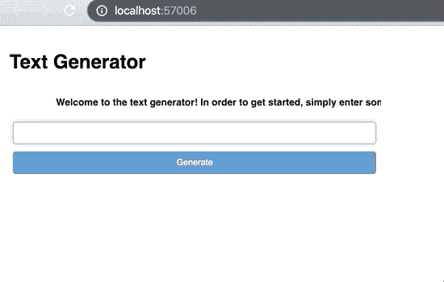

# 用不到 50 行 Python 代码构建一个文本生成器 Web 应用程序

> 原文：<https://towardsdatascience.com/build-a-text-generator-web-app-in-under-50-lines-of-python-9b63d47edabb?source=collection_archive---------9----------------------->

## 学习构建一个自动完成任何输入文本的 web 应用程序

> 我们将使用 [OpenAI 的 GPT-2](https://openai.com/blog/better-language-models/) 作为模型，使用[面板](https://panel.pyviz.org/index.html)作为网络仪表板框架。本指南将分为两部分。在第一部分中，我们将加载我们的模型并编写一个预测函数。第二，我们将构建 web 应用程序。


Example text generation application. We will be building a simpler variation of this web app.

## 你需要什么

本教程假设你已经安装了 [Python 3.7+](https://www.anaconda.com/distribution/) ，并且对[语言模型](https://openai.com/blog/better-language-models/)有所了解。虽然相关步骤可以在 Jupyter 之外完成，但是强烈推荐使用 [jupyter 笔记本](https://jupyter.org/install)。

我们将使用 [**PyTorch**](https://pytorch.org/get-started/locally/) 作为我们深度学习库的选择。在 PyTorch 内，我们将使用 [**变形金刚**](https://huggingface.co/transformers/) 库导入预先训练好的 OpenGPT-2 模型。您可以通过在 bash 中单独输入以下命令来安装这些库:

```
pip install torchpip install transformers
```

对于我们的 web 应用程序，我们将利用 [**面板**](https://panel.pyviz.org/) ，这是一个很好的工具，可以从 jupyter 笔记本或常规 python 脚本轻松创建可服务的仪表板。使用以下命令安装 panel:

```
pip install panel
```

# **第一部分:建立模型**

OpenAI 的 GPT 是一种变形金刚模型，它产生类似人类文本的能力引起了很多关注。如果你以前没有尝试过，在读完这篇文章后，你可能会有同样的想法。

## 加载模型

首先，我们需要导入所需的包。

```
import numpy as np
import torch
import torch.nn.functional as F
from transformers import GPT2Tokenizer, GPT2LMHeadModel
from random import choice
```

接下来，我们将加载 OpenGPT2 标记器和语言模型:(如果第一次运行，可能需要几分钟来下载预训练的模型)

```
tok = GPT2Tokenizer.from_pretrained("gpt2")
model = GPT2LMHeadModel.from_pretrained("gpt2")
```

## 预测功能

在这个阶段，大部分工作已经完成。由于我们的模型是预先训练好的，所以我们不需要训练它，也不需要做任何修改。我们只需要编写一个函数，它可以向模型输入文本并生成预测。

```
def get_pred(text, model, tok, p=0.7):
    input_ids = torch.tensor(tok.encode(text)).unsqueeze(0)
    logits = model(input_ids)[0][:, -1]
    probs = F.softmax(logits, dim=-1).squeeze()
    idxs = torch.argsort(probs, descending=True)
    res, cumsum = [], 0.
    for idx in idxs:
        res.append(idx)
        cumsum += probs[idx]
        if cumsum > p:
            pred_idx = idxs.new_tensor([choice(res)])
            break
    pred = tok.convert_ids_to_tokens(int(pred_idx))
    return tok.convert_tokens_to_string(pred)
```

这个函数中发生了很多事情。所以，我们来分解一下。首先，我们对来自 *input_ids* 的输入文本进行标记和编码。然后，我们要求我们的模型为下一个单词/单词生成一个 *logits* 向量。在应用 softmax 并按降序排列这些概率后，我们有了一个向量， *idxs* ，它按概率顺序列出了我们的 vocab 中每个令牌的索引。

在这个阶段，我们可以只选择概率最高的令牌。然而，我们希望能够混合我们的结果，以便相同的输入文本可以生成多种文本。为此，我们将添加一个随机元素，从最有可能的下一个令牌列表中选择一个随机令牌。这样，我们就不会每次都选择相同的预测标记。为此，我们利用 [**核(Top- *p* )采样**](https://youtu.be/3oEb_fFmPnY?list=PLtmWHNX-gukKocXQOkQjuVxglSDYWsSh9&t=1084) 。

我们通过遍历每个概率来执行这个操作，直到我们遍历的所有概率之和大于 *p，*0 到 1 之间的任意数。在超过 *p* 之前迭代的所有令牌都存储在列表 *res* 中。一旦超过了 *p* ，我们就从这个列表中随机选择一个令牌。请记住，我们正在循环的概率列表包含按概率排序的索引。请注意，如果 *p* 更高，我们的列表中将包含更多的令牌。反之亦然。因此，如果每次想要相同的结果，可以将 *p* 设置为 0。

现在，让我们测试几次 pred 函数:


每一次，都有不同的结果，这正是我们所期待的。我们的预测函数现在已经准备好了。让我们构建我们的 web 应用程序吧！

# 第 2 部分:构建 Web 应用程序

## 面板概述


如果您不熟悉[面板](https://panel.pyviz.org)，它可以简化创建 web 仪表盘和应用程序的过程。乍一看，您需要知道它有三个主要组件:

*   **面板**:可以包含一个或多个窗格(对象)的容器，如文本、图像、图表、小部件等。(它们也可以包含其他面板)
*   **窗格**:任何单个对象，如文本、图像、数据帧等。
*   **Widgets** :用户可调整的项目，如文本输入、滑块、按钮、复选框，可以改变窗格的行为

为了我们的目的，你需要知道的下一件也是最后一件事是，我们有多种方法来定义不同的窗格和小部件如何相互交互。这些被称为“回调”例如，如果某个按钮被按下，其他窗格应该如何更新？稍后我们将定义一个回调函数来完成这个任务。

## 高级应用概述

我们的文本生成器应用程序将有一个输入用户输入他们想要的文本。接下来，用户应该能够通过按下按钮来生成新的令牌。此后，将使用我们在第 1 部分中定义的函数中的预测标记生成新文本。最后，用户应该能够在已经预测的标记之上继续生成新的文本。

## 履行

让我们首先导入面板并创建文本输入小部件:

```
import panel as pn
pn.extension() # loading panel's extension for jupyter compatibility text_input = pn.widgets.TextInput()
```

现在，如果我们在 jupyter 中执行 *text_input* ，我们会得到以下结果:


接下来，我们需要一个面板，它将在我们生成越来越多的令牌时存储整个文本:

```
generated_text = pn.pane.Markdown(object=text_input.value)
```

注意，我们将文本对象设置为 *text_input* 的值。我们希望 *generated_text* 的值与 *text_input* 的值相同，因为我们将在 *generated_text* 的顶部预测新文本。随着更多的令牌被添加到我们的序列中，我们将继续预测 *generated_text* ，直到用户更改 *text_input* 。在这种情况下，该过程将重新开始。

然而，我们还没有完全完成。虽然 *generated_text* 在初始化时会采用 *text_input* 的值，但如果 *text_input* 的值发生变化，它不会自行更新。为此，我们需要将这两个对象链接在一起，如下所示:

```
text_input.link(generated_text, value='object')
```

这里，我们在 *text_input* 到 *generated_text* 之间形成了一个单向链接。因此，每当 *text_input* 的值改变时， *generated_text* 的值也会改变为新值。参见:


*observing linked behavior between text_input and generated_text in a panel. Note: pn.Row as a component is a panel i.e. container of panes and widgets*

现在我们有了两个文本对象，让我们创建按钮小部件:

```
button = pn.widgets.Button(name="Generate",button_type="primary")
```

很好，现在我们有了一个按钮，我们只需要把它和我们想要的行为联系起来。为此，我们将编写一个回调函数，它将在每次单击按钮时运行:

```
def click_cb(event):
    pred = get_pred(generated_text.object, model, tok)
    generated_text.object += pred
```

这里发生了两件事。首先，我们将 *generated_text* 作为输入传递给我们之前编写的预测函数，该函数给出了一个新的令牌。其次，将此令牌添加到 *generated_text* 中。每当有新的按钮点击时，重复这个过程。

说到这里，我们还是要把按钮点击和回调函数捆绑起来。我们可以通过以下方式做到这一点:

```
button.on_click(click_cb)
```

我们现在已经创建了所有的小部件、窗格和功能。我们只需要把这些东西放在一个面板上，瞧:

```
app = pn.Column(text_input, button, generated_text); app
```


Note: pn.Column, similar to pn.Row is another type of panel i.e. container of widgets, panes and even other panels.

让我们添加一个标题和一个简短的描述，我们通过了！

```
title = pn.pane.Markdown("# **Text Generator**")
desc = pn.pane.HTML("<marquee scrollamount='10'><b>Welcome to the text generator! In order to get started, simply enter some starting input text below, click generate a few times and watch it go!</b></marquee>")final_app = pn.Column(title, desc ,app)
```

## 为应用服务

Panel 使服务应用程序变得非常容易。有两种方法可以用来做这件事。第一个是”。show()"命令。这通常用于调试，用法如下。这将启动一个新窗口，我们的 *final_app* 面板作为 web 应用程序运行。

```
final_app.show()
```



为了将其投入生产环境，您需要使用“.servable()"方法。但是，如果您以类似于 show 方法的方式运行它，那么在您当前的笔记本中不会发生任何不同。相反，您必须像这样通过计算机的 bash 来服务笔记本:

```
panel serve --show text_generation_app.ipynb
```

这将在本地端口上启动您的应用程序，只要您在笔记本中有以下代码:

```
final_app.servable()
```

完成了。

> 到目前为止，您已经有能力构建自己的文本生成应用程序了。您可以通过添加更多面板组件来进一步构建它。你甚至可以[将这个应用](https://panel.pyviz.org/user_guide/Deploy_and_Export.html#Embedding)嵌入到你的其他项目中。一如既往，你可以在 [**github**](https://github.com/devkosal/gpt-panel-app) 上找到我的代码库。注:题图中的 app 是我在教程笔记本中找到的高级变体:[**text _ generation _ app . ipynb**](https://github.com/devkosal/gpt-panel-app/blob/master/text_generation_app.ipynb)。

 [## devkosal/gpt-panel-app

### 此时您不能执行该操作。您已使用另一个标签页或窗口登录。您已在另一个选项卡中注销，或者…

github.com](https://github.com/devkosal/gpt-panel-app) 

## 额外资源

*   [OpenAI GPT-2:通过可视化理解语言生成](/openai-gpt-2-understanding-language-generation-through-visualization-8252f683b2f8)
*   [开始使用面板](https://panel.pyviz.org/getting_started/index.html)
*   [轻松可视化任何数据，从笔记本到仪表盘| Scipy 2019 教程| James Bednar(视频:第一个小时是关于面板)](https://www.youtube.com/watch?v=7deGS4IPAQ0)
*   [在服务器上部署 Panel 应用](https://panel.pyviz.org/user_guide/Server_Deployment.html)