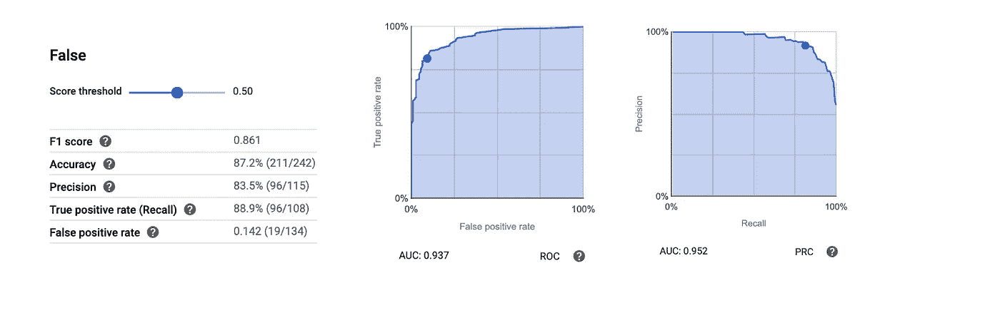

# 在 GCP 建立一个有用的 ML 模型来预测披头士的听众

> 原文：<https://towardsdatascience.com/build-a-useful-ml-model-in-hours-on-gcp-to-predict-the-beatles-listeners-1b2322486bdf?source=collection_archive---------23----------------------->


AutoML“自动化机器学习”最近受到了数据科学界的抨击。我在 [Google Cloud](https://medium.com/u/4f3f4ee0f977?source=post_page-----1b2322486bdf--------------------------------) ML [上发表了一些批评 Google Cloud 的 AutoML first look](https://medium.com/@brianray_7981/google-clouds-automl-first-look-cb7d29e06377)(Google AutoML 团队确实回答了我的一些请求，参见本文结尾的*** *新**** 事情)这篇文章将展示一个公民数据科学家在 ML 下处理整个机器学习生命周期是完全合理的。目标是:

*   解决一个真正的商业问题
*   在 GCP 托管数据
*   使用 GCP 的云自动化
*   进行一些 EDA“探索性数据分析”
*   EDA 如何影响结果
*   GCP AutoML 表上的数据处理
*   利用内置的数据管道
*   使用维持验证模型
*   将模型投入生产
*   随着时间的推移改进模型
*   * * Google 刚刚发布的 AutoML 表格中的新内容

启动你的计时器，准备，设置，开始…

# 解决一个真正的商业问题

目标是基于音乐听众的收听模式来确定他们是否会听披头士；我们将建立一个推荐系统。约翰·列侬难道不会对人工智能的力量印象深刻吗？！

当然，你不会想推荐披头士，所以有人可能不会听披头士。谁会不喜欢披头士呢？不管怎样，这个模型可以适用于任何有足够听力模式数据的艺术家。你只需要关掉目标变量就可以了。

# 在 GCP 托管数据

数据来源是 ListenBrainz 用户的[音乐收听历史](https://console.cloud.google.com/marketplace/details/metabrainz/listenbrainz)。

我们根据听众数量挑选出前 300 名最受欢迎的艺术家。由于 big query 1TB/mo 的自由层处理，这些数据是可用的。

创建数据集的代码可以在我的 github 上找到[。如果你不耐烦，只想在这里下载数据](https://github.com/brianray/beatles_machine_learning_data)(2.19 MB)。


# 使用 GCP 的云自动化


我已经在 Google [Cloud 的 AutoML first look](https://medium.com/@brianray_7981/google-clouds-automl-first-look-cb7d29e06377) 中发布了更多关于如何开始使用 GCP 云 AutoML 表的细节


# 进行一些 EDA“探索性数据分析”


Select the Target “Like_The_Beatles”


Cloud AutoML Analyze Tab

通过 Cloud AutoML，我们可以更深入地研究数据。这与你作为一名在人工智能平台上工作的数据科学家所能做到的细节水平相去甚远。尽管如此，这里还是有一些值得观察的地方。例如，听得最多的艺术家是那些空值最少的艺术家。

# EDA 如何影响结果

在这种情况下，我们如何处理空值:我们让它们为空。原因是 Null 确实意味着在我们的数据集中没有监听；因此等于零。这里的中间值是错误的。了解你的数据！

# GCP AutoML 表上的数据处理


我们需要删除“披头士”栏，因为我们的目标是直接基于这一点。否则，我们总是会得到 100%准确的模型，咄。

# 利用内置的数据管道


最大的好处是你可以通过管道构建模型，而不需要很多代码。事实上，您可以使用支持多种语言(包括 [Python](https://googleapis.dev/python/automl/latest/gapic/v1beta1/tables.html) )的客户端库来编写完整的训练代码。

# 使用维持验证模型

我们使用 AutoML 中的自动数据分割功能。他们说:

> 数据集在定型、验证和测试子集之间拆分的方式。默认情况下，AutoML 表随机选择 80%的数据行用于定型，10%用于测试，10%用于验证。

模型运行得非常好！我们看到了一个. 937 AUC ROC。



这是 50%分数阈值的混淆矩阵:


# 现在将模型投入生产

有这么简单吗:


这是有成本的。如果我将主持这个特定的模型，它将花费 0.126 美元每小时，或 91.98 美元/月(乘数 730 小时在一个月内假设)。

下面是我用的等式:0.005 * 2.8 * 9 = 0.126 美元。0.005 美元是机器的数量(他们使用 9 来实现低延迟，我相信这是硬编码的)。2.8 是因为我的型号是 2.8G。

```
import json
from google.cloud import automl_v1beta1 as automlproject_id = 'mwpmltr'
compute_region = 'us-central1'
model_display_name = 'beatles_machine_l_20191104025339'
input = ['usr', 5.0, None, None, 10, ... ] # list of valuesclient = automl.TablesClient(project=project_id, region=compute_region)response = client.predict(
    model_display_name=model_display_name,
    inputs=inputs)
response###############################################################payload {
  tables {
    score: 0.9896599650382996
    value {
      string_value: "True"
    }
  }
}
payload {
  tables {
    score: 0.010340098291635513
    value {
      string_value: "False"
    }
  }
}
```

# 随着时间的推移改进模型


通过使用标签系统在推荐中寻找模式，我们看到整体准确率有了 3.5%的提高**。**


“诀窍”是纠正不良记录(改进地面真实数据)和引入新数据。


在这种情况下，这个新数据是专家应用于音乐的“标签”。这些标签很有预见性。例如，标签“60 年代”和“英国入侵”是高度预测性的。另一方面，与所有机器学习一样，它也可以预测艺术家不属于哪个标签；例如，那些高水平演奏被标记为“电子乐”的人，他们不太可能听甲壳虫乐队的音乐。

## * * Google 刚刚发布的 AutoML 表格中的新内容

以下是谷歌添加到 AutoML 表格中的三个有意义的新功能:

1.  您可以看到最终的模型架构是如何被训练的，以及在每一轮训练中尝试的实验。


详细信息存储在 Stackdriver 中。


我没有仔细看过这些日志。此时，我不知道日志是否包含了重新创建模型所需的所有信息。

2)在线预测可以得到预测级的特征属性。

```
TypeError: list_models() got an unexpected keyword argument 'feature_importance'
```

我可能需要更新我的软件包。

3)您可以导出您的模型容器(现在每个人都可以使用)


## 结论

踏上汽车之旅并不像我曾经想象的那么可怕。这位数据科学家抱怨说，AutoML 的黑箱性质正在慢慢被打开。易用性越来越强。错误和其他问题似乎正在得到解决。

我谨慎地建议人们开始把目光放在 AutoML 上，作为一个跳跃启动器。这并没有减轻对数据科学之外的数据建模的需求。它并没有减轻工具集之外的数据处理和 EDA 的需要(为此，看看 AI 平台笔记本吧！).同样，这并不意味着这些工具所针对的业务分析师类型不需要很好地理解预测建模理论、术语和最佳实践。