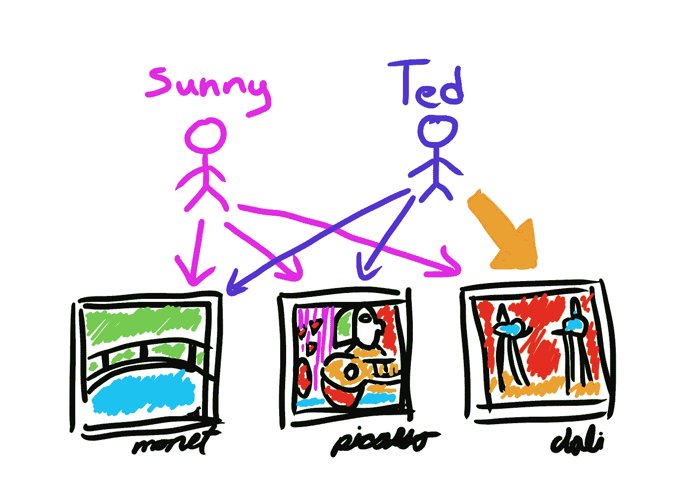
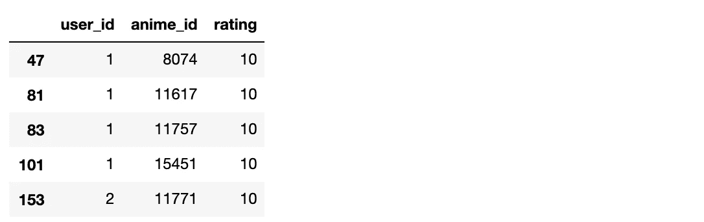
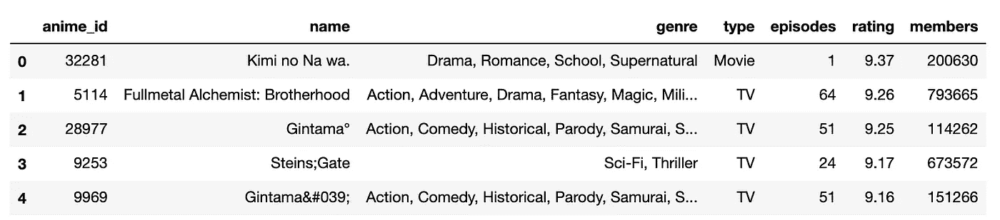
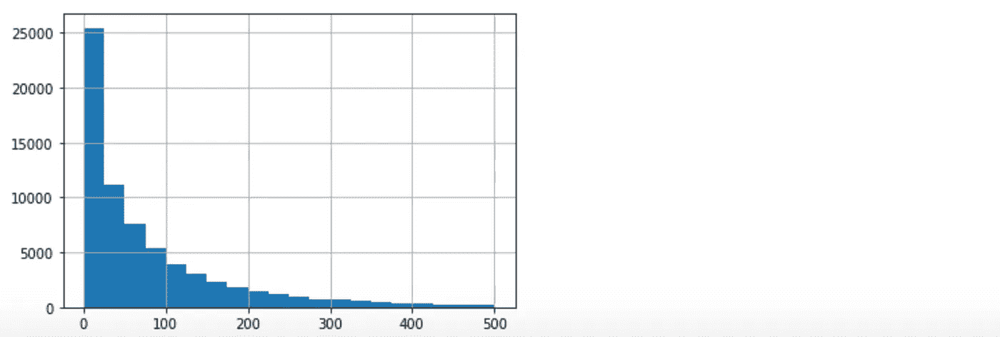
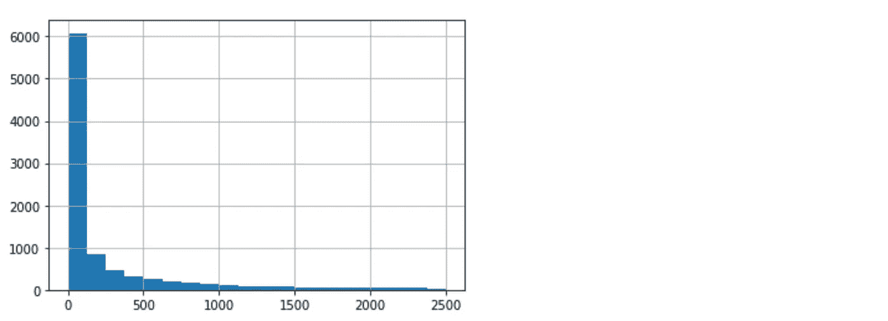
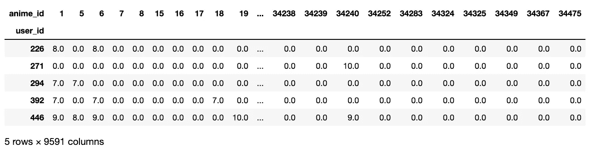
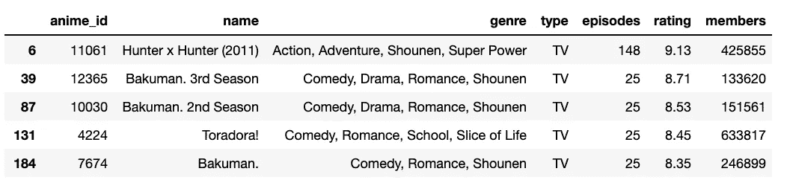

# 构建基于用户的动漫协同过滤推荐引擎

> 原文：<https://towardsdatascience.com/build-a-user-based-collaborative-filtering-recommendation-engine-for-anime-92d35921f304?source=collection_archive---------9----------------------->

## 基于用户之间的统计相似性进行推荐



今天，我们将为动画建立一个推荐引擎，由基于用户的协同过滤提供动力。这只是推荐系统的几种不同方法中的一种

# 介绍

在基于用户的协同过滤中:
-如果用户喜欢相似的项目就被认为是相似的
-我们首先发现哪些用户是相似的
-然后推荐其他相似用户喜欢的项目

**看看我在上面(煞费苦心)画的图。**

桑尼喜欢莫奈、毕加索和达利的画。泰德喜欢莫奈和毕加索的画。

桑尼和泰德很相似，因为他们喜欢一些相同的艺术家。桑妮喜欢达利画，但泰德从未看过达利画。
所以让我们向 Ted 推荐 Dali。

清澈如泥？现在我们已经了解了它是如何工作的，让我们来构建一个推荐器。

# 构建推荐器

从 [Kaggle](https://www.kaggle.com/CooperUnion/anime-recommendations-database/download) 下载数据并加载到 2 个数据帧中。

anime . CSV—我们数据库中关于动漫的详细信息
rating . CSV—特定用户对特定动漫的评分

```
DIR = 'anime-recommendations-database/'import pandas as pdanimes = pd.read_csv(DIR + 'anime.csv')
ratings = pd.read_csv(DIR + 'rating.csv')
```

通过阅读这些文档，我知道评分值为`-1`意味着用户已经观看了这部电影，但还没有对它进行评分。我假设这不会给我们任何有用的信息并删除那些记录。

```
ratings = ratings[ratings.rating != -1]
ratings.head()
```



```
animes.head()
```



# 数据探索

没有人比我更不喜欢花 75%的时间在数据探索上，所以让我们先了解一下数据的大小和分布。

```
# number of ratings
len(ratings)
=> 6337241# number of users
len(ratings['user_id'].unique())
=> 69600# number of unique animes (in anime list, not ratings)
len(animes['anime_id'].unique())
#=> 11200# avg number of anime rated per user
import statistics
ratings_per_user = ratings.groupby('user_id')['rating'].count()
statistics.mean(ratings_per_user.tolist())
#=> 91.05231321839081# distribution of ratings per user
# (we may want to exclude users without many data points)
import matplotlib.pyplot as plt
%matplotlib inline
ratings_per_user.hist(bins=20, range=(0,500))
```



most users have rated fewer than 100 anime

```
# avg number of ratings given per anime
ratings_per_anime = ratings.groupby('anime_id')['rating'].count()
statistics.mean(ratings_per_anime.tolist())
=> 638.3843054296364# distribution of ratings per anime
import matplotlib.pyplot as plt
%matplotlib inline
ratings_per_anime.hist(bins=20, range=(0,2500))
```



most anime received less than 500 ratings

# 回到推荐者

在基于用户的协同过滤中，代表用户的向量实际上是他们给出的评级列表。所以我们宇宙中的动漫越多，每个用户的维度就越多。

让我们通过删除没有被很多用户评价的动画来减少数据量。根据 id 做一个动漫保留清单。

```
# counts of ratings per anime as a df
ratings_per_anime_df = pd.DataFrame(ratings_per_anime)# remove if < 1000 ratings
filtered_ratings_per_anime_df = ratings_per_anime_df[ratings_per_anime_df.rating >= 1000]# build a list of anime_ids to keep
popular_anime = filtered_ratings_per_anime_df.index.tolist()
```

以及没怎么评价过动漫的用户。

```
# counts ratings per user as a df
ratings_per_user_df = pd.DataFrame(ratings_per_user)# remove if < 500
filtered_ratings_per_user_df = ratings_per_user_df[ratings_per_user_df.rating >= 500]# build a list of user_ids to keep
prolific_users = filtered_ratings_per_user_df.index.tolist()
```

现在过滤掉那些列表之外的动漫和用户。

```
filtered_ratings = ratings[ratings.anime_id.isin(popular_anime)]
filtered_ratings = ratings[ratings.user_id.isin(prolific_users)]
len(filtered_ratings)
=> 1005314
```

我们的评级数据点从 600 万降至 100 万。很好。

我们来建立一个用户和动漫之间的评分矩阵。

```
rating_matrix = filtered_ratings.pivot_table(index='user_id', columns='anime_id', values='rating')# replace NaN values with 0
rating_matrix = rating_matrix.fillna(0)# display the top few rows
rating_matrix.head()
```



写一个函数，用余弦相似度找出与 current_user 最相似的用户。我们随意决定找出 3 个最相似的用户。

并选择“226”作为我们的当前用户，但我们可以选择任何人。

```
from sklearn.metrics.pairwise import cosine_similarity
import operatordef similar_users(user_id, matrix, k=3):
    # create a df of just the current user
    user = matrix[matrix.index == user_id]

    # and a df of all other users
    other_users = matrix[matrix.index != user_id]

    # calc cosine similarity between user and each other user
    similarities = cosine_similarity(user,other_users)[0].tolist()

    # create list of indices of these users
    indices = other_users.index.tolist()

    # create key/values pairs of user index and their similarity
    index_similarity = dict(zip(indices, similarities))

    # sort by similarity
    index_similarity_sorted = sorted(index_similarity.items(), key=operator.itemgetter(1))
    index_similarity_sorted.reverse()

    # grab k users off the top
    top_users_similarities = index_similarity_sorted[:k]
    users = [u[0] for u in top_users_similarities]

    return users current_user = 226# try it out
similar_user_indices = similar_users(current_user, rating_matrix)print(similar_user_indices)
#=> [30773, 39021, 45603]
```

现在写一个函数来做推荐。我们已经设置了返回 5 部热门推荐动漫的功能。

```
def recommend_item(user_index, similar_user_indices, matrix, items=5):

    # load vectors for similar users
    similar_users = matrix[matrix.index.isin(similar_user_indices)] # calc avg ratings across the 3 similar users
    similar_users = similar_users.mean(axis=0) # convert to dataframe so its easy to sort and filter
    similar_users_df = pd.DataFrame(similar_users, columns=['mean'])

    # load vector for the current user
    user_df = matrix[matrix.index == user_index] # transpose it so its easier to filter
    user_df_transposed = user_df.transpose() # rename the column as 'rating'
    user_df_transposed.columns = ['rating'] # remove any rows without a 0 value. Anime not watched yet
    user_df_transposed = user_df_transposed[user_df_transposed['rating']==0] # generate a list of animes the user has not seen
    animes_unseen = user_df_transposed.index.tolist()

    # filter avg ratings of similar users for only anime the current user has not seen
    similar_users_df_filtered = similar_users_df[similar_users_df.index.isin(animes_unseen)] # order the dataframe
    similar_users_df_ordered = similar_users_df.sort_values(by=['mean'], ascending=False) # grab the top n anime   
    top_n_anime = similar_users_df_ordered.head(items)
    top_n_anime_indices = top_n_anime.index.tolist() # lookup these anime in the other dataframe to find names
    anime_information = animes[animes['anime_id'].isin(top_n_anime_indices)]

    return anime_information #items # try it out
recommend_item(226, similar_user_indices, rating_matrix)
```



我们做到了！我们的当前用户尚未观看的来自最相似用户的最高评级的 5 部动画。

实际上，我们想要试验不同的相似性算法和不同数量的相似用户。但是我希望你把它当作一个基于用户的协作过滤的粗略框架。

下次见。