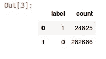
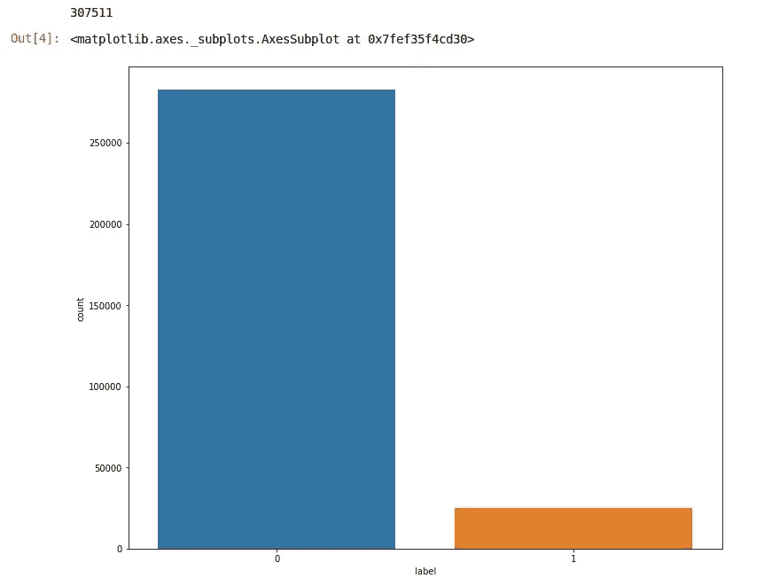
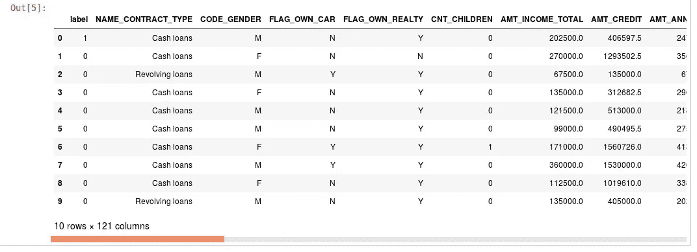
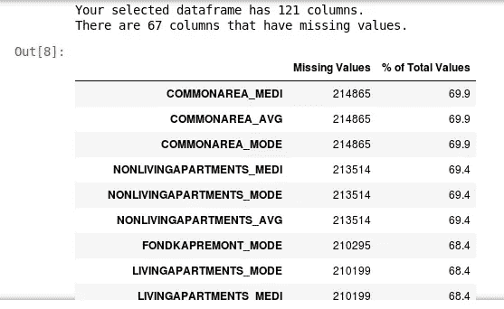
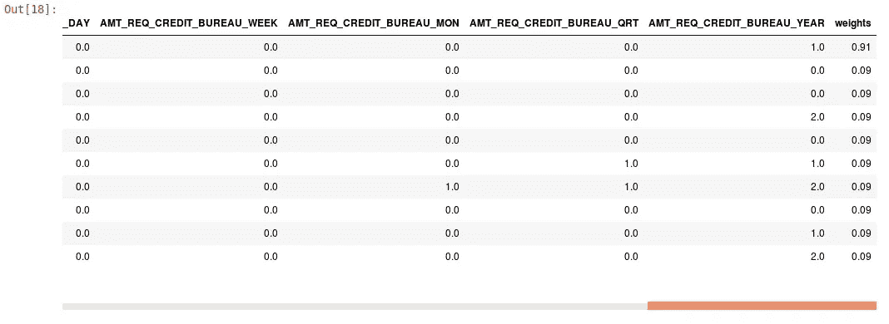
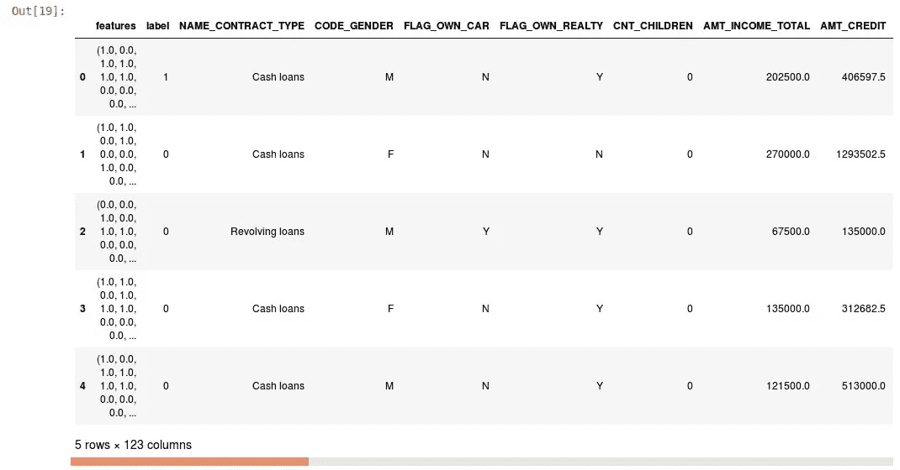
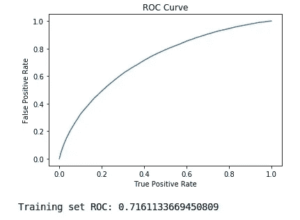

# 在 pySpark 中用 MLlib 搭建一个端到端的机器学习模型。

> 原文：<https://towardsdatascience.com/build-an-end-to-end-machine-learning-model-with-mllib-in-pyspark-4917bdf289c5?source=collection_archive---------3----------------------->

## 对于具有不平衡类别的二元分类问题


photo credit: pexels

# 介绍

内存计算和并行处理是 [**Apache Spark**](https://spark.apache.org/) 在大数据行业非常受欢迎的一些主要原因，以处理大规模的数据产品并执行更快的分析。 **MLlib** 建立在 Spark 之上，是一个可扩展的机器学习库，提供高质量的算法和超快的速度。它拥有优秀的 Java、 **Python** 和 Scala API，是数据分析师、数据工程师和数据科学家的首选。MLlib 由常见的学习算法和实用程序组成，包括分类、回归、聚类、协同过滤(矩阵分解)、降维等。

# 履行

在本文中，我们将在 **pySpark** 中使用 MLlib 构建一个端到端的机器学习模型。我们将使用 kaggle 上的[家庭信用违约风险](https://www.kaggle.com/c/home-credit-default-risk)竞赛的真实数据集。这项竞赛的目的是根据从每个申请人那里收集的数据，确定贷款申请人是否有能力偿还贷款。目标变量为 0(有能力偿还贷款的申请人)或 1(没有能力偿还贷款的申请人)。这是一个目标标签高度不平衡的二元分类问题。分配比率接近 0.91 比 0.09，0.91 是能够偿还贷款的申请人的比率，0.09 是不能偿还贷款的申请人的比率。

让我们先来看看数据集的结构:

```
#we use the findspark library to locate spark on our local machineimport findspark
findspark.init('home Diredtory of Spark')from pyspark.sql import SparkSession# initiate our session and read the main CSV file, then we print the #dataframe schemaspark = SparkSession.builder.appName('imbalanced_binary_classification').getOrCreate()
new_df = spark.read.csv('application_train.csv', header=True, inferSchema=True)
new_df.printSchema()root
 |-- SK_ID_CURR: integer (nullable = true)
 |-- TARGET: integer (nullable = true)
 |-- NAME_CONTRACT_TYPE: string (nullable = true)
 |-- CODE_GENDER: string (nullable = true)
 |-- FLAG_OWN_CAR: string (nullable = true)
 |-- FLAG_OWN_REALTY: string (nullable = true)
 |-- CNT_CHILDREN: integer (nullable = true)
 |-- AMT_INCOME_TOTAL: double (nullable = true)
 |-- AMT_CREDIT: double (nullable = true)
 |-- AMT_ANNUITY: double (nullable = true)
 |-- AMT_GOODS_PRICE: double (nullable = true)
 |-- NAME_TYPE_SUITE: string (nullable = true)
 |-- NAME_INCOME_TYPE: string (nullable = true)
 |-- NAME_EDUCATION_TYPE: string (nullable = true)
 |-- NAME_FAMILY_STATUS: string (nullable = true)
 |-- NAME_HOUSING_TYPE: string (nullable = true)
 |-- REGION_POPULATION_RELATIVE: double (nullable = true)
...
```

printSchema()只显示了列名及其数据类型。我们将删除 SK_ID_CURR 列，将“TARGET”列重命名为“label ”,并查看我们的目标变量的分布:

```
# Sk_ID_Curr is the id column which we dont need it in the process #so we get rid of it. and we rename the name of our 
# target variable to "label"
drop_col = ['SK_ID_CURR']
new_df = new_df.select([column for column in new_df.columns if column not in drop_col])
new_df = new_df.withColumnRenamed('TARGET', 'label')
new_df.groupby('label').count().toPandas()
```



我们可以用 **matplotlib** 可视化标签的分布:

```
# let's have a look at the distribution of our target variable:
# to make it look better, we first convert our spark df to a Pandasimport matplotlib.pyplot as plt
import seaborn as sns
%matplotlib inline
df_pd = new_df.toPandas()
print(len(df_pd))
plt.figure(figsize=(12,10))
sns.countplot(x='label', data=df_pd, order=df_pd['label'].value_counts().index)
```



以下是熊猫数据帧格式的数据:

```
# let's see how everything look in Pandasimport pandas as pd
pd.DataFrame(new_df.take(10), columns= new_df.columns)
```



## 数据争论

现在我们对数据集的一般结构有了一些想法，让我们继续一些**数据争论**。首先我们检查我们有多少**分类**和**数字**特征。接下来，我们构建一个函数，输出数据集中缺失值的基本信息:

```
# now let's see how many categorical and numerical features we have:cat_cols = [item[0] for item in new_df.dtypes if item[1].startswith('string')] 
print(str(len(cat_cols)) + '  categorical features')num_cols = [item[0] for item in new_df.dtypes if item[1].startswith('int') | item[1].startswith('double')][1:]print(str(len(num_cols)) + '  numerical features')**16  categorical features
104  numerical features**
```

下面是我们如何得到**缺失信息**的表格:

```
# we use the below function to find more information about the #missing valuesdef info_missing_table(df_pd):
    """Input pandas dataframe and Return columns with missing value and percentage"""
    mis_val = df_pd.isnull().sum() #count total of null in each columns in dataframe#count percentage of null in each columns
    mis_val_percent = 100 * df_pd.isnull().sum() / len(df_pd) 
    mis_val_table = pd.concat([mis_val, mis_val_percent], axis=1) #join to left (as column) between mis_val and mis_val_percent
    mis_val_table_ren_columns = mis_val_table.rename(
    columns = {0 : 'Missing Values', 1 : '% of Total Values'}) #rename columns in table
    mis_val_table_ren_columns = mis_val_table_ren_columns[
    mis_val_table_ren_columns.iloc[:,1] != 0].sort_values('% of Total Values', ascending=False).round(1) 

    print ("Your selected dataframe has " + str(df_pd.shape[1]) + " columns.\n"    #.shape[1] : just view total columns in dataframe  
    "There are " + str(mis_val_table_ren_columns.shape[0]) +              
    " columns that have missing values.") #.shape[0] : just view total rows in dataframe return mis_val_table_ren_columns missings = info_missing_table(df_pd)
missings
```



121 列中有 67 列缺少值。它没有在图像中显示所有这些列，但总体而言，这 67 列中的大多数都有超过 50%的缺失值。所以我们正在处理大量缺失的值。**我们将用每列的平均值填充数值缺失值，用每列最常见的类别填充分类缺失值。**但首先，让我们统计每一列中缺失的值:

```
miss_counts = count_missings(new_df)
miss_counts[('AMT_ANNUITY', 12),
 ('AMT_GOODS_PRICE', 278),
 ('NAME_TYPE_SUITE', 1292),
 ('OWN_CAR_AGE', 202929),
 ('OCCUPATION_TYPE', 96391),
 ('CNT_FAM_MEMBERS', 2),
 ('EXT_SOURCE_1', 173378),
 ('EXT_SOURCE_2', 660),
 ('EXT_SOURCE_3', 60965),
 ('APARTMENTS_AVG', 156061),
 ('BASEMENTAREA_AVG', 179943),
 ('YEARS_BEGINEXPLUATATION_AVG', 150007),
 ('YEARS_BUILD_AVG', 204488),
...
```

我们将缺失值的分类列和数字列分开:

```
# here we seperate missing columns in our new_df based on #categorical and numerical typeslist_cols_miss=[x[0] for x in miss_counts]
df_miss= new_df.select(*list_cols_miss)
#categorical columns
catcolums_miss=[item[0] for item in df_miss.dtypes if item[1].startswith('string')]  #will select name of column with string data type
print("cateogrical columns_miss:", catcolums_miss)### numerical columns
numcolumns_miss = [item[0] for item in df_miss.dtypes if item[1].startswith('int') | item[1].startswith('double')] #will select name of column with integer or double data type
print("numerical columns_miss:", numcolumns_miss)
```

接下来，我们填充缺失的值:

```
# now that we have seperated the columns based on categorical and #numerical types, we will fill the missing categiracl 
# values with the most frequent categoryfrom pyspark.sql.functions import rank,sum,col
df_Nomiss=new_df.na.drop()
for x in catcolums_miss:                  mode=df_Nomiss.groupBy(x).count().sort(col("count").desc()).collect()[0][0] 
    print(x, mode) #print name of columns and it's most categories 
    new_df = new_df.na.fill({x:mode})# and we fill the missing numerical values with the average of each #columnfrom pyspark.sql.functions import mean, roundfor i in numcolumns_miss:
    meanvalue = new_df.select(round(mean(i))).collect()[0][0] 
    print(i, meanvalue) 
    new_df=new_df.na.fill({i:meanvalue})
```

既然我们的数据集中不再有缺失值，让我们来研究如何处理**不平衡类**。有不同的方法来缓解这个问题。一种方法是**下采样**多数阶级或者**上采样**少数阶级以取得更平衡的结果。另一种方法是为每个类分配**权重**，通过分配较小的权重来惩罚多数类，通过分配较大的权重来促进少数类。我们将在数据集中创建一个名为“weights”的新列，并将每个类的**倒数** **比率**指定为权重。这是如何做到的:

```
# adding the new column weights and fill it with ratiosfrom pyspark.sql.functions import whenratio = 0.91
def weight_balance(labels):
    return when(labels == 1, ratio).otherwise(1*(1-ratio))new_df = new_df.withColumn('weights', weight_balance(col('label')))
```

下面是添加重量列后的样子:



## 特征工程

下一步是**特征工程**。pySpark 使得提取特征变得如此简单，我们不需要做太多工作。以下是步骤:

1.  我们应用 StringIndexer()为分类列中的每个类别分配索引。
2.  我们应用 OneHotEncoderEstimator()将分类列转换为 onehot 编码的向量。
3.  我们应用 VectorAssembler()从所有分类和数字特征中创建一个特征向量，我们将最终向量称为“特征”。

```
# we use the OneHotEncoderEstimator from MLlib in spark to convert #aech v=categorical feature into one-hot vectors
# next, we use VectorAssembler to combine the resulted one-hot ector #and the rest of numerical features into a 
# single vector column. we append every step of the process in a #stages arrayfrom pyspark.ml.feature import OneHotEncoderEstimator, StringIndexer, VectorAssemblerstages = []
for categoricalCol in cat_cols:
    stringIndexer = StringIndexer(inputCol = categoricalCol, outputCol = categoricalCol + 'Index')
    encoder = OneHotEncoderEstimator(inputCols=[stringIndexer.getOutputCol()], outputCols=[categoricalCol + "classVec"])stages += [stringIndexer, encoder]assemblerInputs = [c + "classVec" for c in cat_cols] + num_cols
assembler = VectorAssembler(inputCols=assemblerInputs, outputCol="features")
stages += [assembler]
```

现在让我们把所有东西都放到一个管道里。这里我们执行一系列转换，因此我们使用管道一次完成所有转换:

```
# we use a pipeline to apply all the stages of transformationfrom pyspark.ml import Pipelinecols = new_df.columns
pipeline = Pipeline(stages = stages)
pipelineModel = pipeline.fit(new_df)
new_df = pipelineModel.transform(new_df)selectedCols = ['features']+cols
new_df = new_df.select(selectedCols)
pd.DataFrame(new_df.take(5), columns=new_df.columns)
```

以下是我们的新数据集在特征工程后的样子:



## 训练和超参数调整

对于训练，我们首先将数据集分成训练集和测试集。然后，我们开始使用**逻辑回归**进行训练，因为它对二元分类问题表现良好。

```
# split the data into trainign and testin setstrain, test = new_df.randomSplit([0.80, 0.20], seed = 42)
print(train.count())
print(test.count())# first we check how LogisticRegression perform 
from pyspark.ml.classification import LogisticRegressionLR = LogisticRegression(featuresCol = 'features', labelCol = 'label', maxIter=15)
LR_model = LR.fit(train)
```

我们将为训练数据绘制 ROC 曲线，以了解如何执行逻辑回归，然后我们将使用 ROC 曲线下面积(一种用于评估二元分类的标准度量)作为评估模型的度量:

```
#plotting the ROC CurvetrainingSummary = LR_model.summaryroc = trainingSummary.roc.toPandas()
plt.plot(roc['FPR'],roc['TPR'])
plt.ylabel('False Positive Rate')
plt.xlabel('True Positive Rate')
plt.title('ROC Curve')
plt.show()print('Training set ROC: ' + str(trainingSummary.areaUnderROC))
```



在测试集上检查模型的性能:

```
from pyspark.ml.evaluation import BinaryClassificationEvaluatorpredictions_LR = LR_model.transform(test)
evaluator = BinaryClassificationEvaluator()
print("Test_SET (Area Under ROC): " + str(evaluator.evaluate(predictions_LR, {evaluator.metricName: "areaUnderROC"})))**Test_SET (Area Under ROC): 0.7111434396856681**
```

0.711 对于逻辑回归来说并不是一个很差的结果。接下来，我们尝试另一个模型，**梯度推进树(GBT)。**这是一种非常流行的分类和回归方法，使用决策树的集合。

```
# next we checkout gradient boosting treesfrom pyspark.ml.classification import GBTClassifiergbt = GBTClassifier(maxIter=15)
GBT_Model = gbt.fit(train)
gbt_predictions = GBT_Model.transform(test)evaluator = BinaryClassificationEvaluator()
print("Test_SET (Area Under ROC): " + str(evaluator.evaluate(gbt_predictions, {evaluator.metricName: "areaUnderROC"})))**Test_SET (Area Under ROC): 0.7322019340889893**
```

我们使用 GBT 获得了更好的结果，0.732。作为这里的最后一个策略，我们将使用网格搜索实现超参数调整，然后我们运行交叉验证来更好地提高 GBT 的性能。

```
from pyspark.ml.tuning import ParamGridBuilder, CrossValidatorparamGrid = (ParamGridBuilder()
             .addGrid(gbt.maxDepth, [2, 4, 6])
             .addGrid(gbt.maxBins, [20, 30])
             .addGrid(gbt.maxIter, [10, 15])
             .build())cv = CrossValidator(estimator=gbt, estimatorParamMaps=paramGrid, evaluator=evaluator, numFolds=5)# Run cross validations.cvModel = cv.fit(train)
gbt_cv_predictions = cvModel.transform(test)
evaluator.evaluate(gbt_cv_predictions)**CV_GBT (Area Under ROC) = 0.7368288195372332**
```

结果有了一点改善，这意味着我们仍然可以通过超参数调整来看看我们是否可以进一步改善结果。

在这个项目中，我们建立了一个**端到端的机器学习模型(具有不平衡类的二元分类)。**我们展示了 Apache Spark 的 MLlib 的强大功能，以及它如何应用于端到端 ML 项目。

像往常一样，代码和 jupyter 笔记本在我的 [**Github**](https://github.com/nxs5899/end-to-end-Machine-Learning-model-with-MLlib-in-pySpark) 上可用。

非常感谢您的提问和评论。

参考资料:

1.  [https://github.com/elsyifa/Classification-Pyspark](https://github.com/elsyifa/Classification-Pyspark)
2.  [https://spark . Apache . org/docs/2 . 3 . 0/ml-classification-regression . html](https://spark.apache.org/docs/2.3.0/ml-classification-regression.html)