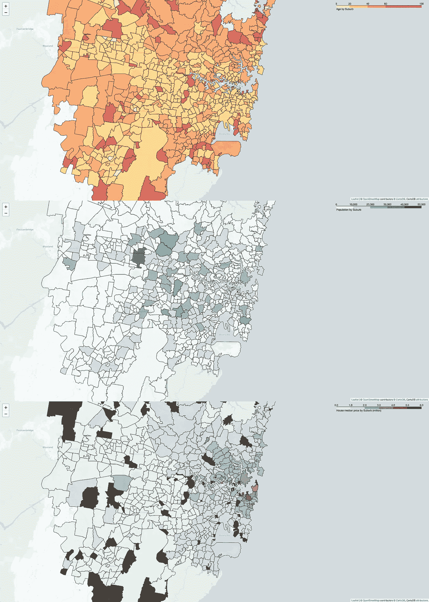

# 用 Plotly 和 Dash 创建交互式 Choropleth 地图

> 原文：<https://towardsdatascience.com/build-an-interactive-choropleth-map-with-plotly-and-dash-1de0de00dce0?source=collection_archive---------8----------------------->


## 悉尼郊区房价中位数的可视化

L 上周，我完成了 IBM 数据科学课程的期末作业，就是根据位置数据，寻找一个理想的郊区，开一家意大利餐厅。在这个过程中，我在网上收集了悉尼每个郊区的房产中值价格(即房屋购买/租赁和单位购买/租赁),并分别绘制在 Choropleth 地图上。



Choropleth maps for different parameters

然而，我想知道是否有可能将所有这些地图组合在一起，并通过点击下拉菜单中的名称来选择其中之一。此外，我想在地图旁边再添加一个地块，以相应地显示中位数价格最高的前 10 个郊区。这些附件将使地图更加丰富和用户友好。在这篇文章中，我将分享我关于如何使用 Plotly 和 Dash 创建一个带有 choropleth 地图和条形图的交互式仪表板的笔记。此外，我假设你以前有与 Plotly 的经验。

## 先决条件

在系统上安装`plotly,` `dash`和`pandas`。我使用`conda`创建了一个虚拟环境，以保持系统有序，避免与系统中的其他包混淆。如果你想了解更多关于`conda env`的信息，我已经在[上一篇文章](https://medium.com/swlh/running-python-and-r-within-jupyter-lab-from-remote-server-d9dfbc4f9a85)中介绍了康达虚拟环境。以下代码将创建一个虚拟环境，其中包含`plotly`和`dash`所需的所有包。

```
conda create -n <whatever name you want for this env> -c plotly plotly=4.4.1 -c conda-forge dash pandas
```

为了能够在`plotly`中绘制地图，我们还需要一个来自 [Mapbox](https://www.mapbox.com/gallery/) 的令牌，它提供了各种漂亮的地图样式，最重要的是免费的。此外，在这个仪表板中使用了两个数据集，它们可以从我的 [github](https://github.com/Perishleaf/data-visualisation-scripts/tree/master/dash_project_medium) 下载(你也可以在这里找到 dash 应用程序代码)。

## 子弹头列车路线

如果您现在想探索 dash 应用程序，在完成上述步骤后，您需要在这个[脚本](https://github.com/Perishleaf/data-visualisation-scripts/blob/master/dash_project_medium/dash_project_medium.py)中将您的 Mapbox 令牌分配给`mapbox_accesstoken`，并在两个数据集所在的同一目录下运行它。一旦弹出以下消息，只需在您首选的浏览器中打开这个地址`[http://127.0.0.1:8050/](http://127.0.0.1:8050/)`，dash 就会加载到那里。

```
$ python dash_project_medium.py
  Running on [http://127.0.0.1:8050/](http://127.0.0.1:8050/)
  Debugger PIN: 880-084-162
  * Serving Flask app "dash_project" (lazy loading)
  * Environment: production
    WARNING: This is a development server. Do not use it in a    production deployment.
  Use a production WSGI server instead.
  * Debug mode: on
```

## 蒸汽火车道

如下图所示，我已经标记了脚本中用于在仪表板中创建相应元素的关键函数。


Dissecting the dashboard

通过`plotly`和`dash`构建这个仪表板的一般原则是 1)在一个定义好的画布上安排和组合不同的元素；2)将所有元素编译到一个容器中:`fig=go.Figure(data=trace2 + trace1, layout=layout)`；3)将这个容器传递给`dcc.Graph`，其中`dcc`是 dash 核心组件，`dash`将为仪表盘创建一个基于 html 的 web 应用。

该仪表板的一个关键功能是通过下拉菜单在两个轨迹(choropleth 图和条形图)中显示特定参数(即`House_buy`、`House_rent`、`Unit_buy`和`Unit_rent`)。我的方法是创建四个层，每个层有一个参数`visible=False`。然后使用`updatemenus`的`buttons`功能转动`visible=True`至给定参数。

Bar plot code

因此，每个轨迹中有四个图形层，只有一个是可见的，这取决于在给定的时间点点击了哪个按钮。

Drop down menu bar code

由于地图不是在笛卡尔坐标系(x/y)上绘制的，而笛卡尔坐标系是条形图中使用的坐标系，因此我在仪表板中为地图和条形图分别设置了两个坐标系。对于条形图(`trace2`)，其坐标轴被分配到`**xaxis='x2'**`、`**yaxis='y2'**`。相反，地图(`trace1`)在`Layout`中有自己的特征，它被赋给变量`mapbox1`，`mapbox`和`x/y`后面的数字是任意的。话虽如此，你可以指定任意多的坐标系，只要确保你在`Layout`中将正确的系统锚定到它的轨迹上。

Choropleth map code

然后在`Layout`设置中，我们分别对这两个坐标系进行调整。如通过`domain`显示轨迹在仪表盘中的位置，通过`showticklabels`显示每个轴上的刻度，通过`autorange`显示条的升序。

Layout code

在连接了`fig=go.Figure`中的所有元素之后，我将`fig`分配给`dcc.Graph`，将所有代码打包成一个`py`文件，并运行它。嘣，我的第一个交互式仪表盘来了。

Dash app implementation

我应该指出，我在这里只使用了非常基本的破折号结构，大部分代码仍然是用 Plotly 编写的。我的方法的一个缺点是，将所有四层堆叠到同一轨迹上可能会降低应用程序的速度，这是因为所有数据都需要在 dash 应用程序初始化时加载。当点击下拉菜单事件发生时，进行实时更新会更有效。希望通过进一步学习高级 Dash 代码，我能找到一个解决方案。

以下是一些学习 Dash 的资源:

*   [Dash 用户指南](https://dash.plot.ly/)
*   来自数据营的初学者 Dash
*   [Dash 社区论坛](https://community.plot.ly/c/dash)
*   [Github 上的牛逼 Dash 资源指南](https://github.com/ucg8j/awesome-dash)
*   [一张详细的仪表盘构建贴](/how-to-build-a-complex-reporting-dashboard-using-dash-and-plotl-4f4257c18a7f)

和往常一样，我欢迎反馈、建设性的批评和倾听您的数据科学项目。你可以在 Linkedin 上找到我。