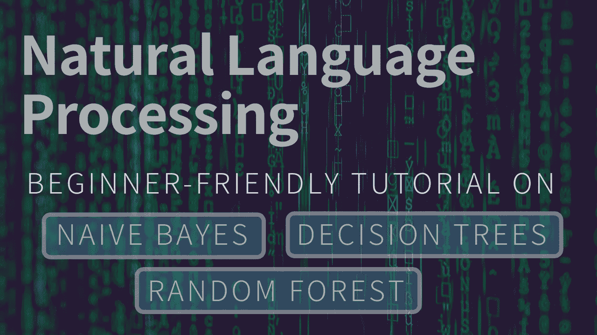
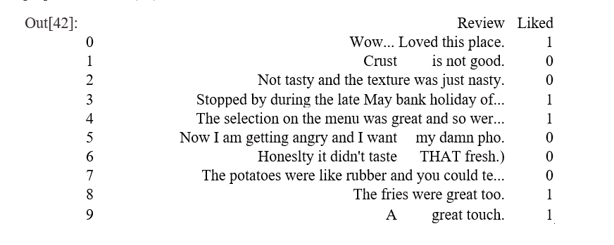
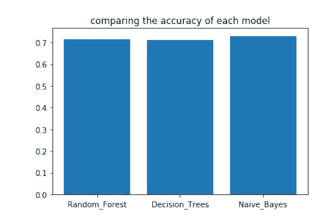
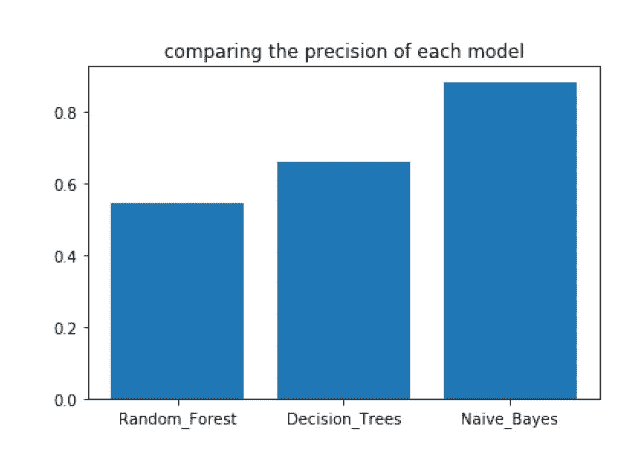
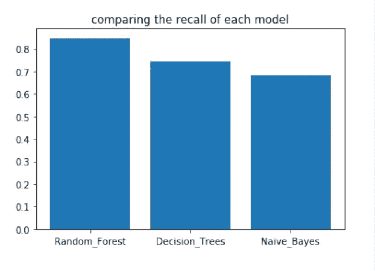
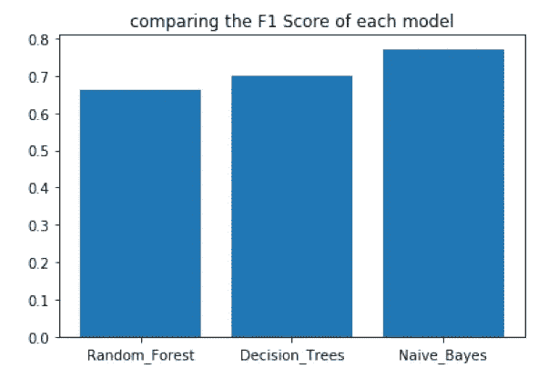

# 构建并比较 3 个模型— NLP 预测

> 原文：<https://towardsdatascience.com/build-and-compare-3-models-nlp-sentiment-prediction-67320979de61?source=collection_archive---------8----------------------->



## 从零开始用 3 种算法预测情绪-初学者友好。

## Python 上的自然语言处理(Jupyter)！

创建这个项目是为了学习和理解各种分类算法在自然语言处理模型中是如何工作的。自然语言处理，我现在称之为 NLP，是机器学习的一个分支，专注于使计算机能够解释和处理语音和文本形式的人类语言。


Photo by [Patrick Tomasso](https://unsplash.com/@impatrickt?utm_source=medium&utm_medium=referral) on [Unsplash](https://unsplash.com?utm_source=medium&utm_medium=referral)

**在这条流水线上，我经历了以下几个步骤:**

1.  导入所需的包和库
2.  导入数据集
3.  在数据集中的文本可以被计算机分析之前对其进行处理
4.  创建一个单词袋模型
5.  将数据集分成训练集和测试集
6.  朴素贝叶斯算法
7.  决策树算法
8.  随机森林算法
9.  比较准确度、精确度、召回率和 F1 分数

# ||二||问题


Photo by [Zulmaury Saavedra](https://unsplash.com/@zulmaury?utm_source=medium&utm_medium=referral) on [Unsplash](https://unsplash.com?utm_source=medium&utm_medium=referral)

对于这个项目，我将使用来自 Kaggle 的数据集，其中包含不同用户对一家披萨店的 1000 条评论。[**|链接到数据集|**](https://www.kaggle.com/yelp-dataset/yelp-dataset/version/6)

人类可以阅读评论，并判断它是积极的还是消极的。如果我们可以创建一个模型来将他们分为积极的或消极的呢？做这件事的最好方法是什么？

首先说一下流程。我们首先对数据进行预处理，删除对我们的预测没有帮助的不必要的词。然后，我们采用词干形式的重要单词*(例如 lov 是 loved、loving 或 lovely 的词干)*。然后，我们训练机器根据词干来学习哪些评论是正面的。之后，我们使用类似的信息测试数据，看看我们的机器能够多准确地预测评论是正面还是负面(1 或 0)。

# || III || **导入基本库**

在这里，我们导入这个模型工作所需的所有库。在开始之前，请确保安装了所有的依赖项。我们将主要与`pandas, numpy, re, nltk, matplotlib, and sci-kit learn.`合作

确保在命令行上运行上面提到的所有库。

```
import numpy as np
import matplotlib.pyplot as plt
import pandas as pd
import re
import nltk
from nltk.corpus import stopwords
from nltk.stem.porter import PorterStemmer
from sklearn.feature_extraction.text import CountVectorizer
from sklearn.model_selection import train_test_split
from sklearn.naive_bayes import GaussianNB
from sklearn.metrics import confusion_matrix
from sklearn.tree import DecisionTreeClassifier
from sklearn.ensemble import RandomForestClassifier
```

# **|| IV ||导入数据集**

```
dataset = pd.read_csv(‘Restaurant_Reviews.tsv’, delimiter = ‘\t’, quoting = 3)
```

在上面的代码中，我使用的是. tsv 文件，而不是. csv 文件。当我们分解缩略词时，区别就更容易分辨了。. tsv(制表符分隔的值)在文本文件中由空格分隔，而. csv(逗号分隔的值)使用逗号分隔不同的值。

`pd.read_csv`可用于两者，但为了指定 tsv 文件，我在分隔符中添加了' \t ',以告诉机器值由制表符而不是逗号分隔。引用被设置为 3，因为我们的评论包含一些双引号，如果我们不添加这一行，机器将无法将它们解释为常规文本。
下面我们可以看到我们数据集的前 10 个评论和结果:正面(1)或负面(0)

```
dataset.head(10)
```



# || V || **文本预处理**

```
nltk.download(‘stopwords’)
corpus = []for i in range(0, 1000):
review = re.sub(‘[^a-zA-Z]’, ‘ ‘, dataset[‘Review’][i])
review = review.lower()
review = review.split()
ps = PorterStemmer()
review = [ps.stem(word) for word in review if not word in set(stopwords.words(‘english’))]
review = ‘ ‘.join(review)
corpus.append(review)
```

上面的代码显示了这个模型中最重要的一步。我从导入 Regex 作为`re`开始。这个类允许我们匹配和搜索字符串对象。我使用 re 的子功能来允许机器包含我们需要的数据元素，即大写和小写的字母 A-Z。

我还导入了代表自然语言工具包的`nltk`。从`nltk`中，我导入了两个类:`stopwords`类和`PorterStemmer`类。

`stopwords`允许我们删除对我们的模型没有帮助的单词(如“the”、“an”、“this”等)。stopwords 类已经包含了这些单词，所以我不必手动输入它们。我使用了一个 for 循环来告诉机器，如果这个单词不在 stopwords 类中，我们需要把它取出来。

`PorterStemmer`允许我们提取一个单词的词干，并将其归类为相似单词的常见预测值。例如，在第一个评论中，“Lov”是单词“loving”或“loved”的词干，这两个单词本质上都转化为积极的评论，因此允许我们的模型有更少的单词。

最后，为了将预处理步骤应用于我们数据集中的所有 1000 条评论，我在文本处理步骤之前添加了另一个 for 循环。

# || VI || **创建单词袋模型**

```
cv = CountVectorizer(max_features = 1500)X = cv.fit_transform(corpus).toarray()
y = dataset.iloc[:, 1].values
```

单词袋模型允许我们从文本数据中提取特征，在本例中，我们从每个观察结果中提取所有单词，并将它们集中在一个“袋”中，通过不计算重复项来减少冗余。我是通过从`sklearn`导入`CountVectorizer`类来做到这一点的。

每个单词以某种方式形成自己的列，因为有这么多单词，我们可以有大量的列。然而，我使用`CountVectorizer`类的`max_features`参数指定了最大列数。

然后，我所要做的就是将单词列与 X(输入)变量相匹配，并将 y(输出)变量指定为数据集中的第二列，这将根据评论是正面还是负面分别给出 1 或 0。

# || VII || **分成训练集和测试集**

```
X_train, X_test, y_train, y_test = train_test_split(X, y, test_size = 0.2, random_state = 0)
```

然后，我必须将数据集分为训练集和测试集，并使用 0.2 的测试大小，这样我们就有 800 个值来训练数据集，200 个值来测试数据集。

下面的代码向我们展示了训练和测试集的样子

```
X_train[0, 0:10] *#First 10 rows of the first column of X_train.***Output**: array([0, 0, 0, 0, 0, 0, 0, 0, 0, 0], dtype=int64)X_test[0, 0:10] *#First 10 rows of the first column of X_test.***Output**: array([0, 0, 0, 0, 0, 0, 0, 0, 0, 0], dtype=int64)y_train[:10] *#First 10 values of the first column of y_train.***Output**: array([1, 1, 1, 0, 1, 0, 1, 0, 0, 0])y_test[:10] *#First 10 values of the first column of y_test.***Output**: array([0, 0, 0, 0, 0, 0, 1, 0, 0, 1])
```

现在我已经完成了所有的预处理步骤，我将开始对 model 应用一些分类算法，以帮助它预测评论。

# || VIII || **朴素贝叶斯模型**

我使用的第一个模型是朴素贝叶斯模型。在机器学习中，朴素贝叶斯分类器是一系列简单的“概率分类器”，基于应用贝叶斯定理，在特征之间具有强(朴素)独立性假设。

给定类变量，所有朴素贝叶斯分类器都假设特定特征的值独立于任何其他特征的值。在我们的模型中，朴素贝叶斯算法根据输出集，查看评论的特定关键字来描述它是正面还是负面的。

在下面的代码中，我导入了 GaussianNB 类，它假设我们的数据是正态分布的(具有高斯钟形曲线)。

## **VIII~i ||将朴素贝叶斯拟合到训练集**

```
classifier = GaussianNB()
classifier.fit(X_train, y_train)**Output**: GaussianNB(priors=None, var_smoothing=1e-09)
```

## **VIII~ii ||预测测试集结果**

我创建了`y_pred_NB`，这是我们的模型的预测将被存储的地方。下面的输出向我们展示了预测矩阵的样子。它是一堆 1 和 0，就像我们的`y_train`数据集。这些是我们的模型做出的预测。`y_pred_NB`可以与`y_test`进行比较，并确定我们的模型有多精确。

```
y_pred_NB = classifier.predict(X_test)
y_pred_NB**Output**: array([1, 1, 1, 0, 0, 1, 1, 1, 1, 1, 1, 1, 1, 1, 1, 1, 0, 0, 0, 1, 0, 0, 1, 1, 1, 0, 1, 1, 1, 0, 1, 1, 1, 1, 1, 0, 1, 0, 1, 1, 1, 1, 1, 0, 0, 0, 1, 1, 0, 0, 1, 1, 1, 1, 1, 0, 1, 1, 0, 1, 1, 0, 1, 1, 1, 0, 1, 1, 1, 1, 1, 1, 1, 1, 0, 1, 1, 0, 0, 1, 0, 1, 1, 0, 1, 1, 1, 0, 1, 1, 0, 1, 0, 0, 1, 1, 1, 1, 1, 1, 0, 1, 1, 1, 0, 1, 1, 1, 0, 0, 0, 1, 0, 1, 1, 0, 1, 1, 1, 1, 1, 0, 1, 1, 0, 0, 1, 1, 0, 1, 1, 1, 0, 0, 1, 1, 1, 1, 1, 1, 0, 1, 1, 0, 1, 0, 1, 1, 1, 1, 1, 0, 1, 1, 1, 0, 1, 1, 1, 1, 1, 0, 0, 1, 0, 0, 1, 0, 0, 0, 0, 1, 1, 0, 0, 1, 0, 1, 0, 0, 1, 0, 0, 1, 0, 1, 0, 1, 0, 1, 1, 0, 1, 1, 1, 0, 1, 1, 1, 1])
```

## **VIII~iii ||制作混淆矩阵**

朴素贝叶斯的混淆矩阵在左上角显示我们的真阴性，在右上角显示假阴性，在右下角显示真阳性，在左下角显示假阳性。

下面，我用缩写对每个数字进行了编码，T 代表真，F 代表假，N 代表负，P 代表正。

```
cm_NB = confusion_matrix(y_test, y_pred_NB) 
cm_NB**Output**: array([[55, 42],[12, 91]])TP_NB = 91 *#True Positives (Naive Bayes)*TN_NB = 55 *#True Negatives (Naive Bayes)*FP_NB = 12 *#False Positives (Naive Bayes)*FN_NB = 42 *#False Negatives (Naive Bayes)*
```

下面，我将使用真/假阳性和阴性来计算准确度、精确度、召回率和 F1 分数。

## **VIII~iv ||朴素贝叶斯算法的精度**

准确性顾名思义。它通过将真实预测相加并除以预测总数来衡量准确性。

```
Accuracy_NB = (TP_NB + TN_NB) / (TP_NB + TN_NB + FP_NB + FN_NB) Accuracy_NB **Output**: 0.73
```

## VIII~v || **朴素贝叶斯算法的精度**

精度是指两个或多个测量值之间的接近程度。它是通过将真阳性除以总阳性来计算的

```
Precision_NB = TP_NB / (TP_NB + FP_NB)Precision_NB**Output**: 0.883495145631068
```

## **VIII~vi ||回忆朴素贝叶斯算法**

回忆是正确预测的正面观察与实际类中所有观察的比率。将真阳性除以真阳性和假阴性之和。

```
Recall_NB = TP_NB / (TP_NB + FN_NB)Recall_NB**Output**: 0.6842105263157895
```

## **VIII~vii ||朴素贝叶斯算法的 F1 得分**

F1 分数是精确度和召回率的加权平均值。如果我们需要在精确度和召回率之间寻求平衡，并且存在不均匀的类别分布，F1 分数可能是一个更好的衡量标准。它的计算方法是将精度和召回率相乘，将结果除以精度和召回率之和，然后将最终结果乘以 2。

```
F1_Score_NB = 2 * Precision_NB * Recall_NB / (Precision_NB + Recall_NB) F1_Score_NB**Output**: 0.7711864406779663
```

# || IX || **决策树**

我使用的下一个算法是决策树。决策树允许您开发分类系统，该系统基于一组决策规则对未来的观察结果进行预测或分类。

## IX~i || **将决策树分类拟合到训练集**

```
classifier = DecisionTreeClassifier(criterion = ‘entropy’, random_state = 0)classifier.fit(X_train, y_train)**Output:** DecisionTreeClassifier(class_weight=None, criterion=’entropy’,max_depth=None,max_features=None,max_leaf_nodes=None,min_impurity_decrease=0.0,min_impurity_split=None,min_samples_leaf=1,min_samples_split=2,min_weight_fraction_leaf=0.0, presort=False, random_state=0,splitter=’best’)
```

## **IX~ii ||预测测试集结果**

```
In [59]: y_pred_DT = classifier.predict(X_test)y_pred_DT**Output**: array([0, 0, 1, 0, 1, 0, 1, 0, 0, 1, 1, 1, 1, 1, 1, 1, 1, 0, 0, 1, 0, 0, 1, 0, 0, 1, 1, 1, 1, 0, 1, 1, 0, 1, 1, 0, 0, 0, 0, 1, 1, 1, 1, 0, 0, 0, 1, 1, 1, 0, 0, 0, 0, 1, 1, 1, 0, 0, 0, 1, 0, 0, 0, 0, 1, 0, 0, 0, 0, 0, 1, 1, 0, 0, 0, 0, 0, 1, 0, 1, 1, 0, 1, 0, 1, 1, 0, 0,1, 0, 0, 1, 0, 0, 0, 0, 0, 0, 1, 1, 0, 1, 1, 0, 0, 0, 0, 1, 0, 0,0, 1, 0, 0, 0, 1, 1, 1, 1, 1, 0, 0, 1, 1, 0, 0, 0, 1, 0, 0, 0, 1,0, 0, 1, 1, 0, 1, 1, 0, 0, 1, 1, 0, 0, 0, 1, 1, 0, 1, 0, 0, 1, 1,0, 0, 1, 0, 1, 1, 0, 1, 1, 0, 1, 0, 0, 1, 0, 0, 0, 1, 1, 0, 0, 1,0, 1, 0, 1, 1, 1, 0, 0, 0, 0, 1, 1, 0, 1, 1, 1, 0, 0, 1, 0, 1, 1,0, 0])
```

## **IX~iii ||制作混淆矩阵**

```
cm_DT = confusion_matrix(y_test, y_pred_DT) cm_DT**Output**: array([[74, 23],[35, 68]])TP_DT = 68 *#True Positives (Decision Tree)*TN_DT = 74 *#True Negatives (Decision Tree)*FP_DT = 35 *#False Positives (Decision Tree)*FN_DT = 23 *#False Negatives (Decision Tree)*
```

## **IX~iv ||决策树算法的准确性**

```
Accuracy_DT = (TP_DT + TN_DT) / (TP_DT + TN_DT + FP_DT + FN_DT)Accuracy_DT**Output**: 0.71
```

## **IX~v ||决策树算法的精度**

```
Precision_DT = TP_DT / (TP_DT + FP_DT)Precision_DT**Output**: 0.6601941747572816
```

## **IX~vi ||召回决策树算法**

```
Recall_DT = TP_DT / (TP_DT + FN_DT)Recall_DT**Output**: 0.7472527472527473
```

## **IX~vii ||决策树算法的 F1 得分**

```
F1_Score_DT = 2 * Precision_DT * Recall_DT / (Precision_DT + Recall_DT)F1_Score_DT**Output**: 0.7010309278350515
```

# **|| X ||随机森林**

最后，我使用了随机森林算法，这只是一些决策树的组合。在我的例子中，我选择使用 300 棵树，但是我可以根据我想要的模型精度来改变这个数字。

## **X～I | |将随机森林分类拟合到训练集**

```
classifier = RandomForestClassifier(n_estimators = 300, criterion = ‘entropy’, random_state = 0)classifier.fit(X_train, y_train)**Output**: RandomForestClassifier(bootstrap=True, class_weight=None, criterion=’entropy’,max_depth=None,max_features=’auto’,max_leaf_nodes=None,min_impurity_decrease=0.0,min_impurity_split=None,min_samples_leaf=1, min_samples_split=2,min_weight_fraction_leaf=0.0, n_estimators=300, n_jobs=None,oob_score=False, random_state=0, verbose=0, warm_start=False)
```

## **X~ii ||预测测试集结果**

```
y_pred_RF = classifier.predict(X_test)y_pred_RF**Output**: array([0, 0, 0, 0, 0, 0, 1, 0, 0, 1, 1, 1, 1, 1, 1, 1, 1, 0, 0, 0, 0, 1, 1, 0, 0, 1, 0, 1, 1, 0, 0, 0, 0, 1, 1, 0, 0, 0, 0, 1, 1, 0, 0, 0, 0, 0, 1, 1, 1, 0, 0, 0, 0, 1, 0, 0, 0, 0, 0, 0, 0, 0, 0, 0, 0, 0, 0, 0, 0, 0, 1, 1, 0, 0, 0, 0, 0, 1, 0, 1, 0, 1, 0, 0, 1, 1, 0, 0, 1, 0, 0, 1, 0, 0, 0, 0, 0, 0, 0, 1, 0, 1, 1, 1, 0, 0, 0, 1, 0, 0, 0, 0, 0, 0, 0, 0, 1, 1, 1, 1, 0, 0, 1, 0, 0, 0, 0, 1, 0, 0, 0, 1, 0, 0, 1, 1, 1, 1, 1, 0, 0, 1, 0, 0, 0, 0, 0, 0, 0, 1, 0, 0, 1, 1, 0, 0, 1, 0, 1, 1, 0, 0, 1, 0, 1, 0, 0, 0, 0, 0, 0, 1, 1, 0, 0, 0, 0, 1, 0, 1, 1, 0, 0, 0, 0, 0, 0, 0, 0, 1, 1, 0, 0, 0, 0, 0, 1, 1, 0, 0])
```

## **X~iii ||制作混淆矩阵**

```
cm_RF = confusion_matrix(y_test, y_pred_RF) cm_RF**Output**: array([[87, 10],[47, 56]])*# Calculating True/False Positives/Negatives* TP_RF = 56 *#True Positives (Random Forest)* TN_RF = 87 *#True Negatives (Random Forest)* FP_RF = 47 *#False Positives (Random Forest)* FN_RF = 10 *#False Negatives (Random Forest)*
```

## X~iv ||随机森林的精度

```
Accuracy_RF = (TP_RF + TN_RF) / (TP_RF + TN_RF + FP_RF + FN_RF)Accuracy_RF**Output**: 0.715
```

## x～v | |随机森林的精度

```
Precision_RF = TP_RF / (TP_RF + FP_RF)Precision_RF**Output**: 0.5436893203883495
```

## X~vi ||随机森林的回忆

```
Recall_RF = TP_RF / (TP_RF + FN_RF)Recall_RF**Output**: 0.8484848484848485
```

## X~vii ||随机森林 F1 得分

```
F1_Score_RF = 2 * Precision_RF * Recall_RF / (Precision_RF + Recall_RF)F1_Score_RF**Output**: 0.6627218934911243
```

# XI ||对比模型

在最后一部分，我将比较我使用的每种算法的准确度、精确度、召回率和 F1 值。我将把它们绘制在条形图上，以图形方式展示不同型号之间的比较。

## Xi～I | |比较模型精度

```
Accuracy = [Accuracy_RF, Accuracy_DT, Accuracy_NB]
Methods = [‘Random_Forest’, ‘Decision_Trees’, ‘Naive_Bayes’]
Accuracy_pos = np.arange(len(Methods))plt.bar(Accuracy_pos, Accuracy)
plt.xticks(Accuracy_pos, Methods)
plt.title(‘comparing the accuracy of each model’)plt.show()
```



正如我们在上面的柱状图中看到的，朴素贝叶斯在所有算法中具有最高的准确性，有 73%的正确预测。决策树和随机森林算法也很接近，准确率分别为 71%和 71.5%。

## XI~ii ||比较模型精度

```
Precision = [Precision_RF, Precision_DT, Precision_NB]
Precision_pos = np.arange(len(Methods))plt.bar(Precision_pos, Precision)
plt.xticks(Precision_pos, Methods)
plt.title(‘comparing the precision of each model’)plt.show()
```



朴素贝叶斯是最精确的模型，精度为 88.35%，而决策树的精度为 66%。随机森林的准确率最低，约为 54.4%。

## XI~iii ||对比车型召回

```
Recall = [Recall_RF, Recall_DT, Recall_NB]
Recall_pos = np.arange(len(Methods))plt.bar(Recall_pos, Recall)
plt.xticks(Recall_pos, Methods)
plt.title(‘comparing the recall of each model’)plt.show()
```



随机森林的召回率最高，约为 84.8%，而决策树的召回率为 74.7%。朴素贝叶斯的召回率最低，为 68.4%

## XI~iv ||对比 F1 车型分数

```
F1_Score = [F1_Score_RF, F1_Score_DT, F1_Score_NB]F1_Score_pos = np.arange(len(Methods))plt.bar(F1_Score_pos, F1_Score)plt.xticks(F1_Score_pos, Methods)plt.title(‘comparing the F1 Score of each model’)plt.show()
```



*   朴素贝叶斯的 F1 值最高，为 77.1%
*   决策树的 F1 值为 70.1%。
*   随机森林的 F1 得分最低，为 66.2%

# 十二||结论

平均而言，我们的模型大约有 71.8%的准确率。虽然这可能意味着机器无法准确预测每一篇评论，但它也向我们展示了我们的模型没有过度拟合数据的证据。过度拟合是一种建模错误，发生在函数与有限的一组数据点过于接近的时候。过度拟合模型通常发生在使用过于复杂的模型来解释数据中的特质时。然而，由于我们的模型正在被训练成像人脑一样思考，因此可以公平地假设，即使是人类也无法 100%地预测评论是正面还是负面的。这实际上取决于数据及其处理方式。

那么这个模型的最佳算法是什么呢？在本项目使用的 3 种算法中，最准确和精确的是**朴素贝叶斯**算法。

然而，我们的随机森林算法的召回率是最高的。这意味着随机森林算法实际上通过将它标记为阳性(真阳性)来计算我们的模型捕获了多少实际阳性。当存在与假阴性相关联的**高成本时，这将是我们用来选择最佳模型的良好指标。**

事实存在于我们的 F1 分数中，这实际上可能是在所选的三个模型中哪个模型最好的最佳预测器。*朴素贝叶斯算法具有最高的 F1 分数*，这意味着它定义了特定模型的召回率和精确度之间的关系。如果我们需要在精确度和召回率之间寻求平衡，并且如果存在不均匀的类别分布(大量实际否定)，F1 分数可能是更好的衡量标准。

**感谢阅读！希望你学到了有用的东西。**

> 关注 Rohan Gupta，了解更多与数据科学和机器学习相关的内容