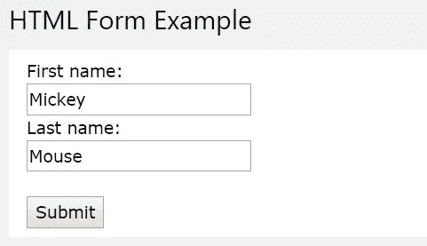
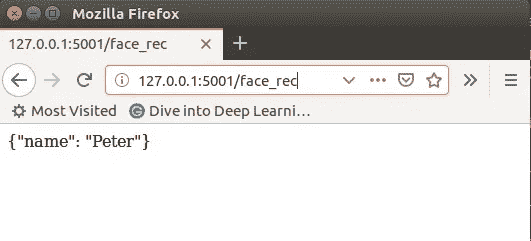

# 将人脸识别构建为 REST API

> 原文：<https://towardsdatascience.com/build-face-recognition-as-a-rest-api-4c893a16446e?source=collection_archive---------4----------------------->

有很多开源的人脸识别包，比如 [face_recognition](https://github.com/ageitgey/face_recognition) ，你可以很容易地将它们安装在 Linux 服务器上。但是在移动和物联网设备上部署它们是非常困难或者不可能的。一种选择是使用机器学习移动框架，如 [TensorFlow Lite](https://www.tensorflow.org/lite) 来调用预先训练好的模型。

但是有更简单的选择吗？是啊！随着 5G 的到来，上传 100KB 的图像只需 0.01 秒，速度约为 [100Mbps](https://5g.co.uk/guides/how-fast-is-5g/) ，因此我们可以部署几乎所有东西，包括服务器端的人脸识别服务和客户端的轻量级应用。这篇文章将展示如何使用 Python [Flask](https://palletsprojects.com/p/flask/) 在 Linux 服务器上为 [face_recognition](https://github.com/ageitgey/face_recognition) 构建一个 RESTful API。

# 人脸识别项目

[face_recognition](https://github.com/ageitgey/face_recognition) 是一个基于 [dlib](https://github.com/davisking/dlib) 的非常棒的人脸识别开源项目，正如它自己所描述的:

> *世界上最简单的 Python 面部识别 api 和命令行*

只需几行 Python 代码，就可以进行人脸比对、人脸检测、面部特征查找。

例如，运行示例[find _ face _ features _ in _ picture . py](https://gist.github.com/peterjpxie/2b0befb3b6696cf82fb891b871436380)(只有 40 行代码)获取一幅奥巴马的图像，您可以得到如下绘制的所有面部特征。


要在 Linux 服务器上安装它，你可以遵循 Github 上 face_recognition 项目中的[步骤](https://github.com/ageitgey/face_recognition#installation)，或者只需下载[预配置的虚拟机](https://medium.com/@ageitgey/try-deep-learning-in-python-now-with-a-fully-pre-configured-vm-1d97d4c3e9b)。对于 Windows 用户，Sasiwut Chaiyadecha 提供的[步骤](https://medium.com/analytics-vidhya/how-to-install-dlib-library-for-python-in-windows-10-57348ba1117f)对我很管用。

# 构建 REST API

让我们使用 face_recognition 包定义两个 API。

*   **对比两张脸**:上传两张图片，返回真/假进行匹配
*   **从已知的数据集中识别一张脸:**上传一张图片并返回这个人的名字。

## 面部识别功能

在文件 face_util.py 中为这两个 API 定义了两个人脸识别函数作为 util。

第一个函数 **compare_faces** 比较两个图像文件，如果两个图像中的人脸是同一个人，则返回 True。

face_util_part1.py

第二个函数 **face_rec** 检查图像文件中的人脸是否是数据集中的已知人脸，并返回人名。在这个例子中有两个已知的面。

face_util_part2.py

## 带烧瓶的 REST API

有了上面的函数，我们可以很容易地用 Flask 定义 REST API，如下。

第一个 API 是 **face_match** 。它从 POST 请求的表单数据中获取两个图像文件，并调用 **compare_faces** 来检查它们是否匹配，然后返回一个 JSON 格式的结果。

flask_server_v1_part1.py

第二个 API 是 **face_rec，**它取一个图像文件作为输入，调用 **face_rec** 检查是否是已知人脸，然后以 JSON 格式返回人名。

flask_server_v1_part2.py

你可以在这里下载完整的 flask_server_v1.py 文件[。](https://gist.github.com/peterjpxie/3717609b51c4b52d569305c8206ebc6a)

通过`pip install -U flask`安装烧瓶模块，然后运行`python flask_server_v1.py`启动服务器 API。启动输出如下所示。

```
* Serving Flask app "flask_server_v1" (lazy loading)
...
 * Debug mode: on
 * Running on [http://0.0.0.0:5001/](http://0.0.0.0:5001/) (Press CTRL+C to quit)
```

您可以使用以下 URL 以 [POST 表单数据](https://www.w3schools.com/html/html_forms.asp)格式访问这两个 API:

*   **比较两张脸** : http:// <服务器 IP 地址> : 5001/face_match
*   **认个脸:** http:// <服务器 IP 地址> : 5001/face_rec

# **REST API 客户端示例**

您可以使用任何编程语言调用 API。我只是以 Python 为例。它需要[请求](https://requests.kennethreitz.org/en/master/)模块，你可以通过`pip install -U requests`安装。

在第一个例子中，我们用同一个人的两幅图像调用 **face_match** API。

demo_client_part1.py

通过`python demo_client_part1.py`运行示例，您将得到如下响应:

```
{"match": true}
```

在第二个例子中，我们调用 **face_rec** API 来查找一个人的名字。

demo_client_part2_v1.py

运行脚本，您将得到如下响应:

```
{"name": "Obama"}
```

# 了解发布表单数据

如果你已经知道 HTML 表单数据，跳过这一节。

表单数据只不过是用户提交给服务器端的 HTML 表单。检查不同的 HTML 表单。例如，一个简单的输入表单如下所示。



当您单击 Submit 时，它实际上向 web 服务器发送一个 HTTP POST 请求，其中包含如下数据:

在我们的例子中，我们使用文件形式。为了更好地理解它，让我们修改 face_rec API，以便当用户通过 GET 访问 API 时返回一个 HTML 表单页面，即在 web 浏览器中键入 URL，当请求内容是 POST 时打印它。

首先，我们定义了一个新函数 **print_request()** 来打印 POST 请求的 URL、键头和正文内容。应用了一个技巧，用字符串'< raw image data >'替换 raw image data，这样我们就可以打印完整的 POST 请求。

flask_server_v2_part1.py

然后我们修改 face_rec API 如下:

*   在方法中添加 GET 支持。(第一行)
*   如果是 POST，打印请求。(第 3 行)
*   如果是 GET，返回一个 HTML 文件表单页面。(第 12–20 行)

flask_server_v2_part2.py

你可以在这里下载完整的 flask_server_v2.py [。](https://gist.github.com/c3f8f5d7898903b7733c7ead20bc47c5)

运行新的服务器 API `python flask_server_v2.py`，然后打开 web 浏览器，输入 face_rec URL，例如 http://127.0.0.1: 5001/face_rec。


你会看到上面的网页，点击浏览选择一个图像文件，然后点击上传按钮。它将向服务器端发送一个包含所选文件的 POST 请求，即调用 face_rec API。因此您将在浏览器上获得 API 响应。



同时，POST 请求内容将在服务器端打印出来，如下所示。

# Base64 图像编码

表单数据传输图像数据是有效的，因为数据是直接以原始二进制传输的。但是如果你想以 JSON body 格式传输图像， [base64](https://en.wikipedia.org/wiki/Base64) 编码是一种流行的解决方案，它将二进制数据转换成可打印的 [ASCII](https://en.wikipedia.org/wiki/ASCII) 文本字符串，但是有 33%的开销，即(8–6)/6。

有了 Python [base64](https://docs.python.org/3/library/base64.html) 库，简直易如反掌。只需调用 b64encode 和 b64decode 函数。但是有一个技巧，你需要将 b64encode 的字节字符串输出转换为普通字符串，例如 b'abc '转换为' abc '，然后再将其传递给 JSON 对象，因为 JSON 不支持 Python [字节字符串](https://docs.python.org/3/library/stdtypes.html#bytes)。

我们可以如下使用 JSON 格式重新编写 face_rec API 客户端。

base64 encode client

你可以在这里下载完整的客户端脚本 v3 [。](https://gist.github.com/5870cad577e3d0d46d11485efe1a2ef7)

并相应地修改服务器端以支持 JSON 格式，如下所示。

base64 encode REST API server

我们将 base64 字符串解码回二进制数据，并将其保存为图像文件，然后调用我们在基于表单数据的 API 中使用的相同的 face_rec 函数。比较帖子内容长度，你会看到 33%的开销如下。

```
Peter2.jpg file size: 89KBPost form data content length: 91162Post base64 data content length: 121396(121396 - 91162) / 91162 = 33%
```

你可以在这里找到完整的服务器端脚本 v3。

# 进一步的工作

您可以向 API 添加更多功能，例如，返回面部位置和面部特征，这样您就可以在移动设备上实现与在 Linux 服务器上相同的功能。

我已经实现了一个使用 REST API 绘制面部位置和面部特征的版本，并带有额外的参数，如果感兴趣，你可以在这里下载完整的库[。](https://github.com/peterjpxie/face_rec_api)


感谢阅读到此结束。

[领英](https://www.linkedin.com/in/xiejiping)