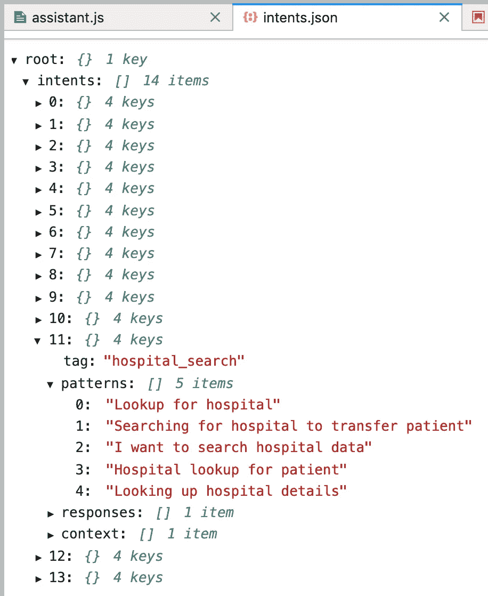

# 自己构建—使用 Keras/TensorFlow 模型的聊天机器人 API

> 原文：<https://towardsdatascience.com/build-it-yourself-chatbot-api-with-keras-tensorflow-model-f6d75ce957a5?source=collection_archive---------0----------------------->

## 在 Keras/TensorFlow 模型上构建简单聊天机器人的分步解决方案及源代码


Source: Pixabay

构建自己的聊天机器人(或助手，这个词是聊天机器人的一个新的流行术语)并不像你想象的那么复杂。各种聊天机器人平台正在使用分类模型来识别用户意图。虽然很明显，在现有平台的基础上构建聊天机器人时，你会得到一个很好的提示，但研究背景概念并尝试自己构建它不会有什么坏处。为什么不自己用一个类似的模型。聊天机器人实施的主要挑战是:

1.  对用户输入进行分类以识别意图(这可以通过机器学习来解决，我正在使用带有 TensorFlow 后端的 Keras)
2.  保持上下文。这部分是编程，这里没有什么 ML 相关的。我使用 Node.js 后端逻辑来跟踪对话上下文(在上下文中，通常我们不需要对用户意图进行分类——用户输入被视为聊天机器人问题的答案)

我的 [GitHub](https://github.com/katanaml/katana-assistant) repo(开源)上提供了本文的完整源代码和自述说明。

这是实现中使用的 Python 库的列表。 [Keras](https://keras.io/) 深度学习库用于建立分类模型。Keras 在 TensorFlow 后端上运行培训。兰开斯特词干库用于折叠不同的单词形式:

```
import nltk
from nltk.stem.lancaster import LancasterStemmer
stemmer = LancasterStemmer()# things we need for Tensorflow
import numpy as np
from keras.models import Sequential
from keras.layers import Dense, Activation, Dropout
from keras.optimizers import SGD
import pandas as pd
import pickle
import random
```

聊天机器人的意图和学习模式在普通的 JSON [文件](https://github.com/katanaml/katana-assistant/blob/master/mlmodels/intents.json)中定义。不需要有庞大的词汇量。我们的目标是建立一个特定领域的聊天机器人。也可以为小词汇量创建分类模型，它将能够识别为训练提供的一组模式:



chatbot training data

在我们开始分类模型训练之前，我们需要首先建立词汇。模式被处理以构建词汇表。每个单词被词干化以产生通用词根，这将有助于覆盖用户输入的更多组合:

```
words = []
classes = []
documents = []
ignore_words = ['?']
# loop through each sentence in our intents patterns
for intent in intents['intents']:
    for pattern in intent['patterns']:
        # tokenize each word in the sentence
        w = nltk.word_tokenize(pattern)
        # add to our words list
        words.extend(w)
        # add to documents in our corpus
        documents.append((w, intent['tag']))
        # add to our classes list
        if intent['tag'] not in classes:
            classes.append(intent['tag'])# stem and lower each word and remove duplicates
words = [stemmer.stem(w.lower()) for w in words if w not in ignore_words]
words = sorted(list(set(words)))# sort classes
classes = sorted(list(set(classes)))# documents = combination between patterns and intents
print (len(documents), "documents")
# classes = intents
print (len(classes), "classes", classes)
# words = all words, vocabulary
print (len(words), "unique stemmed words", words)
```

这是词汇创造的输出。共有 9 个意图(类别)和 82 个词汇:

```
45 documents
9 classes ['adverse_drug', 'blood_pressure', 'blood_pressure_search', 'goodbye', 'greeting', 'hospital_search', 'options', 'pharmacy_search', 'thanks']
82 unique stemmed words ["'s", ',', 'a', 'advers', 'al', 'anyon', 'ar', 'awesom', 'be', 'behavy', 'blood', 'by', 'bye', 'can', 'caus', 'chat', 'check', 'could', 'dat', 'day', 'detail', 'do', 'dont', 'drug', 'entry', 'find', 'for', 'giv', 'good', 'goodby', 'hav', 'hello', 'help', 'hi', 'hist', 'hospit', 'how', 'i', 'id', 'is', 'lat', 'list', 'load', 'loc', 'log', 'look', 'lookup', 'man', 'me', 'mod', 'nearby', 'next', 'nic', 'of', 'off', 'op', 'paty', 'pharm', 'press', 'provid', 'react', 'rel', 'result', 'search', 'see', 'show', 'suit', 'support', 'task', 'thank', 'that', 'ther', 'til', 'tim', 'to', 'transf', 'up', 'want', 'what', 'which', 'with', 'you']
```

训练不会基于单词的词汇来运行，单词对于机器来说是没有意义的。我们需要将单词翻译成包含 0/1 数组的单词包。数组长度将等于词汇大小，当当前模式中的一个单词位于给定位置时，将设置 1:

```
# create our training data
training = []
# create an empty array for our output
output_empty = [0] * len(classes)# training set, bag of words for each sentence
for doc in documents:
    # initialize our bag of words
    bag = []
    # list of tokenized words for the pattern
    pattern_words = doc[0]
    # stem each word - create base word, in attempt to represent related words
    pattern_words = [stemmer.stem(word.lower()) for word in pattern_words]
    # create our bag of words array with 1, if word match found in current pattern
    for w in words:
        bag.append(1) if w in pattern_words else bag.append(0)

    # output is a '0' for each tag and '1' for current tag (for each pattern)
    output_row = list(output_empty)
    output_row[classes.index(doc[1])] = 1

    training.append([bag, output_row])# shuffle our features and turn into np.array
random.shuffle(training)
training = np.array(training)# create train and test lists. X - patterns, Y - intents
train_x = list(training[:,0])
train_y = list(training[:,1])
```

训练数据— X(转换为数组[0，1，0，1…，0]的模式)，Y(转换为数组[1，0，0，0，…，0]的 intents，intents 数组将只有一个 1)。模型是用 Keras 构建的，基于三层。根据我的实验，三层提供了良好的结果(但这都取决于训练数据)。分类输出将是多类数组，这将有助于识别编码意图。使用 softmax 激活生成多类分类输出(结果返回 0/1 的数组:[1，0，0，…，0] —该集合标识编码意图):

```
# Create model - 3 layers. First layer 128 neurons, second layer 64 neurons and 3rd output layer contains number of neurons
# equal to number of intents to predict output intent with softmaxmodel = Sequential()
model.add(Dense(128, input_shape=(len(train_x[0]),), activation='relu'))
model.add(Dropout(0.5))
model.add(Dense(64, activation='relu'))
model.add(Dropout(0.5))
model.add(Dense(len(train_y[0]), activation='softmax'))
```

使用 SGD [优化器](https://keras.io/optimizers/)编译 Keras 模型:

```
# Compile model. Stochastic gradient descent with Nesterov accelerated gradient gives good results for this modelsgd = SGD(lr=0.01, decay=1e-6, momentum=0.9, nesterov=True)
model.compile(loss='categorical_crossentropy', optimizer=sgd, metrics=['accuracy'])
```

拟合模型—执行训练并构建分类模型。我在 200 次迭代中执行训练，批量大小= 5:

```
# Fit the modelmodel.fit(np.array(train_x), np.array(train_y), epochs=200, batch_size=5, verbose=1)
```

模型已建立。现在我们可以定义两个辅助函数。函数 *bow* 帮助将用户句子翻译成数组为 0/1 的单词包:

```
def clean_up_sentence(sentence):
    # tokenize the pattern - split words into array
    sentence_words = nltk.word_tokenize(sentence)
    # stem each word - create short form for word
    sentence_words = [stemmer.stem(word.lower()) for word in sentence_words]
    return sentence_words# return bag of words array: 0 or 1 for each word in the bag that exists in the sentence
def bow(sentence, words, show_details=True):
    # tokenize the pattern
    sentence_words = clean_up_sentence(sentence)
    # bag of words - matrix of N words, vocabulary matrix
    bag = [0]*len(words)  
    for s in sentence_words:
        for i,w in enumerate(words):
            if w == s: 
                # assign 1 if current word is in the vocabulary position
                bag[i] = 1
                if show_details:
                    print ("found in bag: %s" % w)return(np.array(bag))
```

看看这个例子——把这个句子翻译成一个单词包:

```
p = bow("Load blood pessure for patient", words)
print (p)
print (classes)
```

当该函数在 chatbot 词汇表的句子中找到一个单词时，它会在数组中的相应位置设置 1。该数组将被发送到模型进行分类，以识别其所属的意图:

```
found in bag: load
found in bag: blood
found in bag: for
found in bag: paty
[0 0 0 0 0 0 0 0 0 0 1 0 0 0 0 0 0 0 0 0 0 0 0 0 0 0 1 0 0 0 0 0 0 0 0 0 0 0 0 0 0 0 1 0 0 0 0 0 0 0 0 0 0 0 0 0 1 0 0 0 0 0 0 0 0 0 0 0 0 0 0 0 0 0 0 0 0 0 0 0 0 0]
```

将训练好的模型保存到 pickle 文件中是一个很好的做法，以便能够重用它来通过 Flask REST API 发布:

```
# Use pickle to load in the pre-trained model
global graph
graph = tf.get_default_graph()with open(f'katana-assistant-model.pkl', 'rb') as f:
    model = pickle.load(f)
```

在通过 Flask REST API 发布模型之前，运行一个额外的测试总是好的。使用 *model.predict* 函数对用户输入进行分类，并根据计算出的概率返回意图(可以返回多个意图):

```
def classify_local(sentence):
    ERROR_THRESHOLD = 0.25

    # generate probabilities from the model
    input_data = pd.DataFrame([bow(sentence, words)], dtype=float, index=['input'])
    results = model.predict([input_data])[0]
    # filter out predictions below a threshold, and provide intent index
    results = [[i,r] for i,r in enumerate(results) if r>ERROR_THRESHOLD]
    # sort by strength of probability
    results.sort(key=lambda x: x[1], reverse=True)
    return_list = []
    for r in results:
        return_list.append((classes[r[0]], str(r[1])))
    # return tuple of intent and probability

    return return_list
```

句子分类示例:

```
classify_local('Fetch blood result for patient')
```

意图计算正确:

```
found in bag: blood
found in bag: result
found in bag: for
found in bag: paty[('blood_pressure_search', '1.0')]
```

为了通过 REST 端点发布相同的函数，我们可以[将](/publishing-machine-learning-api-with-python-flask-98be46fb2440)包装到 Flask API 中:

```
app = Flask(__name__)
CORS(app)[@app](http://twitter.com/app).route("/katana-ml/api/v1.0/assistant", methods=['POST'])
def classify():
    ERROR_THRESHOLD = 0.25

    sentence = request.json['sentence']

    # generate probabilities from the model
    input_data = pd.DataFrame([bow(sentence, words)], dtype=float, index=['input'])
    results = model.predict([input_data])[0]
    # filter out predictions below a threshold
    results = [[i,r] for i,r in enumerate(results) if r>ERROR_THRESHOLD]
    # sort by strength of probability
    results.sort(key=lambda x: x[1], reverse=True)
    return_list = []
    for r in results:
        return_list.append({"intent": classes[r[0]], "probability": str(r[1])})
    # return tuple of intent and probability

    response = jsonify(return_list)
    return response# running REST interface, port=5000 for direct test, port=5001 for deployment from PM2
if __name__ == "__main__":
    app.run(debug=False, host='0.0.0.0', port=5001)
```

我已经解释了如何实现分类部分。在帖子开头引用的 GitHub repo 中，你会找到如何维护上下文的完整例子。上下文由用 JavaScript 编写并运行在 Node.js 后端的逻辑维护。一旦意图被分类并且后端逻辑找到了上下文的起点，就必须在意图列表中定义上下文流——我们进入循环并询问相关的问题。上下文处理有多高级完全取决于后端实现(这超出了现阶段机器学习的范围)。

聊天机器人用户界面:


Chatbot UI implemented with Oracle JET