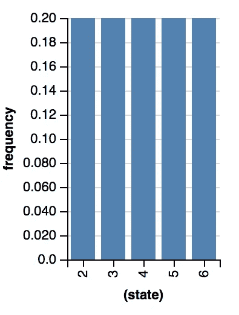
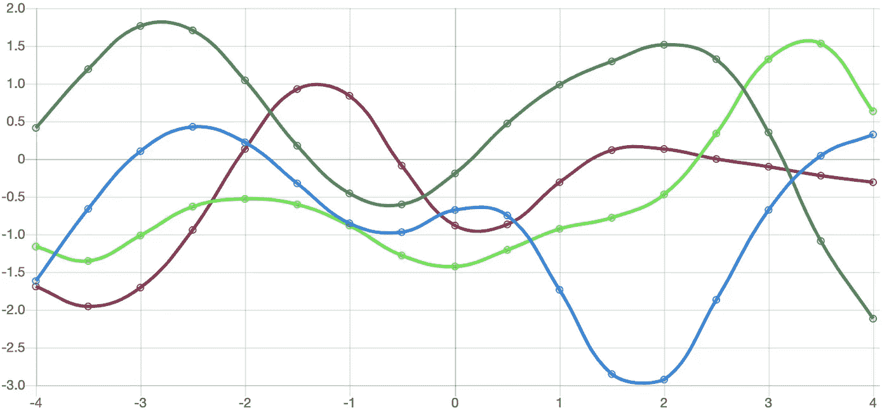
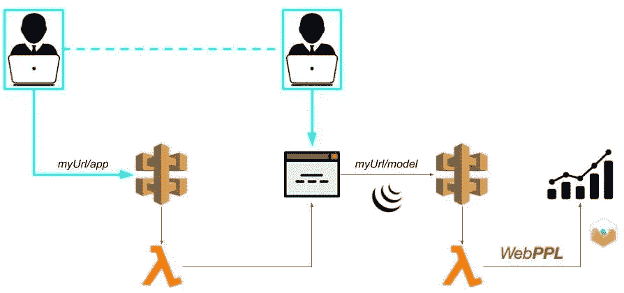
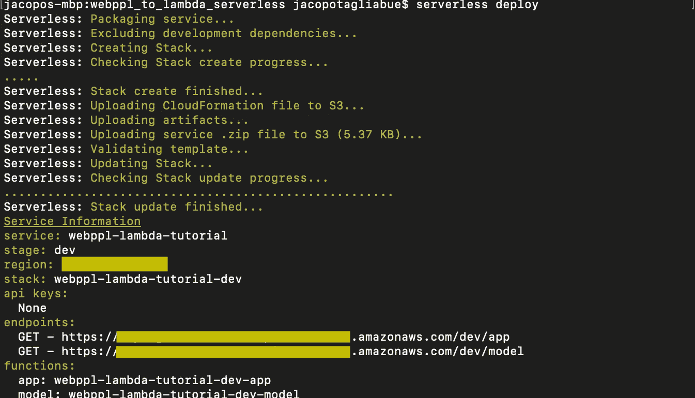
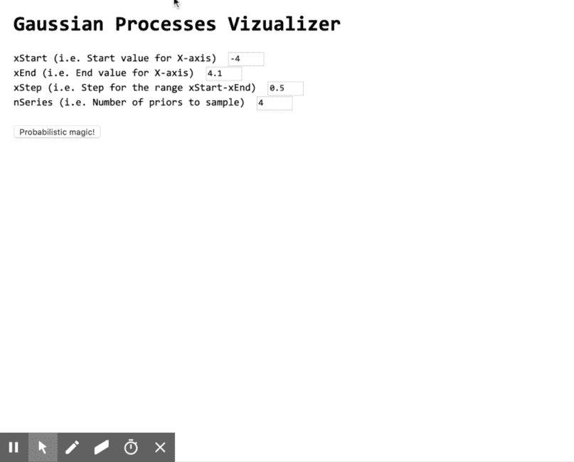

# 使用概率模型和 AWS Lambda 函数构建智能(er)应用程序

> 原文：<https://towardsdatascience.com/build-smart-er-applications-with-probabilistic-models-and-aws-lambda-functions-da982d69cab1?source=collection_archive---------22----------------------->

用 WebPPL 概率程序为端点供电的快速、廉价和无服务器的方法。

## 哎呀！…我需要再次部署一个模型

> "概率是生活的向导."―西塞罗

当今天的酷孩子忙着画张量和画 PyTorch 时，更酷的孩子越来越喜欢*概率编程*(PP)——例如参见 [Pyro](https://github.com/pyro-ppl/pyro) ， [Figaro](https://livebook.manning.com/#!/book/practical-probabilistic-programming/about-this-book/) ， [Stan](https://mc-stan.org/) ，[Infer.NET](https://github.com/dotnet/infer)(想了解更多关于 *PP* 的哲学倾向的读者可以从我们自己关于概念学习的[观点文章](/fluid-concepts-and-creative-probabilities-785d3c81610a)开始

如果你是一名数据科学家/数据工程师/人工智能什么的，并且你正在考虑给你现有的数据管道添加一些概率魔法——而不打扰你的 devOps 团队和花费云资金——你可能会喜欢让微服务以一种*快速、廉价和直接的*方式公开模型的想法。

> 在这篇文章中，我们利用[无服务器](https://serverless.com/framework/)和 [AWS lambda](https://aws.amazon.com/it/lambda/) 功能在几分钟内部署一个 [WebPPL 驱动的](http://webppl.org/)端点。正如我们将看到的，新部署的端点，加上其他无服务器代码(例如，一个单页 web 应用程序)，成为一个可以在组织内共享的原型，用于快速反馈和快速迭代。

这是“懒惰开发”系列中[之前帖子](https://medium.com/tooso/serving-tensorflow-predictions-with-python-and-aws-lambda-facb4ab87ddd)的续篇，该系列以带有 [Tensorflow 模型](https://github.com/jacopotagliabue/tensorflow_to_lambda_serverless)和 [Spark 决策树](/from-big-data-to-micro-services-how-to-serve-spark-trained-models-through-aws-lambdas-ebe129f4849c)的 AWS Lambda 函数为特色。

## 先决条件

在深入研究代码之前，请确保:

1.  拥有一个安装了 [npm](https://www.npmjs.com/get-npm) 的工作节点环境；
2.  拥有一个 *AWS 帐户*来将代码部署到[AWS Lambda](https://aws.amazon.com/lambda/)；
3.  设置*无服务器*(遵循此处的说明[；记得设置你的 AWS](https://serverless.com/framework/docs/providers/aws/guide/installation/) [凭证](https://serverless.com/framework/docs/providers/aws/guide/credentials/))；
4.  如果你有一个 WebPPL 模型准备好了，太好了(100 奖励点！);如果没有，不用担心:我们将一起发货！

像往常一样，你可以在我们的 [GitHub](https://github.com/jacopotagliabue/webppl_to_lambda_serverless) 页面中找到所有代码:让我们开始工作吧。

## (玩具)概率应用程序

> “所有的模型都是错的，但有些是有用的。”―G .盒子

如果说 Javascript 中程序的语义是从程序到执行的函数，那么它的 *PP* 表亲 WebPPL 的语义是从程序到执行的*分发*的函数。换句话说，当你[运行这个程序](http://www.jacopotagliabue.it/webppl_tutorial.html#anchor_rolling_forward)时:

结果是结果的分布，通过 I)列举随机变量(`die1`和`die2`)的可能值，ii)以`die1 + die2`之和的值(`8`)为条件，即*拒绝*条件为*不*满足的所有运行:



Frequency distribution for the value of the first die, conditional on the sum of the two being 8.

由于这不是对[概率规划](https://livebook.manning.com/#!/book/practical-probabilistic-programming/about-this-book/)的[介绍，因此我们仅简单提及 *PP* 原则已经成功应用于各种各样的现象，例如](https://www.cs.cornell.edu/courses/cs4110/2016fa/lectures/lecture33.html)[技能评级](https://www.microsoft.com/en-us/research/publication/trueskilltm-a-bayesian-skill-rating-system/?from=https%3A%2F%2Fresearch.microsoft.com%2Fapps%2Fpubs%2Fdefault.aspx%3Fid%3D67956)、计算机[视觉](https://www.ncbi.nlm.nih.gov/pubmed/16784882)和基于图像的推理(参见[此处](http://dippl.org/examples/vision.html)和[此处](https://web.mit.edu/cocosci/Papers/Science-2015-Lake-1332-8.pdf))、[程序合成](https://arxiv.org/pdf/1611.07051.pdf)、[不确定性下的决策](https://agentmodels.org/)， [自然语言语义学](https://gscontras.github.io/ESSLLI-2016/)和[语用学](http://forestdb.org/models/blm.html)，以及显然在[认知科学](https://probmods.org)中模拟人类推理的棘手任务——非懒惰读者被强烈鼓励[进一步探索理论景观](/fluid-concepts-and-creative-probabilities-785d3c81610a)并了解这一工具家族的许多优点(例如，在服务预测时量化模型不确定性)。

正如所料，我们将使用的语言是 [WebPPL](http://webppl.org/) ，一个纯粹的函数 Javascript 子集，增加了概率原语，如`sample`(一个函数，不出所料，[从分布](https://webppl.readthedocs.io/en/master/sample.html)中采样值)。为了展示 WebPPL 的概率性质，我们将从[高斯过程中采样并提取数据点](https://peterroelants.github.io/posts/gaussian-process-tutorial/) ( *GP* ): *GPs* 非常酷[，](http://mlss2011.comp.nus.edu.sg/uploads/Site/lect1gp.pdf)[非常通用](https://arxiv.org/pdf/1611.07051.pdf)并在数据科学社区中得到越来越多的关注(显然，我们讨论的内容并不特定于 *GPs* ，因此可以应用于其他类型的 WebPPL 程序，例如，对[计算机视觉的推理](http://www.jacopotagliabue.it/webppl_tutorial.html#draw_basic)



Charting priors from GPs with the [RBF kernel](https://en.wikipedia.org/wiki/Radial_basis_function_kernel) (mean=0, sigma=1).

预期的工作流程如下:



A lambda-powered web app for prototyping and data viz. with WebPPL and standard JS libraries.

*   用户从公共 URL 请求 web 应用程序；
*   一个[λ](https://aws.amazon.com/it/lambda/)函数被 [API 网关](https://aws.amazon.com/it/api-gateway/)调用；响应是简单的 HTML 代码，包含一个基本表单，要求用户输入一些变量；
*   用户通过一个 HTML 按钮提交她的选择，这个按钮使用 JQuery 向模型端点发送一个 AJAX 请求；
*   API 网关调用 Lambda 函数；响应是在用户输入上运行所选择的 WebPPL 程序(下面将详细介绍)的输出；
*   最后，一些 [Chart.js](https://www.chartjs.org/) 代码将端点响应映射到一个漂亮的数据可视化。

在下一节中，我们将看到如何在几秒钟内从一个存在于 powerpoint 中的想法变成一个有效的 web 应用程序。

## 空谈不值钱，给我看看代码！

> “给一个人一个程序，让他沮丧一天。
> 教一个人编程，挫他一辈子。”―米·瓦西姆

我们的项目功能仅依赖于[项目](https://github.com/jacopotagliabue/webppl_to_lambda_serverless)中的两个文件:

*   `handler.js`包含上述两个功能的代码；
*   `serverless.yml`是一个标准的 *yml* 文件，描述了运行这两个功能的 AWS 基础设施。

`serverless.yml`是一个普通的[无服务器文件](https://serverless.com/framework/docs/providers/aws/events/apigateway/)，它通过 API Gateway 将 lambda 函数公开为端点:这里没有什么特别的(例如，万维网上已经充满了关于这个设置的[教程](https://serverless.com/blog/node-rest-api-with-serverless-lambda-and-dynamodb/)，包括[我们自己的](https://medium.com/tooso/serving-tensorflow-predictions-with-python-and-aws-lambda-facb4ab87ddd))。

所有神奇的事情都发生在这里。该结构确实相当简单，因此我们将重点介绍一些关键特性:

*   WebPPL 是用顶部的`webppl = require('webppl')`语法导入的；
*   `app`是一个简单的函数，返回一个完整的 HTML 页面，包括在末尾添加所需输入字段和基本交互的 JQuery 函数——HTML 代码简单地存储为一个字符串，并在响应中返回特定的`headers`；
*   `model`函数是实际运行 WebPPL 代码的函数:它从一些简单的参数检查/验证/类型转换开始，然后使用`webppl.run(CODE)`执行在`const code`变量中指定的代码。请注意，为了向模型传递查询参数，我们使用了书中最简单的技巧，即构建一个包含脚本变量的代码片段(作为字符串),并确保`code`使用输入变量的正确名称。一个显而易见的选择是[全球商店](https://webppl.readthedocs.io/en/master/globalstore.html)，但是如果没有特别的顾虑(就像在这个例子中)，我们的简单策略就足够了。

要查看项目的运行情况，只需克隆 [repo](https://github.com/jacopotagliabue/webppl_to_lambda_serverless) ，打开终端，`cd`进入文件夹，下载 [WebPPL 依赖关系](https://aws.amazon.com/it/premiumsupport/knowledge-center/lambda-deployment-package-nodejs/):

```
npm install webppl
```

然后最后键入:

```
serverless deploy
```

如果[无服务器](https://serverless.com/)安装正确，第一个`deploy`触发 AWS 上所需资源的创建(未来的`deploy`命令会更快)。等待一段时间后，您应该会在终端中看到一条成功消息:



Congratulations, your lambdas are up and running!

如果你将浏览器指向在终端中找到的`/app` URL(见上图中的“端点”)，一切都应该如预期的那样工作:



Our fantastic web app is up and running (original video [here](https://drive.google.com/file/d/1LefJ2jcHEh5IbhhqEqppjgqIwVJMWP5N/view))!

当您对原型满意并准备好清理资源时，只需使用`remove` [命令](https://serverless.com/framework/docs/providers/aws/cli-reference/remove/)来安全地移除堆栈:

```
serverless remove
```

## 后续步骤

> “一千个模特的旅程从一个(几乎)老子开始”

在*这篇*的简短帖子中，我们展示了如何将概率模型部署到 AWS，并通过标准 GET 请求用几行代码按需提供预测:

> 这种设置快速、可靠且廉价(如果不是免费的，因为[前 100 万个请求/mo](https://aws.amazon.com/it/lambda/pricing/) 完全在[杰夫·贝索斯](https://en.wikipedia.org/wiki/Jeff_Bezos)上)。

要使提供的模板适应您自己的原型，只需更改`model`函数中的 WebPPL 代码，然后相应地调整 HTML 输入字段、参数解析和数据可视化:在几分钟内，您将能够与任何人分享您非凡的贝叶斯建模的结果，或者生成有洞察力的可视化来帮助您的科学探索。

在可视化方面， [WebPPL viz](https://probmods.github.io/webppl-viz/) 模块可能会有一些启发来概括现在简单而杂乱的图表:使用 [chart.js](https://www.chartjs.org) / [d3](https://d3js.org/) 围绕 WebPPL 模型的主要用例构建一个可重用的包装器应该不会花费太长时间*对于非懒惰读者的练习*:对于线性回归案例，例如*单一回归*来说，什么可能是有趣且引人入胜的可视化].

在建模方面，我们选择了 *GP* s 来提供一个在浏览器窗口中看起来不错的端到端概率程序，但显然概率人工智能的世界是伟大的，并且——像宇宙一样——在不断扩展:如果你想要一些 PP 建模的想法，这里有一吨很酷的东西。

最后，如果你*真的*喜欢这个设置，你认为它已经准备好了，一定要添加测试，错误处理和所有其他重要的东西，这个教程太短了，无法包含。

快乐(概率)编码！

## 再见，太空牛仔


如果您有问题、反馈或评论，请与[jacopo . taglia bue @ tooso . ai](mailto:jacopo.tagliabue@tooso.ai)分享您的故事。

别忘了从 [Linkedin](https://www.linkedin.com/company/tooso) 、 [Twitter](https://twitter.com/tooso_ai) 和 [Instagram](https://www.instagram.com/tooso_ai/) 上的 [Tooso](http://tooso.ai/) 获取最新消息。

## 感谢

如果没有 Tooso 的高级工程师和节点向导 Luca，这一切都是不可能的:Luca 建立了我们的第一个 WebPPL-to-lambda 游乐场，并耐心地回答了我所有(愚蠢的)节点问题。

这篇文章中大多数好的想法都是卢卡的，剩下的错误都是我的。