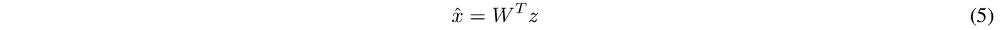

# 构建正确的自动编码器——使用 PCA 原理进行调整和优化。第一部分

> 原文：<https://towardsdatascience.com/build-the-right-autoencoder-tune-and-optimize-using-pca-principles-part-i-1f01f821999b?source=collection_archive---------2----------------------->

## 在这里，我们将学习自动编码器的期望属性，这些属性源自它与 PCA 的相似性。由此，我们将在[第二部分](https://medium.com/@cran2367/build-the-right-autoencoder-tune-and-optimize-using-pca-principles-part-ii-24b9cca69bd6)中为自动编码器构建定制约束，以进行调整和优化。

<<download the="" free="" book="" class="ae kf" href="https://www.understandingdeeplearning.com" rel="noopener ugc nofollow" target="_blank">了解深度学习，了解更多> ></download>

深度学习 API 的可用性，如 Keras 和 TensorFlow，使模型建立和实验变得极其容易。然而，对基本面缺乏清晰的理解可能会让我们在最佳模式的竞赛中迷失方向。在这样的比赛中达到最佳模式是靠运气的。

在这里，我们将了解自动编码器所需的基本属性。这将为自动编码器调整和优化提供一个很好的指导方法。在第一部分中，我们将重点学习这些属性及其优点。在[第二部分](https://medium.com/@cran2367/build-the-right-autoencoder-tune-and-optimize-using-pca-principles-part-ii-24b9cca69bd6)，我们将开发自定义层和约束来合并属性。

我们将在这里学习的主要概念是，**自动编码器与主成分分析(PCA)** 直接相关，这将使我们能够构建一个正确的*自动编码器。一个“正确的”自动编码器在数学上意味着一个适定的自动编码器。一个适定的模型更容易调整和优化。*

自动编码器相对于PCA **、**

*   线性激活的自动编码器近似于 PCA。数学上，最小化 PCA 建模中的重建误差与单层线性自动编码器相同。
*   自动编码器将 PCA 扩展到非线性空间。换句话说，自动编码器是 PCA 的非线性扩展。

因此，自动编码器应该理想地具有 PCA 的特性。这些属性是，

*   **绑定权重:**编码器和相应解码器层上的权重相等(在下一节的图 1 中阐明)。
*   **正交权重:**每个权重向量都是相互独立的。
*   **不相关特征:**编码层的输出不相关。
*   **单位定额:**一层上的权重有单位定额。

然而，大多数教程中解释的自动编码器，例如[在 Keras](https://blog.keras.io/building-autoencoders-in-keras.html)【1】中构建自动编码器，没有这些属性。缺少这一点使它们不是最佳的。

因此，对于一个适定的自动编码器来说，结合这些属性是很重要的。通过合并它们，我们还将

*   **有正规化。**正交性和单位范数约束作为正则化。此外，正如我们将在后面看到的，绑定权重将网络参数的数量减少了近一半，这是另一种正则化类型。
*   **解决爆炸和消失的渐变。**单位范数约束防止权重变大，因此解决了爆炸梯度问题。此外，由于正交性约束，只有重要的/信息性的权重是非零的。因此，在反向传播期间，足够的信息流过这些非零权重，从而避免消失梯度。
*   **有更小的网络**:没有正交性，编码器有冗余的权重和特征。为了补偿冗余，增加了编码器的尺寸。相反，正交性确保每个编码特征都有一条唯一的信息——独立于其他特征。这消除了冗余，并且我们可以用较小的编码器(层)编码相同数量的信息。

> 通过一个更小的网络，我们让 Autoencoder 更接近**边缘计算**。

本文将通过展示

1.  PCA 和 Autoencoder 之间的架构相似性，以及
2.  传统自动编码器的次优性。

本文将在[第二部分](https://medium.com/@cran2367/build-the-right-autoencoder-tune-and-optimize-using-pca-principles-part-ii-24b9cca69bd6)中继续，详细介绍优化自动编码器的步骤。在第二部分的[中，我们发现优化将自动编码器重构误差提高了 50%以上。](/build-the-right-autoencoder-tune-and-optimize-using-pca-principles-part-ii-24b9cca69bd6)

本文假设读者对 PCA 有基本的了解。如果不熟悉，请参考[了解 PCA](https://medium.com/@aptrishu/understanding-principle-component-analysis-e32be0253ef0)【2】。

# PCA 和自动编码器之间的架构相似性


Figure 1\. Single layer Autoencoder vis-à-vis PCA.

为简单起见，我们将线性单层自动编码器与 PCA 进行比较。PCA 建模有多种算法。其中之一是通过最小化重建误差进行估计(参见[ [3](https://www.cs.cmu.edu/~mgormley/courses/10701-f16/slides/lecture14-pca.pdf) ])。遵循该算法可以更清楚地理解 PCA 和自动编码器之间的相似之处。

图 1 显示了单层线性自动编码器。如图底部所示，编码过程类似于 PC 变换。PC 变换将原始数据投影到主成分上，以产生正交特征，称为主得分。类似地，解码过程类似于从主要分数重构数据。在自动编码器和 PCA 中，可以通过最小化重建误差来估计模型权重。

在下文中，我们将通过展示关键的自动编码器组件及其在 PCA 中的等效组件来进一步阐述图 1。

假设我们有带有 *p* 特征的数据。

**输入层—数据样本。**

*   在自动编码器中，使用尺寸为 *p.* 的**输入层**输入数据
*   在 PCA 中，数据作为样本输入。

**编码——数据在主成分上的投影。**

*   编码层的大小为 *k* 。在 PCA 中， *k* 表示选择的主成分(PCs)的数量。
*   在两者中，我们都有 *k* < *p* 进行降维。 *k ≥ p* 导致过代表模型，因此(接近)零重建误差。
*   图 1 中编码层中的彩色单元是计算节点，其具有表示为*p*的权重，


也就是说，对于 1，…， *k* 中的每个编码节点，我们都有一个 *p* 维的权重向量。这相当于 PCA 中的一个特征向量。

*   自动编码器中的编码层输出是，


*x* 是输入， *W* 是权重矩阵。功能 *g* 是一个激活功能。 *g* ( *Wx* )是编码层的输出。如果激活是线性的，这相当于 PCA 中的主要分数。

**解码——从主要分数中重建数据。**

*   自动编码器和 PCA 重建中解码层的大小必须是输入数据的大小
*   在解码器中，数据从编码中被重构为，


类似地，在 PCA 中，它被重构为，



注意，我们在等式中有*W’*。4 和等式中的 *W* 。5.这是因为，默认情况下，编码器和解码器的权重不同。如果编码器和解码器权重与*绑定*，解码器和 PCA 重建将是相同的，即


> 解码器单元中的多种颜色表示编码器中不同单元中的权重出现在解码器中的相同单元中。

这就把我们带到了自动编码器和 PCA 之间的数学比较。

数学上，线性自动编码器将类似于 PCA if，

*   **捆绑权重**:在任何通用多层自动编码器中，编码器模块中的层 *l* 的权重等于解码器中从末端开始的层 *l* 的权重的转置。


*   **正交权重**:编码层上的权重是正交的(参见等式。7b)。可以在中间编码器层上实施相同的正交性约束以进行规则化。


*   **不相关特征**:PCA 的输出，即主分数，是不相关的。因此，编码器的输出应该具有，


*   **单位范数**:PCA 中的特征向量被约束为具有单位范数。如果没有这个约束，我们将得不到一个合适的解，因为只要向量的范数增加，投影的方差就可能变得任意大。出于同样的原因，编码层上的权重应该是单位范数(参见等式 1)。7d)。这个约束也应该应用于其他中间层以进行正则化。


# 正则无约束自动编码器的次优性

这里我们将在随机数据集上实现 PCA 和一个典型的无约束自动编码器。我们将展示它们的输出在上述各个方面的不同。这导致了次优的自动编码器。在这个讨论之后，我们将展示如何为*正确的*估计([第二部分](https://medium.com/@cran2367/build-the-right-autoencoder-tune-and-optimize-using-pca-principles-part-ii-24b9cca69bd6))约束自动编码器。

完整的代码可在[这里](https://github.com/cran2367/pca-autoencoder-relationship/blob/master/pca-autoencoder-relationship.ipynb)获得。

**加载库**

```
**from** **numpy.random** **import** seed
seed(123)
**from** **tensorflow** **import** set_random_seed
set_random_seed(234)

**import** **sklearn**
**from** **sklearn** **import** datasets
**import** **numpy** **as** **np**
**from** **sklearn.model_selection** **import** train_test_split
**from** **sklearn.preprocessing** **import** StandardScaler, MinMaxScaler
**from** **sklearn** **import** decomposition
**import** **scipy**

**import** **tensorflow** **as** **tf**
**from** **keras.models** **import** Model, load_model
**from** **keras.layers** **import** Input, Dense, Layer, InputSpec
**from** **keras.callbacks** **import** ModelCheckpoint, TensorBoard
**from** **keras** **import** regularizers, activations, initializers, constraints, Sequential
**from** **keras** **import** backend **as** K
**from** **keras.constraints** **import** UnitNorm, Constraint
```

**生成随机数据**

我们生成多元相关正态数据。数据生成的步骤在 [GitHub 库](https://github.com/cran2367/pca-autoencoder-relationship/blob/master/pca-autoencoder-relationship.ipynb)中有详细说明。

```
n_dim = 5
cov = sklearn.datasets.make_spd_matrix(n_dim, random_state=None)
mu = np.random.normal(0, 0.1, n_dim)n = 1000X = np.random.multivariate_normal(mu, cov, n)X_train, X_test = train_test_split(X, test_size=0.5, random_state=123)# *Data Preprocessing* scaler = MinMaxScaler()
scaler.fit(X_train)X_train_scaled = scaler.transform(X_train)X_test_scaled = scaler.transform(X_test)
```

测试数据集将在[第二部分](https://medium.com/@cran2367/build-the-right-autoencoder-tune-and-optimize-using-pca-principles-part-ii-24b9cca69bd6)中用于比较自动编码器重建精度。

**自动编码器和 PCA 型号**

我们安装了一个单层线性自动编码器，编码维数为**两个**。我们还为 PCA 安装了两个组件**。**

```
# *Fit Autoencoder*
nb_epoch = 100
batch_size = 16
input_dim = X_train_scaled.shape[1] *#num of predictor variables,* 
encoding_dim = 2
learning_rate = 1e-3

encoder = Dense(encoding_dim, activation="linear", input_shape=(input_dim,), use_bias = **True**) 
decoder = Dense(input_dim, activation="linear", use_bias = **True**)

autoencoder = Sequential()
autoencoder.add(encoder)
autoencoder.add(decoder)

autoencoder.compile(metrics=['accuracy'],
                    loss='mean_squared_error',
                    optimizer='sgd')
autoencoder.summary()

autoencoder.fit(X_train_scaled, X_train_scaled,
                epochs=nb_epoch,
                batch_size=batch_size,
                shuffle=**True**,
                verbose=0)# *Fit PCA*
pca = decomposition.PCA(n_components=2)pca.fit(X_train_scaled)
```


Figure 2\. Structure of the single-layer Autoencoder.

从视觉上看，这里开发的编码器-解码器结构如下面的图 3 所示。该图有助于理解权重矩阵是如何排列的。


Figure 3\. A simple linear Autoencoder to encode a 5-dimensional data into 2-dimensional features.

为了遵循 PCA 属性，图 3 中的自动编码器应该遵循等式中的条件。下面，我们将示出这种传统的自动编码器不满足它们中的任何一个。

## 1.捆绑重物

正如我们在下面看到的，编码器和解码器的权重是不同的。

```
w_encoder = np.round(autoencoder.layers[0].get_weights()[0], 2).T  *# W in Figure 3.*
w_decoder = np.round(autoencoder.layers[1].get_weights()[0], 2)  *# W' in Figure 3.*
print('Encoder weights **\n**', w_encoder)
print('Decoder weights **\n**', w_decoder)
```


## **2。权重正交性**

如下所示，与 PCA 权重(即特征向量)不同，编码器和解码器上的权重不是正交的。

```
w_pca = pca.components_
np.round(np.dot(w_pca, w_pca.T), 3)
```


```
np.round(np.dot(w_encoder, w_encoder.T), 3)
```


```
np.round(np.dot(w_decoder, w_decoder.T), 3)
```


## **3。特征关联**

在 PCA 中，特征是不相关的。

```
pca_features = pca.fit_transform(X_train_scaled)
np.round(np.cov(pca_features.T), 5)
```


但是编码特征是相关的。

```
encoder_layer = Model(inputs=autoencoder.inputs, outputs=autoencoder.layers[0].output)
encoded_features = np.array(encoder_layer.predict(X_train_scaled))
print('Encoded feature covariance\n', np.cov(encoded_features.T))
```


> 权重非正交性和特征相关性是不期望的，因为它带来了包含在编码特征中的信息的冗余。

## **4。单位定额**

五氯苯甲醚重量的单位标准是 1。这是在 PCA 估计中应用的约束，以产生*正确的*估计*。*

```
print('PCA weights norm, \n', np.sum(w_pca ** 2, axis = 1))
print('Encoder weights norm, \n', np.sum(w_encoder ** 2, axis = 1))
print('Decoder weights norm, \n', np.sum(w_decoder ** 2, axis = 1))
```


[**Github 库**](https://github.com/cran2367/pca-autoencoder-relationship/blob/master/pca-autoencoder-relationship.ipynb)

完整的代码可在[这里](https://github.com/cran2367/pca-autoencoder-relationship/blob/master/pca-autoencoder-relationship.ipynb)获得。

[](https://github.com/cran2367/pca-autoencoder-relationship/blob/master/pca-autoencoder-relationship.ipynb) [## cran 2367/PCA-自动编码器-关系

### 了解 PCA 和自动编码器之间的关系-cran 2367/PCA-自动编码器-关系

github.com](https://github.com/cran2367/pca-autoencoder-relationship/blob/master/pca-autoencoder-relationship.ipynb) 

# 结论

因此，自动编码器模型是不适定的。不适定模型没有稳健的估计。这不利地影响了它的测试精度，即新数据的重建误差。

最近的几项研究进展是建立和利用正交条件来提高深度学习模型的性能。一些研究方向参考[ [4](https://arxiv.org/pdf/1709.06079.pdf) ]和[ [5](https://arxiv.org/pdf/1609.07093.pdf) ]。

在续集[第二部分](https://medium.com/@cran2367/build-the-right-autoencoder-tune-and-optimize-using-pca-principles-part-ii-24b9cca69bd6)中，我们将实现自定义约束，将上述从 PCA 得到的属性合并到自动编码器中。我们将会看到，添加约束改善了测试重构误差。

[*去看续集，下集。*](https://medium.com/@cran2367/build-the-right-autoencoder-tune-and-optimize-using-pca-principles-part-ii-24b9cca69bd6)

# 参考

1.  [在 Keras 中构建自动编码器](https://blog.keras.io/building-autoencoders-in-keras.html)
2.  [理解主成分分析](https://medium.com/@aptrishu/understanding-principle-component-analysis-e32be0253ef0)
3.  [主成分分析:利用重构误差的算法(第 15 页)。](https://www.cs.cmu.edu/~mgormley/courses/10701-f16/slides/lecture14-pca.pdf)
4.  黄，雷等.[正交权重归一化:深度神经网络中多重相关 stiefel 流形上的优化解。](https://arxiv.org/pdf/1709.06079.pdf)*第三十二届 AAAI 人工智能大会*。2018.
5.  使用内省对抗网络的神经照片编辑。*arXiv 预印本 arXiv:1609.07093* (2016)。