# 构建正确的自动编码器——使用 PCA 原理进行调整和优化。第二部分

> 原文：<https://towardsdatascience.com/build-the-right-autoencoder-tune-and-optimize-using-pca-principles-part-ii-24b9cca69bd6?source=collection_archive---------3----------------------->

## 在[第一部分](https://medium.com/@cran2367/build-the-right-autoencoder-tune-and-optimize-using-pca-principles-part-i-1f01f821999b)的延续中，我们将在这里定义并实现自定义约束，以构建一个适定的自动编码器。一个适定的自动编码器是一个正则化的模型，它改善了测试重建误差。

<<download the="" free="" book="" class="ae kf" href="https://www.understandingdeeplearning.com" rel="noopener ugc nofollow" target="_blank">了解深度学习，了解更多> ></download>

[*去看前传第一部*](https://medium.com/@cran2367/build-the-right-autoencoder-tune-and-optimize-using-pca-principles-part-i-1f01f821999b)

在[第一部分](https://medium.com/@cran2367/build-the-right-autoencoder-tune-and-optimize-using-pca-principles-part-i-1f01f821999b)中，我们了解到 PCA 和自动编码器在架构上有相似之处。但是尽管如此，自动编码器本身并不具有 PCA 属性，例如正交性。我们知道，结合 PCA 属性将为自动编码器带来显著的好处，例如解决消失和爆炸梯度，以及通过正则化进行过拟合。

基于此，我们希望自动编码器继承的属性是:

1.  捆绑重物，
2.  正交权重，
3.  不相关的特征，以及
4.  单位定额。

在本文中，我们将

*   实现自定义层和约束来合并它们。
*   演示它们是如何工作的，以及它们带来的重构误差的改善。

这些实现将能够构造一个适定的自动编码器并对其进行优化。在我们的示例中，优化将重建误差提高了 50%以上。

> 注意:正则化技术，如*辍学*，是普遍使用的。但是没有一个适定的模型，这些方法需要更长的时间来优化。

下一节详细展示了该实现。读者可以跳至**关键要点**部分进行简要总结。

# 一个适配的自动编码器

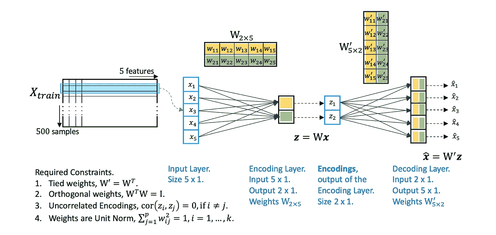

Figure 1\. Apply constraints for a well-posed Autoencoder.

我们将为随机生成的数据集开发一个具有五个特征的自动编码器。我们将数据集分为训练集和测试集。当我们添加约束时，我们将使用测试数据重构误差来评估性能。

本文包含实现细节，以帮助从业者尝试各种选择。完整的代码显示在[这里](https://github.com/cran2367/pca-autoencoder-relationship/blob/master/pca-autoencoder-relationship.ipynb)。

## 导入库

```
from numpy.random import seed
seed(123)
from tensorflow import set_random_seed
set_random_seed(234)import sklearn
from sklearn import datasets
import numpy as np
from sklearn.model_selection import train_test_split
from sklearn.preprocessing import StandardScaler, MinMaxScaler
from sklearn import decomposition
import scipyimport tensorflow as tf
from keras.models import Model, load_model
from keras.layers import Input, Dense, Layer, InputSpec
from keras.callbacks import ModelCheckpoint, TensorBoard
from keras import regularizers, activations, initializers, constraints, Sequential
from keras import backend as K
from keras.constraints import UnitNorm, Constraint
```

## 生成和准备数据

```
n_dim = 5
cov = sklearn.datasets.make_spd_matrix(n_dim, random_state=None)mu = np.random.normal(0, 0.1, n_dim)n = 1000X = np.random.multivariate_normal(mu, cov, n)X_train, X_test = train_test_split(X, test_size=0.5, random_state=123)# *Scale the data between 0 and 1.*
scaler = MinMaxScaler()
scaler.fit(X_train)X_train_scaled = scaler.transform(X_train)X_test_scaled = scaler.transform(X_test)X_train_scaled
```

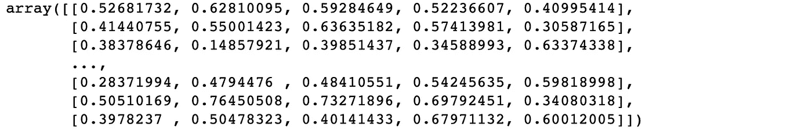

**估算参数**

```
nb_epoch = 100
batch_size = 16
input_dim = X_train_scaled.shape[1] *#num of predictor variables,* 
encoding_dim = 2
learning_rate = 1e-3
```

**基线模型**

```
encoder = Dense(encoding_dim, activation="linear", input_shape=(input_dim,), use_bias = **True**) 
decoder = Dense(input_dim, activation="linear", use_bias = **True**)

autoencoder = Sequential()
autoencoder.add(encoder)
autoencoder.add(decoder)

autoencoder.compile(metrics=['accuracy'],
                    loss='mean_squared_error',
                    optimizer='sgd')
autoencoder.summary()

autoencoder.fit(X_train_scaled, X_train_scaled,
                epochs=nb_epoch,
                batch_size=batch_size,
                shuffle=**True**,
                verbose=0)
```

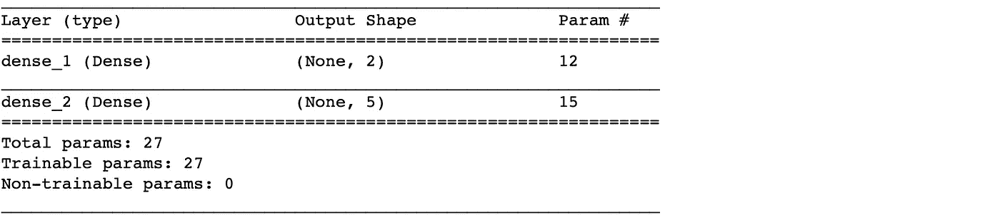

Figure 2.1\. Baseline Model Parameters.

**基线重建误差**

```
train_predictions = autoencoder.predict(X_train_scaled)
print('Train reconstrunction error**\n**', sklearn.metrics.mean_squared_error(X_train_scaled, train_predictions))
test_predictions = autoencoder.predict(X_test_scaled)
print('Test reconstrunction error**\n**', sklearn.metrics.mean_squared_error(X_test_scaled, test_predictions))
```

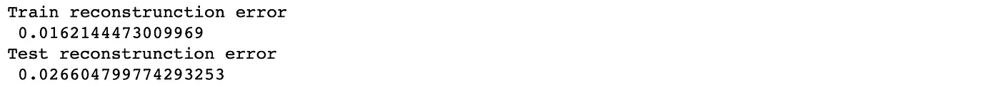

Figure 2.2\. Baseline Autoencoder Reconstruction Error.

## 自动编码器优化

Keras 提供了各种层和约束。对于**单位定额，我们有一个可用的约束。**对于其他人，我们将构建自定义层和约束。

1.  **自定义图层:捆绑砝码。**

有了这个自定义层，我们可以使编码器和解码器的权重相等。数学上，解码器权重的转置等于编码器权重(等式)。第一部分 7a)。

```
**class** **DenseTied**(Layer):
    **def** __init__(self, units,
                 activation=**None**,
                 use_bias=**True**,
                 kernel_initializer='glorot_uniform',
                 bias_initializer='zeros',
                 kernel_regularizer=**None**,
                 bias_regularizer=**None**,
                 activity_regularizer=**None**,
                 kernel_constraint=**None**,
                 bias_constraint=**None**,
                 tied_to=**None**,
                 **kwargs):
        self.tied_to = tied_to
        **if** 'input_shape' **not** **in** kwargs **and** 'input_dim' **in** kwargs:
            kwargs['input_shape'] = (kwargs.pop('input_dim'),)
        super().__init__(**kwargs)
        self.units = units
        self.activation = activations.get(activation)
        self.use_bias = use_bias
        self.kernel_initializer = initializers.get(kernel_initializer)
        self.bias_initializer = initializers.get(bias_initializer)
        self.kernel_regularizer = regularizers.get(kernel_regularizer)
        self.bias_regularizer = regularizers.get(bias_regularizer)
        self.activity_regularizer = regularizers.get(activity_regularizer)
        self.kernel_constraint = constraints.get(kernel_constraint)
        self.bias_constraint = constraints.get(bias_constraint)
        self.input_spec = InputSpec(min_ndim=2)
        self.supports_masking = **True**

    **def** build(self, input_shape):
        **assert** len(input_shape) >= 2
        input_dim = input_shape[-1]

        **if** self.tied_to **is** **not** **None**:
            self.kernel = K.transpose(self.tied_to.kernel)
            self._non_trainable_weights.append(self.kernel)
        **else**:
            self.kernel = self.add_weight(shape=(input_dim, self.units),
                                          initializer=self.kernel_initializer,
                                          name='kernel',
                                          regularizer=self.kernel_regularizer,
                                          constraint=self.kernel_constraint)
        **if** self.use_bias:
            self.bias = self.add_weight(shape=(self.units,),
                                        initializer=self.bias_initializer,
                                        name='bias',
                                        regularizer=self.bias_regularizer,
                                        constraint=self.bias_constraint)
        **else**:
            self.bias = **None**
        self.input_spec = InputSpec(min_ndim=2, axes={-1: input_dim})
        self.built = **True**

    **def** compute_output_shape(self, input_shape):
        **assert** input_shape **and** len(input_shape) >= 2
        output_shape = list(input_shape)
        output_shape[-1] = self.units
        **return** tuple(output_shape)

    **def** call(self, inputs):
        output = K.dot(inputs, self.kernel)
        **if** self.use_bias:
            output = K.bias_add(output, self.bias, data_format='channels_last')
        **if** self.activation **is** **not** **None**:
            output = self.activation(output)
        **return** output
```

带绑定解码器的自动编码器。

```
encoder = Dense(encoding_dim, activation="linear", input_shape=(input_dim,), use_bias = True) 
decoder = DenseTied(input_dim, activation="linear", tied_to=encoder, use_bias = True)autoencoder = Sequential()
autoencoder.add(encoder)
autoencoder.add(decoder)autoencoder.compile(metrics=['accuracy'],
                    loss='mean_squared_error',
                    optimizer='sgd')
autoencoder.summary()autoencoder.fit(X_train_scaled, X_train_scaled,
                epochs=nb_epoch,
                batch_size=batch_size,
                shuffle=True,
                verbose=0)
```

**观察结果**

1a。同等重量。

```
w_encoder = np.round(np.transpose(autoencoder.layers[0].get_weights()[0]), 3)
w_decoder = np.round(autoencoder.layers[1].get_weights()[0], 3)
print('Encoder weights**\n**', w_encoder)
print('Decoder weights**\n**', w_decoder)
```

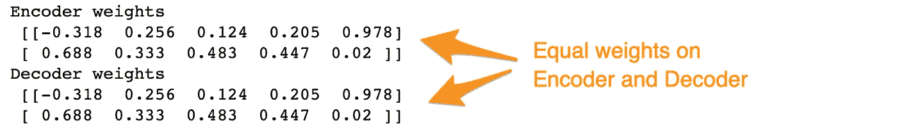

1b。偏见是不同的。

```
b_encoder = np.round(np.transpose(autoencoder.layers[0].get_weights()[1]), 3)
b_decoder = np.round(np.transpose(autoencoder.layers[1].get_weights()[0]), 3)
print('Encoder bias\n', b_encoder)
print('Decoder bias\n', b_decoder)
```

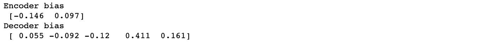

**2。自定义约束:权重正交性。**

```
**class** **WeightsOrthogonalityConstraint** (Constraint):
    **def** __init__(self, encoding_dim, weightage = 1.0, axis = 0):
        self.encoding_dim = encoding_dim
        self.weightage = weightage
        self.axis = axis

    **def** weights_orthogonality(self, w):
        **if**(self.axis==1):
            w = K.transpose(w)
        **if**(self.encoding_dim > 1):
            m = K.dot(K.transpose(w), w) - K.eye(self.encoding_dim)
            **return** self.weightage * K.sqrt(K.sum(K.square(m)))
        **else**:
            m = K.sum(w ** 2) - 1.
            **return** m

    **def** __call__(self, w):
        **return** self.weights_orthogonality(w)
```

对编码器和解码器权重应用正交性。

```
encoder = Dense(encoding_dim, activation="linear", input_shape=(input_dim,), use_bias=**True**, kernel_regularizer=WeightsOrthogonalityConstraint(encoding_dim, weightage=1., axis=0)) 
decoder = Dense(input_dim, activation="linear", use_bias = **True**, kernel_regularizer=WeightsOrthogonalityConstraint(encoding_dim, weightage=1., axis=1))

autoencoder = Sequential()
autoencoder.add(encoder)
autoencoder.add(decoder)

autoencoder.compile(metrics=['accuracy'],
                    loss='mean_squared_error',
                    optimizer='sgd')
autoencoder.summary()

autoencoder.fit(X_train_scaled, X_train_scaled,
                epochs=nb_epoch,
                batch_size=batch_size,
                shuffle=**True**,
                verbose=0)
```

**观察。**

2a。编码器和解码器的权重接近正交。

```
w_encoder = autoencoder.layers[0].get_weights()[0]
print('Encoder weights dot product**\n**', np.round(np.dot(w_encoder.T, w_encoder), 2))

w_decoder = autoencoder.layers[1].get_weights()[0]
print('Decoder weights dot product**\n**', np.round(np.dot(w_decoder, w_decoder.T), 2))
```

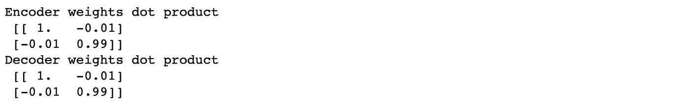

**3。自定义约束:不相关的编码特征。**

对于不相关的特征，我们将对编码特征协方差的非对角元素的*和*施加惩罚。

```
**class** **UncorrelatedFeaturesConstraint** (Constraint):

    **def** __init__(self, encoding_dim, weightage = 1.0):
        self.encoding_dim = encoding_dim
        self.weightage = weightage

    **def** get_covariance(self, x):
        x_centered_list = []

        **for** i **in** range(self.encoding_dim):
            x_centered_list.append(x[:, i] - K.mean(x[:, i]))

        x_centered = tf.stack(x_centered_list)
        covariance = K.dot(x_centered, K.transpose(x_centered)) / tf.cast(x_centered.get_shape()[0], tf.float32)

        **return** covariance

    *# Constraint penalty*
    **def** uncorrelated_feature(self, x):
        **if**(self.encoding_dim <= 1):
            **return** 0.0
        **else**:
            output = K.sum(K.square(
                self.covariance - tf.math.multiply(self.covariance, K.eye(self.encoding_dim))))
            **return** output

    **def** __call__(self, x):
        self.covariance = self.get_covariance(x)
        **return** self.weightage * self.uncorrelated_feature(x)
```

在自动编码器中应用约束。

```
encoder = Dense(encoding_dim, activation="linear", input_shape=(input_dim,), use_bias = **True**, activity_regularizer=UncorrelatedFeaturesConstraint(encoding_dim, weightage = 1.)) 
decoder = Dense(input_dim, activation="linear", use_bias = **True**)

autoencoder = Sequential()
autoencoder.add(encoder)
autoencoder.add(decoder)

autoencoder.compile(metrics=['accuracy'],
                    loss='mean_squared_error',
                    optimizer='sgd')
autoencoder.summary()

autoencoder.fit(X_train_scaled, X_train_scaled,
                epochs=nb_epoch,
                batch_size=batch_size,
                shuffle=**True**,
                verbose=0)
```

**观察。**

3a。我们有较少相关的编码特征。施加这种惩罚更加困难。可以探索更强的约束函数。

```
encoder_layer = Model(inputs=autoencoder.inputs, outputs=autoencoder.layers[0].output)
encoded_features = np.array(encoder_layer.predict(X_train_scaled))
print('Encoded feature covariance\n', np.round(np.cov(encoded_features.T), 3))
```

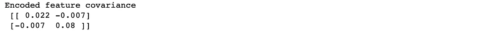

**4。约束:单位定额。**

`UnitNorm`约束是在 Keras 中预先构建的。我们将在编码器和解码器层应用这种约束。值得注意的是，我们为编码器层保留了`axis=0`，为解码器层保留了`axis=1`。

```
encoder = Dense(encoding_dim, activation="linear", input_shape=(input_dim,), use_bias = True, kernel_constraint=UnitNorm(**axis=0**)) 
decoder = Dense(input_dim, activation="linear", use_bias = True, kernel_constraint=UnitNorm(**axis=1**))autoencoder = Sequential()
autoencoder.add(encoder)
autoencoder.add(decoder)autoencoder.compile(metrics=['accuracy'],
                    loss='mean_squared_error',
                    optimizer='sgd')
autoencoder.summary()autoencoder.fit(X_train_scaled, X_train_scaled,
                epochs=nb_epoch,
                batch_size=batch_size,
                shuffle=True,
                verbose=0)
```

**观察。**

4.a .编码器和解码器沿编码轴的权重范数为，

```
w_encoder = np.round(autoencoder.layers[0].get_weights()[0], 2).T  # W in Figure 3.
w_decoder = np.round(autoencoder.layers[1].get_weights()[0], 2)  # W' in Figure 3.print('Encoder weights norm, \n', np.round(np.sum(w_encoder ** 2, axis = 1),3))
print('Decoder weights norm, \n', np.round(np.sum(w_decoder ** 2, axis = 1),3))
```

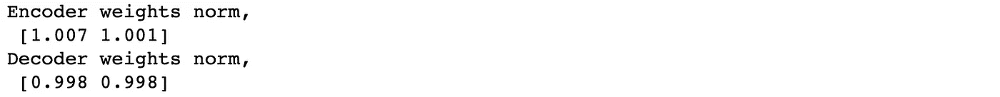

如前所述，规范并不完全是 1.0，因为这不是一个硬约束。

# 把所有东西放在一起

这里我们将把上述属性放在一起。根据问题的不同，这些属性的某种组合会比其他组合更好。

同时应用几个约束有时会损害评估。例如，在此处使用的数据集中，结合联系层、权重正交性和单位范数效果最佳。

```
encoder = Dense(encoding_dim, activation="linear", input_shape=(input_dim,), use_bias = True, kernel_regularizer=WeightsOrthogonalityConstraint(encoding_dim, weightage=1., axis=0), kernel_constraint=UnitNorm(axis=0)) 
decoder = DenseTied(input_dim, activation="linear", tied_to=encoder, use_bias = False)autoencoder = Sequential()
autoencoder.add(encoder)
autoencoder.add(decoder)autoencoder.compile(metrics=['accuracy'],
                    loss='mean_squared_error',
                    optimizer='sgd')
autoencoder.summary()autoencoder.fit(X_train_scaled, X_train_scaled,
                epochs=nb_epoch,
                batch_size=batch_size,
                shuffle=True,
                verbose=0)train_predictions = autoencoder.predict(X_train_scaled)
print('Train reconstrunction error\n', sklearn.metrics.mean_squared_error(X_train_scaled, train_predictions))
test_predictions = autoencoder.predict(X_test_scaled)
print('Test reconstrunction error\n', sklearn.metrics.mean_squared_error(X_test_scaled, test_predictions))
```

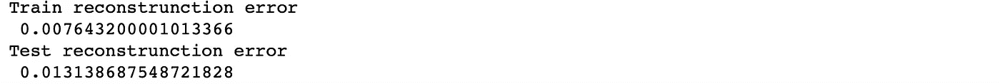

[**GitHub 库**](https://github.com/cran2367/pca-autoencoder-relationship/blob/master/pca-autoencoder-relationship.ipynb)

这里的完整地提到了模型调整的步骤和更多细节。

[](https://github.com/cran2367/pca-autoencoder-relationship/blob/master/pca-autoencoder-relationship.ipynb) [## cran 2367/PCA-自动编码器-关系

### 了解 PCA 和自动编码器之间的关系-cran 2367/PCA-自动编码器-关系

github.com](https://github.com/cran2367/pca-autoencoder-relationship/blob/master/pca-autoencoder-relationship.ipynb) 

# 关键要点

## **重建误差的改善**

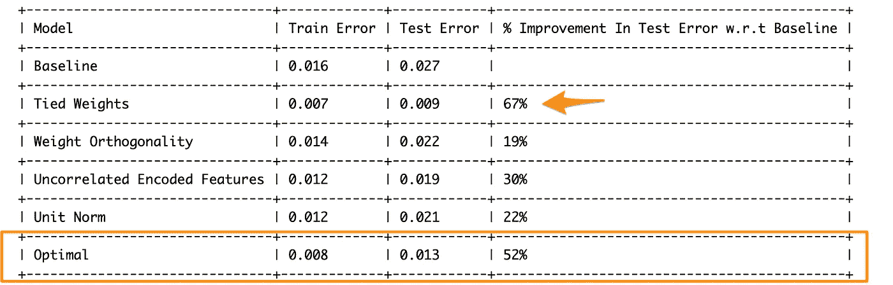

Table 1\. Summary of reconstruction errors.

*   基线模型测试数据的重建误差为 0.027。
*   将每个属性添加到 Autoencoder 减少了测试错误。改进范围从 19%的重量正交性到 67%的束缚重量。
*   不同的数据有不同的改进。
*   在我们的问题中，结合束缚权重、权重正交性和单位范数产生了具有最佳重构误差的最优模型。
*   尽管最佳模型中的误差大于仅具有束缚权重的模型，但这更稳定，因此更可取。

## **关键实施说明**

***绑重物***

*   在绑定权重层`DenseTied`中，编码器和解码器中的偏差会有所不同。
*   要使所有重量完全相等，设置`use_bias=False`。

***权重正交***

*   `kernel_regularizer`用于在层的权重上添加约束或正则化。
*   正交轴对于编码器应该是按行的，`axis=0`，对于解码器应该是按列的，`axis=1`。

***不相关的编码特征***

*   `activity_regularizer`用于对层的输出特征应用约束。因此，这里使用它来将编码特征的非对角协方差约束为零。
*   这个约束不强。也就是说，它不会将非对角协方差元素推到非常接近零的程度。
*   可以探索该约束的另一种定制。

***单位定额***

*   `UnitNorm`编码器和解码器应该在不同的轴上。
*   类似于权重正交性，这适用于编码器的行`axis=0`和解码器的列`axis=1`。

***通用***

*   有两个类，`Regularizer`和`Constraints`用于构建定制函数。实际上，对于我们的应用程序来说，两者是一样的。对于权重正交性和不相关特征，我们使用了`Constraints`类。
*   所有三个约束——单位范数、不相关编码特征和权重正交性——都是软约束。也就是说，它们可以使模型权重和特征接近所需属性，但并不精确。例如，权重几乎是单位范数，而不是精确的。

## **在实践中**，

*   合并这些属性的性能将因问题而异。
*   在不同的设置下，例如有和没有偏差，以及不同层上正交性和不相关特征约束的不同权重下，分别探索每个属性。
*   除此之外，在自动编码器中包括流行的正则化技术，例如**丢弃**层。

# 摘要

*   在前传[第一部分](https://medium.com/@cran2367/build-the-right-autoencoder-tune-and-optimize-using-pca-principles-part-i-1f01f821999b?sk=9c99493a4daf74807a84fd5c5290e0dc)中，我们学习了自动编码器应该从 PCA 继承的重要属性。
*   这里，我们实现了自定义层和约束来合并这些属性。
*   在表 1 中，我们展示了这些特性显著改善了测试重构误差。
*   正如在**关键要点**中提到的，我们需要反复试验来找到最佳设置。然而，这些试验是在一个具有解释意义的方向上进行的。

[*转到前传第一部*](https://medium.com/@cran2367/build-the-right-autoencoder-tune-and-optimize-using-pca-principles-part-i-1f01f821999b?sk=9c99493a4daf74807a84fd5c5290e0dc)

# 参考

1.  [https://stack overflow . com/questions/53751024/tieng-auto encoder-weights-in-a-dense-keras-layer](https://stackoverflow.com/questions/53751024/tying-autoencoder-weights-in-a-dense-keras-layer)