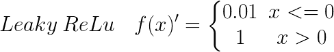
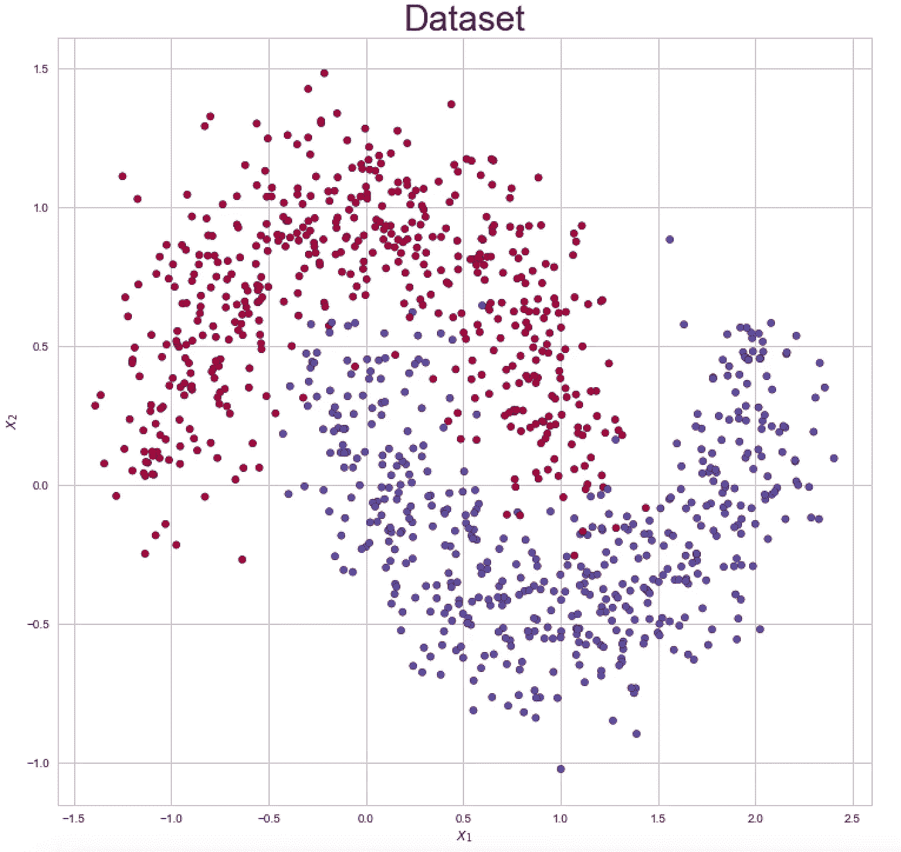

# 用 Python 构建神经网络

> 原文：<https://towardsdatascience.com/build-up-a-neural-network-with-python-7faea4561b31?source=collection_archive---------15----------------------->

## 机器学习和深度学习之旅

## 使用 NumPy 实现正向传播、反向传播

Figure 1: Neural Network

这个博客的目的是使用 python 中的包 NumPy 来建立一个神经网络。虽然像 Keras 和 Tensorflow 这样的成熟包使建立模型变得容易，但是值得自己编写向前传播、向后传播和梯度下降的代码，这有助于更好地理解该算法。

# **概述**

Figure 2: Overview of forward propagation and backward propagation

上图显示了训练神经网络模型时，信息是如何流动的。输入 *Xn* 后，权重 *W1* 和偏差 *B1* 的线性组合被应用于 *Xn* 。接下来，应用激活函数进行非线性变换以得到 *A1* 。然后进入 *A1* 作为下一个隐藏层的输入。相同的逻辑应用于生成 *A2* 和 *A3* 。产生 *A1* 、 *A2* 和 *A3* 的过程称为正向传播。 *A3* 也作为神经网络的输出，与自变量 *y* 比较计算成本。然后计算成本函数的导数，得到 *dA3* 。对 *W3* 和 *B3* 求 *dA3* 的偏导数，得到 *dW3* 和 *dB3* 。同样的逻辑适用于得到 *dA2* 、 *dW2* 、 *dB2* 、 *dA1* 、 *dW1* 和 *dB1* 。生成导数列表的过程称为反向传播。最后应用梯度下降并更新参数。然后，新一轮迭代从更新的参数开始。该算法不会停止，直到它收敛。

# **创建测试数据**

创建一小组测试数据来验证所创建的功能。

# **初始化参数**

在参数初始化阶段，权重被初始化为接近零的随机值。如果权重接近于零，则 sigmoid 的操作部分大致是线性的，因此神经网络崩溃为近似线性的模型[1]sigmoid 函数在零点附近的梯度较陡，利用梯度下降可以快速更新参数。不要使用零和大的权重，这会导致糟糕的解决方案。

我在 Excel 中手动计算了一次神经网络的迭代训练，这有助于您验证每一步创建的函数的准确性。下面是参数初始化的输出。

Table 1: Parameters Initialization Testing Result

# **正向传播**

在神经网络中，输入 *Xn* 被输入，信息通过整个网络向前流动。输入 *Xn* 提供初始信息，该信息向上传播到每层的隐藏单元，并最终产生预测。这个过程称为正向传播。正向传播包括两个步骤。第一步是权重和来自最后一层的输出(或输入 *Xn* )的线性组合，以生成 *Z* 。第二步是应用激活函数进行非线性变换。

Table 2: Matrix Calculation in forward propagation

第一步，你需要注意投入和产出的维度。假设您有一个维度为[2，3]的输入矩阵 *X* ，矩阵中的一列代表一条记录。隐含层有 5 个隐含单元，所以权重矩阵 *W* 的维数为[5，2]。偏置 *B* 的尺寸为【5，1】。通过应用矩阵乘法，我们可以得到维数为[5，3]的输出矩阵 Z。计算的细节可以在上表中看到。

Table 3: How activation is applied in forward propagation

上表显示了激活函数是如何应用于 *Z 的每个分量的。*使用激活函数的原因是为了进行非线性变换。没有激活函数，无论模型有多少隐层，它仍然是一个线性模型。有几种流行且常用的激活函数，包括 ReLU、Leaky ReLU、sigmoid 和 tanh 函数。这些激活函数的公式和图形如下所示。

Figure 3: Activation Function

首先，你需要定义 sigmoid 和 ReLU 函数。然后为单层正向传播创建函数。最后，上一步中创建的函数被嵌套到名为完全正向传播的函数中。为简单起见，ReLU 函数用于前 N-1 个隐藏层，sigmoid 函数用于最后一个隐藏层(或输出层)。注意，在二分类问题的情况下，使用 sigmoid 函数；在多类分类问题的情况下，使用 softmax 函数。将每个隐藏层中计算的 *Z* 和 *A* 保存到缓存中，用于反向传播。

这是测试数据的函数输出。

Table 4: Forward Propagation Testing Result

# 价值函数

正向传播的输出是二元事件的概率。然后将概率与响应变量进行比较，计算成本。在分类问题中使用交叉熵作为代价函数。在回归问题中，均方误差被用作成本函数。交叉熵的公式如下所示。

这是测试数据的函数输出。

Table 5: Cost Function Testing Result

# 反向传播

在训练期间，前向传播可以继续向前，直到它产生成本。反向传播是计算成本函数的导数，并使用微积分中的链式法则将所有信息返回到每一层。

假设

和

然后

链式法则指出

激活函数的导数如下所示。

类似于正向传播。首先，你需要为 sigmoid 和 ReLU 的导数创建一个函数。然后定义一个单层反向传播的函数，计算 *dW* 、 *dB* 、 *dA_prev* 。 *dA_prev* 将被用作前一隐藏层反向传播的输入。最后，上一步中创建的函数被嵌套到名为完全反向传播的函数中。为了与正向传播对齐，前 N-1 个隐藏层使用 ReLU 函数，最后一个隐藏层或输出层使用 sigmoid 函数。你可以修改代码并添加更多的激活功能。将 *dW* 和 *dB* 保存到另一个缓存中，用于更新参数。

这是测试数据的函数输出。

Table 6: Backward Propagation Testing Result

# 更新参数

一旦从反向传播计算出梯度，就通过学习速率*梯度来更新当前参数。然后，更新的参数被用于新一轮的正向传播。

这是测试数据的函数输出。

Table 7: Parameter Update Testing Result

梯度下降的解释可以在我的博客里看到。

 [## 梯度下降导论

### 本博客将涵盖以下问题和主题:

towardsdatascience.com](/an-introduction-to-gradient-descent-c9cca5739307) 

# **将功能堆叠在一起**

为了训练神经网络模型，将前面步骤中创建的函数堆叠在一起。下表提供了功能摘要。

Table 8: Functions Summary

# **运行模式**

首先使用 make_moons 函数创建两个交错的半圆数据。下面提供了数据的可视化。

Figure 4: Training Data

然后运行该函数来训练神经网络模型。下图显示了培训过程。成本在 8000 个时期后收敛，并且模型准确率收敛到 0.9。

Figure 5: Cost over Time

Figure 6: Accuracy over Time

# 下一步

图 5 和图 6 表明存在潜在的过拟合问题。您可以使用包括提前停止、退出和调整在内的方法来解决这个问题。除了 ReLU 和 sigmoid 函数之外，还可以通过添加其他激活函数来玩 model。本博客使用的是批量梯度下降，但也有很多改进的梯度下降算法如 Momentum、RMSprop、Adam 等。

# 摘要

虽然之前上过网上课程，读过书中的相关章节，但直到我亲自动手写博客，我才完全理解了这种奇特的方法。俗话说，教是最好的学习方法。希望你能从阅读这篇博客中受益。如果你有兴趣，请阅读我的其他博客。

 [## 目录

### 这一系列博客将从理论和实现两个方面对深度学习进行介绍。

medium.com](https://medium.com/@songyangdetang_41589/table-of-contents-689c8af0c731) 

**参考**

[1]特雷弗·哈斯蒂，罗伯特·蒂布拉尼，杰罗姆·弗里德曼，(2008)，*统计学习的要素*

[2]伊恩·古德费勒，约舒阿·本吉奥，亚伦·库维尔，(2017) *深度学习*

[3][https://www.coursera.org/specializations/deep-learning?](https://www.coursera.org/specializations/deep-learning?)

[4]https://en.wikipedia.org/wiki/Activation_function

[5]https://explained.ai/matrix-calculus/index.html