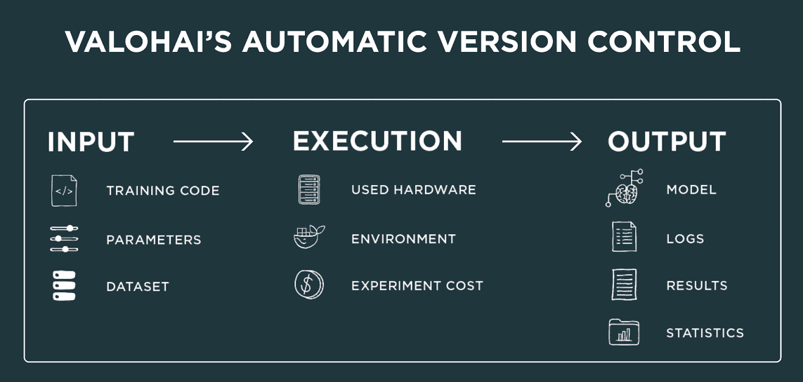

# 构建与购买——可扩展的机器学习基础设施

> 原文：<https://towardsdatascience.com/build-vs-buy-a-scalable-machine-learning-infrastructure-88146cfcadb7?source=collection_archive---------10----------------------->

## 开源 ML 基础设施的路线图。

在这篇博客文章中，我们将看看机器学习平台由哪些部分组成，并将从头构建自己的基础设施与购买一个为您做所有事情的现成服务进行比较。

购买和构建基础架构的最终目标都是让您的数据科学团队尽可能多地花时间了解数据、构建模型并将其投入生产，从而提高他们的效率。相反，这意味着他们将在基础设施和样板代码上花费尽可能少的时间。为了实现这一点，大多数 ML 基础设施公司(如[优步的米开朗基罗](https://blog.valohai.com/an-interview-with-former-product-manager-for-ubers-michelangelo-mike-del-balso))都建立在以下原则之上:

*   集成您的数据科学家已经喜欢使用的工具
*   构建快速迭代实验的平台
*   尽可能自动管理输入数据和输出数据
*   通过提供自动审计跟踪，提供回滚实验的方法
*   支持贵公司使用的环境，从不同的云提供商到内部硬件
*   建立在抽象之上，这样你就可以在新技术出现时支持它们
*   从团队的角度和资源的角度来设计可伸缩性，这样你就可以支持数百个项目、人员、数据源和计算单元。
*   与任何地方的任何东西集成，因此平凡的任务都可以自动化。

记住这些原则，让我们看看如何通过从头开始构建来实现这一点。

# 构建可扩展的机器学习基础设施

有效的机器学习基础设施需要构建它的团队具备各种各样的能力。您将为您的数据科学团队解决特定需求，因此让我们来看看典型的机器学习基础架构由什么组成。

## 机器编排

机器编排是你的机器学习基础设施的主干。编排引擎在你的机器编排部分的 UI 中实现自己，无论是通过集成在 ide、笔记本、CLI、API 或 UI 中。最先进的引擎优化资源使用，预测需求，处理排队等。您可以将您的引擎基于虚拟机、Kubernetes 之类的平台，或者直接编排您自己的硬件。

## 记录保存、记录和版本控制

严格来说，版本控制并不是传统 ML 平台的一部分，但是由于 GDPR 等法规，版本控制变得越来越重要。为了让您的数据科学家只需点击一下鼠标就能重现实验，您需要对数据、参数、硬件和软件环境、日志等进行版本控制和记录。一个很好的起点是使用 Git 进行代码版本控制，使用 Docker 进行环境控制。在下面的图片中可以找到版本的起点。

## 项目和用户管理

您需要将实验纳入项目中，并管理用户和团队的权限。使用 Azure Active Directory 或 Hadoop Ranger 提供的访问控制，或者自己构建一些东西。访问控制还应该定义用户可以使用哪些资源、不同用户如何对作业进行排队、哪些数据对谁可用等等。您将希望消除孤岛并实现透明，以便您的数据科学家可以相互学习。

## 自动化 ML 管道

机器学习管道是一个概念，其中工作被分成不同的阶段，从探索开始，继续进行批处理、规范化、培训、部署和中间的许多其他步骤。您需要构建对将结果从一个步骤传递到下一个步骤的支持。当数据湖中的数据发生重大变化时，一些高级触发器可能会自动重新运行部分管道。从基于 Git 的低级方法到 [Apache 气流](https://airflow.apache.org/)和 [ML 气流](https://mlflow.org/)管道，有几种解决方案，您可能想要探索并组合在一起。

## 整合，整合，整合！

数据科学家应该能够继续使用他们喜欢的工具和框架，无论是他们最喜欢的 IDE、笔记本还是其他任何东西。根据具体情况，还应该有不同的与基础设施交互的方式。最佳实践是在开放 API 的基础上构建一切，然后可以从 CLI 和 web UI 访问，甚至直接从 Jupyter notebook 访问。对于超参数调优，您可能需要考虑外部优化器，比如 [SigOpt](https://sigopt.com/) 。

## 可视化正在进行的执行

当数据科学家使用模型时，他们需要了解各个步骤是如何进行的，无论是训练精度还是数据准备。为此，您需要构建一种以有意义的方式显示实时训练数据的方法。解决方案可以是定制的可视化库或例如 [TensorBoard](https://www.tensorflow.org/guide/summaries_and_tensorboard) 或[权重&偏差](https://www.wandb.com/)。

## 推理部署

ML 管道的最后一部分是部署。您可能不想在实际生产环境中进行部署，但要确保您的数据科学团队在为将预测模型集成到您的业务应用程序中的软件团队部署新模型时能够自给自足。由于开销和缓慢的模型开发周期，将模型交付给 IT 部门的旧方法从长远来看是行不通的。Kubernetes clusters 是业内事实上的云推理部署标准。也可以看看 AWS 的弹性推理，谢顿核心或 Azure 推理引擎与 [ONNX](https://onnx.ai/) 的支持。

# 购买可扩展的机器学习基础设施

不仅自己构建基础设施需要几年的时间(相信我，我们有历史可以证明这一点)，而且随着技术的发展和新技术的支持，您还需要不断开发平台。

Valohai 是一个完整的可扩展的机器学习基础设施服务，可以为您的团队扩展，从 1 到 1000 名数据科学家。Valohai 的一切都是围绕项目和团队构建的，它可以从内部安装扩展到混合云和 Microsoft Azure、AWS 和 Google Cloud 中的全云解决方案。Valohai 为您处理机器编排，并自动跟踪您或您公司中的任何人曾经进行过的每个实验——从数据、代码、超参数、日志、软件环境和库、硬件等等。

Valohai 基于开放 API 构建，通过现成的 CLI、直观的 Web UI 和 Jupyter 笔记本集成，集成到您当前的工作流程中。借助自动化管道，您无需手动操作即可开始批量作业并运行培训流程的每一步。元数据的交互式可视化有助于您的团队了解其他人在做什么，并跟踪他们的模型，直到他们准备好将这些模型投入生产。

然而，有一点是肯定的，ML 基础设施是你的团队生产力中最重要的部分。在最好的情况下，它将减少多达 90%的模型开发时间。

*最初发表于*[*【blog.valohai.com】*](https://blog.valohai.com/scalable-machine-learning-infrastructure/)*。*