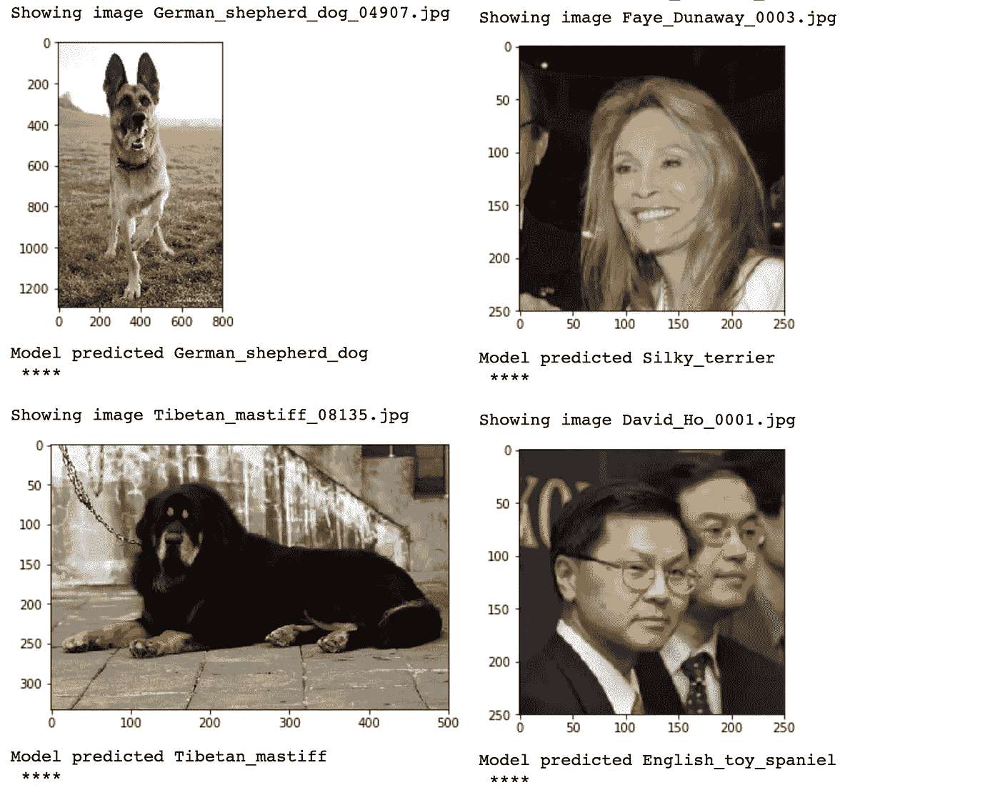

# 建立你的第一个计算机视觉项目——狗的品种分类

> 原文：<https://towardsdatascience.com/build-your-first-computer-vision-project-dog-breed-classification-a622d8fc691e?source=collection_archive---------10----------------------->

## 在不到 30 分钟的时间内开始构建您的第一个计算机视觉项目。


Photo by [Joe Caione](https://unsplash.com/@joeyc?utm_source=medium&utm_medium=referral) on [Unsplash](https://unsplash.com?utm_source=medium&utm_medium=referral)

对我们人类来说，区分不同品种的狗是很容易的。如果你说的是 10-20 种受欢迎的狗品种。当我们谈论 100 多种狗时，情况就完全不同了。对于一个人来说，要正确并一致地对大量品种进行分类，我们需要一种不同于单纯记忆的方法。我们需要开始提取与不同品种相对应的“特征”，如皮毛颜色、耳朵形状、面部形状、尾巴长度等。即使这样，我们也需要记住什么品种有什么特征，这不是一件容易或有趣的任务。


[Image credit](https://medium.com/nanonets/how-to-easily-build-a-dog-breed-image-classification-model-2fd214419cde): It is hard to classify a large number of dog breeds

人类难以识别大量物种是计算机比我们更好的一个完美例子。这并不是说天网要来杀我们所有人；我认为我们现在还不应该为此担心。许多人认为，两个种族一起工作的混合方式比任何一个种族单独工作都要好，而不是用机器来代替人类。你可以在 Andrew McAfee 所著的《机器、平台、人群》一书中了解更多相关信息。

在这个项目中，我将带你经历建立和训练卷积神经网络(CNN)的步骤，该网络将对 133 种不同的狗进行分类。这个项目是我的数据科学家 Nanodegree 的一部分，你可以在这里找到更多关于它的信息。这个项目的代码可在我的 [GitHub repo](https://github.com/tuanchris/dog-project) 上获得，如果你想跟着做，请确保你安装了所需的包。

# 你需要知道的是

## 计算机如何理解图像

由于数百万年的进化完善了我们的眼睛和大脑的视觉能力，我们非常擅长识别事物。计算机将图像“视为”一系列数字。屏幕上的一个像素由从 0 到 255 的三个数字表示。每个数字都表示为红色、绿色和蓝色的强度。一张 1024*768 的图片可以表示为一个 1024*768*3 的矩阵，相当于一系列 239，616 个数字。


[Image credit](https://introcomputing.org/image-introduction.html): Image represented as numbers

传统上，计算机很难识别或分类图像中的对象。随着计算能力和神经网络研究的最新进展，计算机现在可以在许多特定任务上具有人类级别的视觉能力。

## 什么是神经网络

有许多很好的资源可以解释什么是神经网络。下面是我最喜欢的解释，借用这个[帖子](/how-to-build-your-own-neural-network-from-scratch-in-python-68998a08e4f6):

神经网络由以下组件组成

*   一个**输入层**、**T3、x**
*   任意数量的**隐藏层**
*   一个**输出层**，**， *ŷ* ，**
*   一组**权重**和**在各层之间偏向**， ***W 和 b***
*   一个选择**激活功能**用于每个隐藏层，*。在本教程中，我们将使用一个 Sigmoid 激活函数。*

*下图显示了 2 层神经网络的架构(*注意，在计算神经网络的层数时，输入层通常被排除在外**

**

*[Image credit](/how-to-build-your-own-neural-network-from-scratch-in-python-68998a08e4f6): A simplified neural network architecture*

*详细解释神经网络如何工作超出了这篇文章的范围。你可以在 Medium 上找到许多解释神经网络如何工作的优秀文章。对于我们的狗分类项目，我们的输入层将是用数字表示的狗图像。隐藏层将是许多具有权重和偏差的层，这些权重和偏差将在我们训练模型时更新。输出将是我们 133 个犬种的一系列概率。*

*虽然对于各种机器学习问题有不同的神经网络架构，但是卷积神经网络(CNN)是用于图像分类问题的最流行的一种。*

## *什么是卷积神经网络*

*CNN 是通常用于图像分类问题的神经网络的架构。典型的架构包括一个输入层、几个卷积层、一个池层、一个全连接层(FC)和一个输出层。你可以在这里和[这里](https://hackernoon.com/visualizing-parts-of-convolutional-neural-networks-using-keras-and-cats-5cc01b214e59)阅读 CNN [更全面的解释。](https://medium.com/@RaghavPrabhu/understanding-of-convolutional-neural-network-cnn-deep-learning-99760835f148)*

**

*[Image credit](https://medium.com/@RaghavPrabhu/understanding-of-convolutional-neural-network-cnn-deep-learning-99760835f148): Architecture of a CNN*

**

*[Image credit:](https://hackernoon.com/visualizing-parts-of-convolutional-neural-networks-using-keras-and-cats-5cc01b214e59) Visualization of a convolutional layer*

## *什么是迁移学习*

> ***迁移学习**利用解决一个问题时获得的知识，并将其应用于另一个不同但相关的问题。*

*现代卷积网络是在 ImageNet 这样的大型数据集上训练的，需要数周才能完成。所以很多时候，你并不想自己去训练一个全新的 ConvNet。*

*有很多著名的预训练模型，比如 VGG-16，雷斯网-50，Inception，Xception 等。这些模型已经在大型数据集上进行了训练，您可以利用特征提取步骤，并将它们作为特征提取器应用于您的特定问题。你可以在这里阅读更多关于迁移学习[的内容。](/a-comprehensive-hands-on-guide-to-transfer-learning-with-real-world-applications-in-deep-learning-212bf3b2f27a)*

**

*[Image credit](/a-comprehensive-hands-on-guide-to-transfer-learning-with-real-world-applications-in-deep-learning-212bf3b2f27a): Visualization of transfer learning architecture*

# *准备数据*

## *获取数据*

*你可以在这里下载数据集[。该数据集包含 8，351 张狗图像，133 个狗品种，分为 6，680 张用于训练的图像，836 张用于测试的图像，以及 835 张用于验证的图像。](https://s3-us-west-1.amazonaws.com/udacity-aind/dog-project/dogImages.zip)*

*注意，如果你有一个 NVIDIA GPU，你应该遵循这个教程。关于 CPU 的培训需要很多时间。或者，你可以在这里免费使用谷歌实验室。*

*可以按如下方式加载标签和文件路径的键值对字典:*

```
***from** **sklearn.datasets** **import** load_files       
**from** **keras.utils** **import** np_utils
**import** **numpy** **as** **np**
**from** **glob** **import** glob*# define function to load train, test, and validation datasets*
**def** load_dataset(path):
    data = load_files(path)
    dog_files = np.array(data['filenames'])
    dog_targets = np_utils.to_categorical(np.array(data['target']), 133)
    **return** dog_files, dog_targets*# load train, test, and validation datasets*
train_files, train_targets = load_dataset('dogImages/train')
valid_files, valid_targets = load_dataset('dogImages/valid')
test_files, test_targets = load_dataset('dogImages/test')*
```

*不同的图像可能有不同的大小。以下代码将输入调整为 224*224 像素的图像，并将其作为 numpy 系列加载到内存中:*

```
***from** **keras.preprocessing** **import** image                  
**from** **tqdm** **import** tqdm**def** path_to_tensor(img_path):
    *# loads RGB image as PIL.Image.Image type*
    img = image.load_img(img_path, target_size=(224, 224))
    *# convert PIL.Image.Image type to 3D tensor with shape (224, 224, 3)*
    x = image.img_to_array(img)
    *# convert 3D tensor to 4D tensor with shape (1, 224, 224, 3) and return 4D tensor*
    **return** np.expand_dims(x, axis=0)**def** paths_to_tensor(img_paths):
    list_of_tensors = [path_to_tensor(img_path) **for** img_path **in** tqdm(img_paths)]
    **return** np.vstack(list_of_tensors)*
```

## *预处理数据*

*我们需要标准化我们的数据，以消除测量单位。归一化可以帮助我们的模型更好地比较不同尺度的数据。*

```
***from** **PIL** **import** ImageFile                            
ImageFile.LOAD_TRUNCATED_IMAGES = **True***# pre-process the data for Keras*
train_tensors = paths_to_tensor(train_files).astype('float32')/255
valid_tensors = paths_to_tensor(valid_files).astype('float32')/255
test_tensors = paths_to_tensor(test_files).astype('float32')/255*
```

## *培训用数据*

****

*It’s challenging even for humans to identify a dog breed*

*让我们来看看我们的一些数据。我们的例子表明，准确识别狗的品种是具有挑战性的，即使对人类来说也是如此。还有许多其他现实世界的因素会影响我们的模型:*

*   ***灯光条件:**不同的灯光改变颜色的显示方式*
*   *目标定位:我们的狗可以帮助很多不同的姿势*
*   *相框:特写人像相框和全身照片非常不同*
*   ***缺失特征:**照片中并没有显示狗狗的所有特征*

*因此，传统方法不可能在计算机视觉任务中取得进展。让我们看看 CNN 和转移学习能做些什么。*

# *创建一个你自己的模型*

## *模型架构*

*用 Keras 创建 CNN 很简单。您可以用下面的代码定义您的模型架构。*

```
***from** **keras.layers** **import** Conv2D, MaxPooling2D, GlobalAveragePooling2D
**from** **keras.layers** **import** Dropout, Flatten, Dense
**from** **keras.models** **import** Sequentialmodel = Sequential()
model.add(Conv2D(filters=16, kernel_size=2, padding='same',activation='relu',input_shape=(224,224,3)))
model.add(MaxPooling2D())
model.add(Conv2D(filters=32, kernel_size=2, padding='same',activation='relu'))
model.add(MaxPooling2D())
model.add(Conv2D(filters=64, kernel_size=2, padding='same',activation='relu'))
model.add(MaxPooling2D())
model.add(GlobalAveragePooling2D())
model.add(Dense(133,activation='softmax'))model.summary()*
```

*我们的原始模型架构有一个形状为 224*224*3 的输入层。然后，输入馈入两个卷积层，接着是最大池层(用于下采样)。然后，输出被馈送到全局平均池层，以通过减少参数的数量来最小化过拟合。输出层为我们的品种返回 133 个概率。*

**

*[Image credit](https://hackernoon.com/visualizing-parts-of-convolutional-neural-networks-using-keras-and-cats-5cc01b214e59): Visualization of pooling layers such as MaxPooling and AveragePooling*

**

*Our primitive model summary*

## *韵律学*

*在这个项目中，我们的目标是正确预测狗的品种。因此，在每次迭代之后，我们使用准确性作为选择的度量来改进我们的模型。准确性就是我们的模型正确预测犬种的次数。*

## *编译和训练模型*

*然后需要编译我们的模型。我们使用 *rmsprop* 作为我们的优化器，*category _ cross entropy，*作为我们的损失函数，准确性作为我们的度量。*

```
*model.compile(optimizer='rmsprop', loss='categorical_crossentropy', metrics=['accuracy'])*
```

*然后，我们可以使用以下代码训练模型:*

```
***from** **keras.callbacks** **import** ModelCheckpointepochs = 5checkpointer = ModelCheckpoint(filepath='saved_models/weights.best.from_scratch.hdf5', 
                               verbose=1, save_best_only=**True**)model.fit(train_tensors, train_targets, 
          validation_data=(valid_tensors, valid_targets),
          epochs=epochs, batch_size=20, callbacks=[checkpointer], verbose=1)*
```

*用**五个纪元**和大约**八分钟**，我们取得了 **3.2297%** 的准确率，比随机猜测(1/133 = 0.75%)要好。*

*虽然我们的模型比随机猜测的表现好得多，但 3.2297%的模型在现实中没有用。训练和调整我们的模型以达到有意义的准确性需要大量的时间、大量的数据集和大量的计算资源。幸运的是，我们可以使用迁移学习来减少训练时间，而不牺牲准确性。*

# *使用迁移学习创建模型*

## *获取瓶颈特征*

*Keras 提供了以下经过预先培训的最新架构，您可以在几分钟内使用它们:VGG-19、ResNet-50、Inception 和 Xception。在这个项目中，我们将使用 ResNet-50，但是您可以自己尝试其他体系结构。下面的代码下载预先训练好的模型并加载[瓶颈特性](https://www.quora.com/What-is-the-definition-of-bottleneck-features-in-transfer-learning)。*

```
***import** **requests**
url = 'https://s3-us-west-1.amazonaws.com/udacity-aind/dog-project/DogResnet50Data.npz'
r = requests.get(url)**with** open('bottleneck_features/DogResnet50Data.npz', 'wb') **as** f:
    f.write(r.content)bottleneck_features = np.load('bottleneck_features/DogResnet50Data.npz')
train_Resnet50 = bottleneck_features['train']
valid_Resnet50 = bottleneck_features['valid']
test_Resnet50 = bottleneck_features['test']*
```

## *模型架构*

*借助预训练的 ResNet-50 模型，我们使用以下代码创建全连接(FC)层。我们还增加了两个下降层，以防止过度拟合。*

```
*Resnet50_model = Sequential()
Resnet50_model.add(GlobalAveragePooling2D(input_shape=train_Resnet50.shape[1:]))
Resnet50_model.add(Dropout(0.3))
Resnet50_model.add(Dense(1024,activation='relu'))
Resnet50_model.add(Dropout(0.4))
Resnet50_model.add(Dense(133, activation='softmax'))
Resnet50_model.summary()*
```

**

*Our model architecture using transfer learning looks like this*

## *模型性能*

*使用迁移学习(ResNet-50)，在**二十个历元**和**不到两分钟**的情况下，我们取得了 **80.8612%** 的测试准确率。这是对我们原始模型的巨大改进。*

*使用上面描述的模型，我创建了一个小的命令行应用程序。如果你输入一只狗的照片，这个应用程序会预测它的品种。如果你输入一个人的图像，比如你的一个朋友说，这个应用程序会预测最接近的匹配犬种。如果没有狗或人出现，应用程序将输出一个错误。你可以按照我的 GitHub repo 上的 [README.md](https://github.com/tuanchris/dog-project) 文件中的说明进行操作。*

# *结论*

*在这个项目中，我将带你了解一些构建你的第一个计算机视觉项目所需的核心概念。我解释了**计算机如何理解图像**，简要回顾了什么是**神经网络**、**卷积神经网络**、**、**和**迁移学习**。*

*我们还从零开始构建并训练了一个 **CNN 架构**以及应用**迁移学习**来大幅提高我们模型的准确率**从 3.2%到 81%。**在做这个项目时，我对你如何利用迁移学习来提高准确性，同时显著减少培训时间印象深刻。以下是我们模型的一些预测:*

**

*Some predictions of our model*

# *未来的改进*

*如果我有更多的时间，这里是这个项目的几个未来发展:*

*   ***扩充数据:**当前的实现只接受标准图像作为输入。因此，该模型在现实环境中可能不够健壮。我可以增加训练数据，使我们的模型不容易过度拟合。我可以通过随机裁剪、翻转、旋转训练数据来创建更多的训练样本。*
*   ***调优模型:**我还可以调优模型超参数，以达到更好的精度。一些用于调优的潜在超参数包括优化器、损失函数、激活函数、模型架构等。我也可以用 Keras 使用 Sklearn 的 GridSearch。*
*   ***尝试其他模型:**在这个项目中，我尝试在 VGG-16 和 ResNet-50 上训练模型。下一步可能是尝试使用不同的架构来训练模型，以及改变我们完全连接的层的架构。*
*   *创建一个 web/移动应用程序:我也可以用这个模型创建一个 web 应用程序或移动应用程序来取乐。*

***感谢你的阅读，希望你能学到东西:)***