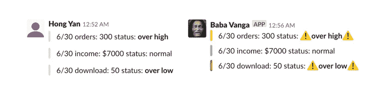

# 建立您的第一个时差数据警报

> 原文：<https://towardsdatascience.com/build-your-first-data-alert-on-slack-e0768621e0fa?source=collection_archive---------30----------------------->

## 动手黑客

## 不仅要注重实践，还要更深入地融入你的工作流程

# 序

这个提醒极大地提高了我的工作效率，让我远离了多余的询问和工作，所以这篇文章不仅关注实践，也解释了我是如何将它融入到工作中的。

为了更容易使用，本文中的所有内容都已经打包到这个 [Github 库](https://github.com/HongYanHuang/slackeonnier)中。

# data alert 如何提高我的工作效率？

## 🔕对多余的询问保持沉默

你对利益相关者的提问感到很烦，他们也是。如果数据能够自己出现并解释这种情况，每个人都会很感激。

## 🏋️‍♂️立即追踪异常信号

异常信号出现时跟踪它比一个月后复查要容易得多。不要害怕**转发信息并给你的同事/老板贴标签！**

## 👨‍👧‍👧让您的团队充分参与进来！

一旦您注意到后端工程师和首席执行官正在讨论是什么原因导致警报发出异常信号，并为您标记营销经理…

你离成功很近了。

# 什么让数据预警清晰？

## 色彩管理

颜色是表明当前状态的最佳方式。红色代表警戒，黄色代表警告，蓝色代表沮丧…

Which style draws more attention with clarity?

## 情节很重要

一张图胜过千言万语，尤其对于没有统计学背景的同事来说，还是能体会到形势有多严峻的。

Don’t mess it up!

## 易接近

人类是最懒的动物，所以你的警报应该整合到原来的工作场所，比如 slack，而不是外部的网站或者仪表盘。

# 编码前:松弛应用设置

1.  登录您的 slack 帐户。
2.  在这里创建一个 Slack App [。](https://api.slack.com/apps)
3.  允许应用程序通过备用渠道上传文件(例如#图片存储)
4.  允许在通道通知中发送传入的 webhook(例如#data-notify)
5.  **上传一个有趣的图标到你的 Slack 应用程序🤪**

Make sure you have the same setting.

# 让我们编码

## **1。确保您的数据和绘图准备就绪**

## 2.将绘图上传到时差

这是最有趣的(hack)部分。这个想法是:

1.  将您的绘图保存为临时文件
2.  **将你的剧情发布到另一个 slack 频道，获得只能在 slack 上分享的私人网址！**
3.  重新分享到#general 或您喜欢的任何频道

## 3.🚥颜色+📊Plot +📝描述=📩完成的

## 你做到了，检查你的松弛频道！

如果没有，在这里处理您的错误代码。

# 替代方案:使用我开发的库

您可以通过克隆[slacleoneir](https://github.com/HongYanHuang/slackeonnier)来完成数据预警，无需额外编码。

# 另外:用气流来安排你的剧本

Cronjob 简单而有用，但我个人建议用气流作为更好的替代品。