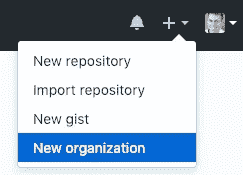
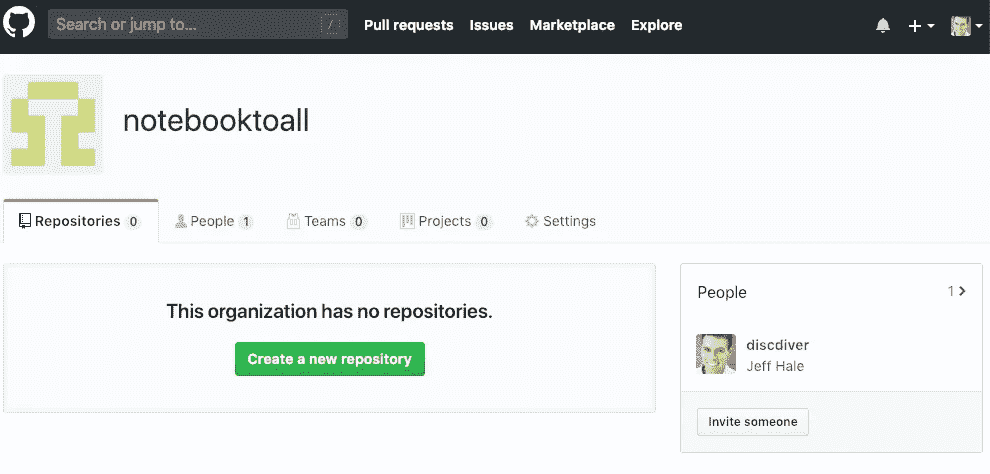
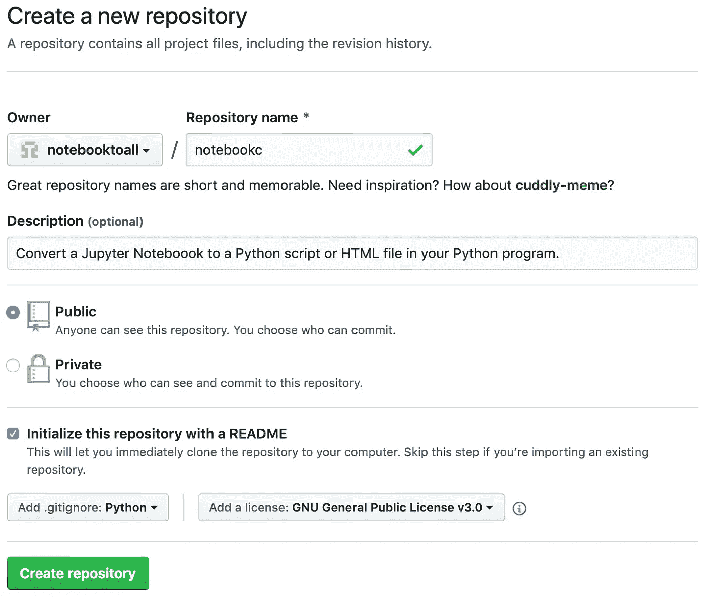
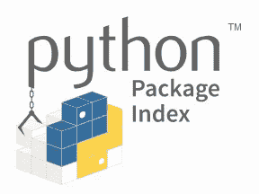

# 构建您的第一个开源 Python 项目

> 原文：<https://towardsdatascience.com/build-your-first-open-source-python-project-53471c9942a7?source=collection_archive---------1----------------------->

## 工作包的逐步指南

每个软件开发人员和数据科学家都应该经历制作软件包的练习。一路上你会学到很多东西。确保你有时间。🕰

制作一个开源 Python 包可能听起来令人生畏，但是你不需要成为一个头发斑白的老手。你也不需要一个精心制作的产品创意。你确实需要坚持和时间。希望这个指南能帮助你减少这两者的需求。😃


Build something beautiful 😃

在本文中，我们将通过每个步骤来制作一个基本的 Python 包。在以后的文章中，我们将建立自动化测试和文档构建。我们还将集成其他有用的应用程序来改进您的包开发。然后，您可以扩展您构建的内容以满足您的需求。

如果你想学习 Python，看看我的[令人难忘的 Python 书籍](https://memorablepython.com)。

本指南适用于使用 Python 3.7 的 macOS。现在一切正常，但事情变化很快，所以不能保证你在 2030 年读到这篇文章。在下面的代码中替换*我的 _ 包*、*我的 _ 文件、*等。用你们自己的名字。

我们开始吧！🚀

# 第一步:制定计划

我们最终计划在 Python 程序中使用一个非常简单的库。该软件包将允许用户轻松地将 Jupyter 笔记本转换成 HTML 文件或 Python 脚本。

我们的包的第一次迭代将允许用户调用打印语句的函数。

现在我们知道了我们想要做什么，我们需要决定如何命名这个包。

# 第二步:命名

给事物命名是很棘手的。名字应该是独一无二的，简短的，易记的。它们也应该全部小写，并且绝对不能有任何破折号或其他标点符号。不鼓励使用下划线。当你在构建你的包时，检查这个名字在 GitHub、Google 和 PyPI 上是否存在。

如果你非常希望你的包裹有一天会有 10，000 颗 GitHub 星，那么你可能需要检查这个名字在社交网络上是否可用。在这个例子中，我将把我的包命名为 *notebookc* ，因为它是可用的、简短的、半描述性的。😄

# 步骤 3:配置环境

确保安装并配置了 Python 3.7、GitHub 和 Homebrew。如果你需要这些，这里有详细信息:

## 计算机编程语言

在这里下载 Python 3.7 [并安装。](https://www.python.org/downloads/)

## 开源代码库

如果你没有 GitHub 账户，请点击这里[注册一个免费账户。点击](https://github.com/join)查看如何安装和配置 Git [。你需要命令行工具。按照链接下载、安装它，设置您的用户名，并设置您的提交电子邮件地址。](https://help.github.com/articles/set-up-git/)

## 公司自产自用

家酿是一个 Mac 专用的软件包管理器。这里的安装说明是。


## Venv

从 Python 3.6 开始，推荐使用 [*venv*](https://docs.python.org/3/library/venv.html) 来创建你的虚拟环境进行包开发。使用 Python 管理虚拟环境有多种方法，并且这些建议也在不断发展。见此处的讨论[，但小心掉进这个兔子洞。🕳](https://stackoverflow.com/questions/41573587/what-is-the-difference-between-venv-pyvenv-pyenv-virtualenv-virtualenvwrappe)

*venv* 从 Python 3.3 开始随 Python 一起安装。请注意，从 Python 3.4 开始， *venv* 将 *pip* 和 *setuptools* 安装到虚拟环境中。

使用以下命令创建 Python 3.7 虚拟环境:

`python3.7 -m venv my_env`

用你喜欢的任何名字替换 *my_env* 。像这样激活您的虚拟环境:

`source my_env/bin/activate`

现在，您应该会在终端提示符的最左边看到`(my_env)`——或者您给虚拟环境起的名字。

当您完成开发后，使用`deactivate`停用您的虚拟环境。

现在让我们在 GitHub 上设置一些东西。

# 步骤 4:在 GitHub 上创建组织

GitHub 是版本控制注册中心的市场领导者。GitLab 和 Bitbucket 是其他流行的选项。我们将在本指南中使用 GitHub。

*   你会经常用到 Git 和 GitHub，所以如果你不熟悉，可以看看我的文章[这里](/learn-enough-git-to-be-useful-281561eef959?source=friends_link&sk=549f0155d272316b6f06fa6f7818beee)。
*   在 Github 上创建一个新组织。按照提示操作。我将我的组织命名为 *notebooktoall。你可以在自己的个人账户下创建回购，但部分目标是学习如何为更大的社区建立一个开源项目。*



# 步骤 5:设置 GitHub Repo

创建新的存储库。我把我的回购记录命名为 c。



从下拉列表中添加一个. *gitignore* 。为您的存储库选择 *Python* 。你的*的内容。gitignore* 文件将匹配要从 Git repo 中排除的文件夹和文件类型。你可以改变你的。gitignore 稍后排除其他不必要的或敏感的文件。

我建议你从*添加许可证*下拉框*中选择一个许可证。*许可证定义了存储库内容的用户可以做什么。有些许可证比其他的更宽松。如果没有选择许可证，则默认版权法适用。点击了解更多关于许可证[的信息。](https://help.github.com/articles/licensing-a-repository/)

对于这个项目，我选择了 GNU 通用公共许可证 v3.0，因为它是流行的、合法的，并且“保证最终用户自由运行、学习、共享和修改软件”——来源[。](https://en.wikipedia.org/wiki/GNU_General_Public_License)



# 步骤 6:克隆和添加目录

选择要在本地克隆存储库的位置，并运行以下命令:

`git clone [https://github.com/notebooktoall/notebookc.git](https://github.com/notebooktoall/notebook_convert.git)`

替代您的组织和回购。

使用桌面 GUI 或代码编辑器进入项目文件夹。或者使用带有`cd my-project`的命令行，然后用`ls —a`查看你的文件。您的初始文件夹和文件应该如下所示:

```
.git
.gitignore 
LICENSE
README.rst
```

为您的主项目文件创建一个子文件夹。我建议您将这个主子文件夹命名为与您的包相同的名称。确保名称中没有任何空格。🙂

创建一个名为 *__init__ 的文件。py* 在您的主子文件夹中。该文件暂时将保持为空。要导入此文件夹中的文件，此文件是必需的。

用*创建另一个与主子文件夹同名的文件。py* 追加到它后面。我的文件命名为 *notebookc.py* 。您可以随意命名这个 Python 文件。您的软件包用户在导入您的模块时将引用该文件的名称。

我的 *notebookc* 目录内容现在看起来是这样的:

```
.git
.gitignore 
LICENSE
README.rstnotebookc/__init__.py
notebookc/notebookc.py
```

# 步骤 7:创建并安装 requirements_dev.txt

在项目目录的顶层，创建一个 *requirements_dev.txt* 文件。通常这个文件被命名为 *requirements.txt* 。称之为 requirements_dev.txt 突出了这些包只由项目开发人员安装。

在 requirements_dev.txt 中，指定需要安装 pip 和[轮](https://pythonwheels.com/)。

```
pip==19.0.3
wheel==0.33.1
```

请注意，我们用双等号和完整的 major.minor.micro 版本号来指定这些包的确切版本。如果你将来读到这篇文章，你会希望使用更新的版本。检查[https://pypi.org/](https://pypi.org/)以查看更新的软件包版本。


Pin your package versions in requirements_dev.txt

派生项目 repo 并使用 pip 安装钉住的 requirements_dev.txt 包的合作者将拥有与您相同的包版本。你知道他们会为他们工作。此外，阅读文档将使用这个文件来安装软件包时，它建立您的文档。

在您激活的虚拟环境中，使用以下命令安装 requirements_dev.txt 中的包:

`pip install -r requirements_dev.txt`

随着新版本的发布，您将希望保持这些包的更新。现在，你可以通过搜索 [PyPI](https://pypi.org) 来安装最新的版本。

我们将在以后的文章中安装一个工具来帮助完成这个过程。跟着[我](https://medium.com/@jeffhale)确保你不会错过它。

# 步骤 8:编码并提交

出于演示目的，让我们创建一个基本函数。您可以稍后创建自己的牛逼函数。👍

在主文件中输入以下内容(对我来说就是*notebook c/notebook c/notebook c . py*):

这是我们最重要的职能。😃

文档字符串以三个连续的双引号开始和结束。它们将在后面的文章中用于自动创建文档。

让我们提交我们的更改。如果你想复习 Git 工作流，请参阅本文。

# 第 9 步:创建 setup.py

*setup.py* 文件是您的包的构建脚本。Setuptools 的 *setup* 函数将构建您的包，并上传到 PyPI。Setuptools 包括关于您的软件包、您的版本号以及用户需要哪些其他软件包的信息。

以下是我的示例 setup.py 文件:

注意 *long_description* 被设置为 README.md 文件的内容。

在*setup tools . setup . install _ requires*中指定的*需求*列表包含了您的软件包工作所需的所有软件包依赖项。

与 requirements_dev.txt 中开发所需的包列表不同，这个包列表应该尽可能宽松。点击阅读更多关于为什么[的信息。](https://stackoverflow.com/a/33685899/4590385)

将这个 *install_requires* 包列表限制为只需要的——你不想让用户安装不必要的包。注意，您只需要列出不属于 Python 标准库的包。如果您的用户将使用您的包，他们将安装 Python。😄

我们的包不需要任何外部依赖，所以您可以排除上面例子中列出的四个包。

派生项目 repo 并使用 pip 安装固定包的合作者将拥有与您所使用的相同的包版本。这意味着事情应该工作。🤞

更改其他 setuptools 信息以匹配您的软件包信息。还有许多其他可选的关键字参数和分类器——参见这里的列表。更深入的 setup.py 指南可以在[这里](https://packaging.python.org/guides/distributing-packages-using-setuptools/)和[这里](https://github.com/kennethreitz/setup.py)找到。

将代码提交给本地 Git repo。让我们准备构建一个包吧！

# 步骤 10:构建第一个版本

Twine 是一个实用程序集合，用于在 PyPI 上安全地发布 Python 包。将[捆绳](https://pypi.org/project/twine/)包添加到 *requirements_dev.txt* 的下一个空行，如下所示:

`twine==1.13.0`

然后通过重新安装 *requirements_dev.txt* 包将 Twine 安装到您的虚拟环境中。

`pip install -r requirements_dev.txt`

然后运行以下命令创建您的包文件:

`python setup.py sdist bdist_wheel`

应该创建多个隐藏文件夹: *dist* 、 *build* 和——在我的例子中——*notebookc . egg-info*。让我们看看*区*文件夹中的文件。的。whl 文件是车轮文件，即构建的分布。. tar.gz 文件是一个源归档文件。


Wheel

在用户的机器上，只要有可能，pip 就会把包安装成轮子。车轮安装更快。当 pip 不能安装一个轮子时，它就依靠源档案。

让我们准备上传我们的车轮和源档案。

# 步骤 11:创建 TestPyPI 帐户

[PyPI](https://pypi.org/) 代表 Python 包索引。它是官方的 Python 包管理器。当库还没有安装在本地时，pip 从 PyPI 中获取库。



PyPI

TestPyPI 是 PyPI 的功能测试版本。在这里创建一个 TestPyPI 账户[并确认你的电子邮件地址。请注意，上传到测试网站和官方网站时，您将有单独的密码。](https://test.pypi.org/account/register/)

# 步骤 12:发布到 TestPyPI


Twine

使用 [Twine](https://pypi.org/project/twine/) 将您的包安全地发布到 TestPyPI。输入以下命令—无需修改。

`twine upload --repository-url [https://test.pypi.org/legacy/](https://test.pypi.org/legacy/) dist/*`

系统会提示您输入用户名和密码。记住，TestPyPI 和 PyPI 有不同的密码！

如果需要，修复任何错误，在 setup.py 中创建一个新的版本号，并删除旧的构建工件: *build* 、 *dist* 和 *egg* 文件夹。用`python setup.py sdist bdist_wheel`重建并用 Twine 重新上传。TestPyPI 上的版本号没有任何意义，这没什么大不了的——您是唯一会使用这些包版本的人。😄

成功上传软件包后，让我们确保您可以安装和使用它。

# 步骤 13:验证安装并使用它

在您的终端 shell 中创建另一个选项卡，并创建另一个虚拟环境。

`python3.7 -m venv my_env`

激活它。

`source my_env/bin/activate`

如果你已经把你的包上传到官方的 PyPI 网站，你就会`pip install your-package`。我们可以从 TestPypPI 中检索这个包，并用修改后的命令安装它。

下面是从 [TestPyPI](https://packaging.python.org/guides/using-testpypi/) 安装软件包的官方说明:

> 您可以通过指定— index-url 标志来告诉 pip 从 TestPyPI 而不是 PyPI 下载包
> 
> `pip install --index-url [https://test.pypi.org/simple/](https://test.pypi.org/simple/) my_package`
> 
> 如果您想让 pip 也从 PyPI 获取其他包，您可以指定——extra-index-URL 来指向 PyPI。当您测试的包有依赖项时，这很有用:
> 
> `pip install --index-url [https://test.pypi.org/simple/](https://test.pypi.org/simple/) --extra-index-url [https://pypi.org/simple](https://pypi.org/simple) my_package`

如果您的包有依赖项，使用第二个命令并替换您的包名。

您应该会看到虚拟环境中安装了最新版本的软件包。

要验证您可以使用您的软件包，请在您的终端中使用以下命令启动 IPython 会话:

`python`

导入函数并用字符串参数调用函数。我的代码如下所示:

`from notebookc.notebookc import convert`

`convert(“Jeff”)`

然后我会看到以下输出:

`I’ll convert a notebook for you some day, Jeff.`

你当然会。😉

# 步骤 14:推送至 PyPI

将你的代码推送到真正的 PyPI 站点，这样人们可以在他们`pip install my_package`的时候下载它。

这是你上传的代码。

`twine upload dist/*`

请注意，如果您想将新版本推送到 PyPI，需要在 setup.py 中更新您的版本号。

好吧，让我们把我们的作品上传到 GitHub。


# 第 15 步:推送至 GitHub

确保您提交了代码。

我的*记事本 c* 项目文件夹看起来是这样的:

```
.git
.gitignore
LICENSE
README.md
requirements_dev.txt
setup.pynotebookc/__init__.py
notebookc/notebookc.py
```

排除任何不想上传的虚拟环境。巨蟒。我们在进行回购时选择的 gitignore 文件应该防止构建工件被索引。您可能需要删除虚拟环境文件夹。

用`git push origin my_branch`推你当地的分支到 GitHub。

# 步骤 16:创建并合并采购申请

从浏览器中，导航到 GitHub。您应该会看到一个发出拉取请求的选项。继续按绿色按钮创建和合并您的 PR，并删除您的远程功能分支。

回到你的终端，用`git branch -d my_feature_branch`删除你的本地特征分支。

# 步骤 17:在 GitHub 上更新发布版本

通过点击资源库主页上的*发布*，在 GitHub 上创建一个新的发布版本。输入发布信息并保存。

那就暂时好了！🎉

我们将在以后的文章中添加更多的文件和文件夹。

让我们回顾一下我们的步骤。

# 总结:工作包的 17 个步骤

1.  想办法
2.  将其命名
3.  配置环境
4.  在 Github 上创建组织
5.  设置 GitHub Repo
6.  克隆和添加目录
7.  创建并安装 *requirements_dev.txt*
8.  编码并提交
9.  创建 *setup.py*
10.  构建第一个版本
11.  创建 TestPyPI 帐户
12.  推送至 TestPyPI
13.  验证安装和使用
14.  推送至 PyPI
15.  推送至 GitHub
16.  创建并合并请购单
17.  在 GitHub 上更新发布版本

# 包装

我希望这篇关于制作和发布你的第一个 Python 包的指南对你有用。如果你有，请分享到你最喜欢的社交媒体渠道，这样其他人也可以找到它。👏

在本系列的下一部分，我们将添加测试、持续集成、代码覆盖等等。请点击这里查看:

[](/10-steps-to-set-up-your-python-project-for-success-14ff88b5d13) [## 成功设置 Python 项目的 10 个步骤

### 如何添加测试、CI、代码覆盖率等等

towardsdatascience.com](/10-steps-to-set-up-your-python-project-for-success-14ff88b5d13) 

我撰写关于 Python、Docker、数据科学和其他技术主题的文章。如果你对此感兴趣，请在这里阅读更多[和关注我。😄](https://medium.com/@jeffhale)

[](https://dataawesome.com)

快乐大厦！

