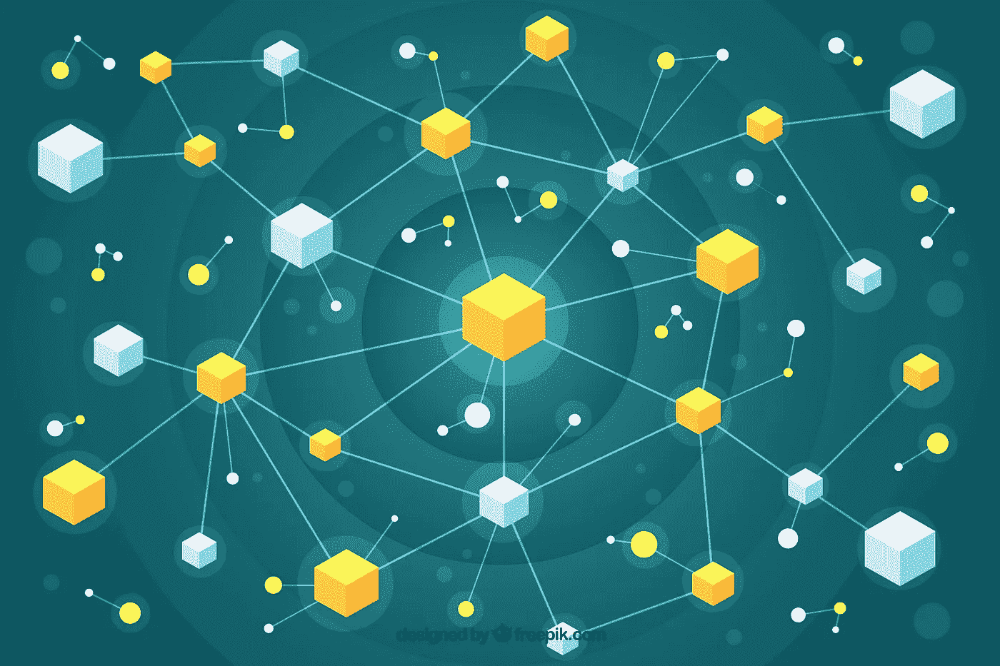

# 为分布式分类帐建立区块链协议

> 原文：<https://towardsdatascience.com/build-your-own-blockchain-protocol-for-a-distributed-ledger-54e0a92e1f10?source=collection_archive---------10----------------------->

## 通过一个简单的编码例子揭开区块链的神秘面纱

Background vector created by freepik — [www.freepik.com](http://www.freepik.com)

在这篇文章中，我将使用区块链构建一个简单的分布式分类帐，扩展 CodeAcademy 和其他人的教程，解释区块链的一些关键机制以及它们如何在 Python 中实现。

## 区块链概览

区块链协议的基本思想是在一个由机器或*节点组成的分布式网络中保存一个名为*分类账*的数据库。*分类账可以用于任何东西，可以保存交易或数字货币，如比特币或以太坊。为了维护保存在网络不同地方的账本的完整性，区块链协议在网络参与者解决计算密集型问题时对他们进行奖励——这个过程被称为*挖掘。*正是网络上的参与者进入的这个过程，确保了公共网络上分布式账本的完整性。区块链本质上是网络上的参与者解决的问题的解决方案的证明，这些解决方案在一个链中链接在一起，并且随着每个新的解决方案的发现，一个新的块被创建，并且下一组记录被复制到该块中。

# 构建区块链类

首先，我们将构建 Blockchain 类构造函数方法，该方法创建一个初始空列表(存储我们的区块链)和另一个存储分类账(交易记录)的列表。区块链类对象将负责管理整个区块链。我们将创建以下方法来帮助我们管理区块链:

[1] *register_node() —* 该方法将在网络上注册一个新节点

[2] *new_block()* —此方法将在区块链中创建一个新块，将最近的事务复制到这个新块中，并清除事务集。

[3] valid_proof() —此方法将检查提交以添加到区块链的块是否解决了问题。

[4]proof _ of _ work()-此方法将检查采矿是否产生了在区块链创建下一个区块的正确证据。如果证明是正确的，我们返回证明，否则它会一直调用 *valid_proof()* 直到我们找到有效的证明。

[5] *valid_chain() —* 该方法将遍历整个区块链，调用 valid_proof()来检查后续块是否有效。

[6]*new _ transaction()*—此方法将向事务列表中添加一个新事务。

[7] *last_block()* —此方法将返回链中的最后一个块。

区块链类看起来是这样的:

# 解决网络上的冲突

由于区块链协议是在分布式网络上运行的，我们需要一个关于区块链类对象的方法来解决网络上的冲突。我们将简单地检查网络上是否有任何其他比我们更长的区块链，如果有，使其成为我们自己的链，否则我们可以继续挖掘我们正在为下一个块挖掘的知识，我们的努力是值得的。

# 与区块链互动

最后，为了让我们的区块链变得生动并与之交互，我们可以使用 flask 通过 web 应用程序接口公开许多方法。

## 在网络上注册节点

我们将允许用户在网络上注册一个节点，这样他们就可以参与到*工作证明*过程中，并为他们的努力获得回报。我们在区块链类对象上调用 register_node()方法注册一个节点。

我们还想让这些参与者检查他们的区块链是否有效，如果无效，就从网络上获取区块链。

## 向区块链添加交易

我们希望允许参与者向分类帐添加交易。为此，我们只需在区块链类对象上调用 new_transaction()，并添加交易细节。

## 采矿

最后一件重要的事情！我们需要创造互动，让网络上的参与者挖掘他们的区块链。

现在，我们可以实例化 flask 应用程序，创建区块链类对象，运行 flask 应用程序，并与我们的区块链进行交互。

要下载完整的代码文件，请参见:【https://github.com/jamesdhope/blockchain】

# 参考

[1]https://www.wikihow.com/Build-a-Blockchain-App

[2][https://www . codecademy . com/learn/introduction-to-区块链/modules/区块链-in-python](https://www.codecademy.com/learn/introduction-to-blockchain/modules/blockchain-in-python)

[3]丹尼尔·范·弗莱明，[https://hacker noon . com/learn-区块链-by-building-one-117428612 f46](https://hackernoon.com/learn-blockchains-by-building-one-117428612f46)。

[4][https://towards data science . com/building-a-minimal-区块链-in-python-4f2e9934101d](/building-a-minimal-blockchain-in-python-4f2e9934101d)

[5]奥默·戈德堡，[https://hacker noon . com/building-a-区块链-the-grey-paper-5be 456018040](https://hackernoon.com/building-a-blockchain-the-grey-paper-5be456018040)