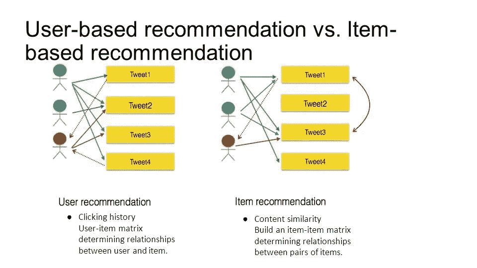
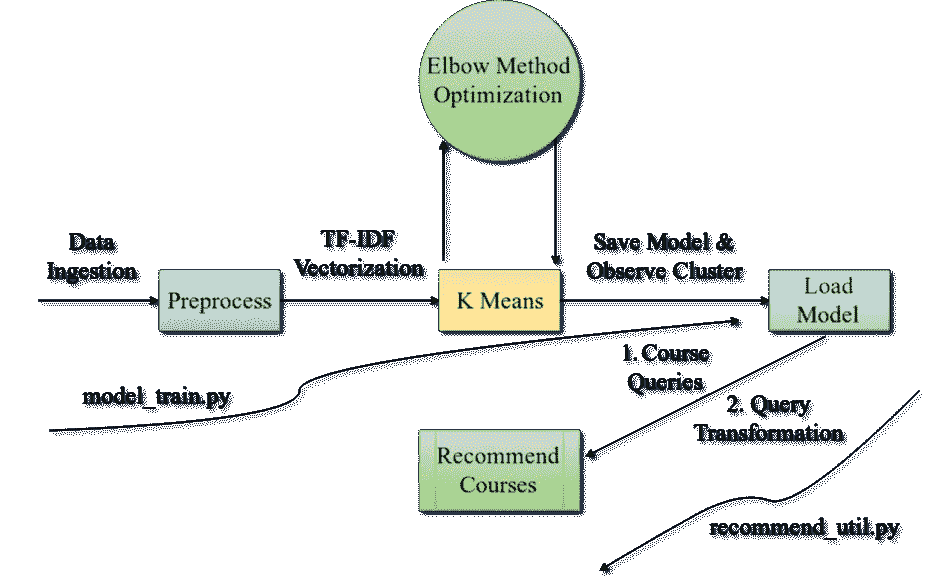
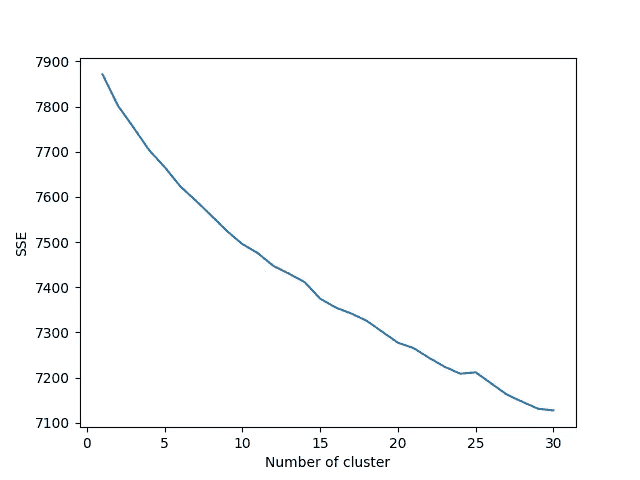

# 在 15 分钟内构建您自己的基于聚类的推荐引擎！！

> 原文：<https://towardsdatascience.com/build-your-own-clustering-based-recommendation-engine-in-15-minutes-bdddd591d394?source=collection_archive---------1----------------------->

推荐引擎是机器学习技术在当前互联网时代最流行的应用之一。这些广泛用于电子商务网站推荐类似产品和电影推荐网站。他们负责为我们生成各种定制的新闻建议。这将推动用户参与更多内容，从而为组织带来更好的用户体验和更多收入。因此，它们在今天的工业中极其重要。

推荐引擎基本上过滤数据并向用户推荐最相关的结果。这些结果是以最大可能感兴趣的方式推荐的。现在，所有的推荐引擎都有用户数据和他们的历史记录，可以用来创建他们的过滤算法。这最终帮助他们为每个独特的用户生成非常准确的推荐。



User-based filtering is based on history of users and similarity b/w them from their purchase histories for example. But, Item-based recommendations are based on content based similarity. Like, “how many times few items are bought together”. Next time, most frequent of these purchases will be recommended together.

在协同过滤的情况下,“用户行为”被用于推荐项目。这些推荐可以利用用户-用户相似性或者基于项目-项目相似性来生成。并且基于该相似性度量，向用户提供建议。但是，让我们考虑一个场景，在这个场景中，我们没有可用的用户数据，但是我们仍然必须向用户推荐商品。

> 没有用户数据怎么办？我们的推荐引擎现在将如何工作？

生成推荐的问题现在被简单地转化为类似聚类的问题。其中相似性度量基于“在生成推荐时，两个项目有多接近？”。用于生成推荐的度量将基于两个项目的相似性，如这些项目之间的向量距离。我们将针对 Pluralsight 的在线课程文本数据进行讨论。让我们来做一个仅基于我们可用的项目数据的推荐引擎。

# 在线课程推荐系统

在本文中，我们将从 Pluralsight 的课程数据中构建一个推荐系统，并查看可以对我们基于聚类的解决方案进行的进一步改进。我们将按下述顺序讨论该项目的整个数据分析流程。为了节省时间，你可以直接参考[项目库](https://github.com/ashishrana160796/Online-Course-Recommendation-System)并遵循精心制作的 [README.md](https://github.com/ashishrana160796/Online-Course-Recommendation-System/blob/master/README.md) 文件。此外，可以为提到的每个模块直接运行[实用程序脚本](https://github.com/ashishrana160796/Online-Course-Recommendation-System/blob/master/model_train_k_30.py)。

> 1.简介:了解你的数据
> 
> 2.架构设计:构建实用工具
> 
> 3.预处理步骤
> 
> 4.问题讨论、模型训练和优化
> 
> 5.工作推荐系统
> 
> 6.结论&主题建模的未来改进(特别是 LDA)

> ***超级省时提示*** :打开项目的 [github](https://github.com/ashishrana160796/Online-Course-Recommendation-System) 库，按照 [README.md](https://github.com/ashishrana160796/Online-Course-Recommendation-System/blob/master/README.md) 文件运行代码即可😉

# 简介:了解你的数据

该项目使用的数据是 Pluralsight 网站上的课程列表和描述。要获取课程数据，只需运行下面提到的 ReST API 查询。但是，为了获得用户注册数据，让我们说一个基于协作过滤器的引擎。

首先，获取在[文档](https://www.pluralsight.com/product/professional-services/white-paper/api)中提到的 ReST api-token，然后进行 ReST 查询，以获取关于该网站上所有课程和注册该网站的各个用户的数据。如果您想要获取用户相关数据，则需要此键。否则，为了获得简单的课程相关数据，我们可以编写如下 ReST 查询。

```
# Input
http://api.pluralsight.com/api-v0.9/courses# Output: A *Courses.csv* file for download. It will be having below mentioned structure.CourseId,CourseTitle,DurationInSeconds,ReleaseDate,Description,AssessmentStatus,IsCourseRetiredabts-advanced-topics,BizTalk 2006 Business Process Management,22198,2008-10-25,"This course covers Business Process Management features in BizTalk Server 2006, including web services, BAM, hosting, and BTS 2009 features",Live,no
abts-fundamentals,BizTalk 2006
...
```

在本文中，我们仅限于发动机制造的课程数据。否则，这种方法将与其他推荐引擎文章非常相似。通过查看这些数据，我们发现以下几点在训练模型时非常重要。您也可以打开 *Courses.csv* 文件，自己进行如下观察。

1.  课程数据文本描述针对课程 Id、课程标题和课程描述列呈现。因此，在构建我们的推荐引擎时，这些列是我们感兴趣的。利用这些列中的文本数据，我们将能够构建词向量，我们的模型将在预测结果时使用这些词向量。此外，大部分信息仅出现在*【描述】*栏中。因此，没有描述的课程将从培训中删除。
2.  “已退休”栏描述了网站上课程的当前状态，即网站上目前是否有该课程。因此，我们不想推荐我们训练有素的模型的退役课程。但是，我们绝对可以在我们的训练数据中使用它们。
3.  并对该数据的预处理进行了讨论。数据中显然存在一些额外的'-'标记、不同的大小写和停用词。我们将相应地预处理我们的文本，只关注名词/名词短语。

在下一节中，我们将讨论正在开发的这个推荐实用程序的基本架构。有了这个架构，最终我们将拥有一个完整的机器学习工具，它将课程数据作为输入，并基于用户查询生成建议。

# 架构设计:构建实用工具

下图清楚地说明了我们在这个数据科学项目中的渠道。请在以从左到右的方式进一步阅读之前先看一下。



**Three main components:** 1\. Pre-process & Train; 2\. Optimizations; 3\. Recommendation Utility Tool

这个实用工具主要分为三个组件，我们将在接下来的章节中详细讨论这些组件。主要是对模型进行训练和优化，减少误差。之后，我们将编写实用工具，该工具将基于唯一课程 id 的输入查询生成推荐。

记住上面的工具架构，让我们转到预处理步骤，并开始为我们的模型进行数据摄取步骤。

# 预处理步骤

按照下面的代码片段，我们将做一些小的文本预处理，如删除所有标点符号。此外，在大量的术语中,“ll”被用在诸如“we’ll”、“you’ll”等情况中。这些也从*‘描述’*文本中删除。我们还将消除停用词，并以适当的方式合并包含描述、课程 id、标题的列。请参考下面的代码片段，以遵循上述步骤。

```
import pandas as pd# 1\. read data, from source
# "Courses.csv" file has been renamed
course_df = pd.read_csv("data/courses.csv")# 2\. drop rows with NaN values for any column, specifically 'Description'
# Course with no description won't be of much use
course_df = course_df.dropna(how='any')# 3\. Pre-processing step: remove words like we'll, you'll, they'll etc.
course_df['Description'] = course_df['Description'].replace({"'ll": " "}, regex=True)# 4\. Another Pre-preprocessing step: Removal of '-' from the CourseId field
course_df['CourseId'] = course_df['CourseId'].replace({"-": " "}, regex=True)# 5\. Combine three columns namely: CourseId, CourseTitle, Description
comb_frame = course_df.CourseId.str.cat(" "+course_df.CourseTitle.str.cat(" "+course_df.Description))# 6\. Remove all characters except numbers & alphabets
# Numbers are retained as they are related to specific course series also
comb_frame = comb_frame.replace({"[^A-Za-z0-9 ]+": ""}, regex=True)
```

在对上述数据进行基本的清理步骤后，*‘comb _ frame’*包含了与课程相关的所有必要的文字描述。之后，让我们移动到这个文本的矢量化，并训练我们的模型。

# 问题讨论、模型训练和优化

现在，我们将所有需要的文本数据呈现在一个数据框中。但是，我们需要将其转换成有意义的表示。因此，它可以正确地输入到我们的机器学习模型中。

为此，我们使用 ***tf-idf*** 权重来表示术语在文档中的重要性。它是对文档中单词重要性的统计度量。该权重与单词在语料库中出现的次数相关，但是被语料库中单词的频率所抵消。

***Tf*** 中的 ***tf-idf*** 权重衡量文档中的词频。以及 ***idf*** 测量给定语料库中给定术语重要性。这可以从下面提到的公式中推断出来。

```
**TF(**t**)** = (Number of times term *'t'* appears in a document) **/** (Total number of terms in the document)**IDF(**t**)** = **log_e(**Total number of documents **/** Number of documents with term *'t'* in it**)**
```

我们将使用 scikit learn 将我们的文本数据转换为上面公式中指定的向量矩阵乘积。按照下面的代码片段进行转换。

```
# Create word vectors from combined frames
# Make sure to make necessary importsfrom sklearn.cluster import KMeans
from sklearn import metrics
from sklearn.feature_extraction.text import TfidfVectorizervectorizer = TfidfVectorizer(stop_words='english')
X = vectorizer.fit_transform(comb_frame)
```

在此之后，我们可以将这些数据直接输入到我们的 k 均值学习算法中。但是，对于我们的 k-means 算法，我们将需要***【k】***的理想值，对此我们还没有讨论过。首先，我们可以使用 k=8 的值，因为 Pluralsight 有八种不同类型的课程类别，并检查我们的模型相应训练的预测能力。跟随下面提到的代码片段。

```
# true_k, derived from elbow method and confirmed from pluralsight's website
true_k = 8# Running model with 15 different centroid initializations & maximum iterations are 500
model = KMeans(n_clusters=true_k, init='k-means++', max_iter=500, n_init=15)
model.fit(X)
```

我们可以观察来自每个聚类的顶词，以查看所形成的聚类在质量上是否良好，或者它们在某种意义上是否需要改进。运行下面提到的片段，观察每个聚类中的热门词。

```
# Top terms in each clusters.print("Top terms per cluster:")
order_centroids = model.cluster_centers_.argsort()[:, ::-1]
terms = vectorizer.get_feature_names()
for i in range(true_k):
    print("Cluster %d:" % i),
    for ind in order_centroids[i, :15]:
        print(' %s' % terms[ind]),
    print
```

观察这些单词后，您可能会注意到所有形成的集群都不合适，一些课程类别在多个集群中重复出现(请参考 [README.md](https://github.com/ashishrana160796/Online-Course-Recommendation-System) 文件)。那现在还是好的(*😉*)，我们的模型将数量巨大的课程类别细分为其他子类别。因此，给定类别的课程数量的基数问题暴露出来，我们的模型无法解决。

我们可以看到，细分类别平面艺术，电影设计，动画形成了母'创意-专业'类别。由于课程类别之间的数据分布不均，即数据基数的问题，因此形成了这个子类。因此，像“商务-专业”这样课程数量少的课程类别在我们的理想假设中迷失了，因为 **k** 等于 8。这很容易发生，因为在我们简单的机器学习模型训练中，不经常出现的业务相关术语很容易失去其 tf-idf 权重。

因此，从这种方法得到的聚类仍然可以通过进一步划分成其他聚类来改进，以用更少数量的课程得到这些更小的课程类别。因为，这些进一步的划分可以公式化为误差最小化的优化问题。我们不想因此过度拟合我们的模型，我们将使用 ***【肘测试】*** 方法来寻找 ***k*** 的理想值。*这个想法是，每当给定的****【k’******的值的误差急剧下降时，该值对于形成聚类来说足够好。*这些形成的集群将具有尖锐的误差极小值，并将为我们的模型给出令人满意的解决方案。按照下面提到的代码对我们的数据进行弯头测试。**

```
**# Continuing after vectorization step# data-structure to store Sum-Of-Square-Errors
sse = {}# Looping over multiple values of k from 1 to 30
for k in range(1, 40):
    kmeans = KMeans(n_clusters=k, init='k-means++', max_iter=100).fit(X)
    comb_frame["clusters"] = kmeans.labels_
    sse[k] = kmeans.inertia_# Plotting the curve with 'k'-value vs SSE
plt.plot(list(sse.keys()), list(sse.values()))
plt.xlabel("Number of cluster")
plt.ylabel("SSE")
# Save the Plot in current directory
plt.savefig('elbow_method.png')**
```

**运行上述代码后，我们得到了下图，在此基础上，我们为 k=30 训练了我们的模型。并为我们的推荐引擎工具实现了相对更好的聚类。**

****

**Slope is drastically diminishing after the value of k=30\. Hence, we’ll opt for this value for our model.**

**最后，让我们保存我们的模型，继续我们的推荐实用程序脚本设计，并讨论未来的改进方法。所有这些提到的片段都以 [model_train.py](https://github.com/ashishrana160796/Online-Course-Recommendation-System/blob/master/model_train_k_30.py) 脚本的形式提供，您可以参考它来直接执行。但是，在此之前，请提取 courses.csv 数据文件，并仔细阅读 [README.md](https://github.com/ashishrana160796/Online-Course-Recommendation-System) 。**

```
**# Save machine learning model
filename = 'finalized_model.sav'
pickle.dump(model, open(filename, 'wb'))**
```

# **工作推荐系统**

**我们将为这个推荐模块创建几个实用函数。一个 cluster_predict 函数，它将预测输入其中的任何描述的分类。首选输入是我们之前在 [model_train.py](https://github.com/ashishrana160796/Online-Course-Recommendation-System/blob/master/model_train_k_30.py) 文件的 comb_frame 中设计的类似“描述”的输入。**

```
**def cluster_predict(str_input):
    Y = vectorizer.transform(list(str_input))
    prediction = model.predict(Y)
    return prediction**
```

**之后，我们将根据新的 dataframe 列中的描述向量为每个课程分配类别，即*‘cluster prediction’*。见下文。**

```
**# Create new column for storing predicted categories from our trained model.
course_df['ClusterPrediction'] = ""**
```

**我们将为只有实时课程的数据框存储该聚类类别分数，即删除“无”实时条目的课程。之后，我们将在数据框中为每门课程运行预测函数实用程序，并存储聚类类别。这些存储的类别将在将来与输入查询及其预测类别进行匹配，以生成推荐。**

```
**# load the complete data in a dataframe
course_df = pd.read_csv("data/courses.csv")# drop retired course from analysis. But, courses with no descriptions are kept.
course_df = course_df[course_df.IsCourseRetired == 'no']

# create new column in dataframe which is combination of (CourseId, CourseTitle, Description) in existing data-frame
course_df['InputString'] = course_df.CourseId.str.cat(" "+course_df.CourseTitle.str.cat(" "+course_df.Description))# Create new column for storing predicted categories from our trained model.
course_df['ClusterPrediction'] = ""# Cluster category for each live course
course_df['ClusterPrediction']=course_df.apply(lambda x: cluster_predict(course_df['InputString']), axis=0)**
```

**最后，推荐实用函数将预测具有课程 id 的输入查询的课程类别，并且将从上面转换的数据帧*‘course _ df’*中推荐几个随机课程，该数据帧具有每个课程的预测值。**

```
**def recommend_util(str_input):

    # match on the basis course-id and form whole 'Description' entry out of it.
    temp_df = course_df.loc[course_df['CourseId'] == str_input]
    temp_df['InputString'] = temp_df.CourseId.str.cat(" "+temp_df.CourseTitle.str.cat(" "+temp_df['Description']))
    str_input = list(temp_df['InputString'])
        # Predict category of input string category
    prediction_inp = cluster_predict(str_input)
    prediction_inp = int(prediction_inp) # Based on the above prediction 10 random courses are recommended from the whole data-frame
    # Recommendation Logic is kept super-simple for current implementation. temp_df = course_df.loc[course_df['ClusterPrediction'] == prediction_inp]
    temp_df = temp_df.sample(10)

    return list(temp_df['CourseId'])**
```

**用下面给出的查询测试你训练过的推荐引擎。您也可以通过从 courses.csv 获取课程 id 来添加您的查询。**

```
**queries = ['play-by-play-machine-learning-exposed', 'microsoft-cognitive-services-machine-learning', 'python-scikit-learn-building-machine-learning-models', 'pandas-data-wrangling-machine-learning-engineers', 'xgboost-python-scikit-learn-machine-learning']for query in queries:
    res = recommend_util(query)
    print(res)**
```

# **结论和未来改进**

**当前推荐引擎的实现本质上是非常原始的。用精确的硬步骤阈值来形成集群的方法是粗糙的，但是给出了用集群化算法实现这些引擎的想法。此外，生成的推荐本质上是随机的。可以采用更具体的方法(如基于最高得分的推荐方法)作为改进。目前，course-id 作为唯一的输入，而不是更好的自然语言输入。但是，这些只是基于实施的改进。**

**基本上，为了将来的改进，用于训练的类别分配机制和模型可以被改变。此外，可以采用来自主题建模的高级和复杂的机制，如潜在狄利克雷分配(LDA)。主题建模是自然语言处理的一个统计分支，它从文档集中提取摘要。我们将使用 LDA，它将一个特定的文档分配给一个特定的主题和一个实数权重分数，该分数将与相应主题的单词相关联。**

> **只需运行 [lda_train.py](https://github.com/ashishrana160796/Online-Course-Recommendation-System/blob/master/lda_train.py) 来详细了解 lda 的实现，注释/控制台输出将解释关于正在执行的步骤的一切。**

**这些指定的主题及其与单词的关联分数可以作为上述 *cluster_prediction* 函数的预测逻辑基础。但是，这些预测将比当前由 k-means 聚类算法生成的任何推荐更精确。一个基于 gensim 的 LDA 实现在[这里](https://github.com/ashishrana160796/Online-Course-Recommendation-System/blob/master/lda_train.py)的同一个 [github](https://github.com/ashishrana160796/Online-Course-Recommendation-System) 仓库中可用。它的推荐实用程序脚本目前还没有添加，你可以作为家庭作业来尝试。**

**霍普，你喜欢读它，并得到了一个数据科学项目的小手。如果有任何改进，请在 [github](https://github.com/ashishrana160796/Online-Course-Recommendation-System) 上做一个公关或公开一个问题。**