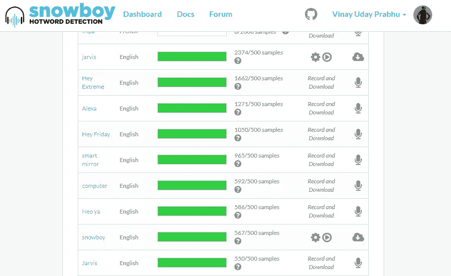
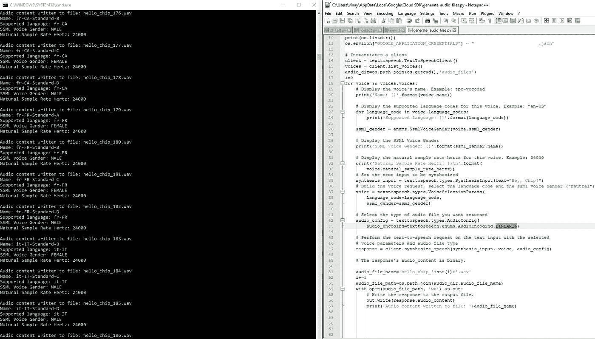
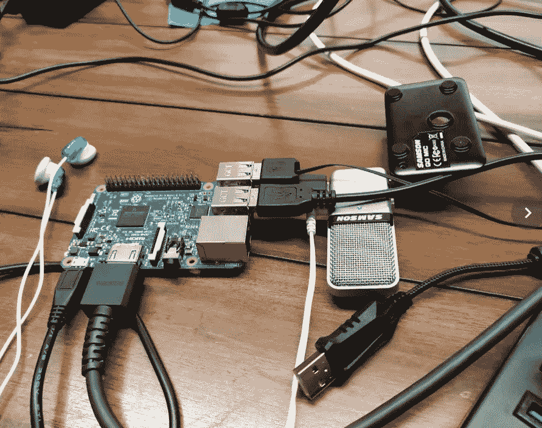

# 建立您自己的自定义热门词探测器零训练数据和$0！

> 原文：<https://towardsdatascience.com/build-your-own-custom-hotword-detector-with-zero-training-data-and-0-35adfa6b25ea?source=collection_archive---------14----------------------->

**TLDR** : *谷歌 TTS - >噪音增强- > {wav 文件} - > SnowBoy - > {。pmdl 型号} - >树莓 Pi*

好了，又到了一年中的这个时候了。你知道[沙漠里有个东西](https://burningman.org/)。上一次，我装配了一个谷歌 AIY 视觉套件，并在[芯片上添加了](https://www.facebook.com/CampByteThis/) [*espeak*](http://espeak.sourceforge.net/) 和 Terra ，这是一群杂牌军的艺术装置，即[ÿntelligent 技术解放的 bÿte:燃烧器](https://www.facebook.com/CampByteThis/)。

结果是这样的:

这一次，我决定增加一种额外的感官能力:倾听和回应的能力，在机器学习中，通俗地说就是装配一个可以在设备上和离线工作的热词检测引擎。放松点，皮兹，不？把啤酒递给我好吗？在学徒上阅读…

因此，我开始四处寻找简单的现成解决方案，并偶然发现了令人敬畏的[*snow boy*](https://snowboy.kitt.ai/)*离线热门词汇检测器。这当然是有限制的！你可以下载预先训练好的机器学习模型来检测特定的热门词汇，如 *Alexa* 和 *Jarvis(见下图)…**

**

*The off-the-shelf available hotword models*

*..但是，为了真正为精确的自定义热门词汇建立您自己的健壮模型，您需要大约 500 名志愿者每人贡献 3 个样本。尽管我在社交媒体上的影响力极其有限，但我还是召集了大约 5 名捐款人*

**

*5 donors from my social media campaign!*

*看到这毫无进展，我想到了生成自己的数据集。我最近从事了几个合成到真实单词转移学习项目，其中一个我在 https://arxiv.org/abs/1905.08633 ICLR 的深度生成模型研讨会上发表了论文(见[和](https://arxiv.org/abs/1905.08633))，我认为如果 WaveNet 在生成真实声音的文本到语音转换方面真的如此令人印象深刻，我可以使用 Goggle doles 提供的 300 美元免费 Google cloud credits 来为我收集数据，并通过一些漂亮的噪声增强将学习转移到现实世界中，是的，深度神经网络的泛化能力是不合理的！*

## ***第一阶段:使用 Google TTS 生成不同声音的合成热门词音频文件***

*于是，我创建了一个临时的 GC 账号，虔诚地按照文档写了一些 Python 代码(分享到这里:[https://github . com/vinay prabhu/burning man 2019/blob/master/generate _ SYNTHETIC _ audio files . py](https://github.com/vinayprabhu/BurningMan2019/blob/master/generate_SYNTHETIC_audiofiles.py))。在大约 5 分钟内，我有 189 个。wav 文件的热词我是针对的(这是 ***嘿芯片！*** BTW)不同的口音，或者更正式地称为*的声音。你可以从[这里](https://github.com/vinayprabhu/BurningMan2019/blob/master/wav.zip)下载整个宝藏。**

**

*Using Google TTS to generate synthetic training data*

*我最喜欢的一些声音例子是:*

*Example sound files from the Google TTS engine!*

*现在我们有了 189 个。不同声音的 wav 文件，对于这些声音中的每一个，我执行了普通的加性白高斯噪声增强来获得(189 x 3) wav 文件。这里是与这个任务相关的 [colab 笔记本](https://github.com/vinayprabhu/BurningMan2019/blob/master/Colab_Notebooks/wav_augmentation.ipynb)。*

## *阶段 2:使用合成的噪声增强 wav 文件训练热词检测模型*

*尽管这项技术很有前途，但它仍处于危险之中。用于以编程方式训练您自己的模型的 api 看起来相当严格:*

```
*python training_service**.**py 1.wav 2.wav 3.wav saved_model**.**pmdl*
```

*正如所见，您需要准确地输入 3 个 wav 文件来生成一个模型。所以，是的。我确实为每个声音生成了 189 个模型(我非常非常高兴在这方面被证明是错误的)，并将它们逻辑“或”在一起。摄取 wav 文件训练 ML 模型的 colab 笔记本分享到这里:[https://github . com/vinay prabhu/burning man 2019/blob/master/Colab _ Notebooks/model _ gen . ipynb](https://github.com/vinayprabhu/BurningMan2019/blob/master/Colab_Notebooks/model_gen.ipynb)*

## *阶段 3:将所有的模型组合在一起，并在 Raspberry Pi 上运行它们*

*好的。所以，这个阶段有点棘手。请确保您耐心且虔诚地遵循本回购文件:*

*[](https://github.com/wanleg/snowboyPi) [## wanleg/snowboyPi

### 从全新安装 Raspbian 开始(Lite 或 Regular，本指南假设是 Lite) sudo apt update && sudo apt -y…

github.com](https://github.com/wanleg/snowboyPi) 

树莓 Pi 上音频项目的一个主要来源是 ALSA 的恶作剧，以及随之而来的 HDMI、USB 音频和本地音频输出端口之间的音频统治之争。为了避免这一点，我使用了良好的 ol' SAMSON mike in + audio-out 钻机(显然亚马逊[兜售这些](https://www.amazon.com/Samson-Mic-Portable-Condenser-Microphone/dp/B001R76D42/ref=asc_df_B001R76D42/?tag=hyprod-20&linkCode=df0&hvadid=312039437910&hvpos=1o4&hvnetw=g&hvrand=1977879924165500956&hvpone=&hvptwo=&hvqmt=&hvdev=c&hvdvcmdl=&hvlocint=&hvlocphy=9031928&hvtargid=pla-318320044466&psc=1)现在 29.99 美元！班加罗尔 SP 路的便宜多了。)

整个设置如下所示:



The raspberry pi-3 set-up with the Samson mike

在开始人体试验之前，我试图通过一个简单的测试案例来隔离使用麦克风的影响，我在笔记本电脑上播放谷歌 TTS 输出音频文件，并检查音频文件是否相关。运行在 Raspberry Pi 上的 pmdl 确实会被合成话语触发。结果非常好！

Synthetic data input trials

现在有了一些希望，我开始调整 snowboy.py 脚本(从这里:【https://github.com/wanleg/snowboyPi/blob/master/snowboy.py】T2)来包含所有的。我刚刚生成的 pmdl 模型文件，以便当现实世界中的智人说出关键字‘嘿，芯片！’时，至少有一个会被触发。原来，你需要做的只是在这里添加第 29 行的模特列表:[https://github . com/wan leg/snowboyPi/blob/master/snowboy . py # L29](https://github.com/wanleg/snowboyPi/blob/master/snowboy.py#L29)

> **大结局:**
> 
> 现在所有的文件都打包好了(顺便说一下，你再也不用担心这些单个 DNN 模型的大小了。各有~ 10KB。令人印象深刻的作品 [*雪衣人*](http://docs.kitt.ai/snowboy/) *！)，我最终决定用真实的人类语音输入进行最后的真实世界测试，结果是..*鼓声*。*

钽..大！有用！它与我正常的(印度口音)声音和我的亚当·莱文声音配合得天衣无缝。

**第 4 阶段:片上部署和 Terra +套管+ playa 部署**

我正屏息等待这一阶段。我一回到默认世界就更新这篇博文！*