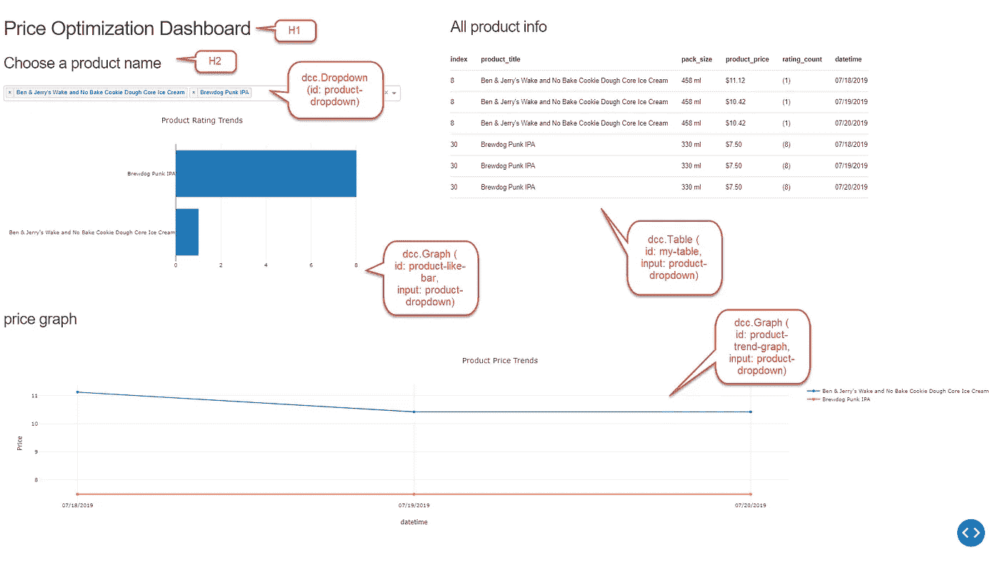

# 构建您自己的数据仪表板

> 原文：<https://towardsdatascience.com/build-your-own-data-dashboard-93e4848a0dcf?source=collection_archive---------0----------------------->

## 数据专业人员权威指南(商业智能)

## 使用 Python Dash 快速构建 dashboard web 应用程序


Source: Unsplash

# 问题是


The emergence of BI Dashboarding Tools. source: ezDataMunch

对于数据科学家来说，将我们的数据和结果传达给非技术用户是非常重要的。特别是以能够被理解和迅速反应的形式。这就是数据可视化非常重要的原因，尤其是在 Power BI、Tableau 和 Qlikview 等 BI 产品中。

虽然他们有一个易于使用的界面来产生惊人的可视化，这些技术许可证可能非常昂贵。对于 Tableau 来说，每月最高可达 50 美元。此外，对于像我这样的数据专业人员来说，我认为大多数 BI 工具不够通用，无法跟上 Python 用例的动态增长。嵌入它仍然非常笨拙，而不是与我们的 web 应用程序无缝集成。

因此，我们需要一个更好的方法来解决这个问题。

> 我们可以免费用 Python 构建仪表板 Web 应用吗？

令人惊讶的答案是肯定的！我将通过开源库——Dash Python 向您展示这一点。

# 见见达什。

简而言之，Dash 是一个开源 Python 库，用于构建针对数据可视化而优化的 web 应用程序。Dash 最棒的地方在于，它建立在 Plotly 和 Matplotlib 等数据可视化库、Web 应用程序库(Flask)以及最终通过 Pandas 实现的数据可移植性之上！由于 Javascript 层是通过 Plotly 和 Flask 处理的，因此您甚至不需要接触其他编程语言就可以创建一个令人惊叹的 web 应用程序。

最终结果是熟悉、惯例和实用性的完美结合。您可以快速地选择、开发和部署应用程序。严格来说，所有这些都是用 Python 编写的，不需要其他语言(尽管选项仍然可用)。

## 冲刺的力量

> [“Dash 应用程序代码是声明性和反应性的，这使得构建包含许多交互元素的复杂应用程序变得容易。”](https://github.com/plotly/dash) —阴谋破折号

最好的特性之一是 Dash 支持**声明式编程。**这允许您基于输入数据和输出属性构建 Dash 应用程序。你将只陈述你需要什么，而不是如何实现目标的细节。


Source: Unsplash

> 假设你想买鸡蛋。

**声明式编程**会说“给我找鸡蛋买鸡蛋。这是现金”

然而**传统编程**会说“去法院超市，去 6 号过道找到你右手角的鸡蛋，去收银台用 5 美元现金支付”。

显然，从这个例子中，声明式编程将卸载**“如何”**。与金钱和鸡蛋类似，您只需要提交输入数据和输出属性，可视化结果就会自动呈现。

你甚至不需要理解 Dash 是如何处理你的视觉化的。你只需要发出指令并接受结果。这就是 Dash 支持声明式编程的美妙之处。

其实这一点都不外国。许多语言也是用相同的概念构建的。声明性语言的一个例子是 [SQL(结构化查询语言)](https://neo4j.com/blog/imperative-vs-declarative-query-languages/)和 [Kubernetes yaml](https://kubernetes.io/docs/tasks/manage-kubernetes-objects/declarative-config/) 。两者都是数据科学家优化数据检索和开发流程的重要工具。

> **希望我让你兴奋！！让我们开始吧**

# 战斗中的冲刺


Our Application in Big Picture, today we are going to learn how to build Dashboard with Dash

在本教程中，您将学习如何使用 Dash Python 构建仪表板应用程序。

我们将访问我们以前在[任务调度器](/automate-your-python-scripts-with-task-scheduler-661d0a40b279)到[上的项目，从 Lazada](/in-10-minutes-web-scraping-with-beautiful-soup-and-selenium-for-data-professionals-8de169d36319?source=post_page---------------------------) (电子商务)网站抓取数据，并将其转储到 [SQLite RDBMS](/relational-database-management-rdbms-basic-for-data-professionals-aca3567f03da?source=post_page---------------------------) 数据库中。然后，我们将生成数据可视化，以了解 Lazada 产品随时间和日期的价格变化。

请随意欣赏这篇文章或访问我的 [Github Repo](https://github.com/VincentTatan/Web-Scraping/blob/master/Selenium%20Web%20Scraping/lazada/dashboard.py) 获取完整代码。

在这种情况下，让我们想象 3 天内的价格变化。


Price Optimization Dashboard Scraped from Lazada over 3 days

## 让我们完成这 5 个重要步骤，生成您的第一个仪表板！

1.  导入和激活仪表板
2.  准备数据
3.  可视化图表
4.  下拉菜单和输入过滤器选择
5.  造型和装饰

# 导入和激活仪表板

像往常一样，让我们在 Python 上导入 Dash 库。

```
import dash
from dash.dependencies import Input, Output
import dash_core_components as dcc
import dash_html_components as html
```

您可以用一个简单的 pip install 命令下载这些库。

```
pip install <library name e.g: dash>
```

我们还将用这段代码激活 Dash 服务器。

```
app = dash.Dash(__name__)
server = app.server
if __name__ == '__main__':
    app.run_server(debug=True)
```

一旦您运行这个 Python 脚本，它将运行一个服务器，您可以使用 [http://127.0.0.1:8050/](http://127.0.0.1:8050/) 打开该服务器。这将打开一个 flask web 应用程序，您可以将它部署在任何地方，比如 Heroku。请注意，我们放置了 run_server 参数`debug =True.` ,这将允许您在脚本中保存任何更改后自动更新本地部署。非常整洁的时间节省技巧重新启动您的应用程序。


Info logs to run dash app on Command Prompt

# 准备数据

在这个领域，我们将从数据库中读取产品信息，并将它们转储到熊猫数据框架中。`dbm` 是我们之前在 [SQLite RDBMS](/relational-database-management-rdbms-basic-for-data-professionals-aca3567f03da?source=post_page---------------------------) 项目中创建的一个模块。这将把一个 SQLite 表转储到名为`product_df`的 Pandas Dataframe 中。请随意从我的 [Github](https://github.com/VincentTatan/Web-Scraping/blob/master/Selenium%20Web%20Scraping/lazada/dashboard.py) 中提取模块。

```
global product_df
product_df = dbm.read()
```

关键字`global` 将全球化 product_df，以便所有回调函数都可以访问它来生成数据可视化。

# 可视化图表



Dash Graph with Component Details

我们将创建一个应用程序布局，它将在`html` 模块中封装 html 对象。这将是我们布局图形和调整相对尺寸到你的屏幕尺寸的主要途径。

```
app.layout = html.Div([
    html.Div([
        html.H1('Price Optimization Dashboard'),
        html.H2('Choose a product name'),
        dcc.Dropdown(
            id='product-dropdown',
            options=dict_products,
            multi=True,
            value = ["Ben & Jerry's Wake and No Bake Cookie Dough Core Ice Cream","Brewdog Punk IPA"]
        ),
        dcc.Graph(
            id='product-like-bar'
        )
    ], style={'width': '40%', 'display': 'inline-block'}),
    html.Div([
        html.H2('All product info'),
        html.Table(id='my-table'),
        html.P(''),
    ], style={'width': '55%', 'float': 'right', 'display': 'inline-block'}),
    html.Div([
        html.H2('price graph'),
        dcc.Graph(id='product-trend-graph'),
        html.P('')
    ], style={'width': '100%',  'display': 'inline-block'})

])
```

注意`dcc` 模块。这是 dash 核心组件，将存储 web 应用程序的基本可视化，如条形图、下拉列表和折线图。

剩下的简单明了，具体到`html` 模块。您可以创建 H1 或 H2 标题、div(包含 web 组件的框)，甚至表格。把它想象成抽象的 html 代码，这样你甚至不需要看它。

现在我们来说说`id`。`dcc.Graph(id=’my-table’)` 中的 id *my-table* 到底是什么意思？这显示了为某个图形输出调用哪个函数。通过插入代码，我们将调用下面的函数。

```
@app.callback(Output('my-table', 'children'), [Input('product-dropdown', 'value')])
def generate_table(selected_dropdown_value, max_rows=20):

product_df_filter = product_df[(product_df['product_title'].isin(selected_dropdown_value))]product_df_filter = product_df_filter.sort_values(['index','datetime'], ascending=True)

return [html.Tr([html.Th(col) for col in product_df_filter  .columns])] + [html.Tr([
        html.Td(product_df_filter.iloc[i][col]) for col in product_df_filter  .columns
    ]) for i in range(min(len(product_df_filter  ), max_rows))]
```

在功能代码的顶部，你会看到`@app.callback` ，它将运行魔法。这意味着您将返回函数准确地导出到 my-table 组件中。您也可以从下拉列表中指定输入选项。这将用于过滤 product_df。

注意，过滤后的 product_df 将用于填充 return 语句，在这里我们使用 html 模块设计表格。

它的美妙之处在于，如果您更改仪表板中的下拉输入，该函数将呈现过滤后的 product_df。

> 确切地说，你如何使用 Tableau，但免费和更通用(即插即用)！！


Source: Meme Crunch

# 下拉菜单和输入过滤器选择

注意到`@app.callback` 输入了吗？此时，您可以指定自己的过滤器来呈现可视化组件。

```
dcc.Dropdown(
    id='product-dropdown',
    options=dict_products,
    multi=True,
    value = ["Ben & Jerry's Wake and No Bake Cookie Dough Core Ice Cream","Brewdog Punk IPA"]
),
```

`id` 与回调函数中的输入注释相同。这指定了要调用的函数。

`options` 将插入所有可用选项的键值对。这可能是股票代号，如{'GOOG ':谷歌，' MSFT ':微软}或任何东西。对于我们的例子，我们将插入相同的键值对，它们是产品名称。

`multi` 属性将允许您选择一个以上的选项，这对于在一个图表中进行并排价格比较来说是完美的。

最后，`value` 属性将在服务器运行开始时存储你的下拉列表值。


Dropdown values to affect Python Dash Elements

# 造型和装饰

Dash 的造型很简单。默认情况下，Dash 已经预先配置了访问资产文件夹的设置。这是您可以覆盖样式的 css 和 web 行为的 js 的地方。你可以插入 *stylesheet.css* 来美化你的 Dash Web 应用。具体的改进空间是组件和表格边框之间的边距。


Inserting assets folder with stylesheet.css for styling

# 最终结果

恭喜你！！您已经创建了第一个交互式仪表板。如果你做得好，你会得到这个结果。如果没有，请随意查阅我的 [Github 代码](https://github.com/VincentTatan/Web-Scraping/blob/master/Selenium%20Web%20Scraping/lazada/dashboard.py)或者在这里提出你的问题。


Your First Python Price Optimization Dashboard!!!

> 现在，释放和创建自己的仪表板！

## 更多参考

如果你需要更多的例子和 Dash 能做什么的更好的见解。请随意访问以下链接。我向你保证，这些将提高你的仪表板设计技能，以解决现实生活中的业务问题。

1.  [价值投资仪表盘配 Python 美汤和 Dash Python](/value-investing-dashboard-with-python-beautiful-soup-and-dash-python-43002f6a97ca)
2.  [使用 Python Dash、主题分析和 Reddit Praw API 自动生成 FAQ](/auto-generated-faq-with-python-dash-text-analysis-and-reddit-api-90fb66a86633)
3.  [仪表盘图库](https://dash-gallery.plotly.host/Portal/)

# 最后…


Source: Unsplash

我真的希望这是一本很棒的读物，是你发展和创新的灵感来源。

请**在下面评论**出来建议和反馈。就像你一样，我也在学习如何成为一名更好的数据科学家和工程师。请帮助我改进，以便我可以在后续的文章发布中更好地帮助您。

谢谢大家，编码快乐:)

# 关于作者

Vincent Tatan 是一名数据和技术爱好者，拥有在 Visa Inc .和 Lazada 实施微服务架构、商业智能和分析管道项目[的相关工作经验。](https://bit.ly/2I8jkWV.?source=post_page---------------------------)

Vincent 是土生土长的印度尼西亚人，在解决问题方面成绩斐然，擅长全栈开发、数据分析和战略规划。

他一直积极咨询 SMU BI & Analytics Club，指导来自不同背景的有抱负的数据科学家和工程师，并为企业开发他们的产品开放他的专业知识。

请通过 [**LinkedIn**](http://www.linkedin.com/in/vincenttatan/?source=post_page---------------------------) **，**[**Medium**](https://medium.com/@vincentkernn?source=post_page---------------------------)**或** [**Youtube 频道**](https://www.youtube.com/user/vincelance1/videos?source=post_page---------------------------) 联系文森特