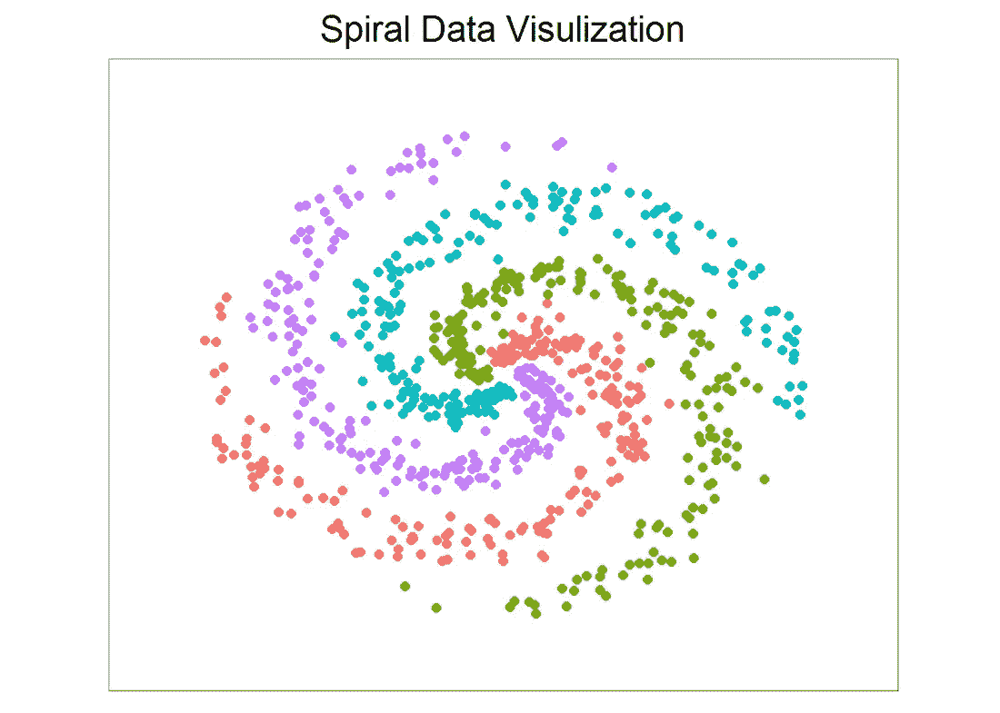
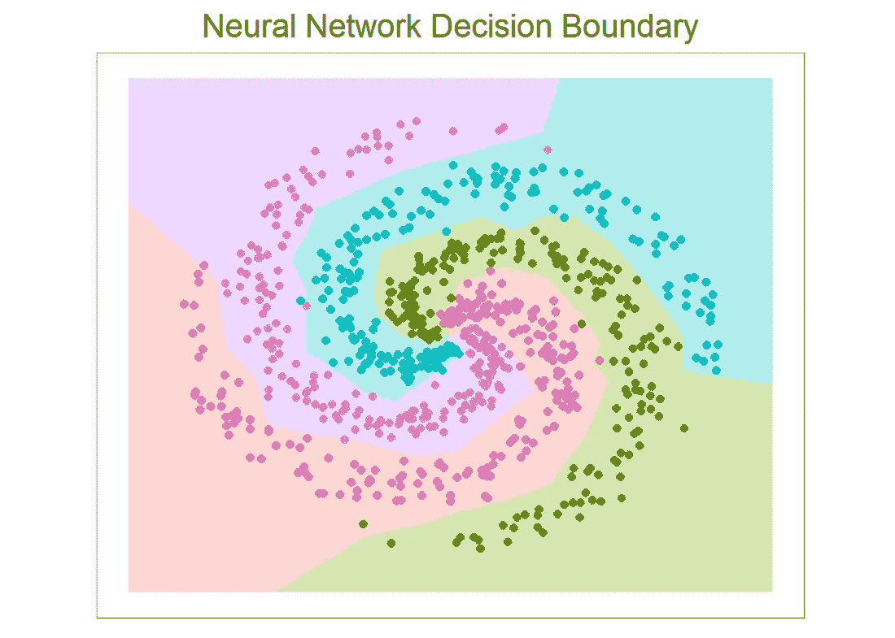
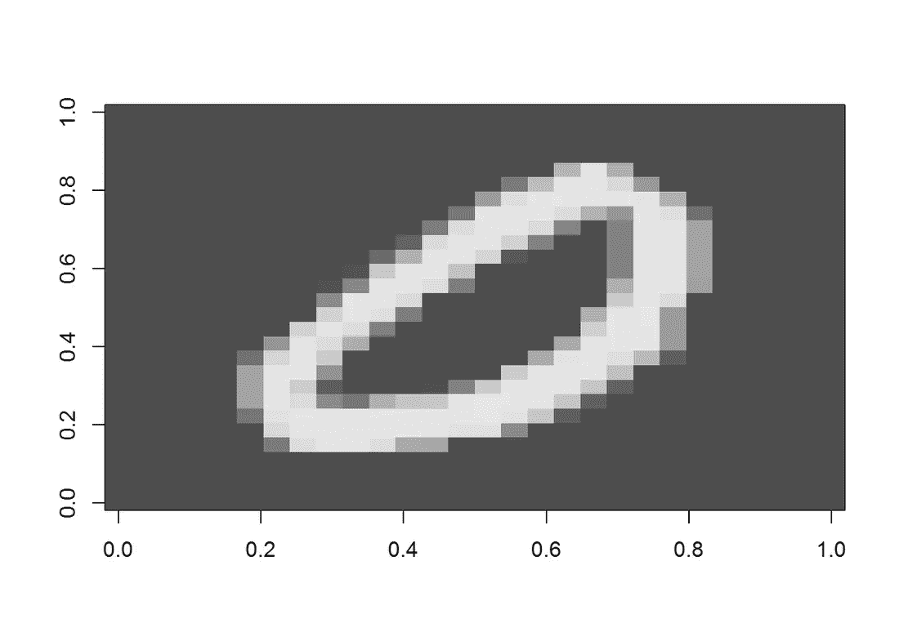
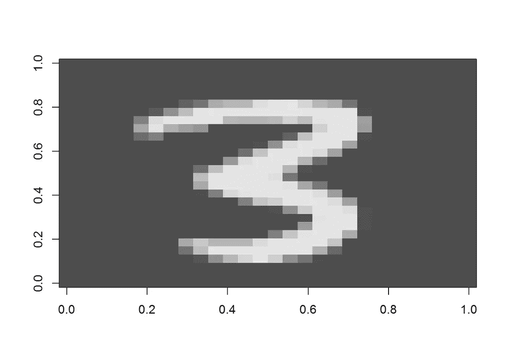

# 用 R 构建你自己的神经网络分类器

> 原文：<https://towardsdatascience.com/build-your-own-neural-network-classifier-in-r-b7f1f183261d?source=collection_archive---------4----------------------->

# 导言

图像分类是计算机视觉中的一个重要领域，不仅因为许多应用都与它相关，而且许多计算机视觉问题都可以有效地归结为图像分类。图像分类中最先进的工具是卷积神经网络(CNN)。在这篇文章中，我将写一个简单的神经网络有 2 层(完全连接)。我将首先训练它对一组 4 类 2D 数据进行分类，并可视化决策边界。第二，我准备用著名的 MNIST 数据(可以在这里下载:[https://www . ka ggle . com/c/digit-recognizer/download/train . CSV](https://www.kaggle.com/c/digit-recognizer/download/train.csv))来训练我的 NN，看看它的表现。第一部分受斯坦福提供的 CS 231n 课程启发:[http://cs231n.github.io/](http://cs231n.github.io/)，用 Python 授课。

# 数据集生成

首先，让我们创建一个螺旋数据集，每个数据集有 4 个类和 200 个示例。

`X`、`y`分别是 800×2 和 800×1 的数据帧，并且它们是以线性分类器不能将它们分开的方式创建的。由于数据是 2D，我们可以很容易地在图上看到它。它们的间距大致相等，实际上一条线并不是一个好的决策边界。

# 神经网络构建

现在，让我们构造一个两层的神经网络。但在此之前，我们需要将 X 转换成一个矩阵(用于后面的矩阵运算)。对于 Y 中的标签，创建新的矩阵 Y (800 乘 4)，使得对于每个示例(Y 中的每一行)，index==label 的条目为 1(否则为 0)。

接下来，让我们构建一个函数`nnet`，它采用两个矩阵`X`和`Y`，并返回一个包含 4 个矩阵的列表，其中有`W`、`b`和`W2`、`b2`(每层的权重和偏差)。我可以指定`step_size`(学习率)和正则化强度(`reg`，有时符号化为λ)。

激活和损失(代价)函数的选择，分别选择 ReLU 和 softmax。如果你选修了吴恩达的 ML 课程(强烈推荐)，在课程笔记和作业中会选择 sigmoid 和物流成本函数。它们看起来略有不同，但是只需修改下面的代码就可以很容易地实现。还要注意，下面的实现使用了看起来难以理解的矢量化运算。如果是这样，你可以写下每个矩阵的维数并检查乘法运算等等。通过这样做，你也知道神经网络的内部是什么。

# 预测函数和模型训练

接下来，创建一个预测函数，它将`X`(与训练`X`相同的列，但可能有不同的行)和层参数作为输入。输出是每行中最大得分的列索引。在这个例子中，输出只是每个类的标签。现在我们可以打印出训练精度。

# 判别边界

接下来，让我们绘制决策边界。我们还可以使用 caret 包，用数据训练不同的分类器，并可视化决策边界。看到不同的算法如何做决定是非常有趣的。这将是另一篇文章。

# MNIST 数据和预处理

著名的 MNIST(“修正的国家标准与技术研究所”)数据集是机器学习社区中的经典，已经被广泛研究。它是分解成 csv 文件的手写数字的集合，每行代表一个示例，列值是每个像素从 0 到 255 的灰度。首先，让我们显示一个图像。

现在，让我们通过删除接近零方差的列并按`max(X)`缩放来预处理数据。为了交叉验证，数据也被一分为二。同样，我们需要通过`K`创建一个维度为`N`的`Y`矩阵。这一次，每行中的非零索引偏移 1:标签 0 将在索引 1 处具有条目 1，标签 1 将在索引 2 处具有条目 1，依此类推。最终，我们需要将其转换回来。(另一种方法是将 0 放在索引 10 处，其余标签没有偏移量。)

# 模型训练和 CV 准确性

现在我们可以用训练集训练模型了。注意即使删除了 nzv 列，数据仍然很大，所以结果可能需要一段时间才能收敛。在这里，我只为 3500 次迭代训练模型。您可以改变迭代次数、学习率和正则化强度，并绘制最佳拟合的学习曲线。​

# 随机图像的预测

最后，我们随机选择一张图片，预测标签。​

# 结论

如今，我们很少从头开始编写自己的机器学习算法。有成吨的软件包可用，他们最有可能胜过这个。但是，通过这样做，我真的对神经网络的工作原理有了深刻的理解。在一天结束时，看到你自己的模型产生一个相当好的准确性是一个巨大的满足。