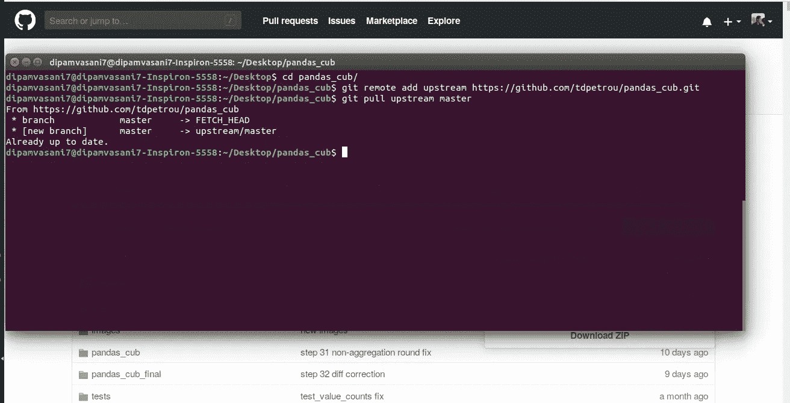
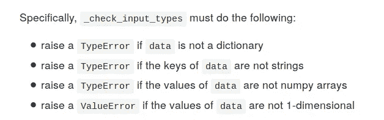

# 建立你自己的熊猫(喜欢)图书馆

> 原文：<https://towardsdatascience.com/build-your-own-pandas-like-library-7aac66c1f3d7?source=collection_archive---------25----------------------->


我主要通过泰德·彼得鲁的烹饪书了解熊猫。而现在，Ted 又想出了另一个有趣的项目: ***建造我们自己的熊猫像库*** 。它包含一系列需要完成的步骤，以便构建一个类似于熊猫的全功能库，称为 [pandas_cub](https://github.com/tdpetrou/pandas_cub) 。图书馆将拥有熊猫最有用的特征。

## 我喜欢这个项目的地方

1.  项目规模:该项目为熟悉 Python 的人提供了一个编写大代码的绝佳机会。
2.  设置环境:这个项目帮助你学习如何为你的项目创建一个独立的环境。这是使用`conda`包管理器完成的。
3.  测试驱动开发:你也学习测试驱动开发，这意味着你首先写测试，然后你写代码通过测试。在这个过程中你会学到 python 库`pytest`。

先决条件和设置可以在项目的 [Github 页面](https://github.com/tdpetrou/pandas_cub)上找到，但我仍然会提供一个快速浏览。

步骤 1: **派生存储库**


[Git](https://in.udacity.com/course/version-control-with-git--ud123) 和 [GitHub](https://in.udacity.com/course/github-collaboration--ud456) 入门课程，以防你不熟悉。

第二步:**克隆你的本地拷贝**


没错。现在，我们可以填写我们的代码，并将其推送到我们的项目副本中。但是，如果项目的创建者修改了原来的项目呢？我们希望我们的分叉版本中也有这些修改。为此，我们可以将一个名为`upstream`的遥控器添加到原始存储库中，并在我们想要同步二者时从那里添加`pull`。然而，这并不是这个项目所必需的。



第三步:**环境设置**

这意味着下载构建这个项目所需的特定库和工具集。该项目有一个名为`environment.yml`的文件，其中列出了所有这些库。一个简单的`conda env create -f environment.yml`将为我们安装它们。我已经安装好了。


我们现在可以使用`conda activate pandas_cub`和`conda deactivate`来激活和停用我们的环境。

步骤 4: **检查测试**

所有的测试都包含在位于`tests`目录下的一个名为`test_dataframe.py`的文件中。

运行所有测试:

```
$ pytest tests/test_dataframe.py
```

运行特定类别的测试:

```
$ pytest tests/test_dataframe.py::ClassName
```

运行该类的特定函数:

```
$ pytest tests/test_dataframe.py::ClassName::FuncName
```

最后，您需要确保 Jupyter 运行在正确的环境中。


第五步:`__init.py__`

一旦一切都设置好了，让我们从检查`__init.py__`开始，这是我们将在整个项目中编辑的文件。第一个任务要求我们检查用户提供的输入是否是正确的格式。



先来举个`TypeError`如果`data`不是字典的话。我们的做法如下:


为了测试这个案例，我们将打开一个新的 Jupyter 笔记本(您也可以使用现有的测试笔记本)并执行以下操作:


**注意**:确保你的笔记本上有这些神奇的代码行。它们将确保无论何时您编辑库代码，它都将反映在您的笔记本中，而无需重新启动。


现在我们传一本字典，看看有没有用。


的确如此。一旦我们编写了所有的案例，我们就可以从`test_dataframe.py`开始运行测试，看看它们是否都通过了。总的来说，这似乎是一个非常有趣的项目，并且提供了很多可以学习的东西。浏览一遍，告诉我你喜不喜欢。也告诉我你做过的其他有趣的项目。

~快乐学习。