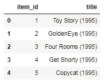

# 5 分钟内建立自己的推荐系统！

> 原文：<https://towardsdatascience.com/build-your-own-recommender-system-within-5-minutes-30dd40388fbf?source=collection_archive---------12----------------------->

## 机器学习技术在商业中最成功和最广泛的应用是推荐系统。


Photo by [Fixelgraphy](https://unsplash.com/@fixelgraphy?utm_source=medium&utm_medium=referral) on [Unsplash](https://unsplash.com?utm_source=medium&utm_medium=referral)

您正在浏览 Spotify 以收听歌曲，但无法决定是哪一首。你正在 YouTube 上浏览观看一些视频，但无法决定观看哪个视频。还有很多这样的例子，我们有丰富的数据，但我们不能决定我们想要什么。这就是推荐系统帮助我们的地方。

推荐系统在今天的市场中无处不在，并且具有巨大的商业重要性，正如大量公司销售推荐系统解决方案所证明的那样。推荐系统改变了无生命网站与用户交流的方式。推荐系统不是提供用户搜索和潜在购买产品的静态体验，而是增加交互以提供更丰富的体验。推荐系统基于过去的购买和搜索以及其他用户的行为，自主地为单个用户识别推荐。

今天，我们将通过推荐与特定项目(在本例中为电影)最相似的项目来重点介绍一个基本的推荐系统。请记住，这不是一个真正健壮的推荐系统，更准确地说，它只是告诉你哪些电影/项目与你的电影选择最相似。

我们开始吧！

# 导入库

```
**import** **numpy** **as** **np**
**import** **pandas** **as** **pd**
```

# 获取数据

您可以通过点击[这里的](https://github.com/meetnandu05/RecommenderSystem)获取数据集。名为“u.data”的数据集中的列表示用户 ID、项目 ID、评级和时间戳，如我们在下面的代码中所定义的。

```
column_names = ['user_id', 'item_id', 'rating', 'timestamp']
df = pd.read_csv('u.data', sep='**\t**', names=column_names)
df.head()
```


Our data should look something like this.

现在让我们来看看电影名称:

```
movie_titles = pd.read_csv("Movie_Id_Titles")
movie_titles.head()
```



我们可以将它们合并在一起:

```
df = pd.merge(df,movie_titles,on='item_id')
df.head()
```


# 电子设计自动化(Electronic Design Automation)

让我们稍微研究一下这些数据，看看一些评分最高的电影。

# 可视化导入

```
**import** **matplotlib.pyplot** **as** **plt**
**import** **seaborn** **as** **sns**
sns.set_style('white')
%matplotlib inline
```

让我们用平均评分和评分数创建一个评分数据框架:

```
df.groupby('title')['rating'].mean().sort_values(ascending=**False**).head()title
Marlene Dietrich: Shadow and Light (1996)     5.0
Prefontaine (1997)                            5.0
Santa with Muscles (1996)                     5.0
Star Kid (1997)                               5.0
Someone Else's America (1995)                 5.0
Name: rating, dtype: float64 df.groupby('title')['rating'].count().sort_values(ascending=**False**).head()title
Star Wars (1977)             584
Contact (1997)               509
Fargo (1996)                 508
Return of the Jedi (1983)    507
Liar Liar (1997)             485
Name: rating, dtype: int64 ratings = pd.DataFrame(df.groupby('title')['rating'].mean())
ratings.head()
```


现在设置评级列的数量:

```
ratings['num of ratings'] = pd.DataFrame(df.groupby('title')['rating'].count())
ratings.head()
```


```
sns.jointplot(x='rating',y='num of ratings',data=ratings,alpha=0.5)
```


好吧！现在我们已经对数据有了一个大致的概念，让我们继续创建一个简单的推荐系统:

# 推荐类似电影

现在让我们创建一个矩阵，在一个访问上有用户 id，在另一个轴上有电影标题。每个单元格将包含用户对该电影的评价。注意会有很多南值，因为大部分人没看过大部分电影。

```
moviemat = df.pivot_table(index='user_id',columns='title',values='rating')
moviemat.head()
```


最受欢迎电影:

```
ratings.sort_values('num of ratings',ascending=**False**).head(10)
```


我们选两部电影:《星球大战》，科幻电影。和骗子骗子，一部喜剧。现在让我们来看看这两部电影的用户评分:

```
starwars_user_ratings = moviemat['Star Wars (1977)']
liarliar_user_ratings = moviemat['Liar Liar (1997)']
starwars_user_ratings.head()user_id
0    5.0
1    5.0
2    5.0
3    NaN
4    5.0
Name: Star Wars (1977), dtype: float64
```

然后，我们可以使用 corrwith()方法来获得两个熊猫系列之间的相关性:

```
similar_to_starwars = moviemat.corrwith(starwars_user_ratings)
similar_to_liarliar = moviemat.corrwith(liarliar_user_ratings)
```

在执行这个命令时，将会发出一个类似这样的警告。

```
/Users/marci/anaconda/lib/python3.5/site-packages/numpy/lib/function_base.py:2487: RuntimeWarning: Degrees of freedom <= 0 for slice
  warnings.warn("Degrees of freedom <= 0 for slice", RuntimeWarning)
```

让我们通过删除 NaN 值并使用数据帧而不是序列来清理这个问题:

```
corr_starwars = pd.DataFrame(similar_to_starwars,columns=['Correlation'])
corr_starwars.dropna(inplace=**True**)
corr_starwars.head()
```


现在，如果我们通过相关性对数据帧进行排序，我们应该会得到最相似的电影，但是请注意，我们会得到一些没有实际意义的结果。这是因为有很多电影只有看过一次的用户也看过《星球大战》(那是最受欢迎的电影)。

```
corr_starwars.sort_values('Correlation',ascending=**False**).head(10)
```


让我们通过过滤掉少于 100 条评论的电影来解决这个问题(这个值是根据前面的直方图选择的)。

```
corr_starwars = corr_starwars.join(ratings['num of ratings'])
corr_starwars.head()
```


现在对值进行排序，注意标题变得更有意义:

```
corr_starwars[corr_starwars['num of ratings']>100].sort_values('Correlation',ascending=**False**).head()
```


喜剧骗子骗子也一样:

```
corr_liarliar = pd.DataFrame(similar_to_liarliar,columns=['Correlation'])
corr_liarliar.dropna(inplace=**True**)
corr_liarliar = corr_liarliar.join(ratings['num of ratings'])
corr_liarliar[corr_liarliar['num of ratings']>100].sort_values('Correlation',ascending=**False**).head()
```


# 干得好！

你不需要通过市场调查来确定一个顾客是否愿意在一个能最大限度帮助他们找到合适产品的商店购买。他们将来也更有可能回到这样的商店。为了了解推荐系统的商业价值:几个月前，网飞估计其推荐引擎每年价值 10 亿美元。

有更先进和非传统的方法来驱动你的推荐过程。这些技术即深度学习、社会学习和张量分解是基于机器学习和神经网络的。[这样的认知计算方法](https://www.marutitech.com/cognitive-computing-features-scope/)可以让你的推荐者的质量更上一层楼。可以肯定地说，产品推荐引擎将随着机器学习的使用而改进。并创建一个更好的客户满意度和保留流程。

最后，我要感谢我的教授——[何塞·马西亚尔·波尔蒂利亚](https://www.linkedin.com/in/jmportilla/)，他在 Udemy 上的课程“Python 用于数据科学和机器学习训练营”让我很容易理解所有这些概念。