# 在几分钟内构建您自己的强大深度学习环境

> 原文：<https://towardsdatascience.com/build-your-own-robust-deep-learning-environment-in-minutes-354cf140a5a6?source=collection_archive---------8----------------------->

## 深度学习环境配置的不太理想方面指南

Photo by [Kyle Hanson](https://unsplash.com/photos/1pyqUh8Jx3E?utm_source=unsplash&utm_medium=referral&utm_content=creditCopyText) on [Unsplash](https://unsplash.com/search/photos/person-with-computer?utm_source=unsplash&utm_medium=referral&utm_content=creditCopyText)

# 介绍

多亏了更便宜、更大的存储，我们拥有了比几年前更多的数据。无论大数据制造了多少宣传，我们都应该感谢它。然而，这里真正的 MVP 是更快更好的计算，这使得 20 世纪 80 年代和 90 年代的论文更加相关([*lstm 实际上是在 1997 年*](https://www.bioinf.jku.at/publications/older/2604.pdf) )发明的！由于更好更快的 CPU 和 GPU，我们终于能够利用神经网络和深度学习的真正力量。不管我们喜欢与否，传统的统计和机器学习模型在处理高维、非结构化数据、更复杂和大量数据的问题时有严重的局限性。

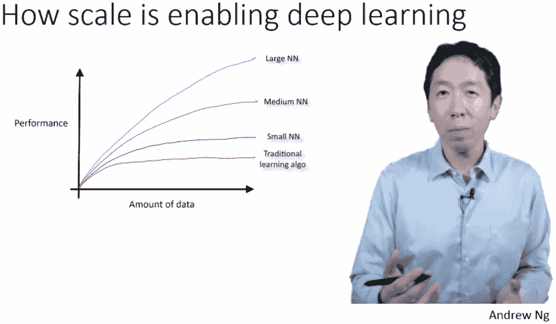

Source: [https://twitter.com/andrewyng/status/700086119333892096](https://twitter.com/andrewyng/status/700086119333892096)

深度学习已经开始在这些领域大放异彩，我们已经慢慢地看到它在整个行业中被大规模应用于几个现实世界的问题。著名的人工智能传奇人物吴恩达几年前也提到过同样的问题！

***深度学习*** 的好处是，在构建解决方案时，我们有更好的计算、更多的数据和各种易于使用的开源框架，如`**keras**`、`**tensorflow**`和`**pytorch**`可供选择。

***关于深度学习不好的部分？*** 从零开始建立自己的深度学习环境可能是一个巨大的痛苦，尤其是如果你迫不及待地开始编码和实现自己的深度学习模型。

经历了几次这个痛苦的过程，也在我的旅程中发现了易于使用的服务，本指南旨在让你轻松地完成建立自己的深度学习环境的不太理想的方面，以便你可以更快地建立你的深度学习模型和解决问题。我们将在本指南中涵盖以下方面。

*   **最小配置的基于云的深度学习环境**
*   **设置你自己的基于云的深度学习环境**
*   **内部设置提示**

事不宜迟，让我们开始吧！

# **最小配置的基于云的深度学习环境**

如果你真的想在不投资专用硬件的情况下开始建立深度学习模型，或者你想跳过所有那些讨厌的配置和设置命令，有几个选项只适合你！使用预先配置的基于云的深度学习环境是最好的。通常，有几个基于云的深度学习服务提供商。以下选项使您能够立即开始工作，只需最少的设置和配置。请注意，这不是我的全面列表，而是我已经试验过或从深度学习实践者那里听到的选项。

*   [**谷歌合作实验室**](https://colab.research.google.com)
*   [**纸空间渐变**](https://www.paperspace.com/gradient)
*   [**FloydHub 工作区**](https://www.floydhub.com/product/build)
*   [**Lambda GPU 云**](https://lambdalabs.com/service/gpu-cloud)
*   [AWS 深度学习 AMIs](https://aws.amazon.com/machine-learning/amis/)
*   [**GCP 深度学习 VM 图片**](https://cloud.google.com/deep-learning-vm)

我们将介绍这些提供商的基本知识，以便您有足够的知识开始使用它们。除此之外，我们鼓励你走出去，进一步探索它们的细节，并根据你的喜好选择一个！

## [谷歌联合实验室](https://colab.research.google.com)

也许是谷歌最好的(仍然)免费的选项之一，它让你能够在 GPU 甚至 TPU 支持的深度学习环境中运行交互式 Jupyter 笔记本。谷歌一直在各个领域积极使用和推广其应用，包括其广受欢迎的机器学习速成班。简而言之，Colaboratory 是一个免费的 Jupyter 笔记本环境，不需要任何设置，甚至可以免费使用 GPU 来运行深度学习模型。更多细节可以在[这篇文章](https://medium.com/tensorflow/colab-an-easy-way-to-learn-and-use-tensorflow-d74d1686e309)中找到。

默认情况下，您会获得一个 CPU 支持的深度学习环境，其中预安装了所有库，您可以使用以下代码验证这一点。

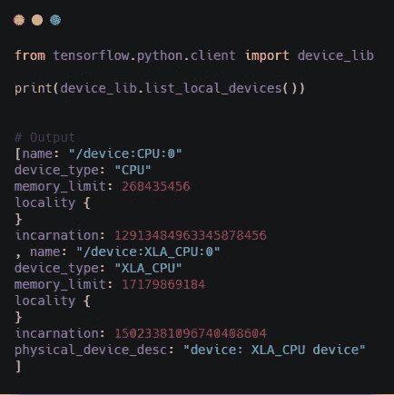

现在，对于工作负载和数据较小的相对简单的模型，使用 CPU 是很好的，但对于更复杂的问题，您肯定需要利用 GPU。将 Google Colab 中的运行时改为使用 GPU 只需要几秒钟，如下图所示。

Google Colab 然后为您分配一个新的支持 GPU 的深度学习后端，您可以使用以下代码查看 GPU 类型。

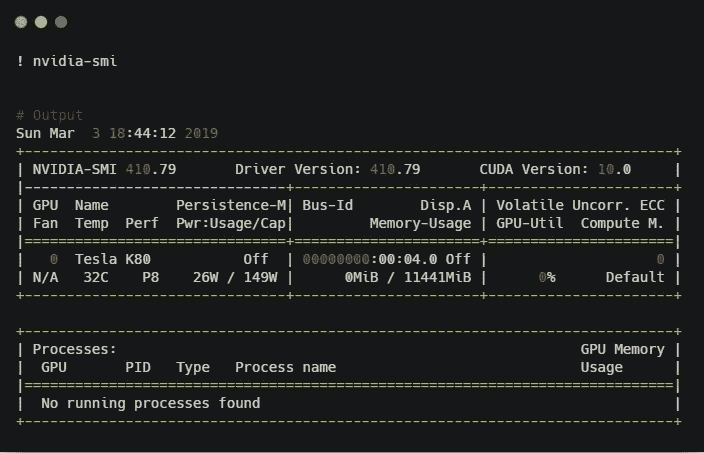

看起来你免费得到了一个 12 GB 内存的 Tesla K80 GPU！这就是 AWS `**p2.xlarge**`实例给你的惊人的 **0.9 美元一小时**。相当整洁！最后，您可以使用以下代码来确认您的深度学习库正在使用 GPU。

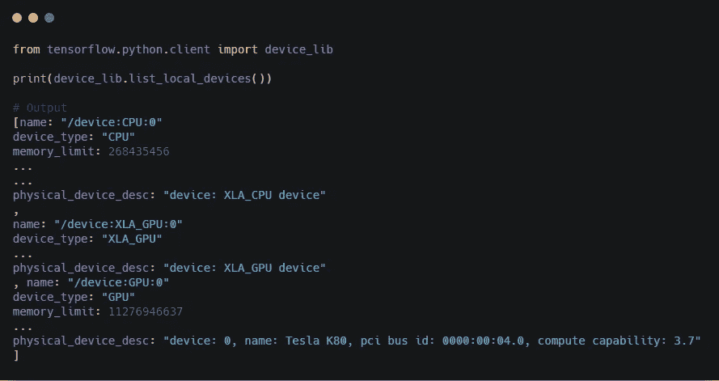

这应该可以让你在 Google Colab 上尝试自己的深度学习模型。当您使用 colab 时，请随意利用[***my Colab notebook***](https://colab.research.google.com/drive/1zSI8QrODgmbgwDflHr1pr4aMzeGMXsjF)来测试支持 CPU 和 GPU 的深度学习环境！

 [## 谷歌联合实验室

### 测试 CPU 和 GPU 支持的环境

colab.research.google.com](https://colab.research.google.com/drive/1zSI8QrODgmbgwDflHr1pr4aMzeGMXsjF) 

## [纸张空间渐变](https://www.paperspace.com/gradient)

Gradient 是 Paperspace 提供的产品，paper space 是一家专注于机器学习和数据科学的轻松基础设施的公司。它为开发人员提供了一整套工具，用于探索数据、训练深度学习模型和在 GPU 上运行计算作业。Gradient 包括一键式 jupyter 笔记本电脑，由 Paperspace GPU 云的全部功能提供支持。这个[介绍视频](https://www.youtube.com/watch?v=bK6DLlYjY7E)更详细地谈到了它。以下是他们的一些基本计划(进一步的细节可以在[这里](https://www.paperspace.com/pricing)找到)。

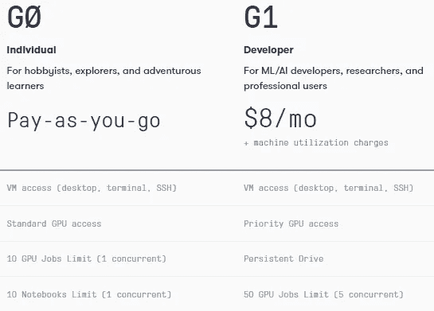

你确实需要按小时支付 GPU 的使用费用，但价格与其他服务提供商相比非常有竞争力，Quadro P4000 每小时 0.5 美元，Tesla K80 每小时约 0.59 美元，仍然比 AWS 上的类似选项相对便宜。

## [FloydHub 工作空间](https://www.floydhub.com/product/build)

FloydHub 提供的一个有趣的产品是 FloydHub Workspace，它旨在通过在云上为深度学习提供一个完全配置的开发环境，来减少设置自己的深度学习环境的麻烦。最精彩的部分？虽然它不是免费的，但你可以无缝地从 CPU 切换到 GPU 后端，只需按每秒使用量付费！

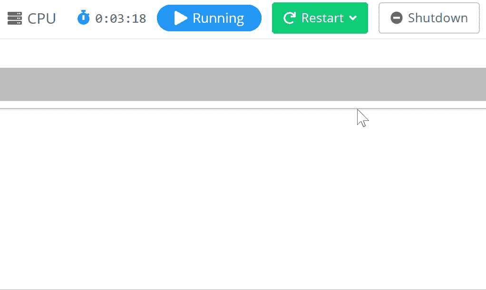

考虑到你可以以 12 美元的最便宜价格获得一个拥有 12 GB 内存、61 GB 内存和 200 GB 固态硬盘的特斯拉 K80 专用实例，它们的价格也很不错。

## [Lambda GPU 云](https://lambdalabs.com/service/gpu-cloud)

Lambda Labs 或 Lambda 是一家人工智能基础设施公司，提供计算来加速人类的进步。他们专注于深度学习工作站，最近推出了 Lambda GPU Cloud，目前仍处于封闭测试阶段。每个 Lambda GPU 云实例有 4 个 GPU，比 AWS 的 p2.8xlarge 实例快 2 倍。他们声称您可以简单地按下按钮，立即获得对 4-GPU 实例的 SSH 远程访问。然而，定价是每小时每 GPU 0.9 美元。可以在这里 报名私测 [***。***](https://docs.google.com/forms/d/e/1FAIpQLSe0L0DmK_HcayePProi5-0ZZoZ3fdk7OIvqDMKSiFZk1hnqdQ/viewform)

## [AWS 深度学习 AMIs](https://aws.amazon.com/machine-learning/amis/)

亚马逊网络服务(AWS)是亚马逊的子公司，提供基于付费订阅的按需云计算平台。最近，他们推出了深度学习 ami，这是亚马逊机器映像(AMIs)，专用于 GPU 密集型工作负载，用于建立深度学习模型。AWS 深度学习 ami 为我们提供了必要的基础设施和预配置的工具和框架，以大规模加速云中的深度学习。它预先配置了所有最新和最好的深度学习框架。

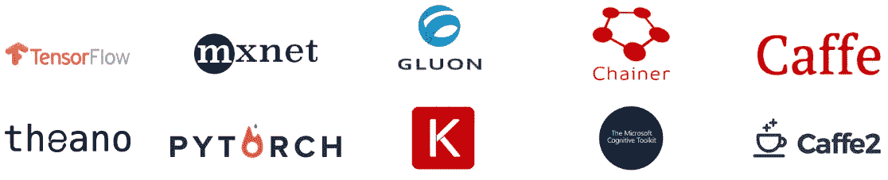

你可以得到 Conda AMI，它为每个深度学习框架提供了单独的虚拟环境，或者是用于配置和使用定制构建的基本 AMI。

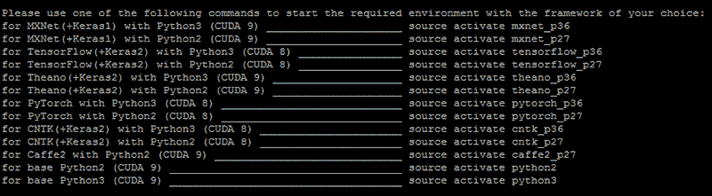

Virtual Environments in the Conda AMIs

随意查看深度学习 AMI 指南 [***这里***](https://aws.amazon.com/machine-learning/amis) 还有如何开始使用 Conda 和 Base AMI[***这里***](https://aws.amazon.com/blogs/machine-learning/getting-started-with-the-aws-deep-learning-conda-and-base-amis/) 。当您选择自己的 AWS 实例时要小心，因为您是按小时收费的。最便宜的选择是给你 12 GB 的 GPU，每小时 0.9 美元(T21)。

## [GCP 深度学习虚拟机图片](https://cloud.google.com/deep-learning-vm)

GCP 也称为谷歌云平台，为我们提供了一套云计算服务，包括运行深度学习模型和工作负载的基础设施。最棒的是，它运行在谷歌内部用于终端用户产品的同一基础设施上。如果你注册的话，GCP 还会在第一年提供价值 300 美元的免费积分，这很酷！

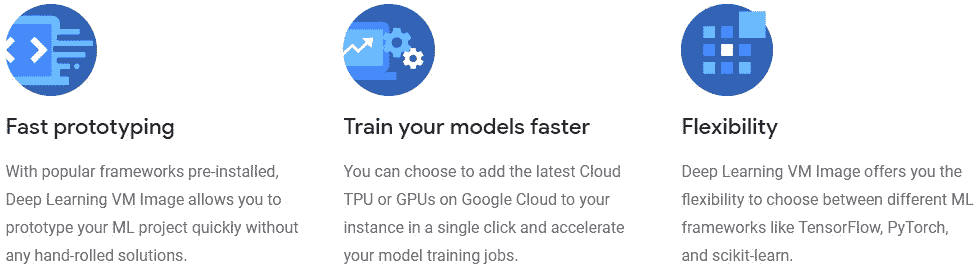

谷歌云深度学习虚拟机映像使开发人员能够在谷歌计算引擎实例上实例化包含流行的深度学习和机器学习框架的虚拟机映像。您可以启动预先安装了流行的 ML 框架(如 TensorFlow、PyTorch 或 scikit-learn)的计算引擎实例。你可以在这里 查看进一步详情 [***。最棒的是，您还可以通过单击添加云 TPU 和 GPU 支持。价格非常有竞争力，比 AWS 便宜得多。GCP 虚拟机让你以每小时仅 **0.45 美元**的价格访问 12 GB Tesla K80 GPU！查看定价板***](https://cloud.google.com/deep-learning-vm/) ***[***点击***](https://cloud.google.com/compute/pricing#gpus) 了解更多信息。***

这些选项应该让您对潜在选项有一个好的想法，以最少的配置和设置启动您的深度学习之旅。

# 设置您自己的基于云的深度学习环境

虽然云上的预配置设置非常好用，但有时您希望构建自己定制的基于云或内部的深度学习环境。在这一部分，我们将看看如何利用任何流行的云平台服务提供商，在云中构建一个健壮的深度学习环境。涉及的主要步骤如下:

*   **选择云提供商**
*   **创建您的虚拟服务器**
*   **配置您的虚拟服务器**
*   **设置你的深度学习环境**
*   **访问您的深度学习环境**
*   **验证 GPU 启用**

现在，让我们详细了解一下如何设置基于云的深度学习环境。

## 选择云提供商

如今，有多家价格合理且具有竞争力的云提供商。在前一节中，我们已经看到了其中的一些。我们希望利用平台即服务(PaaS)功能，我们只需管理我们的数据、应用和基本配置，但使用 GPU 计算进行深度学习。下图显示了深度学习实践者利用的一些流行的云提供商。

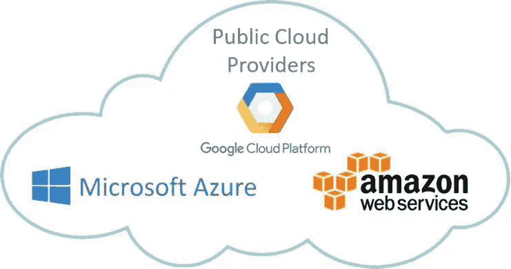

Cloud Providers having Deep Learning Instances

受欢迎的供应商包括亚马逊的 AWS、微软的 Azure 和谷歌的谷歌云平台(GCP)。

## 创建虚拟服务器

选择云服务提供商后的下一步是创建虚拟机实例，这基本上是一个托管代码、数据和配置设置的服务器。创建虚拟机的步骤取决于您的云提供商的选择。以下分步教程深入指导您在 AWS 和 GCP 中创建和设置自己的实例。

*   [**用 AWS 深度学习 AMI**](https://aws.amazon.com/blogs/machine-learning/get-started-with-deep-learning-using-the-aws-deep-learning-ami/) 创建并设置云实例
*   [**使用 GCP 市场**](https://cloud.google.com/deep-learning-vm/docs/quickstart-marketplace#before-you-begin) 创建并设置云实例

我在我的书《第二章中的 [*【用 Python 进行实际迁移学习】*](https://github.com/dipanjanS/hands-on-transfer-learning-with-python) 中确实涵盖了在 AWS 上创建和实例化你自己的 VM 的逐步指南。整个代码库都是开源的，如果你感兴趣的话，进一步的细节在本书的 [***GitHub 资源库***](https://github.com/dipanjanS/hands-on-transfer-learning-with-python) 中。

## 配置您的虚拟服务器

一旦创建了实例，就可以从云提供商的平台上启动实例。通常是 AWS 中的 EC2 用户界面或 GCP 中的 VM 实例页面。现在，通常您需要一个私钥来从本地终端使用 SSH 登录到您的服务器。通常 AWS 允许你在创建 VM 的最后一步设置你自己的密钥，并给你一个可下载的私有密钥。GCP 允许您通过 SSH 使用 GCP 实例页面直接登录到您的系统。然后，如果需要的话，你可以按照这个指南来创建你自己的 SSH 密钥，如果你没有的话。

请记住将您的私有 SSH 密钥保存在一个安全的地方，并从终端使用以下命令登录到您的服务器。

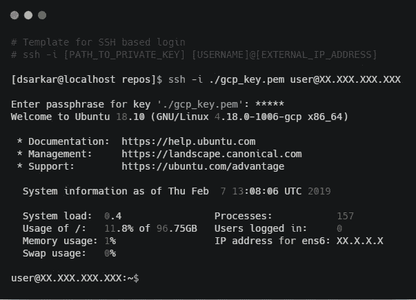

恭喜你！您现在已成功登录到深度学习服务器。我们深度学习设置的其余方面将在假设您在 Linux 服务器上的情况下进行。我们的 Linux 发行版是 Ubuntu 18.10 。您可以根据自己的喜好自由选择自己的操作系统！

由于我们将广泛使用 Jupyter 笔记本电脑进行原型制作和开发，因此为笔记本电脑服务器设置密码通常会有所帮助，这样即使陌生人以某种方式获得了您的公共 IP 地址，也无法使用它。如果您不想设置密码，可以跳过本节中的密码设置步骤。这里的第一件事是使用 Open SSL 创建一个新的 SSL 证书。

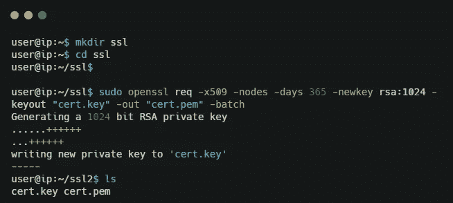

如果系统中没有安装 python，我们建议使用 Anaconda 发行版，它有一个很好的包管理系统，并附带了一套预安装的库。我们推荐下面的 [***官方指南***](https://docs.anaconda.com/anaconda/install/linux/) 来安装 Anaconda python 发行版。

下一步是为我们的 Jupyter 笔记本服务器生成一个配置文件，以防它不存在。通常该文件位于您的主目录中的`**~/.jupyter/jupyter_notebook_config.py**` 处，如果它不存在，您可以使用以下命令创建它。

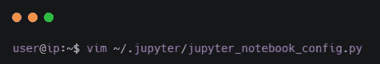

要为笔记本电脑启用基于密码的安全性，我们需要首先生成一个密码及其哈希。我们可以如下利用`**Ipython.lib**`中的`**passwd()**`函数:

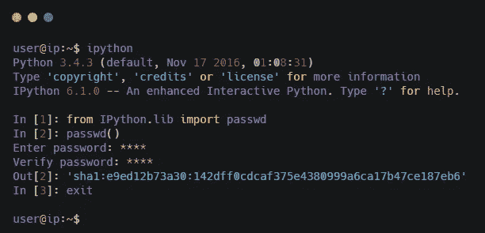

一旦您输入了密码并验证了密码，该函数将返回一个哈希，这是您的密码的哈希(在这种情况下，我键入的密码键实际上是单词 *password* ，这是您绝对不应该使用的！).复制并保存哈希值，因为我们很快就会用到它。接下来，启动您最喜欢的文本编辑器来编辑 Jupyter 配置文件，如下所示:

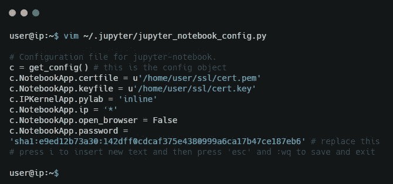

我们现在准备设置我们的深度学习环境。

## 设置您的深度学习环境

我们现在将开始设置我们的深度学习环境所需的必要配置，以开始使用 GPU。如果已经为您的实例配置了 CUDA 和 cuDNN，您可以根据需要跳过下面的一些步骤。

**1。安装图形驱动程序**

这里的第一步是确保为您的 GPU 安装了图形驱动程序。接下来，我们假设您使用的是 NVIDIA GPU。测试是否安装了驱动程序的最佳方法是从终端运行`**nvidia-smi**` 命令。现在，如果这个命令不起作用，我们需要安装 GPU 驱动程序。

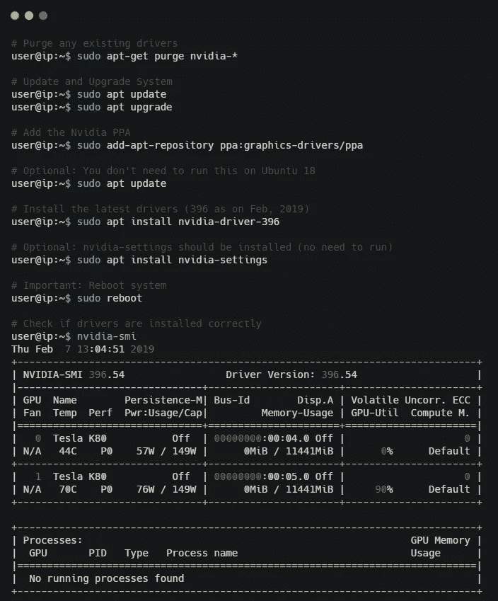

**2。安装 CUDA**

NVIDIA CUDA Toolkit 基本上是一个开发环境，用于创建可以最大限度地利用 NVIDIA GPUs 的应用程序和程序。GPU 加速的 CUDA 库支持跨多个领域的嵌入式加速，包括线性代数、图像和视频处理、深度学习和图形分析。假设我们使用的是基于 Ubuntu 的系统，你可以去[**NVIDIA CUDA 官方页面**](https://developer.nvidia.com/cuda-downloads?target_os=Linux&target_arch=x86_64&target_distro=Ubuntu) 下载必要的安装文件。在撰写本文时，CUDA 10 已经发布，但仍然相当新。因此我们将使用传统的 CUDA 9.0 版本，你可以从 [**传统发布页面**](https://developer.nvidia.com/cuda-toolkit-archive) 获得。如果您在服务器上，最好使用终端直接下载安装文件，并使用以下命令配置 CUDA。

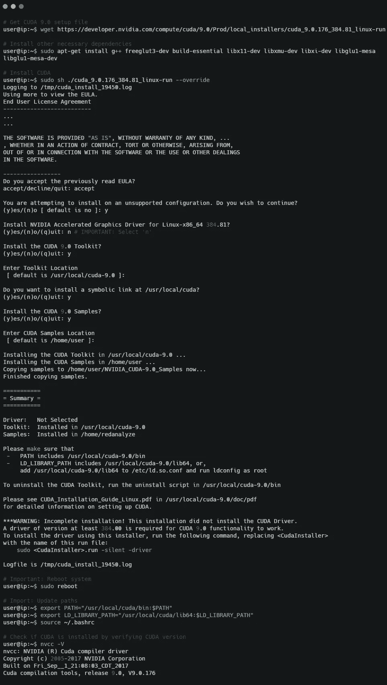

**3。安装 cuDNN**

NVIDIA CUDA 深度神经网络库(cuDNN)是用于[深度神经网络](https://developer.nvidia.com/deep-learning)的 GPU 加速原语库。cuDNN 库为神经网络中的标准例程提供了高度优化的实现，包括前向和后向卷积、池化、规范化和激活层。深度学习实践者可以依赖 cuDNN，它可以在 GPU 上加速广泛使用的深度学习框架。你可以从 [**官方页面**](https://developer.nvidia.com/cudnn) 下载 cuDNN，但是你需要为此注册一个 NVIDIA 账户！您将获得 cuDNN 的下载链接，然后您可以在终端中使用该链接直接下载到服务器中。

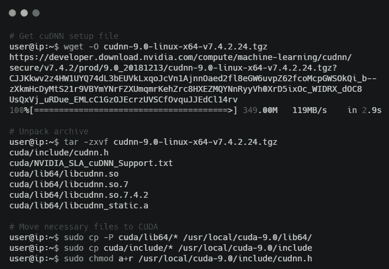

通常，这照顾到我们的 GPU 设置的大多数必要的依赖关系。

**4。安装深度学习框架**

现在，我们需要安装和设置我们的 Python 深度学习框架，以防它们没有安装。我们通常使用大量的 keras 和 tensorflow，下面的命令可以帮助我们在我们的环境中安装它们。

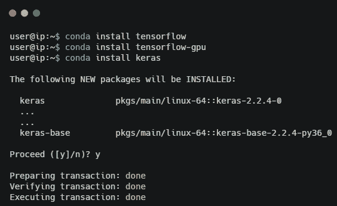

## 访问您的深度学习云环境

我们真的不想一直坐在服务器上的终端中编码。由于我们希望利用 Jupyter 笔记本进行交互式开发，我们将从本地系统访问云服务器上的笔记本。为此，我们首先需要在远程实例上启动 Jupyter 笔记本服务器。

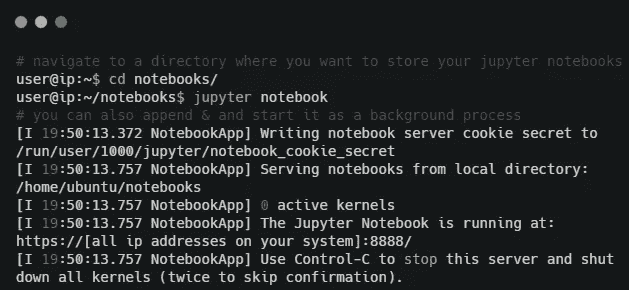

现在，如果您有一个分配给实例的公共 IP，并且端口`**8888**`是公开的，那么您可以直接键入`**http://<IP_Address>:8888**`并开始从您的本地浏览器访问您的云 VM 中的 Jupyter 服务器！

另一个选项，特别是对于 AWS 实例，是在本地实例上启用端口转发，以便从本地机器的浏览器访问我们的云服务器笔记本。这也称为 SSH 隧道。

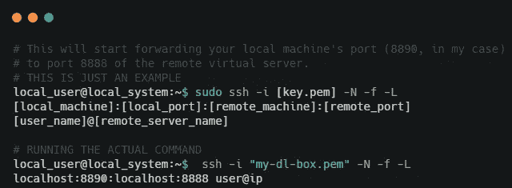

在端口转发的情况下，转到您的本地浏览器并导航到本地主机地址，例如 [https://localhost:8890，](https://localhost:8890,)，我们将它转发到我们虚拟服务器中的远程笔记本服务器。确保你在地址中使用了`**https**`，否则你会得到一个 SSL 错误。

## 验证 GPU 启用

最后一步是确保一切都在工作，并且我们的深度学习框架正在利用我们的 GPU(我们通常按小时付费！).下面的代码应该可以帮助我们验证这一点。

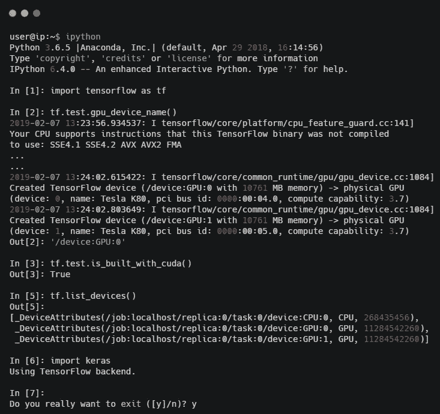

看起来我们的深度学习设置被配置为使用 GPU 进行深度学习，我们已经准备好了！

# **内部设置提示**

通常，用户或组织可能不想利用云服务，尤其是如果他们的数据是敏感的，因此他们专注于构建内部深度学习环境。这里的主要重点应该是投资正确类型的硬件和软件，以实现最高性能，并利用正确的 GPU 来构建深度学习模型。关于硬件，特别强调以下几点:

*   **处理器:**你可以购买 i5 或 i7 英特尔 CPU，或者如果你想宠坏自己，也可以购买英特尔至强处理器！
*   **RAM:** 为你的内存投资至少 32 GB 的 DDR4\DDR5 或者更好的 RAM。
*   **磁盘:**1tb 的硬盘很不错，而且你还可以投资最少 128 GB 或 256 GB 的固态硬盘来实现快速数据访问！
*   **GPU:** 可能是深度学习最重要的组件。购买一个 NVIDIA GPU，任何高于 GTX 1070 的最低 8 GB。

你不应该忽视的其他东西包括主板、电源、坚固的外壳和冷却器。一旦你设置好你的装备，对于软件配置，你可以重复上一节的所有步骤，不包括云设置，你应该准备好了！

# 结论

这份详细的实践指南旨在让开发者、工程师和深度学习实践者在几分钟内从零到深度学习。我希望这个指南能帮助你建立自己的深度学习，而不是最终花几个小时打破你的脑袋阅读论坛上的无数帖子和[栈溢出](https://stackoverflow.com/)来建立自己的深度学习环境。现在出去开始*‘深度学习’*！

我利用数据科学、人工智能、机器学习和深度学习来解决现实世界的问题。我也在业余时间做一些咨询、研究和指导。如果您需要集中咨询、培训课程，希望我在活动中发言，或者如果您想发表一篇关于[***【TDS】***](https://towardsdatascience.com/)*的文章，请随时通过[**LinkedIn**](https://www.linkedin.com/in/dipanzan/)**联系我。***

* [## Dipanjan Sarkar -数据科学家-红帽| LinkedIn

### 查看 Dipanjan Sarkar 在世界最大的职业社区 LinkedIn 上的个人资料。Dipanjan 有 9 份工作列在…

www.linkedin.com](https://www.linkedin.com/in/dipanzan/)*