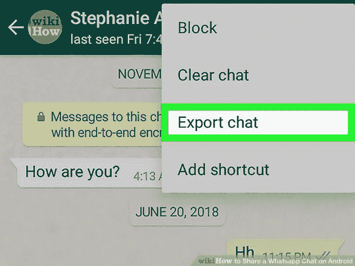

# 构建自己的 Whatsapp 聊天分析器

> 原文：<https://towardsdatascience.com/build-your-own-whatsapp-chat-analyzer-9590acca9014?source=collection_archive---------1----------------------->

最近，在完成了 Udacity 课程中的一些项目后，我开始寻找新的、熟悉的数据进行分析，还有什么地方比自己的手机更好呢？

Whatsapp 声称每天发送近 550 亿条信息。普通用户每周在 Whatsapp 上花费 195 分钟，并且是许多团体的成员。


有了这个就在我们眼皮底下的数据宝库，我们就必须着手一项任务，深入了解我们的手机被迫见证的信息。本文旨在逐步指导您构建自己的 whatsapp 对话分析器，分为以下 3 个主题:

*   数据收集
*   数据准备
*   数据探索

# 先决条件

在您开始之前，确保您的 Python 环境中安装了以下包*(我推荐使用 Jupyter，因为您可以在遵循本教程中的步骤时很容易地看到中间输出)*:

*   熊猫
*   海生的
*   Matplotlib
*   Jupyter(可选但有用，因为你可以在遵循本教程中的步骤时很容易地看到中间输出)或者如果你像我一样懒，不想安装这些包中的任何一个，只需前往谷歌协作实验室(【https://colab.research.google.com】T2)，这是一个免费的 Jupyter 笔记本环境，预装了所有东西，并立即开始！

# 数据收集

首先，我们需要一个 whatsapp 对话来分析。打开您希望分析的 whatsapp 对话*(最好是群聊，因为它们往往比较大)*，使用“导出聊天”功能将整个对话以文本格式发送到您的电子邮件 ID。

**重要提示**:当 whatsapp 提示时，确保不要导出任何媒体，否则可能需要很长时间才能导出。



从您的电子邮件收件箱下载导出的聊天内容。它应该如下所示:

```
18/06/17, 22:45 - Messages to this group are now secured with end-to-end encryption. Tap for more info.
25/09/16, 21:50 - Nick Fury created group "Avengers"
18/06/17, 22:45 - Nick Fury added you
18/06/17, 22:45 - Nick Fury added Hulk
18/06/17, 22:45 - Nick Fury added Thor
18/06/17, 22:45 - Nick Fury added Tony Stark
18/06/17, 22:29 - Tony Stark: Here are the details for tomorrow's picnic:The park is located at 123 Main Street. Bring your own snacks, we will also be grilling. It is going to be very warm so dress appropriately. We should be getting there at noon. See you then and don't forget the sunscreen.
18/06/17, 22:46 - Hulk: HULK NO CARE
18/06/17, 22:46 - Hulk: HULK NO FRIEND HERE
18/06/17, 22:46 - Hulk: HULK HATE LOKI
18/06/17, 22:46 - Hulk: GFCHGK
18/06/17, 22:47 - Thor: Stop pressing every button in there
18/06/17, 22:47 - Loki: Why do you have 2 numbers, Banner?
18/06/17, 22:48 - Hulk: HULK FIRST SMASH YOU THEN TELL YOU
```

# 数据准备


[Background photo created by freepik — www.freepik.com](https://www.freepik.com/free-photos-vectors/background)

就像生蔬菜必须用各种香料烹饪和点缀才能使它们对人类可口一样，这个纯文本文件也必须以有意义的方式进行解析和标记，以便在熊猫数据帧中提供(存储):


让我们只考虑文本中的一行(我们称之为*“raw text”*)，看看我们如何从中提取相关的列:

```
18/06/17, 22:47 - Loki: Why do you have 2 numbers, Banner?
```

此后，每当我希望把你的注意力吸引到字符串 *s* 中的不同记号时，我会向你展示两行。

*   第一行将显示{花括号}中的标记名以及它们在 *s* 中的相对位置。
*   第二行将是字符串 *s* ,它被修改以指示对应于每个标记的实际值，用花括号括起来。

例如，如果字符串 *s* 是“单词 1，随机单词单词 2:”，那么我将提供以下定义:

```
{Token 1}, random word {Token 2} {Token 3}
{Word 1}, random word {Word 2} {:)}
```

由此，您将能够推断出令牌 1 的值是“单词 1”，令牌 2 的值是“单词 2”，令牌 3 的值是“:)”。

在我们的示例文本行中，我们的主要目标是将原始消息自动分解成 4 个令牌，我们将在下一节中了解如何完成这项任务:

```
{Date}, {Time} - {Author}: {Message}
{18/06/17}, {22:47} - {Loki}: {Why do you have 2 numbers, Banner?}
```

## 步骤 1:检测{Date}和{Time}令牌

首先，为了检测一行文本是新消息还是属于多行消息，我们必须检查该行是否以日期和时间开始，为此我们需要一点正则表达式 *(regex)* 匹配*(不要担心——一旦你把它分解，就没那么令人困惑了，特别是用一些我马上会展示给你的漂亮工具)。*让我们定义一个名为 *startsWithDateTime* 的新方法:

下图显示了正则表达式匹配如何检测邮件中的日期和时间:


下图简要概述了在示例文本文件中检测到的所有消息:


我不会深究正则表达式实际上是如何工作的细节，但如果你感兴趣，你可以通过访问[https://regex101.com/](https://regex101.com/)和[https://medium . com/tech-taja wal/regular-expressions-the-last-guide-6800283 AC 034](https://medium.com/tech-tajawal/regular-expressions-the-last-guide-6800283ac034)找到关于这种匹配是如何完成的更多解释。

回到我们的示例行，在我们运行 *startsWithDateTime* 方法之前，**在我们的原始示例消息中没有检测到令牌**:

```
{Raw Message}
{18/06/17, 22:47 - Loki: Why do you have 2 numbers, Banner?}
```

在我们运行了 *startsWithDateTime* 方法之后，在我们处理的示例消息中检测到了**2**令牌:

```
{Date}, {Time} -Message
{18/06/17}, {22:47} - Loki: Why do you have 2 numbers, Banner?
```

## 步骤 2:检测{Author}令牌

现在我们已经确定了包含带有日期和时间组件的新消息的行，让我们移动到消息的下一部分*(hypen 之后的所有内容):*

```
Loki: Why do you have 2 numbers, Banner?
```

同样，我们将需要更多的正则表达式匹配。我们的目标是找出这条信息的作者。虽然根据您在手机联系人应用程序中保存朋友姓名的方式，可能有多种模式，但我确定的最常用模式如下*(您可以随意添加或删除您认为合适的任何规则)*:

记住这些规则，现在让我们定义一个名为 *startsWithAuthor* 的方法，该方法查找至少与上述规则之一匹配的字符串:

下图显示了正则表达式匹配如何检测邮件中的作者:


下图简要概述了示例文本文件中检测到的所有作者:


你可以通过访问[https://regex101.com/](https://regex101.com/)找到更多关于如何匹配的解释

在我们运行 *startsWithAuthor* 方法之前，已经在我们处理的示例消息中检测到了**2**令牌 s:

```
{Date}, {Time} -Message
{18/06/17}, {22:47} - {Loki: Why do you have 2 numbers, Banner?}
```

在我们运行了 *startsWithAuthor* 方法之后，在我们处理过的示例消息中检测到了 **4 个令牌**。

```
{Date}, {Time} - {Author}: {Message}
{18/06/17}, {22:47} - {Loki}: {Why do you have 2 numbers, Banner?}
```

**注意:**您可能想知道*消息*令牌是如何凭空出现的。好了，一旦我们检测到了日期、*时间*和*作者*标记，我们剩下的就是字符串的剩余部分，也就是事实上的*消息*标记

## 步骤 3:提取和组合令牌

既然我们已经能够识别单个消息中的*日期*、*时间*、*作者*和*消息*标记，那么是时候根据分隔符标记(如*逗号*(，)、*连字符* (-)、*冒号*(:)和*空格*())来拆分每一行了，以便可以这一次，让我颠倒一下，突出显示分隔符标记，而不是日期、*时间*、*作者*和*消息*标记:

```
Date{Comma }Time{ Hyphen }Author{Colon }Message
18/06/17{, }22:47{ - }Loki{: }Why do you have 2 numbers, Banner?
```

让我们定义一个名为 *getDataPoint* 的新方法，用于根据分隔符标记分割字符串以提取感兴趣的标记:

示例输出值显示在每行旁边的注释(#)中。

**注:**计算*作者令牌*的值何时可以为 **None** 留给读者作为练习。

## 步骤 4:解析整个文件并处理多行消息

我们已经到了数据解析的最后阶段，为此我们必须读取整个 whatsapp 文本文件，从每一行中识别和提取标记，并在一个列表中以表格格式捕获所有数据:

使用以下代码初始化 pandas 数据帧:

你会发现你所有的数据列表如下*(看起来很整洁，不是吗？)*:


# 数据探索


Image obtained from [https://www.flocabulary.com/lesson/age-of-exploration/](https://www.flocabulary.com/lesson/age-of-exploration/)

最后，我们到达了旅程中最激动人心的部分之一——数据探索。是时候让我们挖掘这些数据试图告诉我们的有趣故事了。

## 描述数据框

首先，让我们看看熊猫对我们的数据帧 *(df)* 有什么看法:

该命令显示数据帧中每一列的条目数量*(计数)*、唯一条目、最频繁出现的条目*(顶部)*和最频繁出现的条目*(频率)*。

输出可能如下所示:


## 非常健谈

谁是最饶舌的成员？我们来看看群里前 10 位作者的发消息量。


## 没有作者的神秘消息！

还记得几节之前，我给你做了一个练习，让你知道某些消息的作者可能是 **None** 吗？好吧，如果你还没有弄明白，你不必担心，因为这一部分的结果可能会给你一个线索。

让我们使用下面的代码找到所有没有作者的消息:


你在这些信息中看到了什么规律吗？

## 媒体超载

浏览原始文本文件或整个数据框时，您可能会注意到包含以下字符串的消息: *" <媒体省略> "* 。这些消息代表任何图片、视频或音频消息。

让我们使用以下代码找到所有媒体消息，并分析组中发送媒体消息的前 10 名作者发送的媒体消息的数量:


你能看出发送信息最多的作者和发送媒体信息最多的作者之间有什么不同吗？

## 我们不需要媒体也不需要鬼魂

由于我们仅限于分析组中朋友发送的纯文本消息，因此让我们创建一个新的数据帧 *(messages_df)* ，通过丢弃所有媒体消息或没有作者的消息，使用前两部分获得的数据帧:

这一步可以归类为**数据清理**。如果您还想深入了解整个非文本数据，可以跳过这一步。

## 如果你不收集任何指标，你就是盲目飞行。

计算每个作者在每条消息中使用的字母和单词的数量可能会很有趣。因此，让我们使用下面的代码，向名为*“Letter _ Count”*和*“Word _ Count”*的数据帧添加 2 个新列:


这一步可以归类为**数据扩充**。

现在，让我们描述清理和扩充的数据帧。这里需要注意的一个要点是包含连续值的列与包含离散值的列之间的区别:


尝试在不指定任何列的情况下对整个数据框运行 describe 命令。你观察到了什么？

## “艺术的殿堂是用语言建造的”和“l”，“e”，“t”，“t”，“e”，“r”，“s”

让我们后退一步，看看整体情况。自从有时间以来(在这种情况下，恰好是从这个团体诞生的那一刻起)，已经发送了多少单词和字母？

运行这段代码发现，复仇者联盟使用了多达 1，029，606 个字母和 183，485 个单词。

## "当然，语言是人类使用的最有效的药物."

有史以来，每个作者总共发了多少字？


## 一条信息中最常见的字数是多少？


看起来大多数消息只包含一个单词。我想知道那个词是什么！

## 能够给别人写一封**信**是多么美好的事情啊！

同样计算自时间开始以来每位作者发出的信件总数有意义吗？好吧，既然我们已经有了一个“信件数量”专栏，我看不出这样做有什么坏处。所以，现在开始:


## 信息中最常见的字母数是多少？


看起来大多数邮件只包含 1 或 2 个字母。嗯！很有意思！这些字母是来自英语还是其他符号？

## 记得，记得，**十一月五日**火药叛国和阴谋

你知道你们组历史上发送消息最多的日期吗？好了，不要再害怕了，因为你马上就会发现:


2017 年 9 月 22 日是最活跃的日期。这是灭霸袭击的日子吗，让每个人都惊慌失措，充满疑问？你得到了几号？你记得这一天有什么重要的事情发生吗？

## 时间是一种幻觉

你晚上睡不着觉，想知道一天中什么时候你的团队最活跃吗？真相将被揭露:


看起来这个组织大多在晚上 8:15 左右活动。请务必在此时发送消息，以便获得更快的回复。

## 当前的需要

一天中什么时候最适合发信息来增加你得到某人回复的机会？

为了回答这个问题，我们必须扩充数据框，以包含一个小时的新列(从“时间”列中提取)，如下所示:

现在，您只需运行类似于获取热门日期和时间的代码:


看起来下午 6 点到 7 点之间发信息最有可能引起团队成员的回应。

# 结论

恭喜你！您现在对 whatsapp 对话更加了解了！那些是相当多的见解，不是吗？你从谈话中获得了什么样的见解？你觉得它们有用吗？你有没有发现这里没有提到的其他有用的见解？请随意在评论区添加您的想法，以便我改进本指南。


这种分析并不是探索和分析的全部。我还没有考虑到像表情符号这样的东西，它们在对话中使用得相当多。或者他们是？我应该抛弃标点符号吗？为什么大多数消息只包含一个单词？

似乎我们的分析在回答了很多问题的同时，也打开了新问题的潘多拉魔盒。嗯，这不是结束。请继续关注不久的将来的一篇文章，在那里我将尝试更深入地挖掘这些问题。

在那之前，再见了，朋友们，祝探索愉快！
来自*我的问候……耶我！*