# 打造您的个人语音助手

> 原文：<https://towardsdatascience.com/build-your-personal-voice-assistant-cec7785508da?source=collection_archive---------10----------------------->

## 通过语音命令在计算机上执行任务

我一直对 Siri、Alexa、谷歌助手或任何其他语音助手的工作方式很着迷。它通过自动化任务使用户的生活变得更加容易。因此，我决定构建自己的语音助手，它将从我的笔记本电脑上的麦克风收集命令，并使用它来执行任务。

# 资料组

我选择了 5 个我觉得任何人都可能经常使用的简单命令，并决定录下自己说这些命令的过程。我假设当用户说出命令时不会有任何背景噪音。这使得事情变得容易得多，因为我不必担心从噪音中分离出实际的命令，这需要对音频进行一些预处理。

这五个命令是:

*   ‘降低音量’—降低系统音量
*   ‘增加音量’—增加系统音量
*   ‘打开谷歌’—在浏览器中打开谷歌网页
*   “显示 CPU 利用率”—显示正在运行的进程的性能详细信息
*   “拍照”—使用笔记本电脑摄像头点击照片

因为我将使用深度学习模型来预测命令，所以我将需要每个类的大量数据。我使用下面的脚本，通过我的笔记本电脑麦克风为每个命令录制了 20 个样本，其中节奏和音调略有不同。每个样本的长度为 2 秒，刚好大于任何人说出任何命令所需的平均时间。

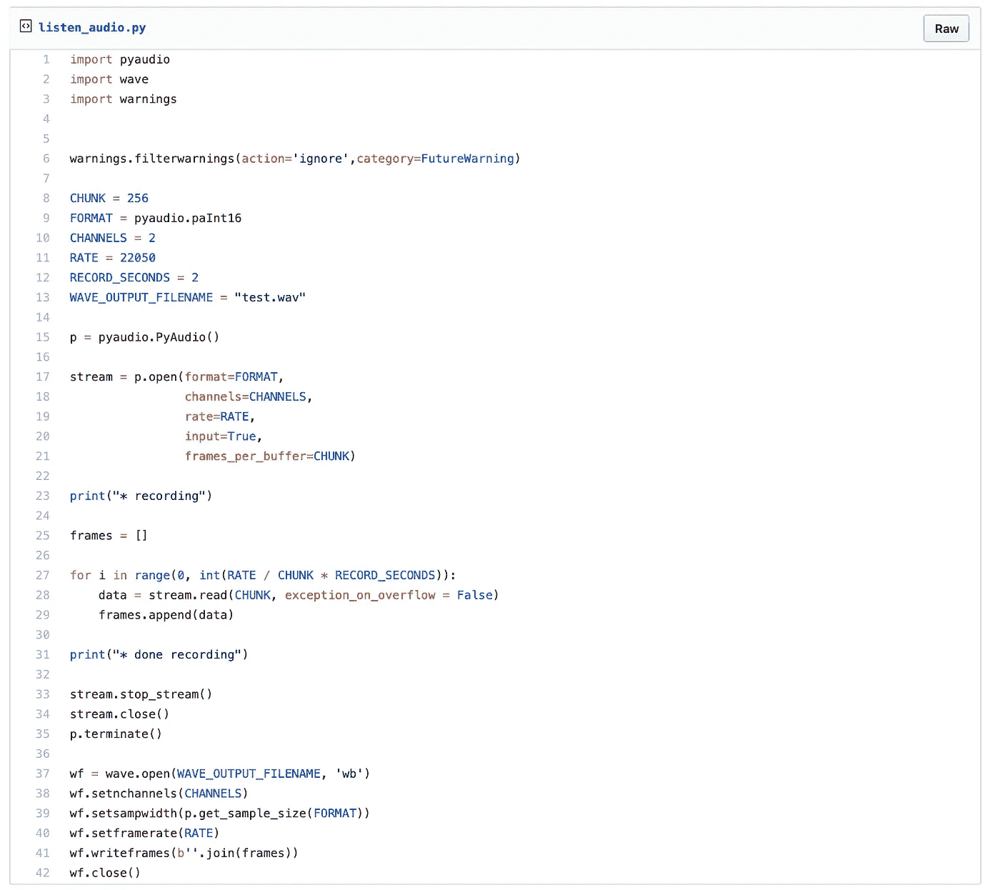

[https://gist.github.com/grohith327/deedd75d73070e7667eef1977162a390](https://gist.github.com/grohith327/deedd75d73070e7667eef1977162a390)

我们可以从记录的 20 个样本中随机抽取 1 秒的作物，并附加 1 秒的静默。这将为我们提供每门课的大量数据。我们使用下面的脚本获取 200 个这样的作物。

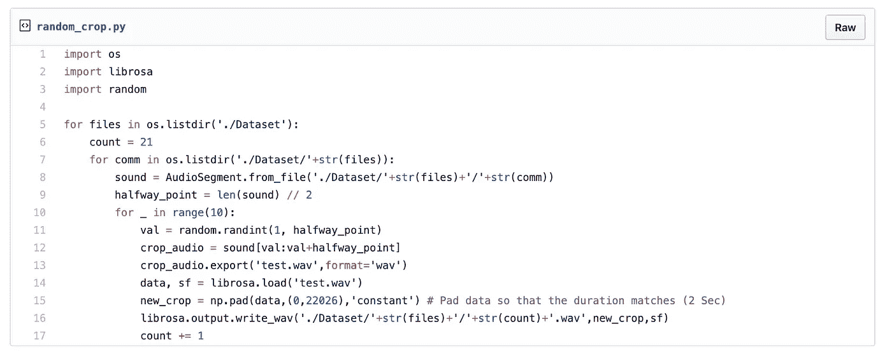

[https://gist.github.com/grohith327/2f9121157039840a77b5d527e2313f06](https://gist.github.com/grohith327/2f9121157039840a77b5d527e2313f06)

现在我们已经为每个类准备了大约 220 个样本(200 个裁剪样本和 20 个原始样本),我们可以考虑对音频样本进行一些预处理。

# 音频预处理

录制的语音命令存储为。wav 文件，如果我们能得到音频文件的声谱图，我们可以把它当作一个图像，并把它输入 CNN，对音频进行分类。幸运的是，python 库 librosa 让事情变得简单多了，我们可以很容易地用这个库生成音频的频谱图。以下脚本用于生成声谱图。

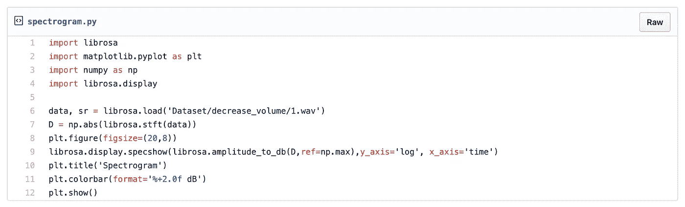

[https://gist.github.com/grohith327/0e6b2071b8e3f57961a24d06c495fe33](https://gist.github.com/grohith327/0e6b2071b8e3f57961a24d06c495fe33)

为了生成声谱图，我们对音频数据进行短时傅立叶变换。傅立叶变换用于将信号从时域转换到频域，我们这样做是为了了解信号变化的程度。短时傅立叶变换是一种扩展，它采用小窗口，将其与信号进行卷积，并在卷积窗口内应用 DFT，现在我们在信号上移动窗口，迭代执行 DFT。

我们可以使用上面的脚本可视化所有五个命令的频谱图。

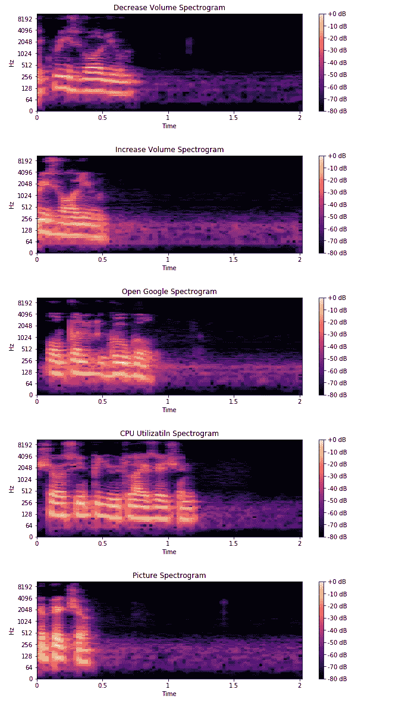

我们可以观察到命令“增大音量”和“减小音量”似乎具有相似的频谱图，因为单词“增大”和“减小”之间只有很小的差别。

我们现在可以为每个音频样本生成声谱图，并使用以下脚本将其转储到 numpy 数组中。(注意:我们填充光谱图，以便所有维度匹配)

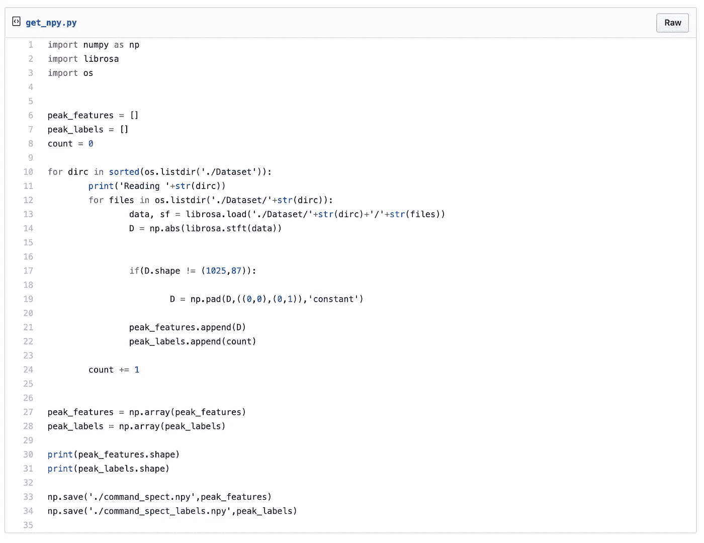

[https://gist.github.com/grohith327/ce30475cd508e0f196fb4face38f47ca](https://gist.github.com/grohith327/ce30475cd508e0f196fb4face38f47ca)

既然我们已经将音频样本及其相应的标签保存到了一个. npy 文件中，我们可以随时加载它们，而不是每次都生成频谱图。

# 构建模型

我们可以将频谱图视为图像，并尝试从这些图像中识别有助于我们识别音频样本类别的特征。我们可以使用[卷积神经网络](/build-your-own-convolution-neural-network-in-5-mins-4217c2cf964f)，它将图像作为输入，学习图像的空间特征并预测类别。

在构建模型之前，我们将数据分为训练集和测试集。我们还使用下面的脚本将标签转换成一个热编码。

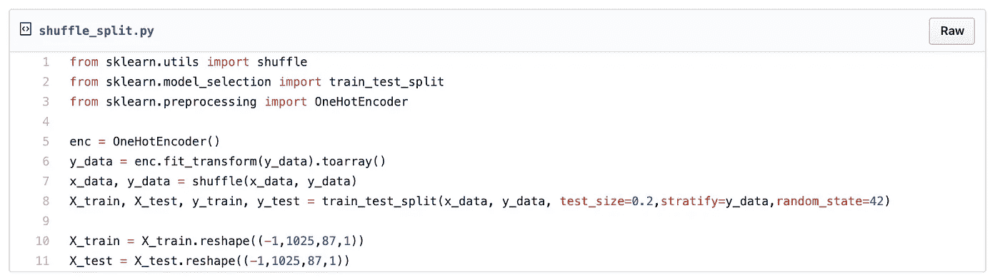

[https://gist.github.com/grohith327/3d3ab1759f6a7a41654cbedbcd5dd7e8](https://gist.github.com/grohith327/3d3ab1759f6a7a41654cbedbcd5dd7e8)

我们现在可以开始构建卷积神经网络，为此我们将使用 TF 2.0 作为我们的框架。要了解如何在 Tensorflow 2.0 [中构建 CNN，请点击此处](/tensorflow-2-0-create-and-train-a-vanilla-cnn-on-google-colab-c7a0ac86d61b)。

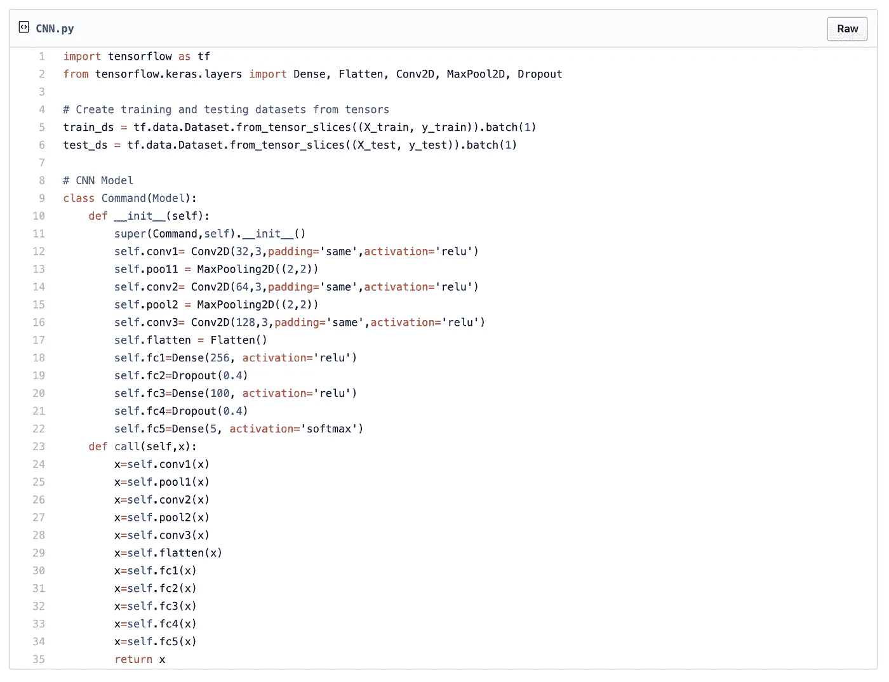

[https://gist.github.com/grohith327/3ff5da311fe03e0a8cc615bf7435ae83](https://gist.github.com/grohith327/3ff5da311fe03e0a8cc615bf7435ae83)

我们现在可以为 15 个时期训练我们的模型，我们评估我们的交叉熵损失模型，并使用 RMSProp 作为我们的优化器。

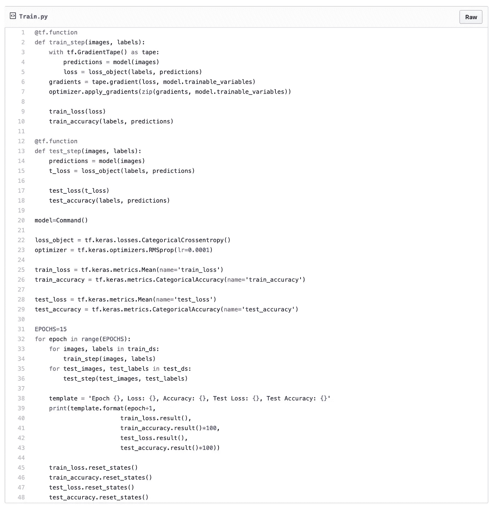

[https://gist.github.com/grohith327/3ff5da311fe03e0a8cc615bf7435ae83](https://gist.github.com/grohith327/3ff5da311fe03e0a8cc615bf7435ae83)

我们的模型学习频谱图的内在特征，并根据语音命令的类型区分它。经过 15 个时期的训练，我在测试数据上观察到了 96%的准确率。我们现在可以保存我们的模型，并使用它来预测我们的语音命令的类别并执行任务。

# 自动化任务

我们使用笔记本电脑的麦克风连续记录音频，并将其分成 2 秒钟的样本，然后输入到我们的模型中进行预测。如果我们的模型能够以高置信度对命令进行分类，我们就执行该任务。以下是通过 python 执行每个命令的脚本。(注意:根据操作系统，某些命令可能需要不同的库来执行，以下脚本适用于 macOS)

## 降低音量

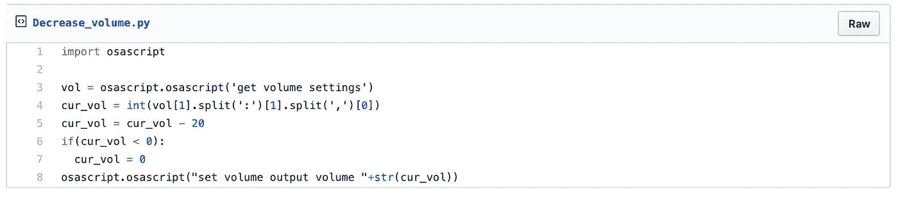

[https://gist.github.com/grohith327/9192644cc40d2d1a2c0cc963dc5520ca](https://gist.github.com/grohith327/9192644cc40d2d1a2c0cc963dc5520ca)

## 增加量

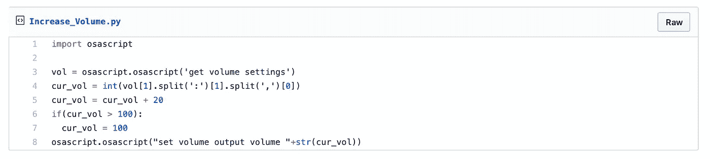

[https://gist.github.com/grohith327/5a7140d573b9416175d0b334da516260](https://gist.github.com/grohith327/5a7140d573b9416175d0b334da516260)

## 打开谷歌

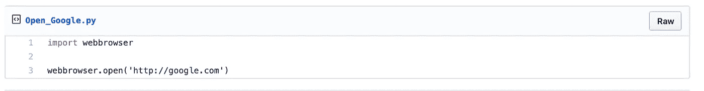

[https://gist.github.com/grohith327/102a2ec2e16a81956a7bc2a7a0a248a5](https://gist.github.com/grohith327/102a2ec2e16a81956a7bc2a7a0a248a5)

## 显示 CPU 利用率

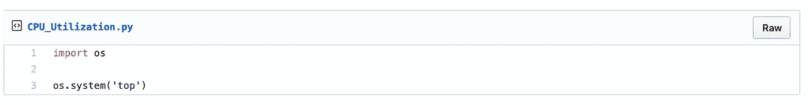

[https://gist.github.com/grohith327/41c810a36097905747f0d5aad57c3500](https://gist.github.com/grohith327/41c810a36097905747f0d5aad57c3500)

## 照相

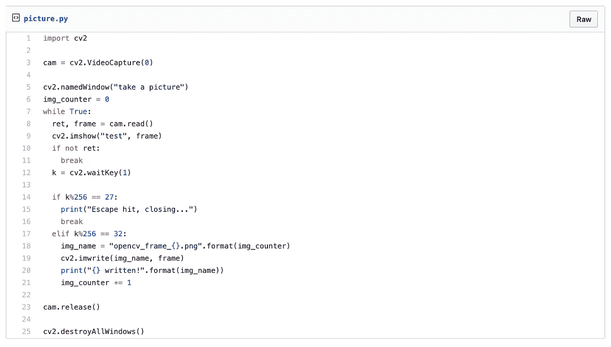

[https://gist.github.com/grohith327/becb9a96274d04a8e97cac5a6e23abdf](https://gist.github.com/grohith327/becb9a96274d04a8e97cac5a6e23abdf)

我们现在可以编写一个脚本，它可以无限期地通过笔记本电脑麦克风监听语音命令，并将其分成 2 秒的间隔，然后使用该样本从 CNN 模型中获得预测。如果我们的 CNN 模型能够以高置信度对样本进行分类(这是因为我们不想在没有命令或静默的情况下执行任务)，我们就执行该任务。代码如下。

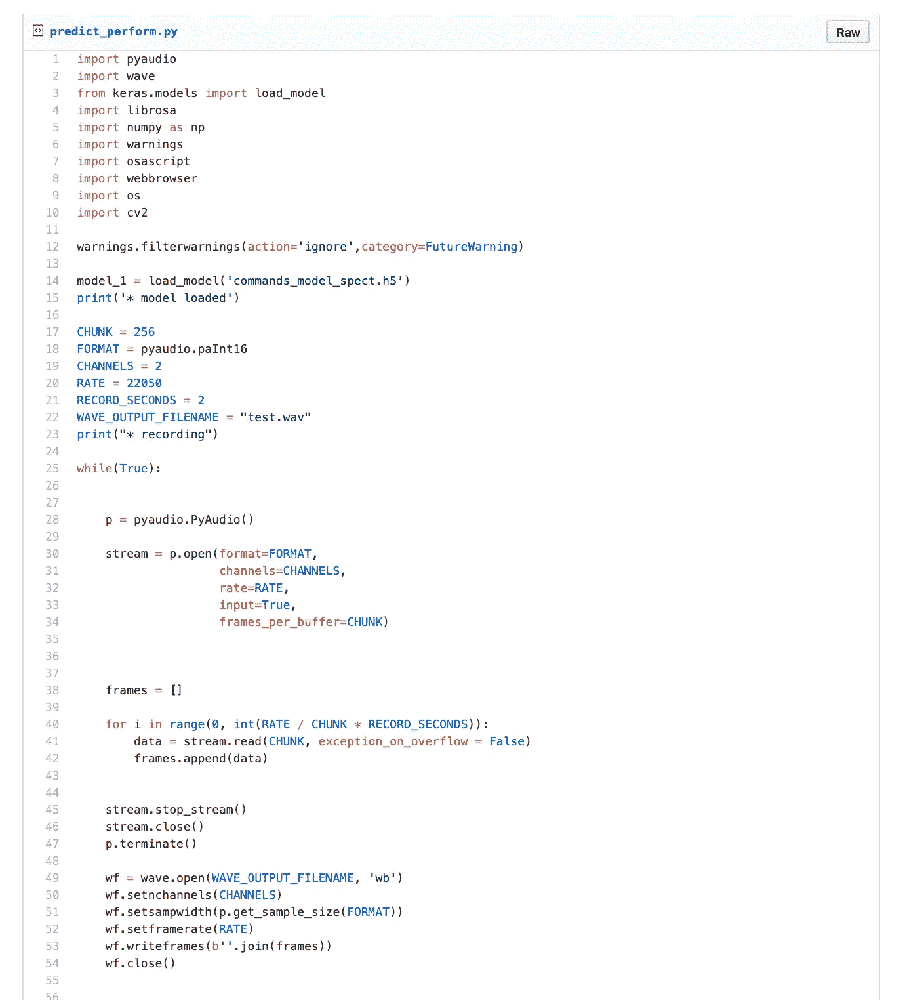

[https://gist.github.com/grohith327/27b51531eb7f27f3de26be4af53a45cb](https://gist.github.com/grohith327/27b51531eb7f27f3de26be4af53a45cb)

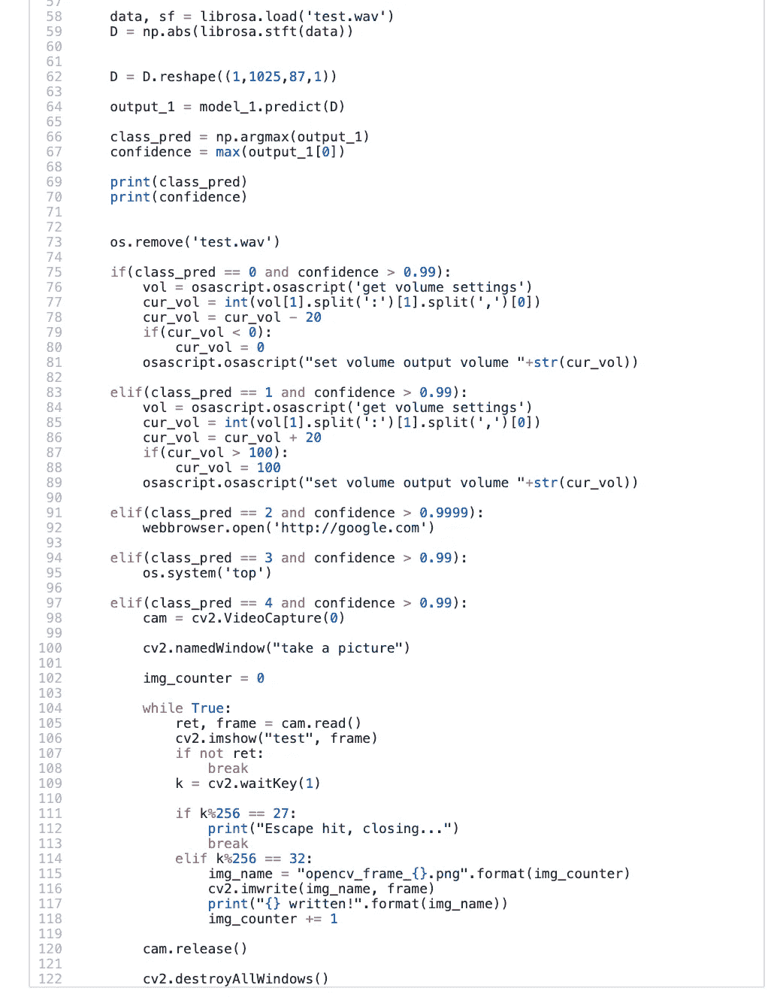

[https://gist.github.com/grohith327/27b51531eb7f27f3de26be4af53a45cb](https://gist.github.com/grohith327/27b51531eb7f27f3de26be4af53a45cb)

# 演示

# 结论

这种方法有点天真，因此它并不完美，正如你在上面的视频中看到的，它两次都没有识别出命令，但是，这是我们可以在短时间内构建和测试的东西(也很有趣！).

这只是你能做的一个例子。如果你愿意，你可以选择通过不同的命令来自动完成不同的任务，甚至可以扩展命令的数量，并且仍然可以获得很好的准确性。

# 参考

 [## 利布罗萨/利布罗萨

### 一个用于音乐和音频分析的 python 包。参见 http://librosa.github.io/librosa/的完整参考手册…

github.com](https://github.com/librosa/librosa)