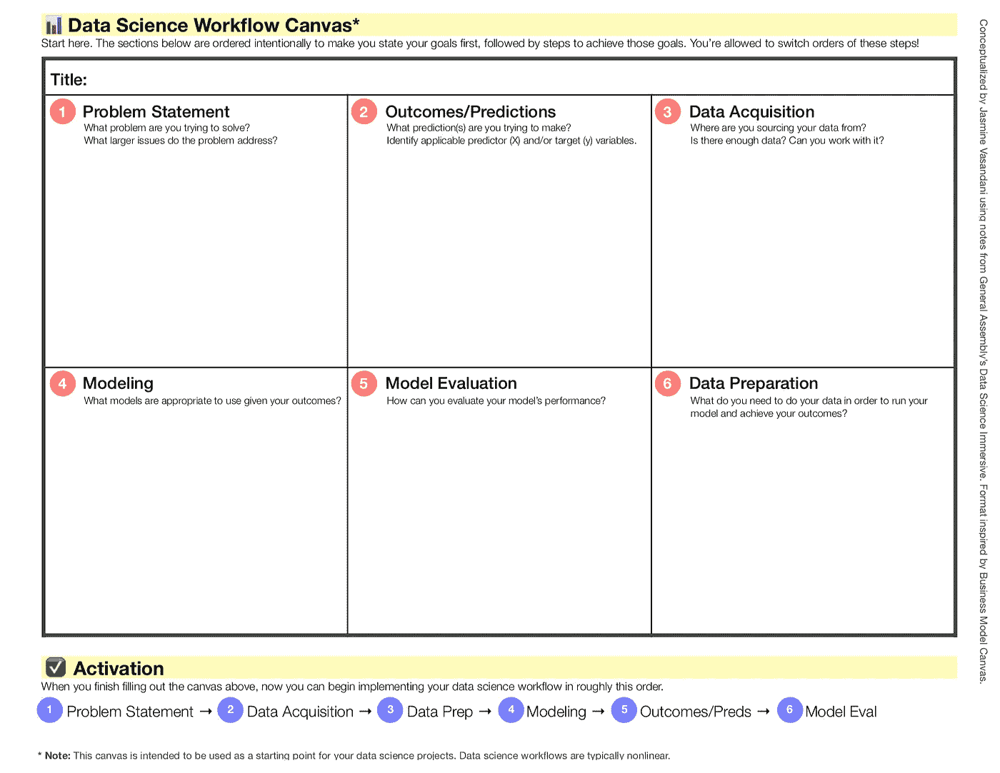
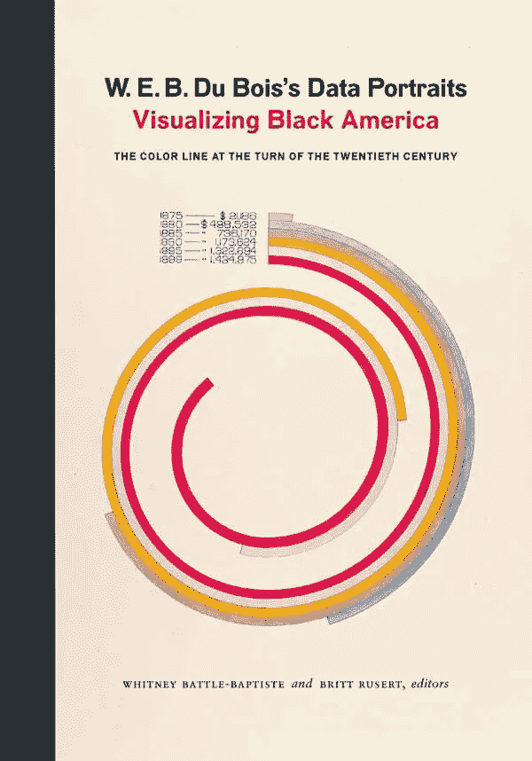
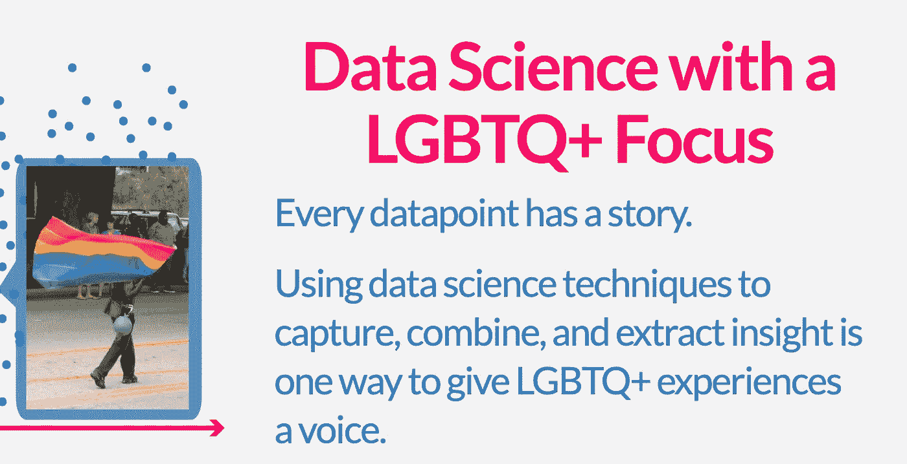

# 用这些数据为好的项目想法建立你的投资组合

> 原文：<https://towardsdatascience.com/build-your-portfolio-with-these-data-for-good-project-ideas-919254357a66?source=collection_archive---------8----------------------->

Credit: [Unsplash](https://unsplash.com/photos/2LJ4rqK2qfU)

## 从数据可视化到数据科学，获得创造的灵感。

*这篇文章的灵感来自于我在* [*数据中的女性*](https://widusa.com/)*[*打造你的数据科学工具箱*](https://www.eventbrite.com/e/building-your-data-science-toolbox-hosted-by-women-in-data-tickets-59582299261#) *研讨会上的一次演讲，题目是“数据(科学)为善”**

*在我成为数据科学家的过程中，我建立了自己的项目组合，这些项目展示了我的硬技能，同时也为社会事业做出了贡献。例如，当我注意到 sports analytics 没有太多关于女子运动队的分析时，我使用了一种无监督的机器学习算法来建立 WNBA 球员的梦之队。或者当我不断听到人工智能中的偏见时，我决定建立一个机器学习模型[来减轻 AI](/knowyourai-developing-a-framework-to-address-bias-in-facial-expression-recognition-b3b8040b0a68) 中的偏见。在这两个项目中，我展示了作为一名数据科学家的艰苦技能，同时也为更大的利益做出了贡献并坚持了我的价值观。为了回馈数据专业人士社区，我想分享一些资源和技巧，以帮助您为优秀项目增加数据。*

# *放下恐惧，开始吧*

**

*Credit: [WOCinTech Chat](https://www.flickr.com/photos/wocintechchat/).*

*我想与你分享的第一个技巧是，放下恐惧，开始使用你已经掌握的数据项目工作技能。在我成为数据科学家的早期，我最喜欢使用 Excel 来解释数据。当时，我不知道如何用 python 开发机器学习模型。利用我当时拥有的技能，我本可以开始从事数据驱动的项目——但唯一阻止我的是恐惧。如果您正处于学习成为数据专家的专业技能的初级阶段，您仍然可以使用现有的技能从事项目工作。我希望我能回到过去，告诉自己这些，但是因为我不能，所以我写这篇文章来告诉你——开始吧！我试着在这里包含一些资源，每个人都可以从中受到启发，不管你是新手还是专家。*

# *创建项目工作流*

**

*[Download the Data Science Workflow Canvas.](/a-data-science-workflow-canvas-to-kickstart-your-projects-db62556be4d0)*

*不管你是否知道你想从事哪种数据驱动的项目，或者你还不确定，开始集思广益吧。头脑风暴、制定战略、构思——这些词的一个共同点是租户认为没有所谓的“错误”想法。对于任何想要一种结构化方式来头脑风暴数据科学项目工作流的人，我设计了[这幅画布](/a-data-science-workflow-canvas-to-kickstart-your-projects-db62556be4d0)(如上图)来帮助你开始。如果你需要其他工具来帮助你制定项目工作流程，你也可以尝试[手绘](https://mindmapsunleashed.com/10-really-cool-mind-mapping-examples-you-will-learn-from)或[数字化思维导图](https://venngage.com/blog/mind-map-templates/)，使用[设计思维工具](https://designthinking.ideo.com/resources)，或者简单地打开一个空白的 word 文档(或者如果你是模拟型的人，翻到笔记本的空白页)并开始写下你的想法。*

# *良好数据集的数据*

**

*Credit: [Unsplash](https://unsplash.com/photos/oqStl2L5oxI)*

*既然您已经有了如何制定项目工作流程战略的想法，您就可以开始使用这些数据换好的数据集了。或者你也可以收集你的数据，或者出去收集你自己的数据。我在下面列表中分享的大多数门户网站都提供易于下载的数据集。这些资源中的一些并不纯粹关注“数据的好处”，但仍然有相关的数据集可以下载。最后，这些只是众多数据集的一小部分！*

*   *[人道主义数据交换](https://data.humdata.org/)*
*   *[美国主要博物馆中艺术家的多样性](https://artofstat.shinyapps.io/ArtistDiversity/)*
*   *[民权数据收集](https://ocrdata.ed.gov/)*
*   *政府开放数据库:[美国开放数据](https://catalog.data.gov/dataset)，[美国城市开放数据](https://www.forbes.com/sites/metabrown/2018/04/29/city-governments-making-public-data-easier-to-get-90-municipal-open-data-portals/#673510355a0d)*
*   *[气候数据](https://www.ncdc.noaa.gov/cdo-web/)*
*   *[性别数据门户](http://datatopics.worldbank.org/gender/)*
*   *[健康数据](https://healthdata.gov/search/type/dataset)*
*   *[Kaggle 的数据科学为好:洛杉矶市](https://www.kaggle.com/c/data-science-for-good-city-of-los-angeles/data)*
*   *[穿越时间线](https://www.acrossthetimeline.com/)*
*   *[多样性数据](http://diversitydata.org/)*
*   *[FiveThirtyEight:我们的数据](https://data.fivethirtyeight.com/)*
*   *或者你可以使用[谷歌的数据集搜索](https://toolbox.google.com/datasetsearch)来找到其他东西*

# ***数据可视化***

**

*Credit: [Amazon](https://www.amazon.com/W-Boiss-Data-Portraits-Visualizing/dp/1616897066)*

*数据可视化是一个强大的工具，可以传达您从数据分析中收集到的见解，尤其是如果您正在进行一个有益于数据的项目。这些是我最喜欢的展示数据可视化的资源。*

*   *[杜波依斯的数据画像:可视化美国黑人](https://books.google.com/books/about/W_E_B_Du_Bois_s_Data_Portraits.html?id=zft0DwAAQBAJ&source=kp_book_description)*
*   *[莫娜·沙拉比](https://www.theguardian.com/profile/mona-chalabi)*
*   *[乔尔吉亚·卢皮](http://giorgialupi.com/data-humanism-my-manifesto-for-a-new-data-wold)*

# *出版物/博客*

**

*Source: [Gayta Science](https://www.gaytascience.com/)*

*这些只是一些以数据驱动的文章集合为特色的博客和/或出版物。*

*   *[布丁](https://pudding.cool/topics/#music)*
*   *[盖塔科学](https://www.gaytascience.com/)*
*   *她的篮圈统计数据*
*   *[空间研究中心](http://c4sr.columbia.edu/projects)*
*   *[数据女权主义](https://bookbook.pubpub.org/data-feminism) ( *帽尖米切尔·博曼与我分享这个！)**
*   *[数据&社会](https://datasociety.net)*

# *介入*

**

*Credit: [Unsplash](https://unsplash.com/photos/C4G18Paw0d4)*

*有很多方法可以参与进来，围绕“数据为善”的理念建立社区这里有一些你可以参与的方法，无论是通过为一个组织做志愿者还是参加一个会议。*

*   *[黑人生活数据](http://d4bl.org/)*
*   *[AI4All](http://ai-4-all.org/)*
*   *[LatinX in AI](https://www.latinxinai.org/)*
*   *[数据种类](https://www.datakind.org/)*
*   *[数据中的女性](https://widusa.com/)*
*   *[AI 中的黑色](https://blackinai.github.io/)*
*   *[机器学习和数据科学领域的女性](http://wimlds.org/)*
*   *[数据为好:加拿大](https://dataforgood.ca/)*
*   *[R-女装](https://rladies.org/)*
*   *皮拉迪斯*
*   *[酷儿在艾](https://sites.google.com/view/queer-in-ai/home)*

# *结论*

**

*Credit: [Unsplash](https://unsplash.com/photos/SZgVZPbQ7RE)*

*我希望这些资源能激励您创建数据为善的项目！请记住，这些资源只是可用资源的一个快照。如果你想分享更多你参与过的资源或项目，请在下面评论！*

*—*

**感谢 Anuva Kalawar 总是与我分享数据换好处的资源。**

*Jasmine Vasandani 是一名数据科学家和战略家。你可以在这里了解她的更多:【https://github.com/jasminevasandani/about_jasmine】。*