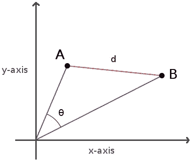
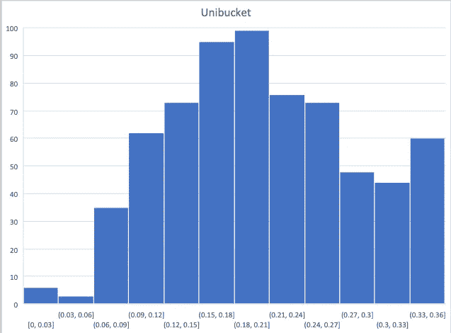
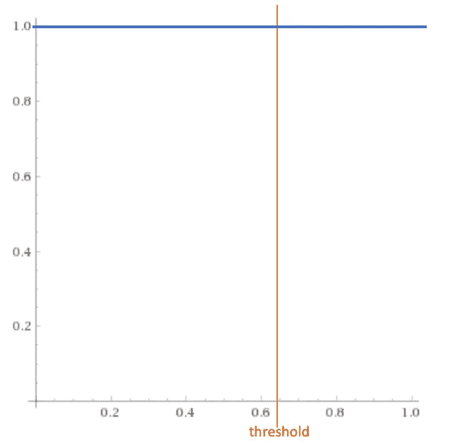
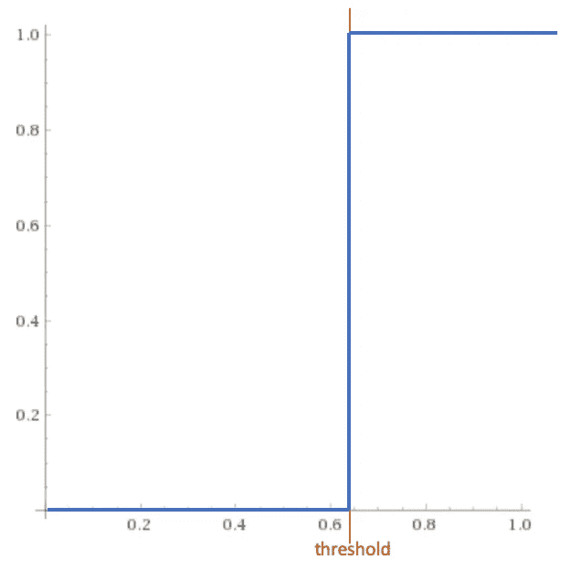
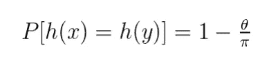
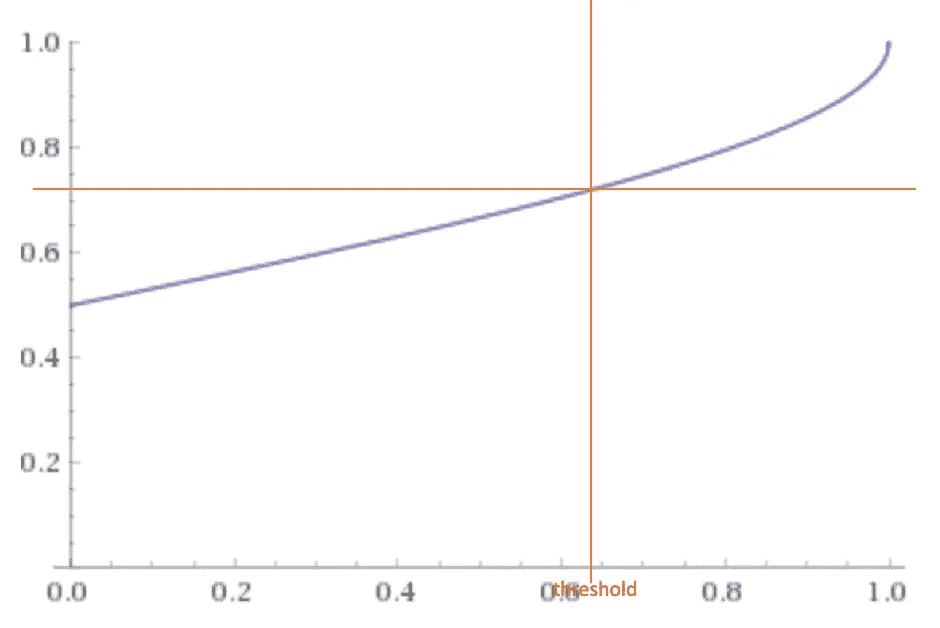
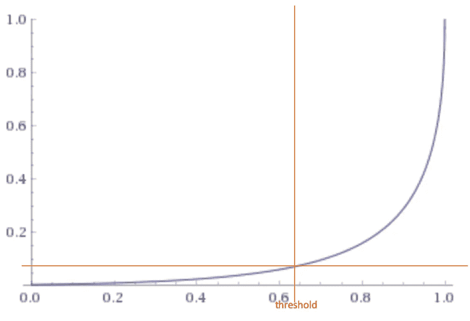
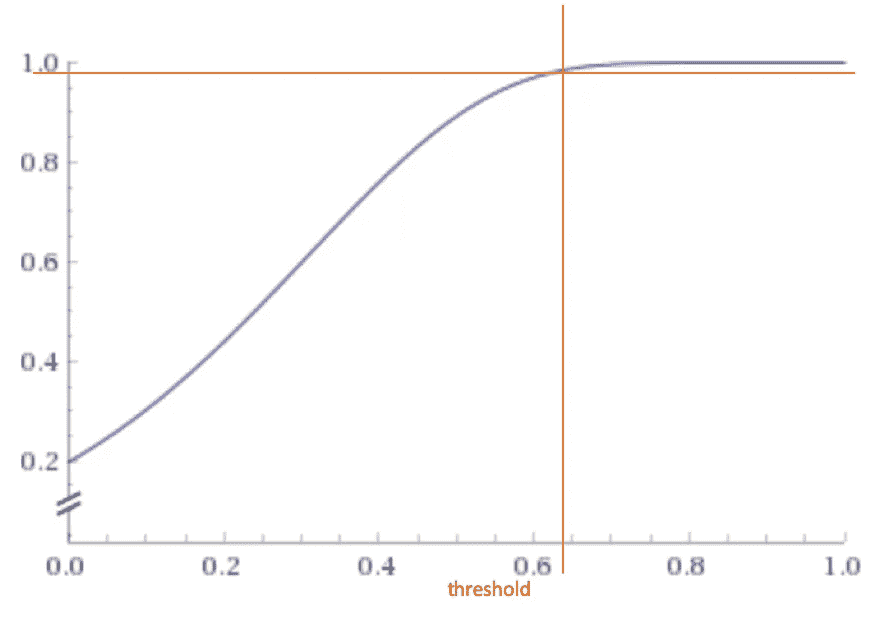
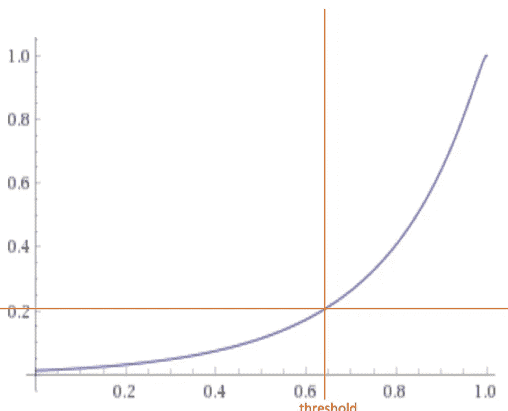

# 为人工智能构建后端系统

> 原文：<https://towardsdatascience.com/building-a-backend-system-for-artificial-intelligence-c404efade360?source=collection_archive---------23----------------------->

## 构建可扩展“人工智能”系统的挑战

让我们探讨一下构建一个后端系统来存储和检索高维数据向量所面临的挑战，这是使用“人工智能”的现代系统的典型特征，包括图像识别、文本理解、文档搜索、音乐推荐等

在我的上一篇文章中，我提到了一个我写的用来替代第三方 API 的系统。新系统由三部分组成:
1。领域逻辑服务—“人工智能”
2。存储检索服务
3。后备数据存储(Redis)

域逻辑服务处理输入数据，并生成代表数据的 1024 维规范化向量。然后传递给存储和检索服务进行持久化。
在检索时，域逻辑服务从输入中产生另一个向量，该向量使用相同的处理逻辑和存储进行转换&检索服务的任务是产生一组已经保存在系统中的与给定输入最相似的向量。

以这种方式分解系统的原因是因为存储和检索本身就是一个具有挑战性的问题。为了隔离问题，我将它放在一个自包含的服务中。下文旨在解释原因。

# 向量相似度

因为我们使用向量，所以让我们将两个向量的“相似性”定义如下:
如果
a) a 与 b 相同或者
b)向量 a 与 b 之间的距离小于向量 b 与数据集中任何其他向量之间的距离
并且该距离低于给定阈值，则向量 a 与输入向量 b 相似。

向量之间的距离有不同的计算方法:
1。欧几里德距离
2。余弦距离
3。笛卡儿及其思想的

Visual representation of euclidean distance (d) and cosine similarity (θ)

这是欧几里德距离(d)和余弦相似度(θ)的直观表示。余弦着眼于向量之间的角度(因此不考虑它们的重量或大小)，欧几里得距离类似于使用尺子来实际测量距离。

当向量的大小无关紧要时，余弦相似性通常用作测量距离的度量。这正是我们在这里要用的。我们的向量标准化地进入存储和检索服务(所有向量都是长度为 1 的单位向量)。

既然我们已经确定了寻找“相似”向量意味着什么，那么让我们看看真正的挑战——检索相似向量集。

# 挑战

寻找相似向量的强力方法是获取输入并计算与数据集中每个其他向量的余弦相似性。将 vector 与“所有其他向量”进行比较并不能很好地扩展(它是线性的— O(n))，考虑到向量的维数，您可以看到当数据集增长时，这变得非常无效。如果你需要一个每秒处理大量查询的实时系统，那就不太现实了…

# 局部敏感散列法

相反，我们将使用本地敏感散列法(LSH)。在计算机科学中，LSH 是一种算法技术，它以很高的概率将相似的输入项散列到相同的“桶”中(桶的数量远小于可能的输入项的总数)。

LSH 主要不同于传统的散列法(又名加密)，因为加密散列法试图避免冲突，而 LSH 的目标是最大化相似输入的冲突。

对于 LSH，彼此靠近的向量(“相似”)具有相同的散列值，而远离的向量具有不同的散列值(“不相似”)。
这为我们提供了一个潜在的解决方案——如果我们使用 LSH 散列我们的向量，我们可以减少匹配检索所需的向量比较次数。
我们可以将搜索限制在一个桶(或一组桶)中，以显著减少计算余弦距离的向量数量。
但是，如果我们考虑具有数百万个向量的数据集，那么即使在一个桶中，要搜索的向量的数量仍然很大。稍后会详细介绍。

然而，这是有代价的。在之前的 LSH 定义中，你应该关注的关键词是“概率”。LSH 不是一个精确的算法，它使用近似值。不能保证数据集中的相似向量最终会出现在同一个桶中。这取决于我们提供给算法的参数，即相似的向量具有相同散列的“可能性”有多大。

这里需要注意的一件重要事情是，对于我的用例，相似性截止(阈值)是余弦距离 0.36，这非常宽，这使得 LSH 的使用更加困难，因为你需要考虑更广泛的向量集。LSH 最擅长处理非常接近的向量。

幸运的是，我们有一个优势。我们不需要一个最相似的向量。我们可以近似。一旦找到第一个距离小于阈值的向量，我们就可以在桶内终止搜索。我们举个面部识别的例子。这里，系统中的每个向量代表一张脸。但是每个人都有多张相关的脸(他或她的多张照片)。假设我们正在使用另一张脸作为输入来搜索一个人。我们不需要检索单个最近的向量——最相似的脸。我们只需要一张足够“接近”的脸(低于指定的阈值)。根据定义，该阈值应该保证低于该阈值的每个这样的向量代表同一个人。

在为本文收集笔记时，我决定对我当前的实现进行测试，以了解我的系统的性能，并看看我是否可以对它进行改进。好家伙，我学到了很多东西！

# 基线

因为我的目标是观察(并希望改进)我当前的实现，所以我首先必须建立一种方法来测量被观察的系统，然后建立一个我们试图改进的基线。

我很幸运，因为我已经开发和测试我的系统有一段时间了，我有来自测试用户的“真实世界”数据可以使用。
为了设置我的实验，我手工挑选了大约 250 个向量的数据集作为我的系统的种子，并挑选了近 3000 个向量用于相似性检索
(即“250 个种子向量中有任何一个与 3000 个测试向量中的每一个相似吗？”).如果你要谈论生产规模，这不是一个巨大的数据集，但请记住，我们希望用它来观察我们算法的准确性，而不是硬件性能。为此目的，它应该是足够的。同样值得注意的是，这个数据集不能与用于训练人工智能子系统的数据集混淆。这已经在数百万个数据点上进行了预先训练，超出了我们今天讨论的范围。

为了建立准确性基线，我使用了简单的“蛮力”方法。这样，我总是保证得到最准确的结果，代价是将我的输入与“数据库”中的每一个向量进行比较。这就是可怕的 O(n)线性性能。

“匹配”总数为 673，相似性分布如下:

Similarity distribution histogram for baseline scenario (no approximation)

显而易见，在这种情况下找到“正确”匹配的概率总是 1。也就是说，如果一个相似的向量存在，它将被检索。查看不同算法的概率图将是理解其准确性的关键。

Probability of retrieving correct match in brute-force approach

# 接近

接下来，我决定测量我当前实现的算法。与 LSH 一起进入问题近似的世界。理想情况下，我们希望 LSH 降低搜索的复杂性(比线性更好),但保持准确率在——或接近——100%。为了实现这个圣杯，我们需要提出一个阶跃函数，将所有低于阈值的向量散列到同一个桶中，将所有其他向量散列到不同的桶中。如果我们在特定的桶中搜索向量，我们会大大减少搜索空间，但我们保证会找到相似的向量(假设它们存在于我们的数据集中)。

Ideal case — step function

首先，我们需要从输入向量中计算二进制散列。为此，我们将空间划分为 n 个随机平面。对于每一个平面，矢量都位于该平面分隔的两个区域之一。如果向量在正侧，我们赋值 1，如果向量在负侧，我们赋值 0。直觉上，两个文档越接近，它们越有可能在随机平面的同一区域。例如，如果两个文档几乎在彼此之上，那么对于你能想到的大多数平面来说，它们将在相同的区域结束。

对于随机绘制的平面，可以从数学上证明两个文档 x 和 y 以概率散列到相同的值:

这个表达式概括了我们的直觉:两个文档越接近(小θ)，它们出现在同一区域的可能性就越大。

如果我们仅使用一个平面将我们的空间分成两半，则两个向量具有相同散列的概率将是:

Probability of two vectors having same single-bit binary hash

您可以将这解释为余弦相似度为 0.36(阈值)的两个向量被散列到同一个桶中的概率大约为 0.72 (72%)。这起初听起来不错，但这也意味着在 0.38 (38%)的情况下，相似的向量将散列到不同的桶(因此我们不会找到我们的匹配)。我们只减少了 50%的搜索空间。考虑到我们损失了相当多的准确性，这不是一个好的优化。

让我们添加更多的随机平面，最终得到一个如下所示的散列:

01110011

(通过将空间除以 8 个随机超平面构建的 8 位散列)

现在我们的概率降低了。向量不太可能散列到同一个桶中，除非它们几乎相同。如果你还记得的话，这正是我们早期关于 LSH 建立的——该算法最适合非常接近的匹配(向量之间非常小的余弦距离)。

Probability of two vectors having same 8bit binary hash

但是我们可以采用不同的技术来改善我们的处境。

*   探索附近的桶
*   考虑部分哈希匹配

# 附近的桶

为了探索附近的桶，我添加了汉明距离散列变量。这个想法很简单:一旦我们获得了 LSH 散列，我们就计算该散列在 n 个距离内的变化。这允许对根据我们的标准相似但最终在不同桶中的向量进行纠错。

如果我们取前面例子中的散列，汉明距离 1 的变化将是:

**1**1110011
0**0**110011
01**0**10011
011**0**0011
0111**1**011
01110**1**11
011100**0【T19**

对于汉明距离 2，我们得到:

**10**110011
**1**1**0**10011
**1**11**0**0011
1111**1**011
**1**1110**1**11

0**00**10011
0**0**10011
011**1**011
**00**110**1**11
0**0【T77**

01**00**0011
01**0**1**1**011**0**10**1**11
01**0**100**0
1**0**1**

等等。

在我的例子中，我选择的汉明距离为 3，这总共产生 1+8+7 * 8/2+6 * 7/2+5 * 6/2+4 * 5/2+3 * 4/2+2 * 3/2+1 * 2/2 = 93 个变量。这给了我们找到正确匹配的概率:

8bit hash with Hamming distance 3

这比前一种情况好得多，曲线的形状开始类似于理想的阶跃函数。但是在准确性(近似值)和性能(获得结果所需的时间/资源)之间有一个明显的折衷。

与基线相比，这种配置给出了令人满意的 93%的准确度，并且子线性复杂度在搜索空间中提供了平均 63.7%的减少。让我解释一下:在一个假设的场景中，我们的数据库中有 100 万个*均匀分布的*向量，我们在 256 个桶的每个桶中保存了大约 3906 个
向量(8 位哈希= 256 个不同的桶)。我们每个查询需要搜索 93 个桶，这给了我们大约 363281 个向量要搜索(100 万个存储向量的 36.3%)。但是我必须强调的是，这些计算是理想化场景中的平均结果(均匀分布的向量)，实际上，向量会更集中在一些桶中，从而为不同的查询产生非常不同的结果。

这是一个适度的改进，但也让我们损失了 7%的准确性。换句话说，在 7%的情况下，数据库中有一个相似的向量，但我们没有找到它。

为了完整起见，让我解释一下实际的数据持久性是如何实现的。我使用 Redis，每个散列都简单地转换成数据存储中的一个键。Value 是一个 Redis 向量列表，它将与查询响应中返回的元数据一起被搜索(例如，在音乐推荐服务中，元数据可以是一首歌曲的名称、一个艺术家等等)。

# 部分哈希匹配

作为最后一个实验，我尝试了一个略有不同的算法，这是我在研究 LSH 时发现的。

对于这个实验，我们生成更长的散列，但是将它分成多个组，并搜索每个桶，其中至少有一个散列组与查询中的一个组相匹配。

输入:01110011**11001001**11001100

(24 位哈希分为 3 组)

如果我们有两个不同的向量存储在系统中，哈希为

答:00110010 11001001 10001100

b:11000011**11001001**11001000

我们的输入向量将被认为类似于向量 b，因为第二组(11001001)匹配输入的第二组。

直到后来，当我开始分析我的结果时，
我才意识到我犯了一个错误，我只使用了 24 位散列分成 3 组。这第三个实验不可能超过我当前的实现。原因就摆在我面前:

24bit hash split in 3 groups

一旦我计算了概率图，我就明白了为什么与基线相比，我只看到了 71%的准确性。散列余弦距离为 0.36 的两个向量的概率下降到大约 22%。
虽然性能更好，但在我们拥有 100 万个向量的理想场景中，使用该算法我们只需比较(平均)约 12k 个向量，也就是说我们将搜索空间减少了 98.8%。

因为我们将散列分组，并且需要单独考虑每个组，所以我们需要不同的机制来查询 Redis 后端。

对于样本散列 01110011 11001001 11001100，我们将其分解为 3 个 Redis 键:

01110011 xx
x 11001001 x
xx 11001100

我们将向量存储在三个键的每个键下。这造成了数据的重复，但是当只有组成散列的一些组匹配时，允许我们找到向量。
在返回结果之前，我们还需要引入一个额外的步骤来过滤掉重复的结果。

# 我们能做得更好吗？

这是我一直在思考的事情。不仅仅是我——这是相当前沿的东西，许多比我聪明得多的人都在花大量时间开发新算法来查询大量高维数据。

我尝试了不同的配置来微调系统的精度和性能。但是到了最后，这仅仅是边际改善，虽然很重要，但并没有显著改变观察到的行为和(最好的)亚线性性能。

我也试着从不同的角度看待这个问题。我的系统存储了大量的向量，这些向量可能在存储后不久就会被使用，但更多的时候根本不会被使用。在大多数情况下，只有很小一部分向量最终会被返回为最相似的向量。

如果我们更积极地减少数据集的整体大小会怎么样？

我的计划是实现生存时间(TTL)，这是缓存中众所周知的概念，只在特定的时间窗口内保持向量“已使用”(已检索)(并且在每次使用向量时重新创建 TTL，甚至可能使用滑动窗口—第一个 TTL 为 1 小时，向量“已使用”后，下一个 TTL 将为 1 天，然后是 1 周，依此类推)。结合禁用某些向量的 TTL 的能力，我应该可以从数据集中清除大量向量，而不必太担心算法的性能。

未来要考虑的另一件事是并行处理。我们可以将数据集划分到不同的节点上进行存储和查询，然后将部分结果组合成最终结果(map-reduce)。或许，这将是另一个有趣的话题？