# 用 Python 和 PyMC3 构建贝叶斯逻辑回归

> 原文：<https://towardsdatascience.com/building-a-bayesian-logistic-regression-with-python-and-pymc3-4dd463bbb16?source=collection_archive---------6----------------------->

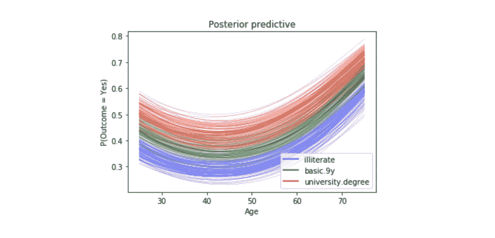

## 我认购定期存款的可能性有多大？后验概率，可信区间，优势比，WAIC

在本帖中，我们将探讨如何使用贝叶斯逻辑回归来预测客户在银行开展营销活动后是否会认购定期存款。

我们希望能够实现:

*   客户认购定期存款的可能性有多大？
*   变量选择技术实验。
*   对变量 so 的探索是探索性数据分析的一个很好的例子，它可以指导模型的创建和选择过程。

我相信你熟悉数据集[。不久前，我们使用标准的机器学习方法对这个数据集建立了一个逻辑回归模型。今天我们将应用](https://www.kaggle.com/janiobachmann/bank-marketing-dataset)[贝叶斯方法](https://en.wikipedia.org/wiki/Bayesian_inference)来拟合逻辑回归模型，然后解释由此产生的模型参数。我们开始吧！

# 数据

此数据集的目标是创建一个二元分类模型，该模型根据许多指标预测客户在银行开展营销活动后是否会认购定期存款。目标变量被给定为`y`，如果客户已经订阅，则取值 1，否则取值 0。

这是一个类别不平衡的问题，因为没有认购定期存款的客户明显多于认购定期存款的客户。

```
import pandas as pd
import numpy as np
import seaborn as sns
import matplotlib.pyplot as plt
import pymc3 as pm
import arviz as az
import matplotlib.lines as mlines
import warnings
warnings.filterwarnings('ignore')
from collections import OrderedDict
import theano
import theano.tensor as tt
import itertools
from IPython.core.pylabtools import figsize
pd.set_option('display.max_columns', 30)
from sklearn.metrics import accuracy_score, f1_score, confusion_matrixdf = pd.read_csv('banking.csv')
```

作为 EDA 的一部分，我们将绘制一些可视化图形。

*   使用 seaborn 的`stripplot`函数探索目标变量与客户年龄的关系:

```
sns.stripplot(x="y", y="age", data=df, jitter=True)
plt.show();
```

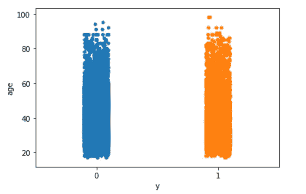

Figure 1

*   使用 seaborn 的`stripplot`函数探索目标变量与 euribor3m 的对比:

```
sns.stripplot(x="y", y="euribor3m", data=df, jitter=True)
plt.show();
```

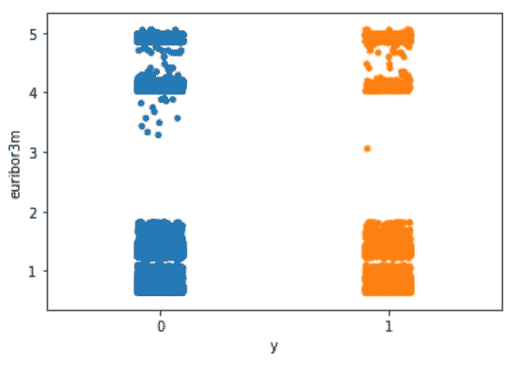

Figure 2

这里没什么特别有趣的。

下面是我使所有变量数值化的方法。你可能有更好的方法做这件事。

cat_to_num.py

# 单自变量逻辑回归

我们将从最简单的逻辑模型开始，仅使用一个独立变量或特征，即持续时间。

```
outcome = df['y']
data = df[['age', 'job', 'marital', 'education', 'default', 'housing', 'loan', 'contact', 'month', 'day_of_week', 'duration', 'campaign', 'pdays', 'previous', 'poutcome', 'euribor3m']]
data['outcome'] = outcome
data.corr()['outcome'].sort_values(ascending=False)
```

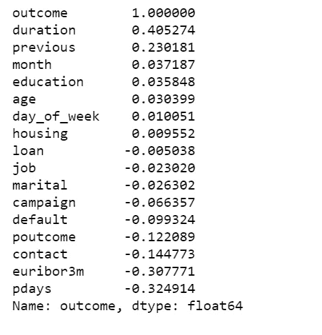

Figure 3

有了正确格式的数据，我们可以开始用 [PyMC3](https://docs.pymc.io/) 构建第一个也是最简单的逻辑模型:

*   将数据居中有助于采样。
*   确定性变量之一θ是应用于μ变量的逻辑函数的输出。
*   另一个确定性变量 bd 是边界函数。
*   `pm.math.sigmoid`是同名的 [Theano](http://deeplearning.net/software/theano_versions/0.8.X/library/tensor/nnet/nnet.html) 函数。

logReg_model.simple.py

我们将绘制拟合的 sigmoid 曲线和决策边界:

logReg_viz.py

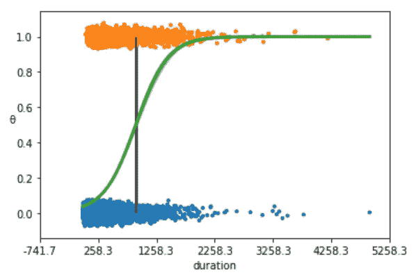

Figure 4

*   上图显示了非订阅与订阅的对比(y = 0，y = 1)。
*   S 形(绿色)线是θ的平均值。这条线可以解释为订阅的概率，假设我们知道最后一次联系持续时间(持续时间的值)。
*   边界决策表示为一条(黑色)垂直线。根据边界决策，左边的持续时间值对应于 y = 0(非订阅)，右边的值对应于 y = 1(订阅)。

我们总结了推断的参数值，以便更容易地分析结果，并检查模型的表现如何:

```
az.summary(trace_simple, var_names=['α', 'β'])
```

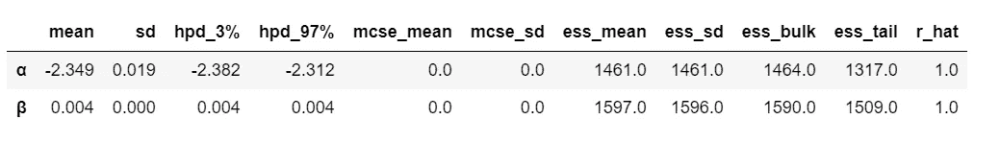

Table 1

如您所见，α和β的值非常狭窄。这是完全合理的，因为我们正在将一条二元拟合线拟合到一组完全对齐的点上。

让我们运行一个后验预测检查来探索我们的模型捕捉数据的能力。我们可以让 PyMC3 为我们做从后面取样的艰苦工作:

```
ppc = pm.sample_ppc(trace_simple, model=model_simple, samples=500)
preds = np.rint(ppc['y_1'].mean(axis=0)).astype('int')print('Accuracy of the simplest model:', accuracy_score(preds, data['outcome']))
print('f1 score of the simplest model:', f1_score(preds, data['outcome']))
```

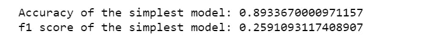

# 数据的相关性

我们绘制了一张热图来显示每个变量之间的相关性。

```
plt.figure(figsize=(15, 15))
corr = data.corr() 
mask = np.tri(*corr.shape).T 
sns.heatmap(corr.abs(), mask=mask, annot=True, cmap='viridis');
```

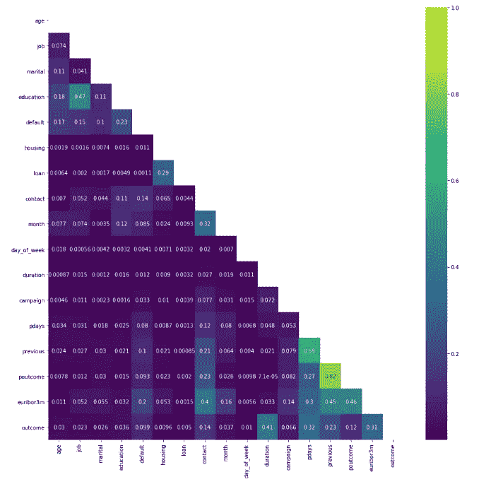

Figure 5

*   poutcome & previous 有很高的相关性，我们可以简单的去掉其中一个，我决定去掉 poutcome。
*   与结果变量没有太多强相关性。最高正相关为 0.41。

# 使用具有多个独立变量的 PyMC3 GLM 方法定义逻辑回归模型

*   我们假设订阅结果的概率是年龄、工作、婚姻、教育、违约、住房、贷款、联系人、月份、星期几、持续时间、活动、pdays、先前和 euribor3m 的函数。为了从后验样本中抽取样本，我们需要指定一个先验和一个似然。
*   解释公式如下:

> logit = β0 + β1(年龄)+ β2(年龄)2 + β3(工作)+ β4(婚姻)+ β5(教育)+ β6(默认)+ β7(住房)+ β8(贷款)+ β9(联系)+ β10(月)+ β11(星期几)+ β12(持续时间)+ β13(活动)+ β14(活动)+ β15(pdays) + β16(以前)+ β17(poutcome) + β18

*   然后，对数赔率可以转换为输出的概率:

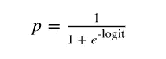

*   对于我们的问题，我们感兴趣的是在给定所有活动的情况下，找出客户认购定期存款的概率:

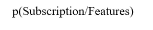

*   数学问题解决后，我们可以回到数据上来。PyMC3 有一个模块 glm，用于使用 patsy 风格的公式语法定义模型。这看起来真的很有用，特别是对于用更少的代码行定义模型。
*   我们使用 PyMC3 从后部提取样本。使用的采样算法是 NUTS，其中的参数是自动调整的。
*   我们将使用所有这 18 个变量，并使用上面定义的公式创建模型。添加年龄 2 的想法是从[本教程](https://docs.pymc.io/notebooks/GLM-logistic.html)中借用的，比较最近的模型也是很有趣的。
*   我们也将年龄缩放 10，这有助于模型收敛。

logistic_model.py

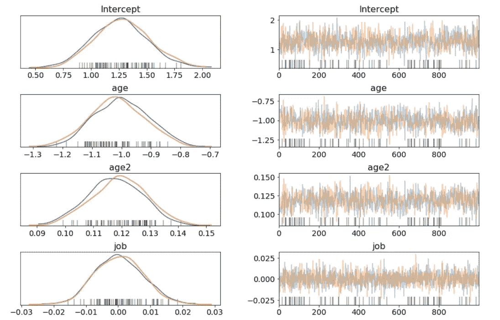

Figure 6

以上我只展示了部分的痕迹图。

*   该轨迹显示了为所有变量抽取的所有样本。在左侧，我们可以看到模型参数的最终近似后验分布。右边是采样过程中每一步的单个采样值。
*   这个`glm`定义的模型表现得非常相似，并且找到了与我们之前创建的传统定义模型相同的参数值。

我希望能够回答这样的问题:

# 年龄和教育程度如何影响认购定期存款的概率？假设客户已婚

*   为了回答这个问题，我们将展示几个不同教育水平的人订阅定期存款的概率如何随年龄变化，我们想研究已婚客户。
*   我们将传入三个不同的线性模型:一个教育程度== 1(文盲)，一个教育程度== 5(基础. 9y)，一个教育程度== 8(大学.学位)。

age_education_marital.py

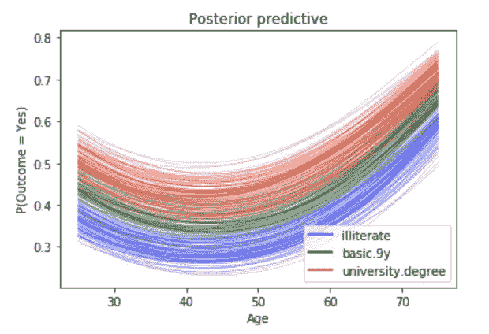

Figure 7

*   对于所有三种教育水平，随着年龄的增长，定期存款的概率会降低，直到大约 40 岁时，这一概率才开始增加。
*   每条曲线都是模糊的，这是因为我们为每个教育水平绘制了 100 条不同的曲线。每条曲线都是从我们的后验分布中抽取的。

# 让步比

*   一个人的教育程度会影响他或她定期存款吗？为了做到这一点，我们将使用比值的概念，我们可以这样估计教育的比值比:

```
b = trace['education']
plt.hist(np.exp(b), bins=20, normed=True)
plt.xlabel("Odds Ratio")
plt.show();
```

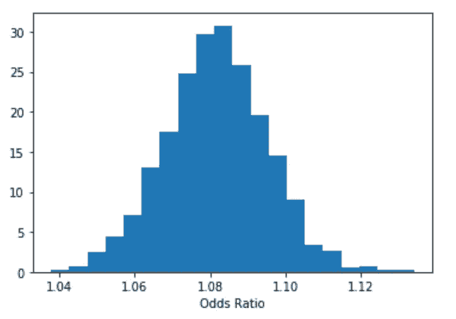

Figure 8

*   我们有 95%的信心，教育的优势比在以下区间内。

```
lb, ub = np.percentile(b, 2.5), np.percentile(b, 97.5)
print("P(%.3f < Odds Ratio < %.3f) = 0.95" % (np.exp(lb), np.exp(ub)))
```

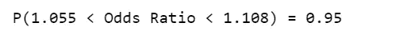

*   我们可以这样解释:“在概率为 0.95 的情况下，优势比大于 1.055，小于 1.108，所以教育效应发生了，因为在保持所有其他独立变量不变的情况下，教育程度较高的人比教育程度较低的人至少有 1.055 的概率订阅定期存款。”
*   我们可以估计所有变量的优势比和百分比效应。

```
stat_df = pm.summary(trace)
stat_df['odds_ratio'] = np.exp(stat_df['mean'])
stat_df['percentage_effect'] = 100 * (stat_df['odds_ratio'] - 1)
stat_df
```

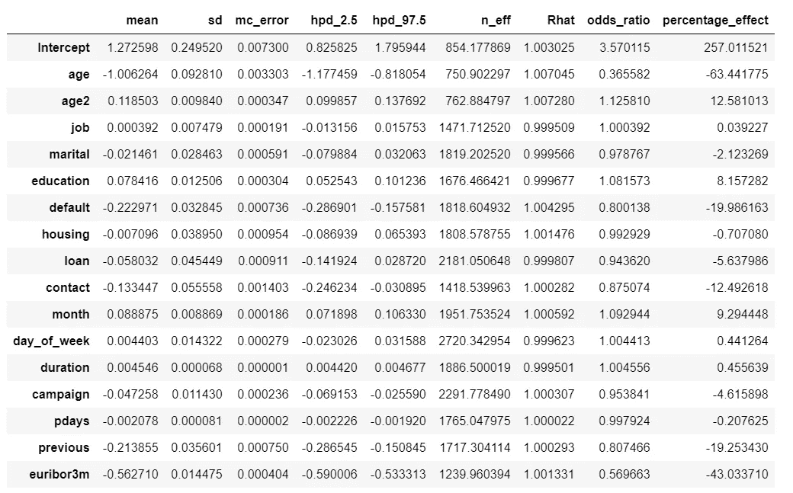

Table 2

*   我们可以这样来解释 percentage_effect:“教育水平每提高一个单位，定期存款的可能性就会增加 8%。同样，在保持所有其他独立变量不变的情况下，euribor3m 每增加一个单位，认购定期存款的可能性就会降低 43%。

# 可信区间

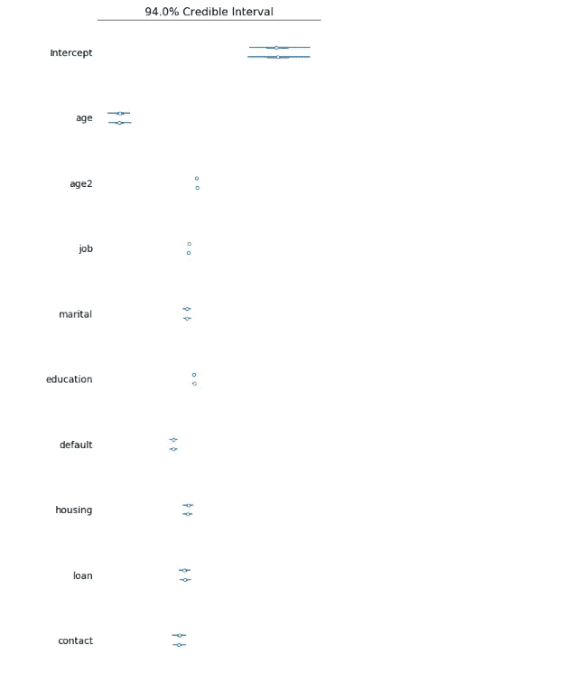

Figure 9

很难展示整个森林地块，我只展示了其中的一部分，但这足以让我们说，存在订阅定期存款的基线概率。除此之外，年龄对订阅的影响最大，其次是联系方式。

# 使用广泛适用的信息标准比较模型(WAIC)

*   如果你记得的话，我们增加了一个年龄 2 变量，它是年龄的平方。现在是时候问它对我们的模型有什么影响了。
*   WAIC 是模型拟合的一种度量，可应用于贝叶斯模型，并且在使用数字技术进行参数估计时有效。阅读[这篇论文](http://www.jmlr.org/papers/volume14/watanabe13a/watanabe13a.pdf)了解更多信息。
*   我们将比较三个多项式复杂度递增的模型。在我们的例子中，我们对 WAIC 分数感兴趣。
*   现在循环所有的模型，计算 WAIC。

compare_models.py

*   PyMC3 包括两个方便的函数，有助于比较不同型号的 WAIC。第一个函数是`compare`，它从一组轨迹和模型中计算 WAIC，并返回一个数据帧，该数据帧从最低到最高 WAIC 排序。

```
model_trace_dict = dict()
for nm in ['k1', 'k2', 'k3']:
    models_lin[nm].name = nm
    model_trace_dict.update({models_lin[nm]: traces_lin[nm]})dfwaic = pm.compare(model_trace_dict, ic='WAIC')
dfwaic
```

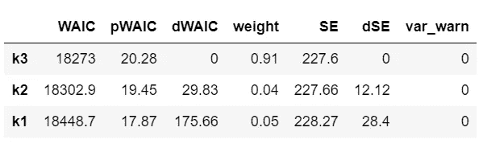

Table 3

*   我们更喜欢 WAIC 较低的型号。
*   第二个便利函数获取`compare`的输出并生成一个汇总图。

```
pm.compareplot(dfwaic);
```

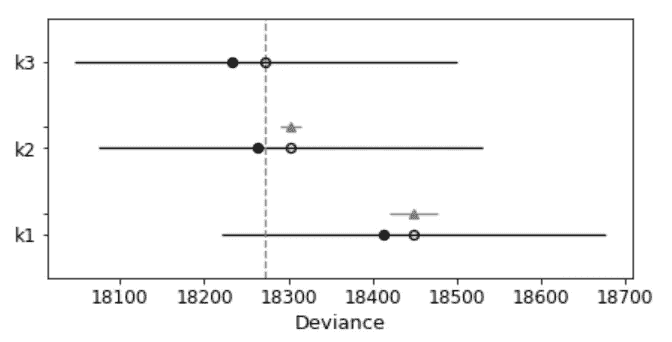

Figure 10

*   空心圆圈代表 WAIC 的值，与之相关的黑色误差线是 WAIC 的标准偏差值。
*   最低 WAIC 值也用垂直灰色虚线表示，以便与其他 WAIC 值进行比较。
*   实心黑点是每个模型的样本内偏差，对于 WAIC 来说，与相应的 WAIC 值相差 2 pWAIC。
*   对于除排名第一的模型之外的所有模型，我们还得到一个三角形，指示该模型和排名第一的模型之间的 WAIC 差值，以及一个灰色误差条，指示每个模型的排名第一的 WAIC 和 WAIC 之间的差值的标准误差。

这证实了包含年龄平方的模型比不包含年龄平方的模型更好。

# 后验预测检查

与标准的机器学习不同，贝叶斯专注于预测的模型可解释性。但我很好奇，如果我们计算标准的机器学习指标，我们会得到什么。

我们将使用参数的平均值作为“最有可能”的估计值来计算指标。

bayesian_metrics.py

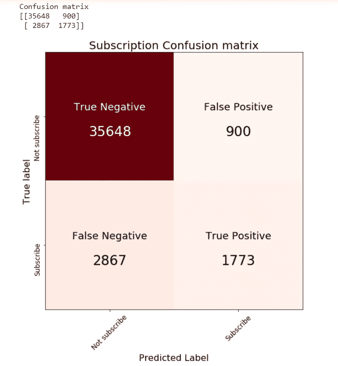

Figure 11

```
print('Accuracy of the full model: ', accuracy_score(preds, data['outcome']))
print('f1 score of the full model: ', f1_score(preds, data['outcome']))
```

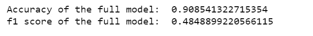

[Jupyter 笔记本](https://github.com/susanli2016/Machine-Learning-with-Python/blob/master/Bayesian%20Logistic%20Regression_bank%20marketing.ipynb)可以在 [Github](https://github.com/susanli2016/Machine-Learning-with-Python/blob/master/Bayesian%20Logistic%20Regression_bank%20marketing.ipynb) 上找到。祝你一周愉快！

参考资料:

 [## GLM:逻辑回归- PyMC3 3.6 文档

### 编辑描述

docs.pymc.io](https://docs.pymc.io/notebooks/GLM-logistic.html)  [## 型号比较-pymc 3.6 文档

### 为了演示模型比较标准在 PyMC3 中的使用，我们实现了来自第 5.5 节的 8 所学校的示例…

docs.pymc.io](https://docs.pymc.io/notebooks/model_comparison.html) 

这本书:用 Python 进行贝叶斯分析，第二版