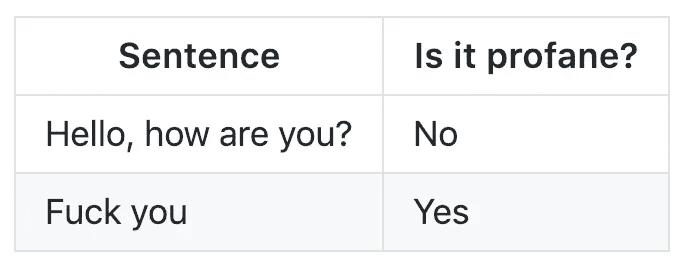
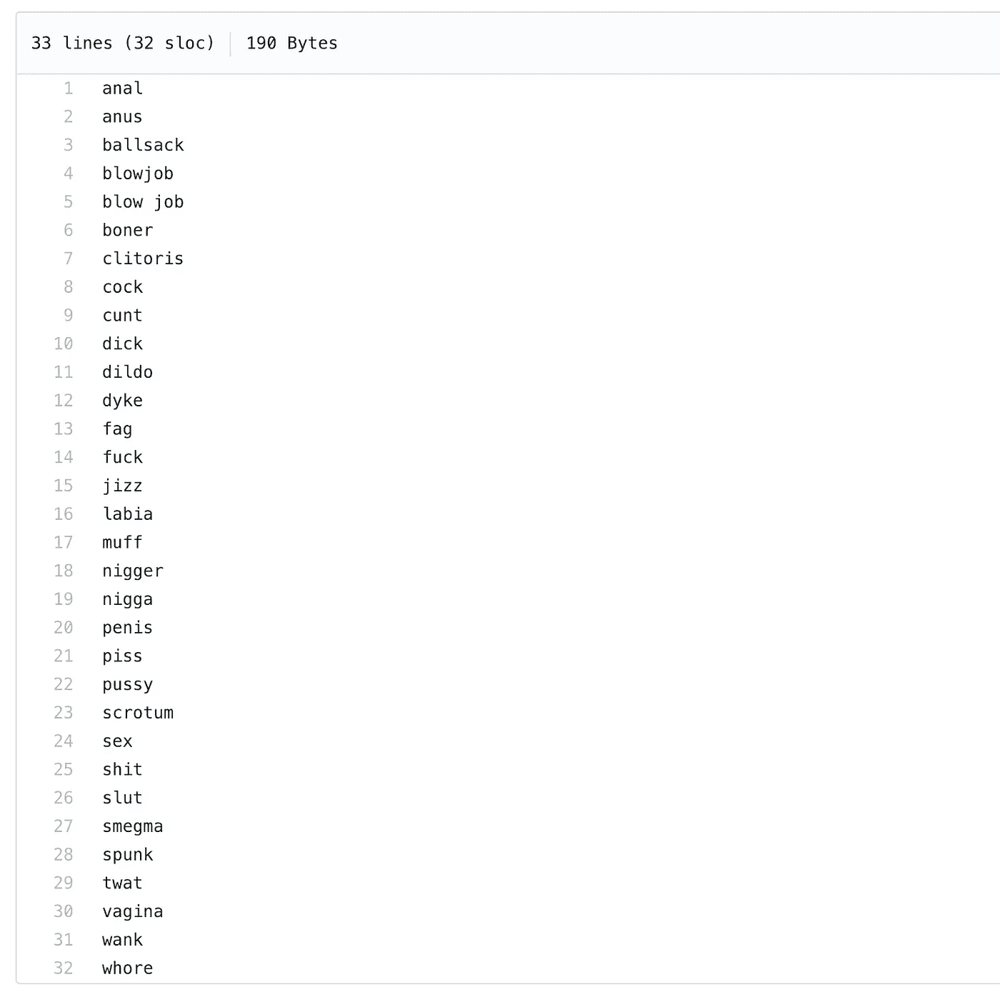
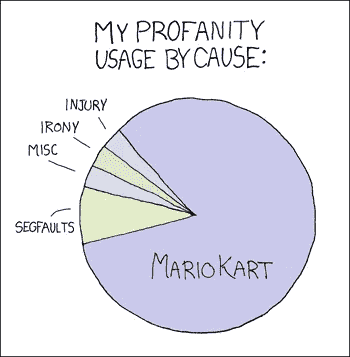
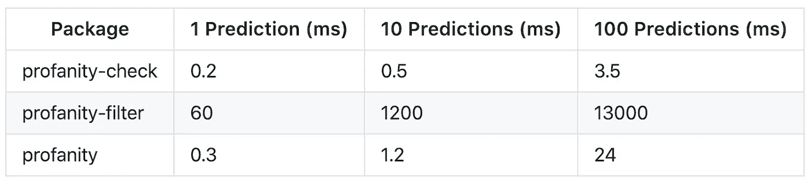
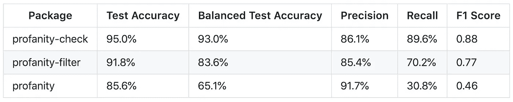
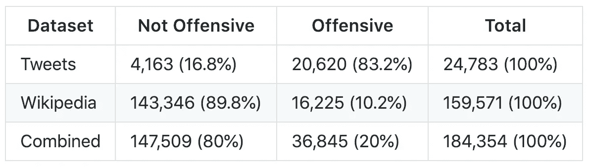
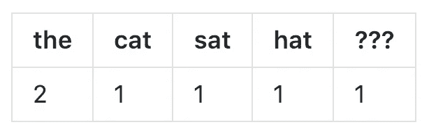
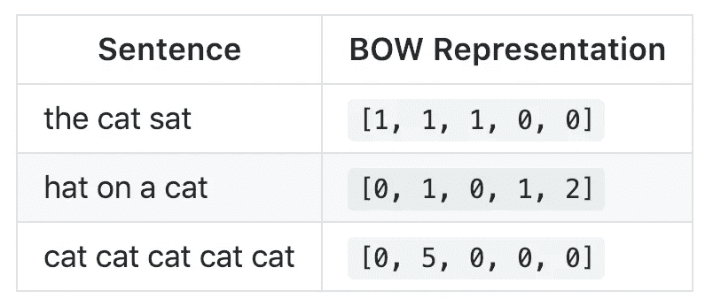

# 用 scikit-learn 构建一个更好的亵渎检测库

> 原文：<https://towardsdatascience.com/building-a-better-profanity-detection-library-with-scikit-learn-3638b2f2c4c2?source=collection_archive---------9----------------------->

## 为什么现有的库没有启发性，以及我如何建立一个更好的库。

几个月前，我需要一种方法来检测用户提交的文本字符串中的亵渎内容:



This shouldn’t be that hard, right?

为此，我最终构建并发布了自己的库，名为[亵渎检查](https://github.com/vzhou842/profanity-check):

[](https://github.com/vzhou842/profanity-check) [## vzhou 842/亵渎性检查

### 一个快速、健壮的 Python 库，用于检查字符串中的攻击性语言。-vzhou 842/亵渎-检查

github.com](https://github.com/vzhou842/profanity-check) 

当然，在我这么做之前，我在 [Python 包索引](https://pypi.org/) (PyPI)中寻找任何可以为我做这件事的现有库。搜索查询“亵渎”得到的结果只有一半还不错:

*   [脏话](https://pypi.org/project/profanity/)(理想的包名)
*   [更好——亵渎](https://pypi.org/project/better-profanity/) : *“灵感来自包* [*亵渎*](https://github.com/ben174/profanity) [*本·弗里德兰*](https://github.com/ben174) *的* *，这个库比原来的快多了。”*
*   [亵渎过滤器](https://pypi.org/project/profanityfilter/)(有 31 颗 Github 星，比大多数其他结果多 30 颗)
*   [脏话过滤](https://pypi.org/project/profanity-filter/)(采用机器学习，说够了吧？！)

然而，第三方库有时可能是粗略的，所以我对这 4 个结果做了尽职调查。

# 亵渎，更好的亵渎，亵渎过滤器

在快速浏览了一下`profanity`存储库之后，我找到了一个名为 [wordlist.txt](https://github.com/ben174/profanity/blob/master/profanity/data/wordlist.txt) 的文件:



Sorry this image of profanities is so big…

整个`profanity`库只是这个 32 个单词列表的包装器！`profanity`只需查找其中一个单词就能检测出亵渎。

令我沮丧的是，`better-profanity`和`profanityfilter`都采取了同样的方法:

*   `better-profanity`使用[一个 140 字的单词表](https://github.com/snguyenthanh/better_profanity/blob/master/better_profanity/profanity_wordlist.txt)
*   `profanityfilter`使用[一个 418 字的单词表](https://github.com/areebbeigh/profanityfilter/blob/master/profanityfilter/data/badwords.txt)

这很糟糕，因为**基于单词表的亵渎检测库非常主观。**例如，`better-profanity`的单词列表中就包含了单词“suck”你愿意说任何包含“吸”字的句子都是亵渎吗？此外，任何硬编码的不良词汇列表将不可避免地是不完整的——你认为只有`profanity`的 32 个不良词汇吗？



Fucking Blue Shells. source: [xkcd](https://xkcd.com/290/)

已经排除了 3 个库，我把希望放在了第 4 个也是最后一个:`profanity-filter`。

# 脏话过滤器

`profanity-filter`使用机器学习！太棒了。

原来，是 ***真的*** 慢。下面是我在 2018 年 12 月运行的一个基准测试，比较了(1) `profanity-filter`、(2)我的库`profanity-check`、(3) `profanity`(有 32 个单词列表的那个):



A human could probably do this faster than profanity-filter can

我需要能够实时执行许多预测，而`profanity-filter`甚至还不够快。但是，嘿，也许这是一个经典的速度与准确性的权衡，对不对？

没有。



At least profanity-filter is not dead last this time

我在 PyPI 上找到的库都不能满足我的需求，所以我自己建了一个。

# 建筑物亵渎检查第 1 部分:数据

我知道我希望`profanity-check`基于数据进行分类，以避免主观*(理解为:可以说我使用了机器学习)*。我从两个公开来源收集了一个综合数据集:

*   来自[t-Davidson/仇恨言论和攻击性语言](https://github.com/t-davidson/hate-speech-and-offensive-language/tree/master/data)的“推特”数据集，包含从推特上抓取的推文。
*   Alphabet 的 [Conversation AI](https://conversationai.github.io/) 团队发布的来自 [this Kaggle competition](https://www.kaggle.com/c/jigsaw-toxic-comment-classification-challenge) 的“维基百科”数据集，其中包含来自维基百科 talk page edits 的评论。

这些数据集中的每一个都包含了文本样本，这些样本是由人们通过众包网站手工标注的，比如[Figure 8](https://www.figure-eight.com/)。

我的数据集最终看起来是这样的:



Combined = Tweets + Wikipedia

> Twitter 数据集有一个名为`class`的列，如果推文包含仇恨言论，则为 0，如果包含攻击性语言，则为 1，如果两者都不包含，则为 2。我将任何一条`class`为 2 的推文归类为“不冒犯”，而将所有其他推文归类为“冒犯”。
> 
> 维基百科数据集有几个二进制列(如`toxic`或`threat`)，表示该文本是否包含该类型的毒性。我将任何包含毒性类型的文本归类为“攻击性的”，而将所有其他文本归类为“非攻击性的”

# 建筑亵渎检查，第 2 部分:培训

现在有了一个干净的组合数据集(你可以[在这里](https://github.com/vzhou842/profanity-check/blob/master/profanity_check/data/clean_data.csv)下载)，我已经准备好训练这个模型了！

> 我跳过了我是如何清理数据集的，因为老实说，这很无聊——如果你有兴趣了解更多关于预处理文本数据集的信息，请查看[这个](https://machinelearningmastery.com/clean-text-machine-learning-python/)或[这个](https://medium.com/@datamonsters/text-preprocessing-in-python-steps-tools-and-examples-bf025f872908)。

Are you also surprised the code is so short? Apparently [scikit-learn](https://scikit-learn.org/) does everything.

这里有两个主要步骤:(1)矢量化和(2)训练。

## 矢量化:单词包

我使用了`scikit-learn`的 [CountVectorizer](https://scikit-learn.org/stable/modules/generated/sklearn.feature_extraction.text.CountVectorizer.html) 类，它基本上通过计算每个给定单词出现的次数，将任何文本字符串转换成一个向量。这就是所谓的[袋字](https://victorzhou.com/blog/bag-of-words/)(鞠躬)表示法。例如，如果英语中仅有的单词是`the`、`cat`、`sat`和`hat`，则句子`the cat sat in the hat`的可能矢量化结果可能是:



“the cat sat in the hat” -> [2, 1, 1, 1, 1]

`???`代表任何未知单词，对于这个句子来说就是`in`。任何句子都可以这样表示为`the`、`cat`、`sat`、`hat`和`???`的计数！



A handy reference table for the next time you need to vectorize “cat cat cat cat cat”

当然，英语中有更多的单词，所以在上面的代码中我使用了`fit_transform()`方法，它做了两件事:

*   **Fit:** 通过查看数据集中出现的所有单词来学习词汇。
*   **Transform** :将数据集中的每个文本字符串转换成它的向量形式。

## 训练:线性 SVM

我决定使用的模型是线性支持向量机(SVM)，它是由`scikit-learn`的 [LinearSVC](https://scikit-learn.org/stable/modules/generated/sklearn.svm.LinearSVC.html) 类实现的。[这个](https://medium.com/machine-learning-101/chapter-2-svm-support-vector-machine-theory-f0812effc72)和[这个](https://www.svm-tutorial.com/2014/11/svm-understanding-math-part-1/)如果你不知道什么是支持向量机，是很好的介绍。

> 上面代码中的 [CalibratedClassifierCV](https://scikit-learn.org/stable/modules/generated/sklearn.calibration.CalibratedClassifierCV.html) 是一个包装器，为我提供了`predict_proba()`方法，它返回每个类的概率，而不仅仅是一个分类。不过，如果最后一句对你来说毫无意义，你几乎可以忽略它。

你可以用一种(简化的)方式来思考线性 SVM 的工作原理:在训练过程中，该模型学习哪些单词是“坏的”，以及它们有多“坏”，因为这些单词在攻击性文本中出现得更频繁。**就好像训练过程是在为我挑出“不好的”单词**，这比用我自己写的单词表好多了！

线性 SVM 结合了我发现的其他亵渎检测库的最佳方面:它足够快，可以实时运行，但又足够健壮，可以处理许多不同类型的亵渎。

# 警告

话虽如此，`profanity-check`远非完美。让我明确一点:对`profanity-check`的预测持保留态度，因为**也会犯错。例如，它不擅长挑选不太常见的脏话变体，如“f4ck you”或“you b1tch ”,因为它们在训练数据中出现的频率不够高。你永远无法检测出所有的脏话(人们会想出新的方法来逃避过滤器)，但是`profanity-check`在发现大多数方面做得很好。**

# 亵渎-检查

`profanity-check`是开源的，可以在 PyPI 上获得！简单地说，使用它

```
$ pip install profanity-check
```

怎样才能更好？如有任何想法或建议，请随时联系我们或发表评论！

[](https://github.com/vzhou842/profanity-check) [## vzhou 842/亵渎性检查

### 一个快速、健壮的 Python 库，用于检查字符串中的攻击性语言。-vzhou 842/亵渎-检查

github.com](https://github.com/vzhou842/profanity-check) 

*也贴在*[【victorzhou.com】](https://victorzhou.com/blog/better-profanity-detection-with-scikit-learn/)*上。*