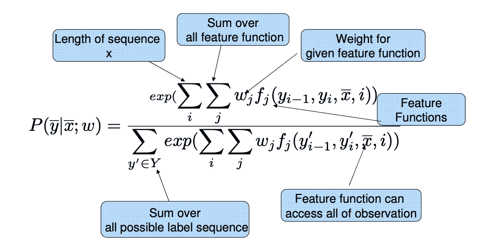
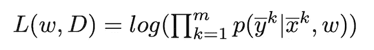
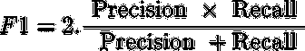
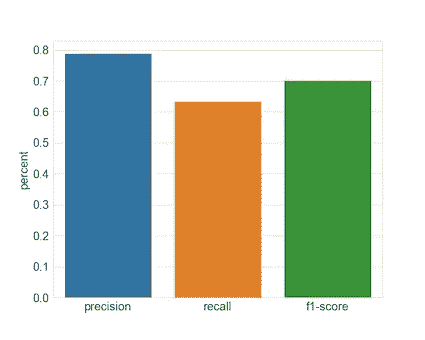
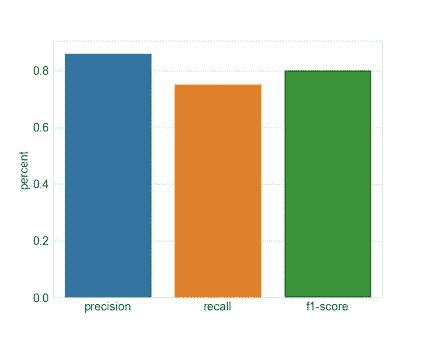

# 构建更好的查询引擎

> 原文：<https://towardsdatascience.com/building-a-better-query-engine-ff52cb6364cd?source=collection_archive---------33----------------------->


> ***TL；博士*** *这篇文章讲述了我们如何引入一个自由文本查询引擎来取代传统的基于过滤器的方法，使用命名实体识别和一些其他技巧来查询数据。*

所有企业都在以巨大的速度生成数据。当数据量很大时，我们会希望查看我们可能感兴趣的数据子集(应用过滤器)。所以传统上这些过滤器转化为数据库查询。对 IBM 中所有概要文件的简单查询如下所示

> SELECT * from profiles where company = " IBM "

当以有意义的方式向用户呈现数据时，Draup 面临着非常类似的挑战。它有一个庞大的配置文件生态系统，用户可以根据几个过滤器参数缩小范围。您可以根据公司、位置、技能、业务职能等选择个人资料。

这是基于过滤器的方法的样子。


Filter-Based Approach

当每个类别只有几个选项时，过滤很容易，但随着每个类别的选项增加，复杂性就会不成比例。

# 另一种查询方法

在 Draup，我们希望摒弃这种过滤搜索结果的方式，改善我们的用户体验。所以我们研究了另一种查询平台的方法。用户现在可以输入自由文本查询，告别所有由过滤器造成的混乱。这里有几个例子

```
- Show me data engineers skilled in python
- Someone who is located at san francisco with the qualification of a data scientist.
- Show me top executives in Amazon
- Adam from Microsoft, Redmond
```

所以第一个查询应该转换成下面的 SQL 查询。

> **从**档案**中选择** *，其中**JOB _ TITLE = " data engineer "**和 **SKILL = "python"**

我们从机器学习的角度来处理这个问题。这个问题在 ML 世界中被称为命名实体识别(NER)。

# 构建命名实体识别系统

**命名实体识别**是[信息提取](https://en.wikipedia.org/wiki/Information_extraction)的一个子任务，旨在定位非结构化文本中的命名实体提及并将其分类为预定义的类别，例如**个人和组织名称、位置**、**日期、**等。

NER 有出色的开源模型 ( [1](https://github.com/explosion/spaCy/tree/master/spacy) 、 [2](https://stanfordnlp.github.io/stanfordnlp/) 、 [3](https://www.nltk.org/) 、 [4](https://github.com/zalandoresearch/flair) )，但它们本质上非常普通。这些模型适用于一般的实体类型，如人名、位置、组织、日期等，但是在 Draup 中，我们关心的要多得多。我们还有其他几个实体，如技能、子垂直行业、业务职能、组织级别等，这些都是这些预训练模型无法涵盖的。所以我们得出结论，我们必须建立自己的 NER 系统。

# 构建数据集

这通常是任何机器学习(ML)过程中最关键的部分。ML 遵循一个简单的规则，**“垃圾入，垃圾出”**。这意味着一个 ML 模型的好坏取决于它所训练的数据。牢记这一点，我们努力产生尽可能多的例子。我们可以达到大约 200 个可能的查询。这是用于训练模型的相对较小的数据集。对用户查询模式的仔细研究给了我们关于如何通过数据扩充生成更多数据的想法。人们似乎并不关心自由文本查询中重要单词的大写。许多用户没有注意到**使用正确的标点符号**，但是仍然期望模型能够工作。这些见解有助于我们建立一个快速的数据增强管道，为我们创建更多的训练示例。所有这些努力总共产生了 **1000 个培训示例**。

# 建模技术的选择

构建 NER 系统有两大主题:

1.  传统算法如**条件随机场** (CRF)
2.  基于深度学习的方法

如果你有一个大的数据集，基于深度学习的方法在文本数据领域非常有效。大约 1000 个例子还不够。最近，通用语言模型，如谷歌的伯特 T21 或 OpenAI 的 GPT-2 已经在较小的数据集上显示出有希望的结果。然而，这些模型体积庞大，我们觉得它们对我们的任务来说有点大材小用。与传统方法相比，深度学习的另一个重要缺点是很难解释和说明模型行为。

另一方面，条件随机场即使在数据有限的情况下也能很好地完成 NER 任务。

# 条件随机场模型

> 本节以一些直观的细节讨论了 CRF，但涉及一些数学问题。您可以选择跳过它。

当我们处理序列时，使用 [**条件随机场**](https://repository.upenn.edu/cgi/viewcontent.cgi?article=1162&context=cis_papers) 模型。在我们的例子中，输入是一个单词序列，输出是一个实体标签序列。


Words and Tags sequence

让我们把单词序列叫做 x̄，把标签序列叫做 y̅.
同样，让我们定义所谓的特征函数:f(yᵢ₋₁、yᵢ、x̅，i)
这里，特征函数采用 4 个参数:-

> 1: i，当前索引在序列
> 2: x̄，整个输入序列
> 3: yᵢ₋₁，先前的输出标签索引在 i
> 4: yᵢ，当前输出标签索引在 I

为了让事情更清楚，让我们定义一个示例特征函数。

f(yᵢ₋₁、yᵢ、x̅、i) = { 1 如果 yᵢ₋₁和 yᵢ都是**头衔**并且现在的单词是‘**工程师**’,否则为 0}

正如您所看到的，这是一个非常具有描述性的特征函数，如果我们定义了很多这样的特征函数，我们就可以提取出很多关于文本数据的信息。这是另一个功能。

f(yᵢ₋₁、yᵢ、x̅、i) = { 1 如果 yᵢ₋₁是其他人，yᵢ是标题，当前单词是大写的**，否则 0}**

在收集了一系列特征函数之后，我们想要找到一个概率分布函数。这个函数应该告诉给定 x̅.，每个可能的 y̅的概率是多少下面的等式定义了这个概率。



Image Credit: Sameer Maskey slides

这里 exp 是指数函数。上述函数使用指数平滑地将概率分布在所有可能的标签序列上，并确保概率之和为 1。

如果你仔细观察，你会发现**每个特征函数都被赋予了一个权重**，这在直觉上是有意义的，因为不是所有的特征函数都具有同等的重要性。现在，给定数据，我们希望**最大化我们的数据的条件似然**并找到最佳的权重集。



Conditional Likelihood function

这里 L 是条件似然函数，k 迭代所有的训练例子。使用梯度下降，我们可以学习最适合我们数据集的参数(权重)。

嗯，这看起来需要做很多工作，但是我们使用了[**sklearn-CRF suite**](https://sklearn-crfsuite.readthedocs.io/en/latest/tutorial.html)库，在大约 1000 个例子的数据集上训练 CRF 模型。

# 准确率、召回率和 F1 评分

下面用一个简单的例子来解释一下 [**精度和回忆一下**](/precision-vs-recall-386cf9f89488) 。假设我们建立了一个模型，可以预测/提取文本中提到的所有技能，我们的输入文本有 9 项技能。假设模型预测了 10 项技能，其中 6 项实际上是技能，另外 4 项不是技能。

> A =相关记录数= 9
> B =检索到的相关记录数= 6
> C =检索到的记录数= 10
> D =检索到的不相关记录数= 10–6 = 4
> 
> **精度= B/C = 0.6
> 召回=B/A = 0.667**

一个好的模型在精确度和召回率上都有很高的值。然而，有时用一个值来评估模型的好坏是有好处的。f1 分数由此而来。它将精确度和召回率和谐地结合在一起。



f1-score

所以在我们的例子中，f1 分数是 0.632

# 模型验证和改进

如果模型不能识别查询中的所有实体，这是可以接受的。但是如果模型错误地识别了实体，那么结果就会受到负面影响。例如，如果模型将一个人的名字识别为一家公司，那么很可能不会有搜索结果，甚至更糟的是，系统会产生错误的结果。因此，我们需要非常好的精确度和尽可能多的召回率。



Initial Model

我们最初的努力导致了以下结果。

> 精确度:0.790
> 召回率:0.635
> F1-得分:0.702

这些结果是基于完全看不见的数据。

如果看召回，好像挺低的。这通常是 CRF 技术的一个问题。CRF 通常可以达到很好的精度，但是在召回率上有所欠缺。

> 为了解决低召回率的问题，我们引入了几个特征函数，它们使用我们的几个实体的管理列表。

> f(yᵢ₋₁，yᵢ，x̅，我)= {1 如果 yᵢ₋₁是其他，yᵢ是技能，并且当前单词存在于我们的已知技能列表中，否则 0}

假设我们的列表中有这样的技能:
('AutoCAD '，' python '，' java '，' MongoDB '，' nodejs '，……)


Value of skill lookup function for each index in the original sequence

在为其他一些实体定义了这样的特性之后，我们取得了巨大的进步。在引入这些特性后构建的模型给出了以下结果。



Improved Model

精确度:0.862
召回率:0.754
F1-得分:0.803

帮助我们的引擎在生产中表现良好的另一个技巧是使用 [**拼写纠正**](https://norvig.com/spell-correct.html) 。用户在向系统查询时似乎很匆忙。我们经常会遇到这样的查询:

> *向我展示****amzon*** *Java****伦敦*** *的开发人员*

拼写纠正过程帮助我们在很大程度上纠正这种情况，并使我们的系统更可用。

# 它看起来像什么

系统现在允许用户输入自由文本查询，然后提取实体并显示给用户，以及显示基于这些实体/过滤器的结果。


New Search Interface

上面的例子显示了微软中的查询“ **Director”。系统正确地识别出实体**董事**和**微软**，并为您应用这些过滤器。**

这只是自由文本查询引擎的开始。我们的系统将随着我们获得更多数据的训练而改进。

**参考文献:-**

*   [*条件随机场:用于分割和标记序列数据的概率模型*](https://repository.upenn.edu/cgi/viewcontent.cgi?article=1162&context=cis_papers)
*   [*Web 对数线性模型的统计 NLP，MEMM，条件随机字段*](http://www.cs.columbia.edu/~smaskey/CS6998-0412/slides/week13_statnlp_web.pdf)*:***same er Maskey**
*   [*自然语言工具包*](https://www.nltk.org/)
*   [*Spacy:工业级自然语言处理*](https://spacy.io/)
*   [*sk learn-CRF suite*](https://sklearn-crfsuite.readthedocs.io/en/latest/)
*   [*最大似然估计*](https://en.wikipedia.org/wiki/Maximum_likelihood_estimation)