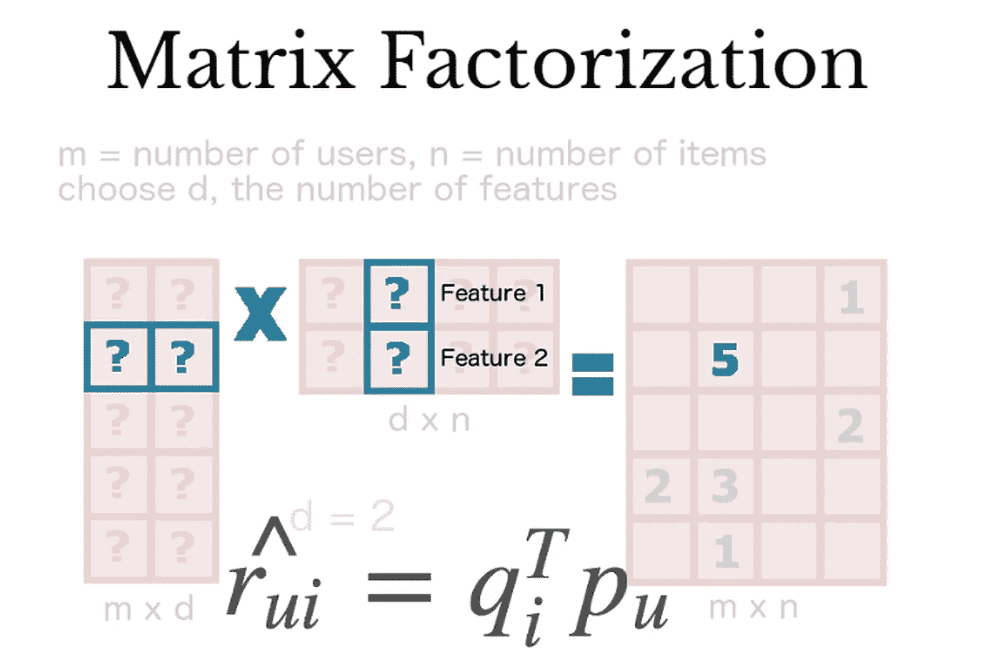
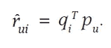
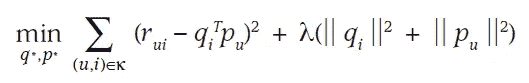
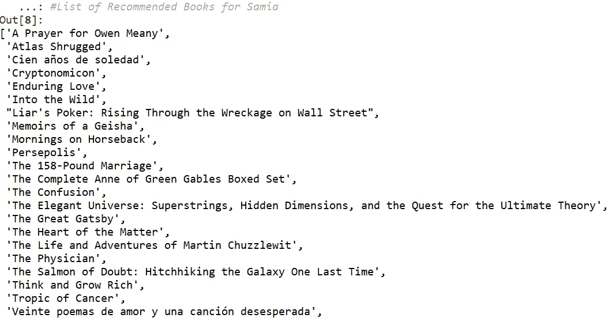

# 利用矩阵分解和 SV 分解构建图书推荐系统

> 原文：<https://towardsdatascience.com/building-a-book-recommendation-system-using-matrix-factorization-and-sv-decomposition-d3541112d53e?source=collection_archive---------21----------------------->

每周一，我都会点击“发现周刊”的列表，看看 Spotify 提供了哪些个性化服务，特别是针对我前一周上传的音乐定制的服务。有时我会遇到一个隐藏的宝石(有一些音乐跳过)，有时我会完全失望。但事实是，我通常也有错，因为我根据情绪听完全不同的音乐风格，所以所发生的是推荐引擎没有区分情绪，我最终不得不做一些手动工作，以在给定的时间达到期望的精神状态。

然而，撇开情绪不谈(我强烈推荐 Spotify 团队考虑/测试的产品功能)，我一直想知道 Spotify 是如何找出这些标题的，即使在其系统中除了“另存为收藏夹”按钮之外没有评级，该按钮发送的是分类信号而不是数量信号……直到我最近意识到他们的推荐引擎使用了不同架构的组合:

**1。基于记忆的协同过滤推荐器:**，它关注用户和所讨论的项目之间的关系(当数据包含对所提供的各种项目的评级时是理想的)。矩阵分解在这里是一个强大的数学工具，用来发现用户和物品之间潜在的交互。比方说，A 和 B 听歌曲 X，B 经常听歌曲 Y，那么 A 也很可能听宋立科 Y。

**2。基于内容的推荐:**关注项目本身的特征。因此，不是分析用户/客户与项目的主动交互，而是主要在后者的水平上进行分析，因此检查和测量项目特征的相似性。为了保持在音乐环境中，让我们举例说，你经常听歌曲 X 和 Y，而这两首歌恰好来自一位意大利音乐家，他使用独特的钢琴曲调，并且恰好属于歌曲标签中指定的音乐流派和时代。
这种推荐方法将使用不同的机器学习技术(例如，自然语言处理、音频建模等。)来确定具有相似属性的歌曲 Z。

我想尝试一下第一种推荐方式，因为它似乎比第二种更简单。最重要的是，我想了解算法背后的数学原理，并提供简单的直觉，或许还想在转向更复杂的模型之前，为推荐系统在实践中的工作方式打下基础。

**10k Books 数据集** 在本教程中，我选择了在 Kaggle 上找到的 [Goodbooks-10k 数据集作为开始。我一直担心读完一本精彩的书后会感到失望，所以我认为这将解决个人的矛盾，总的来说，这可能只是一件有趣的事情，因为朋友们会问我接下来该读什么。
zip 文件包含多个数据集(book_tags、books、ratings、tags)。我们将只使用包含与我们的分析相关的列的书籍和评级数据集。](https://www.kaggle.com/zygmunt/goodbooks-10k)

首先，让我们导入必要的库。

```
import pandas as pd
import numpy as np
import sklearn
from sklearn.decomposition import TruncatedSVD
import warnings
```

让我们上传数据集。“图书”数据集包含 23 列。我们将分割数据并删除变量，只保留感兴趣的列。我们将保持评级数据集不变。
接下来，我们将合并“book_id”上的两个数据集。Book_id 比 original_title 更可靠，因为某些标题的格式可能会有一些变化。在继续创建矩阵之前，我们将删除 user_id 和 book_id 以及 user_id 和 original_title 的成对组合中的重复项。

```
books = pd.read_csv('books.csv', sep=',')
books = books.iloc[:, :16]
books = books.drop(columns=['title', 'best_book_id', 'work_id', 'books_count', 'isbn', 'isbn13', 'original_publication_year','language_code','work_ratings_count','work_text_reviews_count'])
books.head(5)
ratings = pd.read_csv('ratings.csv', sep=',')
ratings.head(5)df = pd.merge(ratings, books, on="book_id")
df.head(5)df1= df.drop_duplicates(['user_id','original_title'])
df1= df.drop_duplicates(['user_id','book_id'])
df1.head(10) #went down from 79701 to 79531 
df1.shape #(79531, 8)
```

**矩阵分解法& SVD —直觉**

我们现在将使用矩阵分解方法和单值分解模型(SVD)来创建一个矩阵模型。您可以在网上找到许多优秀的技术资源，以更深入的方式描述这些模型，但是我将在这里用简单的术语把它分解给你。

我们接下来要做的是调用 pivot 函数来创建一个数据透视表，用户在这个数据透视表中采用不同的行，预订不同的列，并在这个表中用一个形状(m*n)来表示各自的评分值。

```
######################################
####MATRIX FACTORIZATION
######################################books_matrix = df1.pivot_table(index = 'user_id', columns = 'original_title', values = 'rating').fillna(0)
books_matrix.shape #(28554, 794)
books_matrix.head()
```

如果你看看下面的图形表示，你就会知道幕后发生了什么。首先，我们创建了形状为(m*d)=(books*user_id)的 A 矩阵和形状为(d*n)=(ratings*user_id)的 B 矩阵。



Matrix graphical representation by [Albertauyeung](/overview-of-matrix-factorisation-techniques-using-python-8e3d118a9b39)

结果是两个矩阵之间的乘积(矩阵因式分解),其数学计算值如下:



我们需要创建一组训练数据——我们的训练数据基本上由更小的矩阵组成，这些矩阵是我们想要预测的评级因素。为此，我们将设置另一个矩阵 X，它是上面创建的结果矩阵(“books_matrix”)的转置，也称为*可逆*矩阵。

```
X = books_matrix.values.T
X.shape#Fitting the Model
SVD = TruncatedSVD(n_components=12, random_state=0)
matrix = SVD.fit_transform(X)
matrix.shape #(812, 12)
```

你会注意到我们新创建的矩阵非常稀疏。根据您指定的随机状态，列数是 5 位数，这意味着一个 5 位数的维度空间。这就是 SVD 方法介入的地方。

就像我们在其他数据集上使用 PCA/核 PCA 特征提取方法一样，SVD 是我们在推荐应用中应用于矩阵的另一种方法。奇异值分解可以将我们的维数压缩成更小的数来描述数据中的方差。这里发生的事情是，SVD 将寻找潜在的特征，并从数据中提取它们，从 10.000 个特征减少到只有 10 个，并且将为我们节省大量的计算能力，此外还可以避免数据过度拟合。在这个练习中，我将 SVD 的组件数量设置为 12。为了应用该模型，现在剩下的是拟合和转换训练数据 x。

*注:* *一般来说，在应用 SVD 后，一个常见的做法是引入一个正则化项(下面右边的项)，以避免对数据的过拟合:*



*左边的最小化术语是我们没有信息的评级误差的最小化(例如，未知的当前或未来评级)。我们可以在数学上用上述目标函数得出这些值，在实践中用随机梯度下降(SGD)等方法。
在本教程中，为了简单起见，我没有在实践中引入这两个术语，只是用空值(.菲尔娜(0))。*

**创建相关系数** 接下来我们用 numpy 函数 np_corrcoef 为矩阵中的所有元素创建相关系数函数。我们称之为“corr”。
一旦我们将“corr”应用于我们非常喜欢的一本书，该函数将计算与其余书的所有相关系数，并将返回我们最有可能喜欢的所有书。

```
import warnings
warnings.filterwarnings("ignore",category =RuntimeWarning)#to avoid RuntimeWarning #Base class for warnings about dubious runtime behavior.corr = np.corrcoef(matrix)
corr.shape
```

相关系数的范围从 0 到 1，0 表示两个项目之间不存在相关性，1 表示相反。在我们的例子中，我们越接近 1，其他推荐的书籍就越有可能具有与您输入的书籍高度相关的特征，因此您更有可能喜欢这些书籍。

**检查结果** 现在我们来检查结果。我将创建一个名为“titles”的向量并列出条目。我会挑一本我喜欢的书作为索引。《艺妓回忆录》是我最喜欢的小说之一，所以我们就看这本吧。

```
title = books_matrix.columns
title_list = list(title)
samia = title_list.index('Memoirs of a Geisha')
corr_samia  = corr[samia]
list(title[(corr_samia >= 0.9)])
```

在我运行完全部代码后，这里是算法推荐的书籍列表:



Suggested Book list for Samia

这个看起来不错！我已经读了很多以上的书，可以证明他们中的一些曾经在我的清单上(例如《波斯波利斯》、《荒野》、《了不起的盖茨比》、《百年孤独》、《问题的核心》等)。).我仍然很好奇这个算法在这里使用了哪些潜在的特征来选择“思考和致富”，因为我会把它归类到另一个类别中(非小说+其他考虑)，但这再次揭示了这个算法的一个限制，这可能与我们提供给它的独立变量的权重有关。

**评估结果** 我评估了这个模型，只是看了一下算法给出的书单，因为我已经阅读了(并且非常喜欢)一些推荐的书名，并且为了好玩，和其他人一起运行这个模型，看看他们是否会同意大部分内容——我想我今天就到此为止了。当然，如果您必须提供清晰的性能指标，这不是正确的方法。

为了更加准确，有许多方法来评估推荐系统，并且该方法将根据推荐器的类型而不同(例如，基于内容的与协同过滤的)。一种方法是应用交叉验证模型——将您的用户分成 k 个折叠组并循环进行:将(k-1)个折叠作为训练集，并对剩余的折叠进行测试，对所有结果进行平均。也许这将是后续文章的主题:)

**免责声明&离开的想法:)** 最后，这是我的第一个数据科学/机器学习实践帖子，所以我希望这是一个有用的教程，直观地解释了模型背后的数学原理。
祝您构建自己的推荐引擎愉快，不要忘记订阅我的频道或在下面提问以获得澄清！:)

*关注我在* [Linkedin](https://www.linkedin.com/in/samia-haimoura/)
*连接在* [Twitter](https://twitter.com/SamiaHaimoura)