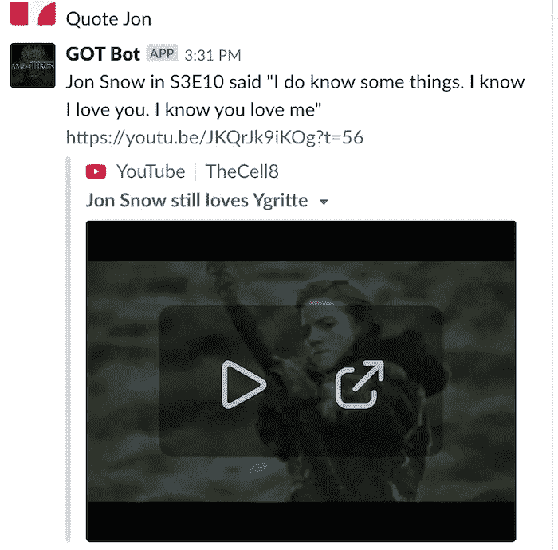
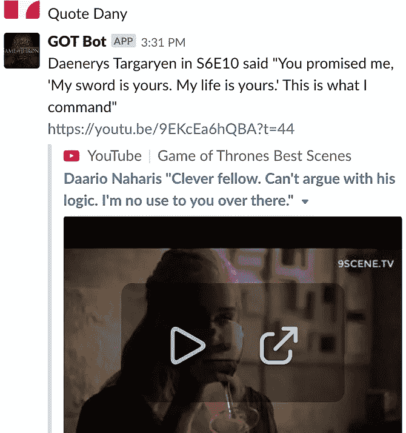
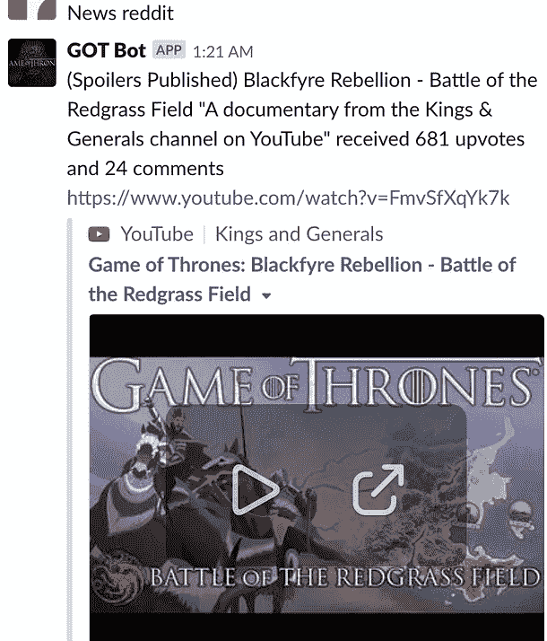
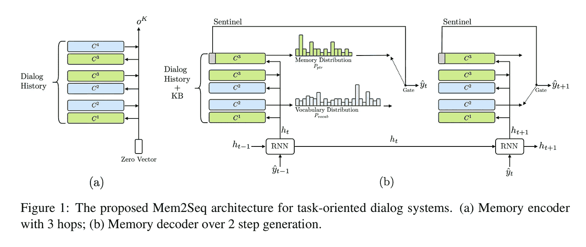

# 为 Slack 构建一个王座聊天机器人游戏:第 1 部分理解语言

> 原文：<https://towardsdatascience.com/building-a-chatbot-for-slack-from-scratch-part-1-understanding-language-1f085b2eda6c?source=collection_archive---------30----------------------->

## 经验教训将深度学习应用于自然语言理解并结合问答


去年夏天，我决定测试一下我的 NLP 技能，着手开发一个聊天机器人。作为《权力的游戏》的忠实粉丝，我决定为《权力的游戏》开发一个聊天机器人。最初，我的目标只是提供一种从 Reddit、Watchers on the Wall、Los Siete Reinos 和 Twitter 等网站轻松获取各种新闻的方式。然而，我很快决定扩展到其他任务，我对如何整合现代 NLP 方法来丰富我的聊天机器人特别感兴趣。这第一篇文章将涵盖自然语言理解和问答组件；第二篇文章将更多地讨论平台和架构。

如果你想使用聊天机器人，那么你可以加入 Slack 上的 Citadel 社区(虽然，正如我将要描述的，我还没有将所有描述的功能添加到实际的产品版本中)。在未来，我计划增加支持，将它安装在您的工作区。还要注意的是，本文中的一些例子和机器人本身的内容包含了第七季的信息。

## 自然语言理解(NLU)

**NLU 深度学习简介**

在哪里以及如何将深度学习集成到聊天机器人中，实际上是一个有点棘手的问题。在聊天机器人的基础上，你可以使用基于规则的方法，机器学习，或者两者的结合。使用基于规则的方法，你通常可以保证只要用户以公式化和受限的方式书写，聊天机器人就会正确地响应用户的查询。通过机器学习(甚至是统计 NLP 方法)，你可以打破刻板的公式，让用户更自然地打字。然而，这样做也引入了不确定性(即使是最好的模型)。此外，即使是 SOTA 模型通常也只适用于有限类型的对话。例如，如果用户开始参与聊天，为面向目标的对话训练的模型通常会崩溃。深度学习当然也需要数据，在这种情况下，我们经常会遇到冷启动问题。因此，你经常需要写你认为用户会问的样本数据。这个过程既费时又不准确。

**形式化的方式**

在看为什么我们可能需要基于机器学习的模型之前，让我们看看使用基于规则的方法的一些限制。使用聊天机器人的公式化方式，我们可以编写类似这样的代码:

Note this is purposefully simplfied. In my actual bot for my rule based methods I usually use a dict to map words to actions to avoid long if statement like these. Also you would obviously have to handle the DB operations etc



Example users requests and responses using the formulaic approach

现在，用户必须用非常公式化的方式来使用聊天机器人。他们必须准确地写出`Quote Jon Snow`或`News Reddit`如果你只想包含简单的查询，这没问题。但是如果想要支持像`Quote about Jon Snow`甚至`Quote from Jon Snow when he is talking about Stannis?`这样的短语的功能，我们可以强迫用户以一种公式化的方式做事情，但是这对用户来说很快就变得复杂和累赘。对于新闻来说也是如此，支持像`Get news from the past 24 Hours on Reddit`甚至`News about Jon Snow in Season 8`这样的复杂查询在最好的情况下会变得很困难，在最坏的情况下也是不可能的。

**槽填充和意图检测**

这就把我们带到了机器学习的缝隙填充和意图检测。在聊天机器人中使用深度学习的一个关键领域是自动获取用户输入的字符串，并将相关的令牌映射到 API 的插槽(这被称为插槽填充或 SLU)。一个相关的领域是意图检测，其集中于将话语映射到意图。这是一个 SLU 注释的例子

```
Quote about Jon                 Snow
0       0   B-focus-character   I-focus-character
Intent: Quote 0 Quote from   Jon       Snow      when he is talking about Stannis
0       0   B-speaker  I-speaker  0   0   0   0       0   I-focus
Intent: Quote 0
```

在某种意义上，槽填充是命名实体识别(NER)的更细粒度版本。例如，在纯 NER 设置中`Jon Snow`可能总是有标签`character`，而对于槽填充，标签将基于他应该占据的槽而改变。注释的格式称为 [IOB](https://en.wikipedia.org/wiki/Inside–outside–beginning_(tagging)) ，代表内-外开始。这意味着一起显示令牌的“块”。

由于机器人的响应将取决于插槽和用户的目标，许多论文集中在联合插槽填充和意图检测。此外，许多 NLU 库如 [Rasa-NLU](https://rasa.com/docs/nlu/) 框架提供了联合 SLU 意图检测。

一旦填充了插槽，我们仍然需要构建实际的查询。查询构造将取决于数据库的设置方式。因此，在大多数情况下，这些代码是您自己手工编写的。然而，[有一些模型](http://aclweb.org/anthology/N18-2093)学习话语到 SQL 查询的直接映射。但是大多数时候，您会有一个现有的 API 或者想要构建一个。因此，让我们看看如何将它变成一个简单的 API 请求:

```
def process_user_text(user_text, model):
    # Let's assume model.predict() returns 
    # intent:str ents:dict (e.g. {"focus_character":"Jon Snow"})
    intent, ents = model.predict(user_text)
    # Assume this function combines multi-token ents an
    # normalizes them to how they appear in the database
    ents = combine_normalize_ents(ents) 
    url = "https://random_site.com/" + intent
    requests.post(url, data=ents)
```

Note although this code resembles the code in the GOT-Bot APIs I have not personally tested this code. I plan on doing so in the next few days. But if you run into errors in the interim let me know.

现在我们可以使用这个简单的 Flask API 来处理这些请求。

回到我们之前的新闻示例，我们将使用以下格式标记数据，以便与 API 一起工作:

```
News about Jon          Snow          in    Season       8
0     0    B-character  I-character    0    B-season  I-season
Intent: News 1
```

正如您所看到的，这种格式允许我们更容易地构造 API 调用和 SQL 查询。现在我们可以定义一个函数(假设我们已经运行了一个 NER 并标记了新闻故事)。

**有限数据场景**

这种方法的问题，当然还有一般深度学习的问题，是需要大量带标签的训练数据。我目前正在研究的一种方法是在许多带注释的对话数据集上使用元学习，以便使模型能够快速适应少数几个例子。

插槽对齐是另一种有趣的(尽管有些局限)方法。[面向域缩放的零镜头帧语义解析](https://arxiv.org/pdf/1707.02363.pdf)，谷歌研究人员 2017 年的一篇文章描述了在 API 中使用槽的名称和/或槽的文档来有效地执行零镜头填充。其想法是，如果模型已经接受了预订航空公司的培训，那么它也应该能够预订公共汽车，因为插槽通常应该重叠(即，两者都有一个`start_city`、`destination_city`)。更进一步，基于餐馆的对话系统可能具有`restaurant_city` (即，在芝加哥为我预订一家餐馆)，而酒店可能具有`hotel_city`。通过利用短语之间的相似语义，一个模型可以学习有效地填充`restaurant_city`，即使它只在机票预订数据上受过训练。当然，这种方法也有局限性:(1)它不能在几乎没有重叠的完全不同的领域上工作；(2)在某些情况下，实际上可能存在负迁移(例如，在出租车预订上表现更差；它混淆了`drop_off` 和`pickup_spot`，因为它们是依赖于上下文的；即使这些可以与`start_city`和`destination_city`对齐，它们的表示也不相似)。对于我的用例，这种方法可能不会工作，因为在大型公共槽填充数据集和我的聊天机器人之间很少有重叠的语义槽。

**超越关节槽填充和意图检测模型**

但是，即使是联合 NLU 模型也有其局限性，因为它们不使用上下文。例如，假设用户说`Quote from Robert Baratheon`，然后说`Get me another quote from him.`，在这种情况下，之前描述的 NLU 模型之一不知道该做什么，因为它不使用对话历史。类似地，用户可能会问这个问题`Who is Jon Snow's mother?`，机器人将(希望)返回`Lyanna Stark`，那么如果用户问`When did she run off with Rhaegar?`，它甚至可能不会将`her`投给一个槽。有时，我们可能需要更新或请求关于某些插槽的附加信息。例如，如果用户要求`News from the past 24 hours about Season 8?`，但 API 要求指定新闻来源，机器人可能会回复`From what source?`，或者如果用户声明`Get the scene from episode 2?,`，机器人可能会回复`from what season?`

端到端对话模型应该能够处理这些任务。为测量该任务的进度而创建的一个挑战是对话状态跟踪。特别是挑战的第二个版本 [DSTC2](http://camdial.org/~mh521/dstc/downloads/handbook.pdf) ，测量了模型在需要时发布和更新 API 调用以及向用户请求额外信息的能力。在这个挑战中做得很好的第一个模型是用于目标导向对话的记忆网络。这是由脸书的研究人员在论文《学习端到端的面向目标的对话》中完成的。他们表明，记忆网络远远胜过其他机器学习方法。

最近出现了像 [*Mem2Seq*](https://github.com/HLTCHKUST/Mem2Seq) 这样的论文，它们积极地将对话历史与知识库结合起来，并在响应生成中使用它们。具体来说，Mem2Seq 有两个部分，一个是对对话历史进行编码的内存编码器，另一个是使用编码的 dialogue/KB 生成用户响应的解码器。Mem2Seq 在 DSTC2 challenge、BABI 和车载 stanford 数据集上获得了 SOTA 结果。



The architecture of Mem2Seq notice how both dialog history and the knowledge base are encoded that is utilized at each turn.

为 GOT-Bot 训练 Mem2Seq 需要三样东西:知识库、带注释的意图和带注释的对话历史。这使得更难适应 GOT-Bot，因为知识库需要转换成三元组，如(person，person2，relation)。

**问题解答**

从回答问题开始到填充位置结束之间的界限通常很模糊。在研究术语中，我们通常将 QA 视为基于非结构化文本数据的问题回答。(它也可以基于一个结构化的知识库，但是在这种情况下，填隙结束和 QA 开始的确切位置特别混乱)。在前一种情况下，这通常意味着从文本数据中搜索和提取答案，而不是计算查询数据库时要填充哪些槽。在《权力的游戏》机器人的上下文中，这意味着接受一个用户问题，在 ElasticSearch 上搜索适当的索引，然后从返回的结果中提取正确的答案。在讨论具体如何之前，我们先来看看用户可能会问的不同类型的问题:

基本上有三类问题:

(1)通过查询知识图可以回答的问题。

`Who has the Hound killed?`

`Who is Jon Snow's father?`

`What is the motto of house Glover?`

`Who was Margeary married to?`

`What region is Harrenhall in?`

这些问题都有已知的答案，可以在结构化知识图中找到。问题是我们需要将用户查询转换成 SQL 或 API 请求。这类似于我们需要做的槽填充。在许多情况下，我们实际上可以通过将问题作为另一个意图来表达，从而将这个问题作为一个填充问题。举个例子，

```
Who has the Hound               killed 
0   0    0  I-focus_character   I-attribute 
Intent kb_question`
```

或者在以下问题的情况下:

```
What region             is   Harrenhall       in?
0    I-location-region   0  I-focus_castle     0 
Intent 
```

然后，我们可以用类似的方式构造一个 API 请求。然而，有大量的数据集对 SQL 有疑问，所以在这种情况下，使用其中一个数据集可能是有意义的。

(2)不在知识图中但是仍然有已知答案并且可以从 MediaWiki 页面或其他 GOT 站点提取的问题。

`How did the war of the five king's start?`

`What happened during Harrenhal tourney?`

`What was the war of the five kings?`

`How did Robert's rebellion end?`

`Who got the Tyrell's to support the Lannisters?`

与此任务最相关的数据集/模型是像 MARCO 女士和 TriviaQA 这样的数据集。尽管许多研究人员对 SQUAD 进行评估，但在现实中，你几乎永远不会得到给你的准确的上下文段落。这使得在 MARCO 女士身上表现良好的模型非常理想，因为它们被给予一个完整的排名结果列表，并且必须从中提取正确的答案。

QuAC 数据集或上下文中的问答类似于前面提到的问答的“端到端”对话模型。它包含涉及多次对话的问题和跟进问题。像 [FlowQA](https://arxiv.org/abs/1810.06683) 这样的模型可以很好地完成对话式 QA 任务，因为它们将对话历史添加到基础模型中。

(3)问题，其中答案是主观的或推测性的，并且需要找到相似的问题或可替换地执行多跳推理。

`Why did Sansa trust Joffery?`

`Who will survive season 8 and why?`

`If Robb Stark hadn't broken his marriage pack would've the Freys betrayed him?`

`Who will kill Cersei?`

`Is Jon the prince that was promised?`

这些问题没有明确的答案，需要分析或推测。因此，最好的解决方案是找到已经回答过的类似问题。这可以通过刮掉的 Quora 索引来实现。但是，这里我们不会使用 QA 模型，而是使用问题相似度模型。可以使用多种方法来完成问题相似性。我目前生产的模型使用一个基本的弹性搜索，然后使用[通用句子编码器](https://arxiv.org/abs/1803.11175) +余弦相似度对结果进行重新排序。为了收集更多的数据来提高排名，机器人目前向用户显示所有前十名的结果。然后，我们可以根据用户的选择重新训练模型。然而，这种方法有几个问题。首先，在许多情况下，最初的弹性搜索通常不会返回好的问题。第二，用户可能会返回另一个有趣的答案，而不是直接回答他们的问题。然而，这种“弱监督”意味着人们可以在以后更快地手工注释例子。


Example questions and bot returned answers. In the first panel (from the left) the correct answered is returned as (1) when it should be returned as 0 (it is likely some type of bug as that question seems very out of place). In 2/3 the correct answers are not even found by ElasticSearch but the related results

**创建良好的入职流程**

创建良好的入职流程对于获得用户也至关重要。你的机器人需要立即给人留下积极的印象，否则人们会离开。出于这个原因，为了建立一个良好的入职流程，我决定编写一个基于规则的对话。机器人首先用欢迎他们来到城堡的直接信息来介绍自己。在整个入职过程中，Redis 会跟踪用户的状态。在每个响应的结尾，用户的状态在 Redis 中被更新。这里我决定使用简单的字典将用户的状态映射到动作，以避免冗长的 if 语句。

入门过程旨在以有趣和友好的方式让用户熟悉机器人的基本功能。


Maester bot message to new users

手动定义规则的一个问题是，如果用户说了一些意想不到的话，甚至与您硬编码的略有不同，机器人就会失败。当我不小心让一个 bug 从我的单元测试和手动测试中溜走时，我发现了这一点。我期望用户对问题`Would you like me to show you around the Citadel`做出`yes`的回应，但是用户经常用`yes thanks`或`yes please` 这样的话来回应，这是一个我没有发现的非常简单的错误。这就是为什么我建议让不同的人测试你的聊天机器人，因为你可能会不可避免地错过一些东西。

**响应生成**

在本文中，我没有过多讨论实际的响应生成。在很大程度上，这是通过用基本短语重新组合先前描述的元素的响应来完成的。当然，还有许多更复杂的方法来生成独特的、随时间变化的响应。然而，现在我仍然使用简单的短语来组合 API 中 NLU 调用的结果。

闲聊和无目标的互动呢？

这是一个我没有研究太多的领域，但我希望能够深入到后续的补充。本质上，这是当用户不想完成一个特定的任务，而只是想从总体上谈论《权力的游戏》的元素，并听到机器人机智/有趣的回应。

**机器人的当前状态和未来改进**

目前，聊天机器人仍处于公式化状态。我还没有能够对足够的训练数据进行注释，或者有效地结合元/无监督学习，以使槽填充始终如一地执行。然而，我训练的模型正在变得更好，我希望很快推出一个包含它们的更新。我也在考虑通过元学习训练 Mem2Seq 来处理整个对话过程，不过这是在更遥远的将来。

在问答方面，Quora 索引的搜索仍然很差，并且不支持查询知识库。我希望通过使用在 MARCO 女士身上预先训练的 BERT Reranker 来提高 Quora 索引的问答问题排名。我希望重写新闻系统，这样你就可以询问“关于第八季的最新消息”或“来自 Reddit 的新琼恩·雪诺迷因”最后，我添加了一些基于规则的对话流，用于更真实的聊天序列。在本系列的第二部分中，我将深入到聊天机器人更实际的方面，比如使用的平台和工具。