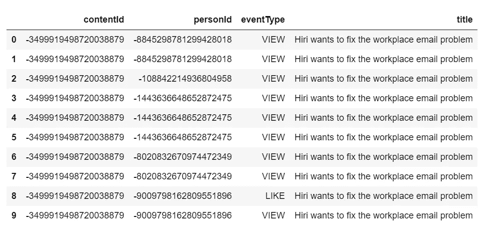
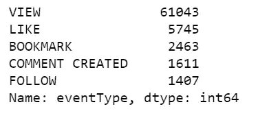
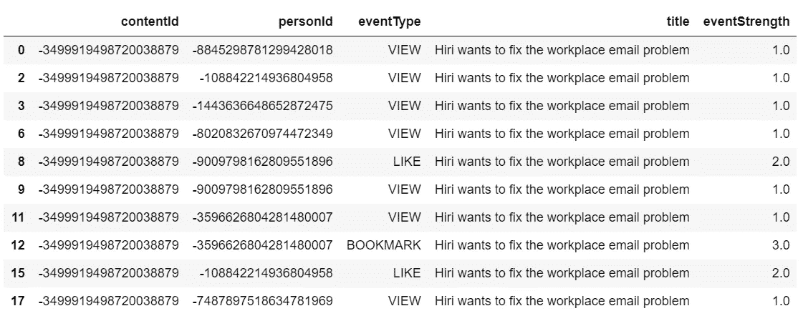
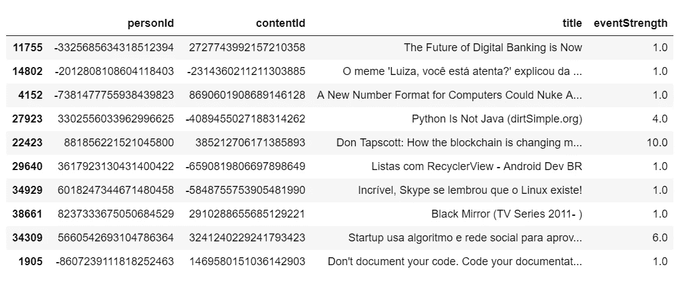
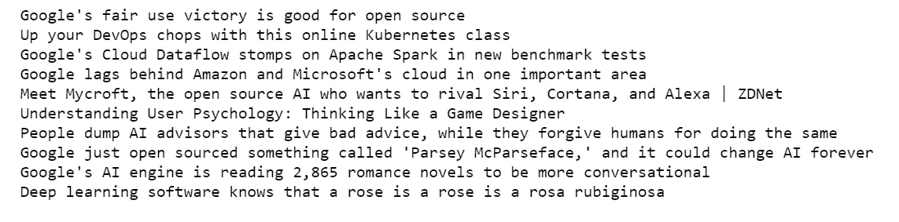
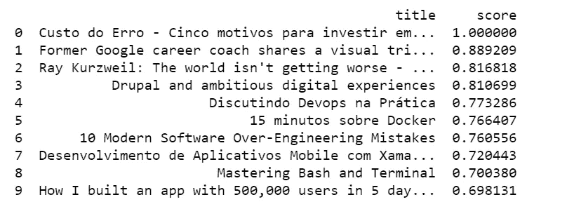
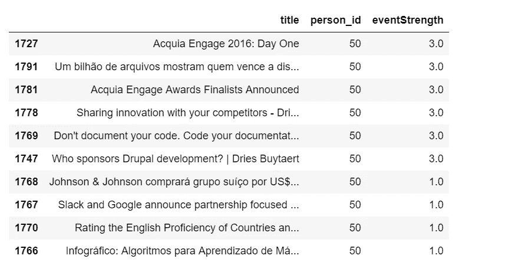
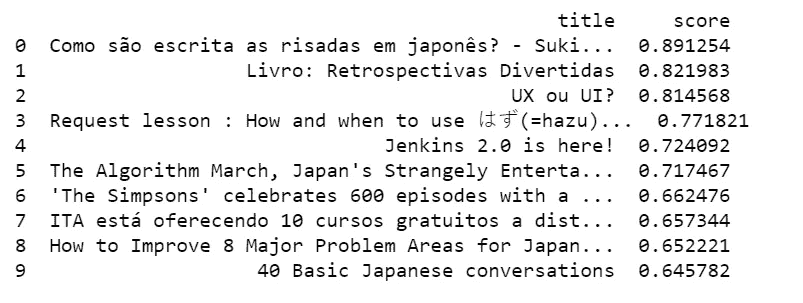
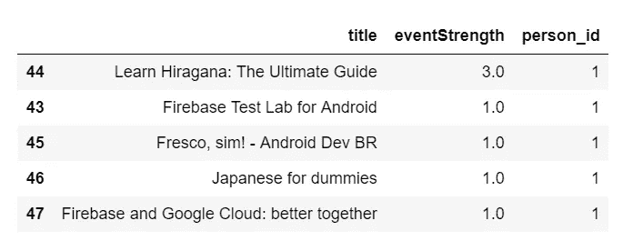
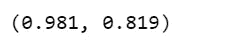

# 利用点击流数据构建协同过滤推荐系统

> 原文：<https://towardsdatascience.com/building-a-collaborative-filtering-recommender-system-with-clickstream-data-dffc86c8c65?source=collection_archive---------3----------------------->


Photo credit: Paxabay

## 如何实现一个基于先验隐式反馈的推荐算法？

[推荐系统](https://en.wikipedia.org/wiki/Recommender_system)无处不在，帮助你找到一切，从书籍到浪漫约会，从酒店到餐馆。

针对各种情况有各种推荐系统，这取决于你的需求和可用的数据。

**显性 vs 隐性**

让我们面对现实吧，**明确的**反馈很难收集，因为它们需要用户的额外输入。只有当用户选择这样做时，他们才会给出明确的反馈。结果，大多数时候，人们根本不提供评分(我自己在亚马逊上对此完全有罪！).因此，收集到的显性数据量极其稀少。

另一方面，**隐式**数据易于大量收集，无需用户付出任何努力。目标是通过观察用户行为，将用户行为转化为间接反映意见的用户偏好。例如，一个为同一作者的许多文章添加书签的用户可能喜欢那个作者。

# 数据

我们今天的目标是开发一个具有隐式数据收集的推荐系统，在我们的例子中，隐式数据收集是点击流数据。

很难找到这个项目的公开可用数据。我使用的数据来自[文章分享和 CI & T DeskDrop](https://www.kaggle.com/gspmoreira/articles-sharing-reading-from-cit-deskdrop) 阅读。 [Deskdrop](https://deskdrop.co/) 是一个内部交流平台，允许公司员工与同事分享相关文章，并围绕他们进行协作。

该数据包含了约 73k 个用户在平台上分享的超过 3k 篇公共文章上的互动，更重要的是，它包含了丰富的隐性反馈，记录了不同的互动类型，使得推断用户对文章的兴趣程度成为可能。

我们将使用[隐式库](https://github.com/benfred/implicit/)，一个隐式数据集的快速 Python 协作过滤，用于我们的矩阵分解。

# 数据预处理

*   删除我们不需要的列。
*   从`articles_df`上移除`eventType == 'CONTENT REMOVED'`。
*   将`interactions_df`与`articles_df`合并。

implicit_rec_preprocess.py

这是让我们开始的数据集:



Table 1

这告诉我们每个人对每个内容有什么事件类型。有许多重复的记录，我们将很快删除它们。

```
df['eventType'].value_counts()
```



Figure 1

eventType 值为:

*   **查看**:用户已经打开文章。内容站点中的页面视图可能意味着许多事情。这可能意味着用户感兴趣，或者用户只是迷路或随机点击。
*   **喜欢**:用户喜欢这篇文章。
*   **书签**:用户已经将文章做了书签，方便日后归还。这强烈表明用户找到了感兴趣的东西。
*   **评论已创建**:用户对文章发表了评论。
*   **跟在**后面:用户选择在关于文章的任何新评论上得到通知。

我们将把每个事件类型与权重或强度相关联。合理的假设是，例如，文章上的书签指示用户对该文章的兴趣比类似的更高。

```
event_type_strength = {
   'VIEW': 1.0,
   'LIKE': 2.0, 
   'BOOKMARK': 3.0, 
   'FOLLOW': 4.0,
   'COMMENT CREATED': 5.0,  
}df['eventStrength'] = df['eventType'].apply(lambda x: event_type_strength[x])
```



Table 2

*   删除重复的记录。
*   将 eventStrength 与人员和内容组合在一起。

```
df = df.drop_duplicates()
grouped_df = df.groupby(['personId', 'contentId', 'title']).sum().reset_index()
grouped_df.sample(10)
```

*   我们得到分组事件强度的最终结果。



Table 3

# 交替最小二乘推荐模型拟合

eventStrength 可以代表交互有多强的“置信度”,而不是表示明确的评级。一个人的事件强度越大，文章在我们的事件强度评级矩阵中的权重就越大。

*   为了避开“负整数”警告，我必须创建数字列`person_id`和`content_id`。
*   创建两个矩阵，一个用于拟合模型(内容-人)，另一个用于推荐(人-内容)。
*   初始化交替最小二乘(ALS)推荐模型。
*   使用稀疏内容-人矩阵来拟合模型。
*   我们将矩阵的类型设置为 double，以便 ALS 函数正常运行。

implicit_als_model.py

# 寻找相似的文章

我们要为 content_id = 450 找出前 10 篇最相似的文章，标题为“ ***Google 的合理使用胜利对开源有好处*** ”，这篇文章似乎在谈论 Google 和开源。

*   从我们训练好的模型中获取人物和内容向量。
*   计算向量范数。
*   计算相似性得分。
*   获取前 10 个内容。
*   创建与本文最相似的文章的内容分数元组列表。

similar_content.py



Figure 2

第一条就是它自己。另外 9 篇文章是关于谷歌、开源软件、云、人工智能或其他科技公司的。我相信你会同意我的看法，它们都与第一部有些相似之处！

# 向人们推荐文章

下面的函数将返回根据人/内容向量选择的前 10 个推荐，这些内容是从未与任何给定的人交互的内容。

*   从稀疏人员内容矩阵中获取互动得分。
*   每样东西都加 1，这样没有交互作用的文章就等于 1。
*   让文章已经互动为零。
*   得到人物向量和所有内容向量的点积。
*   在 0 和 1 之间调整这个推荐向量。
*   已经互动的内容的推荐乘以零。
*   按照最佳推荐的顺序对内容的索引进行排序。
*   开始空列表来存储标题和分数。
*   将标题和分数添加到列表中。
*   获取经过培训的人员和内容向量。我们将它们转换成 csr 矩阵。
*   为 id 为 50 的人员创建推荐。

implicit_rec_als_id_50.py



Figure 3

这里我们有 person_id = 50 的前 10 个建议。它们有意义吗？让我们看看此人互动过的前 10 篇文章。

```
grouped_df.loc[grouped_df['person_id'] == 50].sort_values(by=['eventStrength'], ascending=False)[['title', 'person_id', 'eventStrength']].head(10)
```



Table 4

显然，此人对 Drupal 等开源 CMS 上的文章感兴趣，她也阅读软件开发和业务相关的文章，即“Google”、“Slack”或“Johnson Johnson”。

我们向她推荐的文章包括 Drupal for digital experience、信息技术与人类、软件开发以及关于 Google 的商业文章。

相当令人印象深刻！让我们再试一次。

我们向 person_id = 1 推荐了以下文章:

```
person_id = 1recommendations = recommend(person_id, sparse_person_content, person_vecs, content_vecs)print(recommendations)
```



Figure 4

以下是 person_id = 1 互动过的文章:

```
grouped_df.loc[grouped_df['person_id'] == 1].sort_values(by=['eventStrength'], ascending=False)[['title', 'eventStrength', 'person_id']]
```



Table 5

显然，这个人只和 5 篇文章有过互动，她似乎对此兴趣不大。她互动的文章是关于学习日语和/或 android 开发的。

我们向她推荐的文章包括学习日语、android 开发和用户界面设计。酷！

# 评估推荐系统

以上抽查看起来都不错。但是对推荐系统最好的评价标准是该系统给最终用户和/或企业增加了多少价值，该系统是否增加了页面浏览量、点赞数、书签数、关注数和评论数。我们希望进行一些在线 A/B 测试来评估这些指标。

然而，在我们将推荐系统推向在线之前，还有其他一些单独评估推荐系统性能的通用指标。通过遵循这个[教程](https://nbviewer.jupyter.org/github/jmsteinw/Notebooks/blob/master/RecEngine_NB.ipynb)，我们能够计算出我们的训练集中至少有一篇文章被屏蔽的每个人的 [AUC](https://en.wikipedia.org/wiki/Receiver_operating_characteristic) 。和 [AUC](https://en.wikipedia.org/wiki/Receiver_operating_characteristic) 最受欢迎的文章，供人们比较。



Jupyter 笔记本可以在 [Github](https://github.com/susanli2016/Machine-Learning-with-Python/blob/master/Articles%20Rec%20System%20Implicit.ipynb) 上找到。复活节快乐！

参考资料:

 [## alternatinglestsquares-隐式 0.3.8 文档

### 基于论文“隐式反馈的协同过滤”中描述的算法的推荐模型…

implicit.readthedocs.io](https://implicit.readthedocs.io/en/latest/als.html) [](https://medium.com/radon-dev/als-implicit-collaborative-filtering-5ed653ba39fe) [## ALS 隐式协同过滤

### 继续我的二进制数据协同过滤示例中的协同过滤主题，我将…

medium.com](https://medium.com/radon-dev/als-implicit-collaborative-filtering-5ed653ba39fe) [](https://www.kaggle.com/gspmoreira/recommender-systems-in-python-101) [## Python 101 中的推荐系统

### 使用文章中的数据共享和从 CI&T 桌面阅读 Drop

www.kaggle.com](https://www.kaggle.com/gspmoreira/recommender-systems-in-python-101)