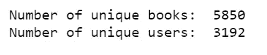
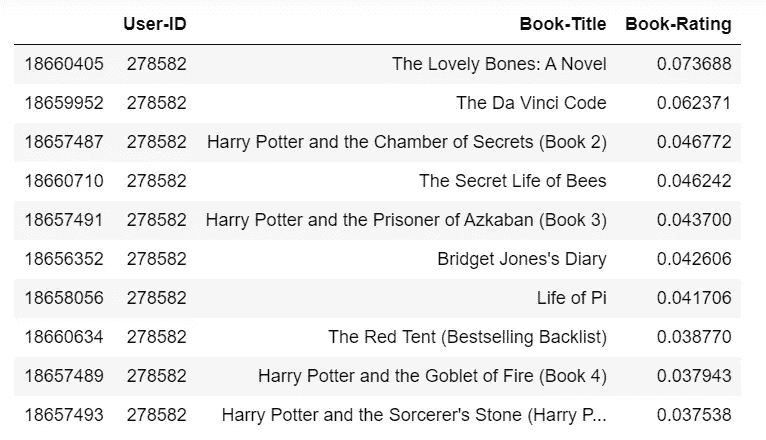
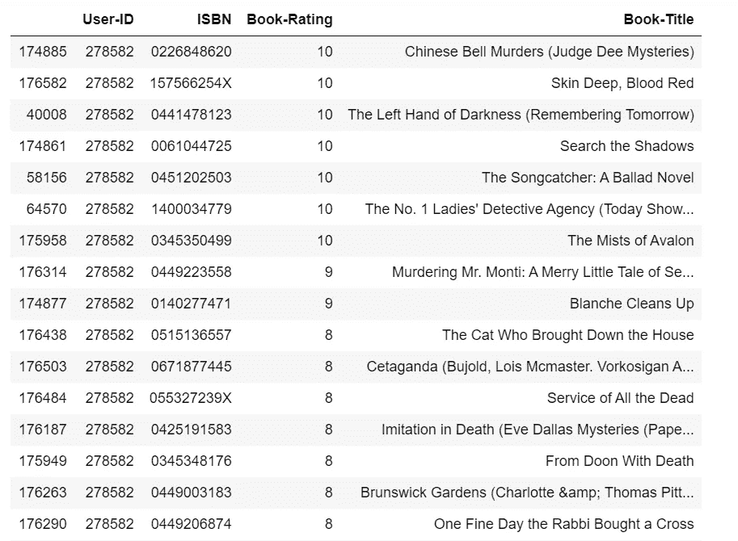

# 用 TensorFlow 构建协同过滤推荐系统

> 原文：<https://towardsdatascience.com/building-a-collaborative-filtering-recommender-system-with-tensorflow-82e63d27b420?source=collection_archive---------2----------------------->


Source: Pixabay

## 推荐是建立在其他用户的现有评级基础上的，这些用户与我们想要推荐的用户具有相似的评级。矩阵分解

## [协同过滤](https://en.wikipedia.org/wiki/Collaborative_filtering)是一种被[推荐系统](https://en.wikipedia.org/wiki/Recommender_system)广泛使用的技术，当你有足够大的用户项目数据时。它会根据相似用户的内容偏好进行推荐。

因此，协同过滤不是处理[冷启动](https://en.wikipedia.org/wiki/Cold_start_(computing))问题的合适模型，在这种情况下，协同过滤不能对尚未收集到足够信息的用户或项目做出任何推断。

但是一旦你有了相对大的用户-项目交互数据，那么协同过滤就是最广泛使用的推荐方法。我们将学习如何使用 [TensorFlow](https://cloud.google.com/solutions/machine-learning/recommendation-system-tensorflow-overview) 构建一个[协同过滤](https://en.wikipedia.org/wiki/Collaborative_filtering)推荐系统。

# 数据

我们再次使用预订交叉数据集，可以在[这里](http://www2.informatik.uni-freiburg.de/~cziegler/BX/)找到。数据预处理步骤执行以下操作:

*   合并用户、评级和图书数据。
*   移除未使用的列。
*   过滤至少有 25 个评分的书籍。
*   过滤至少给出 20 个评级的用户。记住，协同过滤算法通常需要用户的积极参与。

recSys_preprocessing.py



因此，我们的最终数据集包含 5，850 本书的 3，192 个用户。并且每个用户给出了至少 20 个评级，每本书获得了至少 25 个评级。如果你没有图形处理器，这将是一个很好的大小。

[协同过滤](https://en.wikipedia.org/wiki/Collaborative_filtering)方法专注于寻找对同一本书给出相似评价的用户，从而在用户之间建立一个链接，向他们推荐被正面评价的书籍。这样，我们寻找的是用户之间的关联，而不是书籍之间的关联。因此，协同过滤仅依靠观察到的用户行为来做出推荐，不需要简档数据或内容数据。

我们的技术将基于以下观察:

*   以类似方式对书籍进行评级的用户共享一个或多个隐藏的偏好。
*   具有共享偏好的用户可能会以相同的方式对相同的书籍进行评级。

# 张量流中的过程

首先，我们将标准化评级功能。

```
scaler = MinMaxScaler()
combined['Book-Rating'] = combined['Book-Rating'].values.astype(float)
rating_scaled = pd.DataFrame(scaler.fit_transform(combined['Book-Rating'].values.reshape(-1,1)))
combined['Book-Rating'] = rating_scaled
```

然后，构建具有三个特征的用户、预订矩阵:

```
combined = combined.drop_duplicates(['User-ID', 'Book-Title'])
user_book_matrix = combined.pivot(index='User-ID', columns='Book-Title', values='Book-Rating')
user_book_matrix.fillna(0, inplace=True)users = user_book_matrix.index.tolist()
books = user_book_matrix.columns.tolist()user_book_matrix = user_book_matrix.as_matrix()
```

`tf.placeholder`仅在 v1 中可用，所以我必须这样做:

```
import tensorflow.compat.v1 as tf
tf.disable_v2_behavior()
```

在下面的代码脚本中

*   我们设置了一些网络参数，比如每个隐层的维数。
*   我们将初始化 TensorFlow 占位符。
*   权重和偏差是随机初始化的。
*   以下代码摘自《Python 机器学习烹饪书——第二版》

placeholder.py

现在，我们可以建立编码器和解码器模型。

encoder_decoder.py

现在，我们构建模型和预测

```
encoder_op = encoder(X)
decoder_op = decoder(encoder_op)y_pred = decoder_opy_true = X
```

在下面的代码中，我们定义损失函数和优化器，最小化平方误差，并定义评估指标。

```
loss = tf.losses.mean_squared_error(y_true, y_pred)
optimizer = tf.train.RMSPropOptimizer(0.03).minimize(loss)
eval_x = tf.placeholder(tf.int32, )
eval_y = tf.placeholder(tf.int32, )
pre, pre_op = tf.metrics.precision(labels=eval_x, predictions=eval_y)
```

因为 TensorFlow 使用计算图形进行运算，所以占位符和变量必须在拥有值之前进行初始化。因此，在下面的代码中，我们初始化变量，然后创建一个空数据框来存储结果表，这将是对每个用户的前 10 项建议。

```
init = tf.global_variables_initializer()
local_init = tf.local_variables_initializer()
pred_data = pd.DataFrame()
```

我们终于可以开始训练我们的模型了。

*   我们把训练数据分成几批，然后把它们输入网络。
*   我们用用户评级的向量来训练我们的模型，每个向量代表一个用户，每个列代表一本书，条目是用户给书的评级。
*   经过几次尝试，我发现批量大小为 35 的 100 个时期的训练模型将消耗足够的内存。这意味着整个训练集将馈给我们的神经网络 100 次，每次使用 35 个用户。
*   最后，我们必须确保删除训练集中的用户评级。也就是说，我们不能向一个用户推荐他(或她)已经评价过的书籍。

recSys_train.py

最后，让我们看看我们的模型是如何工作的。我随机选择了一个用户，看看我们应该向他(或她)推荐什么书。

```
top_ten_ranked.loc[top_ten_ranked['User-ID'] == 278582]
```



Table 2

以上是该用户的前 10 个结果，按标准化预测评分排序。

我们来看看他(或她)评价过哪些书，按评价排序。

```
book_rating.loc[book_rating['User-ID'] == 278582].sort_values(by=['Book-Rating'], ascending=False)
```



Table 2

这位用户喜欢的书籍类型有:历史推理小说、惊悚悬疑小说、科幻小说、奇幻小说等。

这个用户的前 10 个结果是:谋杀幻想小说，神秘惊悚小说等等。

结果并不令人失望。

[Jupyter 笔记本](https://github.com/susanli2016/Machine-Learning-with-Python/blob/master/Collaborative%20Filtering%20Model%20with%20TensorFlow.ipynb)可以在 [Github](https://github.com/susanli2016/Machine-Learning-with-Python/blob/master/Collaborative%20Filtering%20Model%20with%20TensorFlow.ipynb) 上找到。星期五快乐！

参考资料:

Python 机器学习烹饪书—第二版

[https://cloud . Google . com/solutions/machine-learning/recommendation-system-tensor flow-overview](https://cloud.google.com/solutions/machine-learning/recommendation-system-tensorflow-overview)