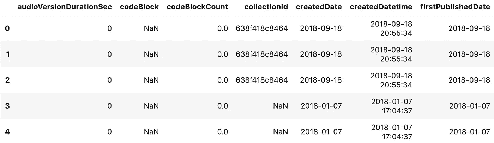
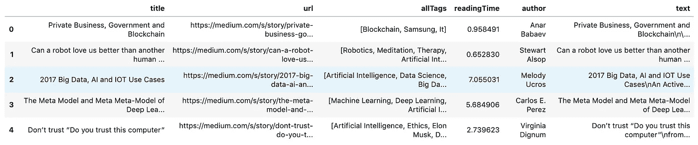
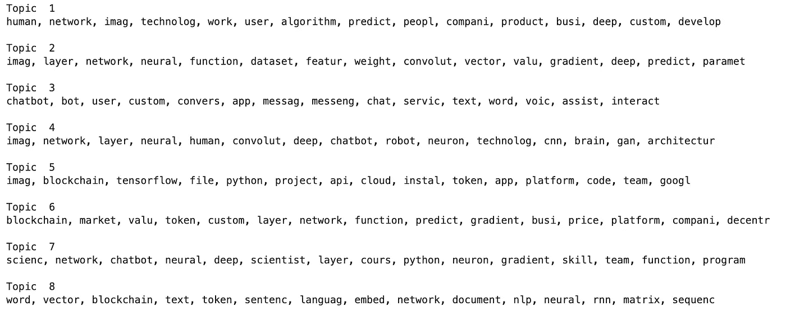
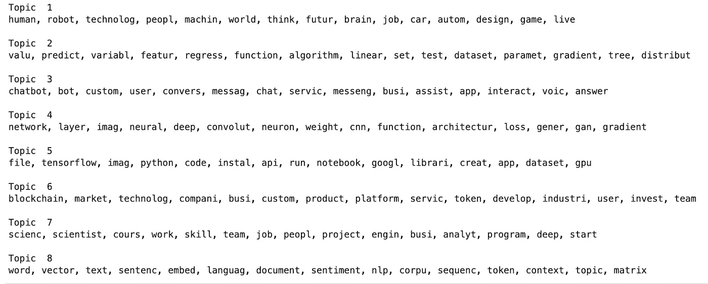
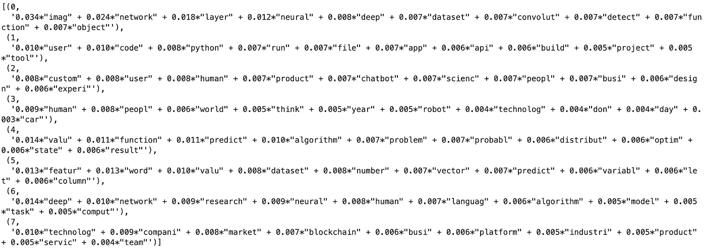
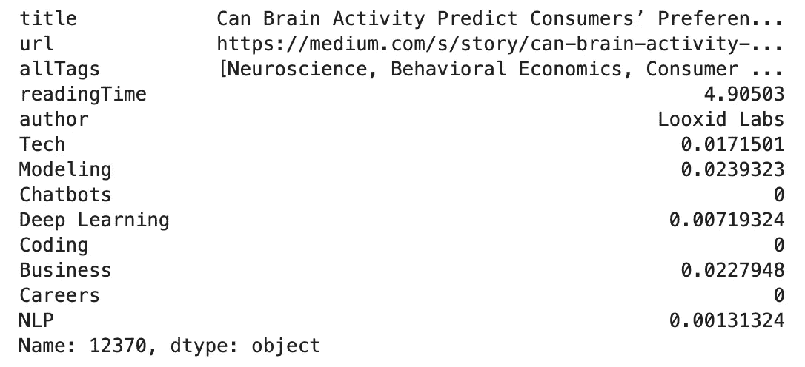

# 为数据科学文章构建基于内容的推荐器

> 原文：<https://towardsdatascience.com/building-a-content-based-recommender-for-data-science-articles-728e5ec7d63d?source=collection_archive---------15----------------------->

## 一步一步的教程


# 介绍

博客在数据科学社区中很流行，这已经不是什么秘密了。通过这种方式，这个领域反映了它在开源运动中的根源。在找到一个问题的创新解决方案后，似乎没有什么比写关于它的文章更让数据科学家喜欢的了。数据科学社区内的博客是一个双赢的局面，作者从曝光中受益，读者从获得的知识中受益。

在本教程中，我将使用主题建模来描述与数据科学相关的媒体文章的内容，然后使用主题模型输出来构建一个基于内容的推荐器。作为我的语料库，我将使用 Kaggle 数据集 [Medium Articles(带内容)](https://www.kaggle.com/aiswaryaramachandran/medium-articles-with-content)，它包含大约 70，000 篇中型文章，这些文章被标记为数据科学、机器学习、AI 或人工智能。这是一个很好的数据集，因为除了文章的全文之外，它还包含了大量的信息:点击次数、作者、url 等。该数据集包含最近在 2018 年 10 月发布的文章。这意味着我们的推荐者不会推荐最近的帖子，但这没关系。

# 加载数据

首先，让我们导入我们的库，将数据集加载到 pandas 数据框中，然后查看前几行。

```
import numpy as np
import pandas as pd
import re
import stringfrom sklearn.decomposition import NMF
from sklearn.feature_extraction.text import TfidfVectorizer
from sklearn.decomposition import TruncatedSVDimport gensim
from gensim.parsing.preprocessing import STOPWORDS
from gensim import corpora, models
from gensim.utils import simple_preprocessfrom nltk.stem.porter import PorterStemmermedium = pd.read_csv(‘Medium_AggregatedData.csv’)
medium.head()
```



看起来未经处理的数据集包含大量冗余信息。事实上，分配给一篇文章的每个标签都有一行，所以每篇文章最多有 5 行。让我们通过压缩标记信息然后消除重复行来解决这个问题。为了进一步减少我们数据集的大小，并确保我们产生高质量的推荐，让我们也删除不是用英语写的文章和少于 25 次鼓掌的文章。最后，我们将删除所有不会继续使用的列。

```
# Filter articles
medium = medium[medium['language'] == 'en']
medium = medium[medium['totalClapCount'] >= 25]def findTags(title):
    '''
    Function extracts tags for an input title
    '''
    rows = medium[medium['title'] == title]
    tags = list(rows['tag_name'].values)
    return tags# Get all the titles
titles = medium['title'].unique()tag_dict = {'title': [], 'tags': []} # Dictionary to store tagsfor title in titles:
    tag_dict['title'].append(title)
    tag_dict['tags'].append(findTags(title))tag_df = pd.DataFrame(tag_dict)  # Dictionary to data frame# Now that tag data is extracted the duplicate rows can be dropped
medium = medium.drop_duplicates(subset = 'title', keep = 'first')def addTags(title):
    '''
    Adds tags back into medium data frame as a list
    '''
    try:
        tags = list(tag_df[tag_df['title'] == title]['tags'])[0]
    except:
        # If there's an error assume no tags
        tags = np.NaN
    return tags# Apply addTags
medium['allTags'] = medium['title'].apply(addTags)# Keep only the columns we're interested in for this project
keep_cols = ['title', 'url', 'allTags', 'readingTime',
             'author', 'text']
medium = medium[keep_cols]# Drop row with null title
null_title = medium[medium['title'].isna()].index
medium.drop(index = null_title, inplace = True)medium.reset_index(drop = True, inplace = True)print(medium.shape)
medium.head()
```



太好了！数据集现在已经缩减到只有 24，576 行，标记信息保留在“allTags”列中。这将更容易向前推进。

# 文本清理

现在让我们把注意力转移到预处理文章文本，为主题建模做准备。首先，我们将删除链接、非字母数字字符和标点符号。我们还会将所有字符转换成小写字母。

```
def clean_text(text):
    '''
    Eliminates links, non alphanumerics, and punctuation.
    Returns lower case text.
    '''

    # Remove links
    text = re.sub('(?:(?:https?|ftp):\/\/)?[\w/\-?=%.]+
                  \.[\w/\-?=%.]+','', text)
    # Remove non-alphanumerics
    text = re.sub('\w*\d\w*', ' ', text)
    # Remove punctuation and lowercase
    text = re.sub('[%s]' % re.escape(string.punctuation),
                  ' ', text.lower())
    # Remove newline characters
    text = text.replace('\n', ' ')

    return textmedium['text'] = medium['text'].apply(clean_text)
```

预处理管道中的下一步是消除停用词，这些词非常常见并且没有信息。对于许多 NLP 任务来说，这些单词是混淆我们试图寻找的任何信号的噪音。标准英语停用词的几个例子是“the”、“is”和“you”。此外，考虑特定领域的停用词通常也很重要。对于这个项目，我们将从 Gensim 的预定义停用词集开始，然后添加数据科学专用停用词和一些由我们的预处理步骤生成的词片段。

```
stop_list = STOPWORDS.union(set(['data', 'ai', 'learning', 'time', 'machine', 'like', 'use', 'new', 'intelligence', 'need', "it's", 'way', 'artificial', 'based', 'want', 'know', 'learn', "don't", 'things', 'lot', "let's", 'model', 'input', 'output', 'train', 'training', 'trained', 'it', 'we', 'don', 'you', 'ce', 'hasn', 'sa', 'do', 'som', 'can']))# Remove stopwords
def remove_stopwords(text):
    clean_text = []
    for word in text.split(' '):
        if word not in stop_list and (len(word) > 2):
            clean_text.append(word)
    return ' '.join(clean_text)medium['text'] = medium['text'].apply(remove_stopwords)
```

在你的语料库上运行单词计数(在移除标准停用词之后)可以快速识别一些更明显的领域特定停用词，但是通常这些停用词列表需要通过反复试验来精炼。

作为最后的预处理步骤，我们将对文档应用词干分析器，将各种单词时态和词尾变化转换成标准化的词干。这将产生一些词干，看起来像是被屠宰了的(例如，image → imag 和 busy→busi)，但是人们通常很容易识别出真正的词根。

```
# Apply stemmer to processedText
stemmer = PorterStemmer()def stem_text(text):
    word_list = []
    for word in text.split(' '):
        word_list.append(stemmer.stem(word))
    return ' '.join(word_list)medium['text'] = medium['text'].apply(stem_text)
```

我们几乎准备好继续主题建模了，但是让我们首先将当前的数据框保存到一个 csv 文件中。

```
medium.to_csv('pre-processed.csv')
```

# 主题建模

预处理完成后，我们终于可以享受主题建模的乐趣了。主题建模的想法是将我们的文档转换成稀疏的词向量，然后应用降维技术来找到有意义的词分组。为此，我们将使用不同的方法构建多个模型，并比较结果。我们将寻找能产生最清晰、最有凝聚力、最具差异化主题的模型。这是无监督学习的领域，对结果的评估是主观的，需要良好的人工判断。

构建主题模型的第一步是将我们的文档转换成单词向量。有两种常用的方法，BOW(单词袋)和 TFIDF(术语频率，逆文档频率)。BOW 只是统计一个单词在文档中出现的次数。如果单词“president”在一个文档中出现 5 次，那么它将被翻译成该文档的稀疏单词向量的适当位置中的数字 5。

另一方面，TFIDF 基于这样的假设运行，即出现在每个文档中的单词对于任何一个单独的文档都不太重要。例如，考虑与 2020 年总统选举相关的文档集。显然,“president”这个词会出现在几乎每一篇关于这个主题的文章中，并且“president”不是一个特别有用的词来分析这个上下文中的任何单个文档。更多关于 TFIDF 的信息可以在这里找到[。](https://en.wikipedia.org/wiki/Tf%E2%80%93idf)

为了简洁起见，我将只关注 TFIDF 主题模型的实现，除了 LDA 算法只适用于 BOW 的情况。根据我的经验，TFIDF 通常在提取清晰、有凝聚力和有区别的主题方面做得更好。首先，让我们将文档集转换为 TFIDF 稀疏向量表示，并将 SVD(单值分解)应用于稀疏集矩阵。

```
vectorizer = TfidfVectorizer(stop_words = stop_list,
                             ngram_range = (1,1))
doc_word = vectorizer.fit_transform(medium['text'])svd = TruncatedSVD(8)
docs_svd = svd.fit_transform(doc_word)
```

这将从我们的语料库中提取 8 个主题(根据我的判断，8 是这个语料库的最佳主题数，但可以尝试使用不同的数量)，并将我们的文档转换为 8 维向量，这些向量表示该文档中每个主题的存在。现在让我们编写一个函数来打印出每个主题中最突出的单词，这样我们就可以评估 SVD 算法的执行情况。

```
def display_topics(model, feature_names, no_top_words, no_top_topics, topic_names=None):
    count = 0
    for ix, topic in enumerate(model.components_):
        if count == no_top_topics:
            break
        if not topic_names or not topic_names[ix]:
            print("\nTopic ", (ix + 1))
        else:
            print("\nTopic: '",topic_names[ix],"'")
        print(", ".join([feature_names[i]
                        for i in topic.argsort()[:-no_top_words - 
                                                 1:-1]]))
        count += 1display_topics(svd, vectorizer.get_feature_names(), 15, 8)
```



还不错，但是让我们看看我们是否能做得更好。下一个要尝试的算法是 NMF(非负矩阵分解)。这种算法与奇异值分解非常相似。有时会产生更好的结果，有时会更糟。现在让我们自己来看看。

```
nmf = NMF(8)
docs_nmf = nmf.fit_transform(doc_word)display_topics(nmf, vectorizer.get_feature_names(), 15, 8)
```



这看起来很不错。在我看来，这些主题比用 SVD 产生的主题更好区分。

最后，让我们试试 LDA(潜在狄利克雷分配)。这种算法最近在主题建模中非常流行，被许多人认为是最先进的。也就是说，评估仍然是高度主观的，不能保证结果比奇异值分解或 NMF 更好。有关算法如何工作的更多细节，请参见本文[这里](https://medium.com/@lettier/how-does-lda-work-ill-explain-using-emoji-108abf40fa7d)。为了实现 LDA，我们将使用 Gensim 库，这意味着我们的代码看起来会有点不同。

```
tokenized_docs = medium['text'].apply(simple_preprocess)
dictionary = gensim.corpora.Dictionary(tokenized_docs)
dictionary.filter_extremes(no_below=15, no_above=0.5, keep_n=100000)
corpus = [dictionary.doc2bow(doc) for doc in tokenized_docs]# Workers = 4 activates all four cores of my CPU, 
lda = models.LdaMulticore(corpus=corpus, num_topics=8, 
                          id2word=dictionary, passes=10,
                          workers = 4)lda.print_topics()
```



这些题目都挺好的。也就是说，我认为从 NMF 那里获得的数据稍微有些不同。对于我们的基于内容的推荐器，主题之间的区别是至关重要的。这使得推荐者能够将一篇文章与用户的口味相匹配。考虑到上述情况，让我们继续使用 NMF 的话题。

接下来，让我们命名我们的 NMF 主题，并将文档主题向量连接回包含文章元数据其余部分的数据框架。然后，我们将数据帧保存到它自己的 csv 文件中，以便以后访问。

```
# Define column names for dataframe
column_names = ['title', 'url', 'allTags', 'readingTime', 'author', 
                'Tech', 'Modeling', 'Chatbots', 'Deep Learning', 
                'Coding', 'Business', 'Careers', 'NLP', 'sum']# Create topic sum for each article
# Later remove all articles with sum 0
topic_sum = pd.DataFrame(np.sum(docs_nmf, axis = 1))# Turn our docs_nmf array into a data frame
doc_topic_df = pd.DataFrame(data = docs_nmf)# Merge all of our article metadata and name columns
doc_topic_df = pd.concat([medium[['title', 'url', 'allTags', 
                         'readingTime', 'author']], doc_topic_df,
                         topic_sum], axis = 1)doc_topic_df.columns = column_names# Remove articles with topic sum = 0, then drop sum column
doc_topic_df = doc_topic_df[doc_topic_df['sum'] != 0]doc_topic_df.drop(columns = 'sum', inplace = True)# Reset index then save
doc_topic_df.reset_index(drop = True, inplace = True)
doc_topic_df.to_csv('tfidf_nmf_8topics.csv', index = False)
```

# 构建推荐引擎

最后，是时候构建我们推荐器的后端了。作为输入，推荐器将采用主题的分布；然后，它会找到一篇与该分布非常匹配的文章。为了多样化，引入一点随机性也是个不错的主意。这将允许系统从更大数量的文章中进行选择，同时仍然产生质量建议。

在实践中，计算我们的输入分布和任何文章之间的相似性的一个简单方法是使用[余弦距离](https://en.wikipedia.org/wiki/Cosine_similarity)。当两个向量指向同一方向时，余弦距离最大，并且与向量的比例无关。后一个属性非常好，因为它允许我们忽略向量缩放，这对于欧几里德距离来说是不正确的。

至于随机性，这可以通过在输入中添加一个随机的 8 维向量来实现。为了稳定随机性的大小，这个随机向量应该与用户输入向量的距离成比例。

最后要考虑的一件事。使用 for 循环来计算我们的输入和每个可能的输出之间的余弦距离会非常慢。显然我们不能让用户等待 30 秒的推荐。解决方案是矢量化，或者换句话说，使用线性代数进行并行计算。我们将在 Numpy 中使用矩阵和向量运算来实现这一点。这将使我们的代码运行速度提高几个数量级，并几乎立即产生建议。让我们看看这一切是如何工作的。

```
topic_names = ['Tech', 'Modeling', 'Chatbots', 'Deep Learning', 
               'Coding', 'Business', 'Careers', 'NLP']
topic_array = np.array(doc_topic_df[topic_names])
norms = np.linalg.norm(topic_array, axis = 1)def compute_dists(top_vec, topic_array):
    '''
    Returns cosine distances for top_vec compared to every article
    '''
    dots = np.matmul(topic_array, top_vec)
    input_norm = np.linalg.norm(top_vec)
    co_dists = dots / (input_norm * norms)
    return co_distsdef produce_rec(top_vec, topic_array, doc_topic_df, rand = 15):
    '''
    Produces a recommendation based on cosine distance.
    rand controls magnitude of randomness.
    '''
    top_vec = top_vec + np.random.rand(8,)/
                        (np.linalg.norm(top_vec)) * rand
    co_dists = compute_dists(top_vec, topic_array)
    return doc_topic_df.loc[np.argmax(co_dists)]
```

让我们创建一些样本用户输入，看看会有什么结果。

```
tech = 5
modeling = 5
chatbots = 0
deep = 0
coding = 0
business = 5
careers = 0
nlp = 0top_vec = np.array([tech, modeling, chatbots, deep, coding, business, careers, nlp])rec = produce_rec(top_vec, topic_array, doc_topic_df)
rec
```



呜！成功了。我们的推荐者基于我们的输入产生了一篇有趣的文章，我们也获得了一大堆相关的元数据。此时，我们可以将工作移交给前端工程团队。如果前端是你的东西，你可以继续自己建立一个。使用 python flask 应用程序的一个例子是这里的(警告:这个应用程序在移动设备上是一个巨大的集群。当我有空的时候，我会解决这个问题。从不)

# 结论

最后，我们讨论了文本预处理、主题建模，以及使用我们的主题构建推荐引擎。还真不少！如果你已经做到了这一步，祝贺并感谢你的坚持。我希望这是信息丰富和有用的。

祝您的数据科学之旅好运！

这个项目的笔记本托管在 Github [这里](https://github.com/alexmuhr/medium-recommender-notebook.git)。

在 [linkedIn](https://www.linkedin.com/in/alexander-muhr/) 上与我联系。

查看我的网站[datascienceodyssey.com](https://www.datascienceodyssey.com)了解更多内容。