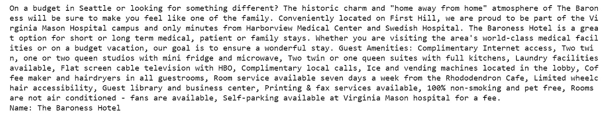

# 为西雅图的酒店建立基于内容的推荐系统

> 原文：<https://towardsdatascience.com/building-a-content-based-recommender-system-for-hotels-in-seattle-d724f0a32070?source=collection_archive---------3----------------------->


Photo Credit: Pixabay

## 如何使用酒店描述来推荐相似的酒店？

对于[推荐系统](https://en.wikipedia.org/wiki/Recommender_system)来说，[冷启动](https://en.wikipedia.org/wiki/Cold_start_(computing))问题是一个众所周知且经过充分研究的问题，其中系统不能向用户推荐项目。由于三种不同的情况，即新用户、新产品和新网站。

[基于内容的过滤](http://recommender-systems.org/content-based-filtering/)就是解决这个问题的方法。我们的系统在创建推荐时首先使用新产品的元数据，而在一定时间内访问者的行为是次要的。并且我们的系统基于产品的类别和描述向用户推荐产品。

基于内容的推荐系统可以用于从推荐网页、新闻文章、餐馆、电视节目和酒店的各种领域。基于内容的过滤的优点是它没有冷启动问题。如果你刚开始做一个新网站，或者有什么新产品可以马上推荐。

假设我们正在创办一家新的在线旅行社(OTA ),我们已经签约了数千家愿意在我们的平台上销售的酒店，我们开始看到来自我们网站用户的流量，但我们没有任何用户历史记录，因此，我们将建立一个基于内容的推荐系统来分析酒店描述，以确定用户特别感兴趣的酒店。

我们希望根据用户已经预订或使用余弦相似度查看的酒店来推荐酒店。我们会推荐与用户之前预订、查看或表示出兴趣的酒店最相似的酒店。我们的推荐系统高度依赖于定义一个合适的相似性度量。最后，我们选择酒店的子集显示给用户，或者确定酒店的显示顺序。

# 数据

很难找到公开可用的酒店描述数据，因此，我自己从西雅图地区 150 多家酒店的主页上收集了这些数据，其中包括市中心的商务酒店、精品酒店和住宿加早餐酒店、机场商务酒店、大学附近的客栈、偏远地区的汽车旅馆等等。数据可以在[这里](https://github.com/susanli2016/Machine-Learning-with-Python/blob/master/Seattle_Hotels.csv)找到。

```
import pandas as pd
import numpy as np
from nltk.corpus import stopwords
from sklearn.metrics.pairwise import linear_kernel
from sklearn.feature_extraction.text import CountVectorizer
from sklearn.feature_extraction.text import TfidfVectorizer
from sklearn.decomposition import LatentDirichletAllocation
import re
import random
import plotly.graph_objs as go
import plotly.plotly as py
import cufflinks
pd.options.display.max_columns = 30
from IPython.core.interactiveshell import InteractiveShell
import plotly.figure_factory as ff
InteractiveShell.ast_node_interactivity = 'all'
from plotly.offline import iplot
cufflinks.go_offline()
cufflinks.set_config_file(world_readable=True, theme='solar')df = pd.read_csv('Seattle_Hotels.csv', encoding="latin-1")
df.head()
print('We have ', len(df), 'hotels in the data')
```


Table 1


看一些酒店名称和描述对。

print_description.py

```
print_description(10)
```


Figure 1

```
print_description(100)
```



Figure 2

# 电子设计自动化(Electronic Design Automation)

## **去除停用词之前的令牌(词汇)频率分布**

unigram_distribution.py

Figure 3

## 去除停用词后的标记(词汇)频率分布

unigram_distribution_stopwords_removed.py

Figure 4

## 去除停用词前的二元模型频率分布

bigrams_distribution.py

Figure 5

## 去除停用词后的二元模型频率分布

bigrams_distribution_stopwords_removed.py

Figure 6

## 去除停用词前的三元模型频率分布

trigrams_distribution.py

Figure 7

## 去除停用词后的三元模型频率分布

trigrams_distribution_stopwords_removed.py

Figure 8

每个人都知道西雅图的派克市场，它不仅仅是一个公共农贸市场。这是一个充满活力的历史旅游景点，由数百名农民、手工艺者和小企业组成。酒店行业因位置而繁荣，游客寻找可能离市中心和/或城市必游景点最近的酒店。所以，每个酒店如果离酒店不太远，都会吹嘘一番。

## 酒店描述字数分布

```
df['word_count'] = df['desc'].apply(lambda x: len(str(x).split()))
desc_lengths = list(df['word_count'])print("Number of descriptions:",len(desc_lengths),
      "\nAverage word count", np.average(desc_lengths),
      "\nMinimum word count", min(desc_lengths),
      "\nMaximum word count", max(desc_lengths))
```


word_count_distribution.py

Figure 9

许多酒店充分利用描述，知道如何利用吸引人的描述来吸引游客的情绪，从而推动直接预订。他们的描述可能比其他人更长。

# 文本预处理

测试很简单，我们没什么可做的，但以防万一。

description_preprocessing.py

# 建模

*   为每家酒店创建一个包含一元、二元和三元模型的 TF-IDF 矩阵。
*   使用 [sklearn 的 linear_kernel](https://scikit-learn.org/stable/modules/generated/sklearn.metrics.pairwise.linear_kernel.html#sklearn.metrics.pairwise.linear_kernel) 计算所有酒店之间的相似度(相当于我们案例中的[余弦相似度](https://scikit-learn.org/stable/modules/generated/sklearn.metrics.pairwise.cosine_similarity.html#sklearn.metrics.pairwise.cosine_similarity))。
*   定义一个函数，将酒店名称作为输入，并返回推荐的前 10 家酒店。

hotel_rec_model.py

# 推荐

大家来做一些推荐吧！

```
recommendations('Hilton Seattle Airport & Conference Center')
```


对我们的相似性是否起作用的一个好的测试是，当机场酒店是种子时，基于内容的推荐器返回所有机场酒店。

我们也可以问问谷歌。以下是谷歌为“西雅图希尔顿机场和会议中心”推荐的:


Figure 10

Google 推荐的四分之三也是我们推荐的。

以下是 [tripadvisor](https://www.tripadvisor.ca/Hotel_Review-g58732-d100617-Reviews-Hilton_Seattle_Airport_Conference_Center-SeaTac_Washington.html) 为“西雅图希尔顿机场&会议中心”推荐的:


Figure 11

也不错。

试试住宿加早餐。

```
recommendations("The Bacon Mansion Bed and Breakfast")
```


以下是谷歌推荐的《培根公馆民宿》:


Figure 12

酷！

以下是 tripadvisor 推荐的《培根公馆民宿》，我印象不深。


Figure 13

Jupyter 笔记本可以在 Github 上找到，如果你喜欢，这是一个 [nbviewer 版本](https://nbviewer.jupyter.org/github/susanli2016/Machine-Learning-with-Python/blob/master/Seattle%20Hotels%20Recommender.ipynb)。

祝你一周工作顺利！