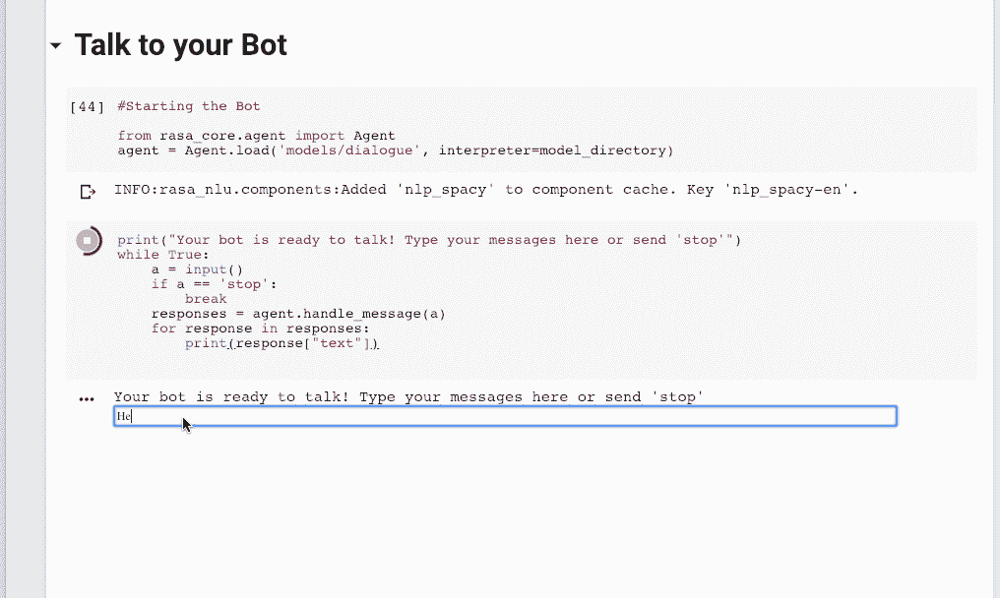

# 使用 Rasa 和 Python 为 Slack 构建对话聊天机器人——第 1 部分

> 原文：<https://towardsdatascience.com/building-a-conversational-chatbot-for-slack-using-rasa-and-python-part-1-bca5cc75d32f?source=collection_archive---------4----------------------->

## 使用 Rasa 堆栈和 Python 创建聊天机器人指南。


[Source](https://www.wired.com/2015/08/slack-overrun-bots-friendly-wonderful-bots/)

> ***注意:这篇文章是很久以前写的，RASA 可能会有变化，但这些变化并没有纳入本文。建议访问他们的官方文档网站，了解最新的详细信息。***

> 现在是时候超越“对不起，我没有得到那个”类型的机器人，并使用机器学习建立人工智能助手:Rasa

[对话式人工智能系统](https://arxiv.org/pdf/1712.05181.pdf)正在成为人类生态系统不可或缺的一部分。对话式人工智能的知名例子包括苹果的 Siri、亚马逊的 Alexa 和微软的 Cortana。对话聊天机器人已经从基于规则的前辈那里走了很长一段路，如今几乎每个科技公司都雇佣了一个或多个健谈的助手。

对话聊天机器人理解对话的上下文，可以优雅地处理任何用户目标，并帮助尽可能好地完成它。这并不总是意味着机器人能够回答所有问题，但它可以很好地处理对话。

# 目标

在本文中，我们将构建一个名为“ **Robo** 的聊天机器人，它能够检查人们的情绪，并采取必要的行动让他们振作起来。然后我们将它部署到 Slack。这将是一个功能齐全的 Slackbot 能够监听和响应您的请求。下面的演示截图应该足以激励你建立一个自己的。


***本文来源于一篇*** [***精彩演讲***](https://www.youtube.com/watch?v=HV0bJMkzpO4) ***工程主管 Tom Bocklisch @ Rasa 在柏林 Pydata 上的演讲。***

# 要求

我们主要要求安装 **Rasa 栈**和**语言模型**。语言模型将用于解析传入的文本消息并提取必要的信息。我们将使用空间语言模型。

# Rasa 堆栈

**Rasa Stack** 是一套开源的机器学习工具，供开发者创建[上下文 AI 助手和聊天机器人](http://blog.rasa.com/level-3-contextual-assistants-beyond-answering-simple-questions/)。它是领先的开源机器学习工具包，允许开发人员使用最少的训练数据来扩展机器人，而不仅仅是回答简单的问题。这些机器人基于在示例对话中训练的机器学习模型。它由两个框架组成:


[source](https://rasa.com/docs/get_started_step1/)

**Rasa NLU** :一个自然语言理解库，具有意图分类和实体提取功能。这有助于聊天机器人理解用户在说什么。

**Rasa Core** :基于机器学习的对话管理聊天机器人框架，根据来自 NLU 的输入、对话历史和训练数据预测下一个最佳行动**。**

*Rasa 有很棒的* [*文档*](https://rasa.com/docs/) *包括一些互动的例子来轻松掌握主题。*

# 装置

我们将使用 Jupyter 笔记本来运行代码。然而，我会推荐使用谷歌的[合作实验室](https://colaboratory.jupyter.org/welcome/)，因为它不需要任何设置，代码是在你的账户专用的虚拟机中执行的。唯一的问题是，虚拟机在空闲一段时间后会被回收，并且有一个由系统强制执行的最大生命周期。

## 主要安装

你需要一个 Rasa NLU，Rasa 核心和一个 spaCy 语言模型。

```
#Rasa NLU
python -m pip install rasa_nlu[spacy] ([https://rasa.com/docs/nlu/installation/](https://rasa.com/docs/nlu/installation/))#Rasa Core
python -m pip install -U rasa_core == 0.9.6
([https://rasa.com/docs/core/installation/](https://rasa.com/docs/core/installation/))#Language Modelpython -m spacy download en_core_web_md
python -m spacy link en_core_web_md en --force;
```

*本文使用的 Rasa 核心版本不是最新的。使用最新版本会在执行代码时抛出错误，所以我不得不使用旧版本。我目前正在努力让代码在最新版本上运行。*

我们将按照他们的要求安装其他依赖项。

# 1.使用 Rasa NLU 教机器人理解用户输入

NLU 教聊天机器人如何理解用户输入。这是一个我们希望与机器人进行对话的例子。


为了能够实现这一点，我们将建立一个**拉沙 NLU 模型**，并输入用户必须准备的训练数据。然后，模型会将数据转换成由实体和意图组成的结构化格式。

## 1.准备 NLU 培训数据

训练数据由一个预期从机器人接收的消息列表组成。这些数据被注释了意图和实体，这是拉莎·NLU 应该学会提取的。让我们用一个例子来理解意图和实体的概念。

*   **意图:**意图描述了消息的内容。例如，对于一个天气预测机器人来说，句子:`What’s the weather like tomorrow?`”有一个`request_weather`意图。


*   **实体:**通过识别句子中的结构化数据，帮助聊天机器人理解用户具体在问什么*的信息。*


在这里，美食和地点都是提取的实体。

以下是训练数据的摘录。你也可以添加一些拼写错误或俚语，因为这将给机器人带来口语的味道。有关全部训练数据，请参考[笔记本](https://github.com/parulnith/Building-a-Conversational-Chatbot-for-Slack-using-Rasa-and-Python/blob/master/Notebook/Conversational_Chatbot.ipynb)。

```
nlu_md = """
## intent:greet
- hey
- hello there
- hi
- hello there
## intent:goodbye
- cu
- good by
- cee you later
## intent:mood_unhappy
- my day was horrible
- I am sad
- I don't feel very well
- I am disappointed
%store nlu_md > nlu.md
```

*训练数据将被写入* `*nlu.md*` *文件，并保存在与笔记本相同的目录下。训练数据通常存储在减价文件中。*

## 2.定义 NLU 模型配置

Rasa NLU 有许多不同的组成部分，它们共同构成了一个管道。一旦训练数据准备好了，我们就可以把它输入 NLU 模型管道。在管道中列出的所有组件将被一个接一个地训练。你可以在这里阅读更多关于管道[的信息。](https://rasa.com/docs/nlu/choosing_pipeline/#choosing-pipeline)

该文件包含将在 nlu 模型中使用的配置。配置文件对于模型训练很重要，因为它将提供相当多的重要参数，这些参数将在训练模型时使用。

## 3.训练 NLU 模型。

是时候训练我们的模型识别用户输入了，这样当你向你的机器人发送“你好”这样的消息时，它会识别这是一个`greet`意图，当你发送“再见”时，它会识别这是一个`goodbye`意图。


训练好的模型文件将存储在路径:`‘./models/nlu/current’.`

**4。评估 NLU 模型**

是时候检验我们的模型表现如何了。让我们传递一些随机消息。

```
# small helper to make dict dumps a bit prettier
def pprint(o):
   print(json.dumps(o, indent=2))pprint(interpreter.parse("I am unhappy"))
```


我们的模型表现良好。现在让我们在一个测试数据集上评估它。然而，出于我们的目的，让我们根据手头的数据对其进行评估，即`nlu.md`

```
**from** **rasa_nlu.evaluate** **import** run_evaluationrun_evaluation("nlu.md", model_directory)
```

我们得到一个带有各种评估结果的意图混淆矩阵。


我们已经成功地创造了一个基本的机器人，它只能理解自然语言，但没有对话。是时候给我们的机器人添加对话功能了。

# 2.教导机器人使用 Rasa 核心进行响应

我们的机器人现在能够理解用户在说什么，即我们的心情是怎样的，是快乐还是悲伤。现在，下一个任务是让机器人响应消息。在我们的例子中，将根据用户的选择获取一只狗、猫或鸟的图像来让它们高兴起来。我们将通过使用 Rasa Core 训练一个对话管理模型来教'`robo’`做出回应。

## 1.写故事

对话管理模型的训练数据称为`stories.`故事由用户和机器人之间发生的实际对话组成。用户的输入被表示为意图以及相应的实体，聊天机器人的响应被表示为动作。

让我们看看一个典型的故事是什么样的。这只是摘录，完整数据请参考[笔记本](https://github.com/parulnith/Building-a-Conversational-Chatbot-for-Slack-using-Rasa-and-Python/blob/master/Conversational_Chatbot.ipynb)。

```
stories_md = """## happy path               
* greet              
  - utter_greet
* mood_great              
  - utter_happy
* mood_affirm
  - utter_happy
* mood_affirm
  - utter_goodbye

## sad path          
* greet
  - utter_greet             
* mood_unhappy
  - utter_ask_picture
* inform{"animal":"dog"}  
  - action_retrieve_image
  - utter_did_that_help
* mood_affirm
  - utter_happy
"""%store stories_md > stories.md
```

典型故事的格式如下:

`##` 表示一个故事的开始，你可以给它起一个名字，比如`happy path`、`sad path`等等。

`*`表示用户以意图的形式发出的信息。

`-` 表示机器人采取的行动。

## 2.定义域

这个领域就像一个机器人生活和运作的宇宙。这包括它应该期望得到什么用户输入，它应该能够预测什么动作，如何响应以及存储什么信息。该域由五个关键部分组成，分别是`intents`、`slots`、`entities`、`actions`和`templates`。我们意识到了前两个，让我们来理解其他的。

*   **slots** : slots 就像是值的占位符，使机器人能够跟踪对话。
*   动作:我们的机器人会说或做的事情。
*   **模板**:机器人要说的东西的模板字符串

我们以生命的形式定义领域。这是我们的机器人的一个示例域:

## 3.自定义操作

因为我们希望我们的机器人进行 API 调用来检索狗、猫或鸟的照片，这取决于用户指定的照片，所以我们需要创建一个自定义操作。机器人将通过检索插槽`group`的值来知道应该接收哪种类型的图片。

## 4.训练对话模型

最后，我们将引用应该用于训练对话管理模型的[政策](https://rasa.com/docs/core/policies/)来训练对话管理模型。对于我们的例子，我们将在 Keras 中实现一个神经网络，它可以预测下一步要采取的行动。

该模型的主要组件是一个递归神经网络(LSTM)，它从原始对话历史直接映射到系统动作的分布。

有时你想回到一个后备的行动，比如说“对不起，我不明白”。为此，将`FallbackPolicy`添加到您的策略集合中。


The fitted keras policy model

模型将保存在路径:`‘models/dialogue’`

## 4.聊天时间到了

是时候和我们的机器人聊天了。执行下面的代码并开始聊天。

```
import warnings
warnings.simplefilter('ignore', ruamel.yaml.error.UnsafeLoaderWarning)from rasa_core.agent import Agent
from rasa_core.interpreter import NaturalLanguageInterpreter
interpreter = NaturalLanguageInterpreter.create(model_directory)
agent = Agent.load('models/dialogue', interpreter=interpreter)print("Your bot is ready to talk! Type your messages here or send 'stop'")
while True:
    a = input()
    if a == 'stop':
        break
    responses = agent.handle_text(a)
    for response in responses:
        print(response["text"])
```



# 《恋恋笔记本》

你既可以从 [Github](https://github.com/parulnith/Building-a-Conversational-Chatbot-for-Slack-using-Rasa-and-Python/tree/master/Notebook) 访问笔记本，也可以看看下面:

# 结论

我们的**第一部**到此结束。我们创建了一个聊天机器人，它能够监听用户的输入并根据上下文做出响应。在**第二部分**中，我们将在 **Slack** 上部署这个机器人。

我们利用 NLU Rasa 和 Rasa Core 的能力，用最少的训练数据创建了一个机器人。在下一部分中，我们将利用创建的模型在 slack 上部署 bot。Rasa 让用户可以很容易地试验聊天机器人，并轻松地创建它们。所以是时候开始用 Rasa 为你的用例创建一个机器人了。

在这里阅读第 2 部分。