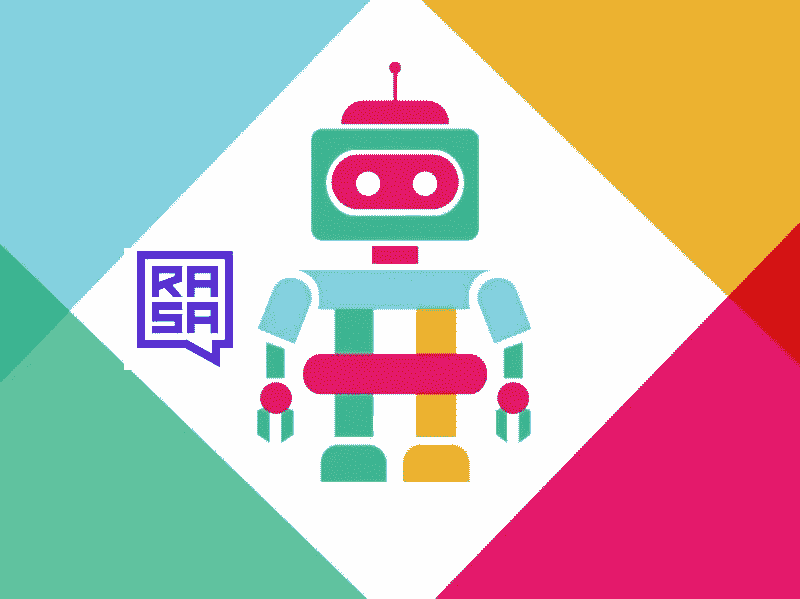
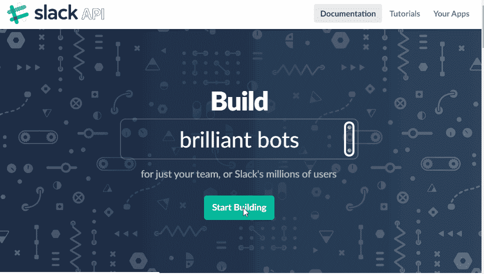
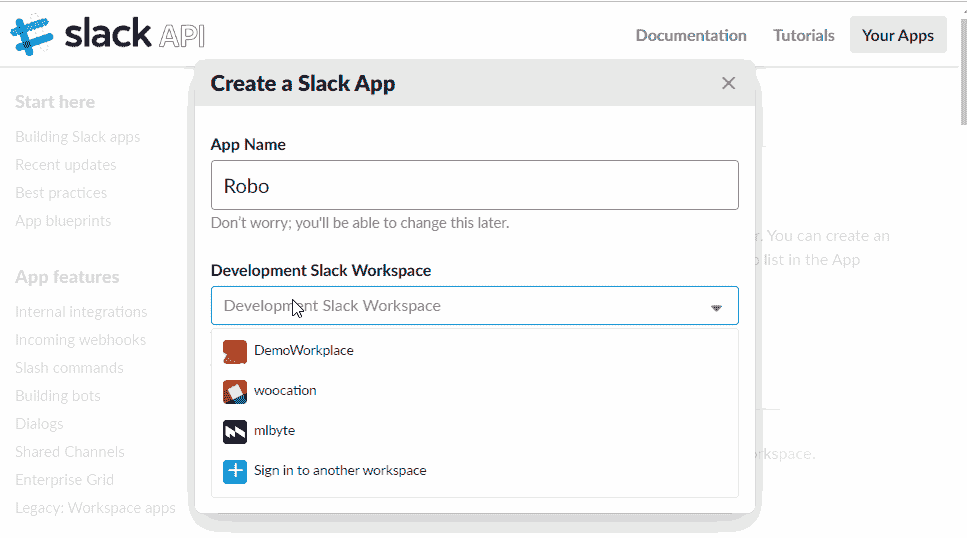
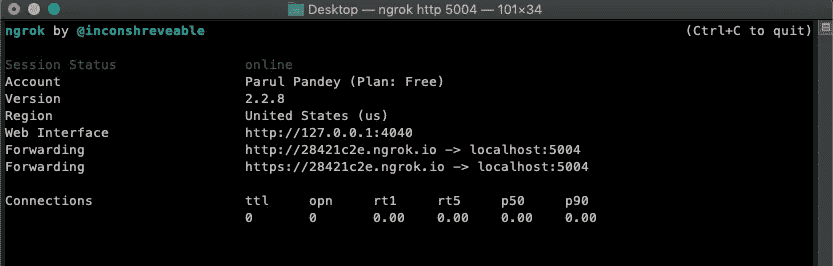
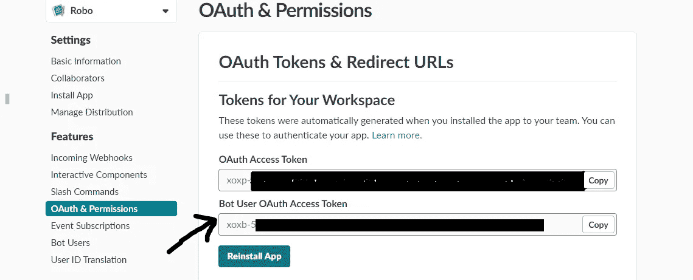
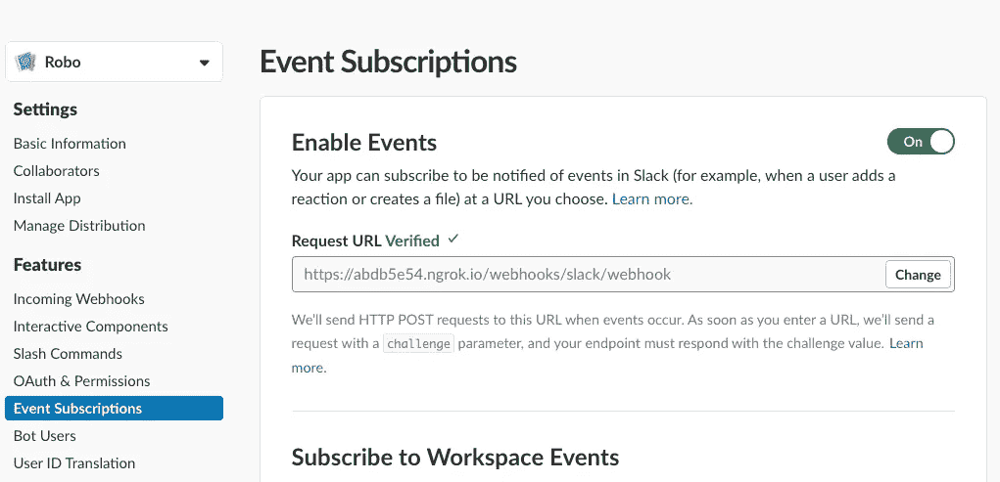
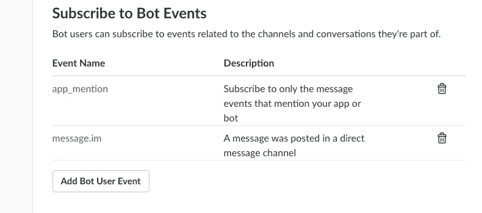
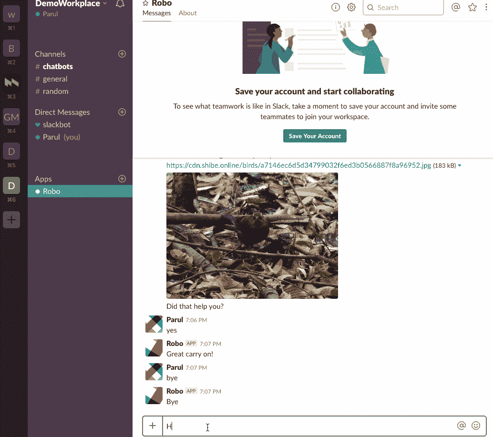

# 使用 Rasa 和 Python 为 Slack 构建对话聊天机器人——第 2 部分

> 原文：<https://towardsdatascience.com/building-a-conversational-chatbot-for-slack-using-rasa-and-python-part-2-ce7233f2e9e7?source=collection_archive---------2----------------------->

## 在 Slack 上部署 Rasa 聊天机器人的指南



> ***注意:这篇文章是很久以前写的，RASA 可能会有变化，但这些变化并没有纳入本文。建议访问他们的官方文档网站，了解最新的详细信息。***

> "松弛度又下降了，所以同事们不得不互相交谈"。

*当 slack 在 2018 年年中暂时关闭时，整个科技世界陷入了混乱和混乱。互联网上充斥着关于 slack 的讨论，Twitter 上也出现了 Slack #的流行趋势。嗯，slack 已经成为许多公司不可或缺的一部分，人们经常用它来交流和讨论事情。一些远程工作的公司一直使用 slack 进行实时通信。*

# 我们离开的地方

这是文章的结论部分: [**使用 Rasa 和 Python 为 Slack 构建对话聊天机器人——第 1 部分**](/building-a-conversational-chatbot-for-slack-using-rasa-and-python-part-1-bca5cc75d32f) **。**在第一部分中，我们详细讨论了关于 **Rasa Stack** :一个开源的机器学习工具包，它让开发人员可以扩展机器人，而不仅仅是回答简单的问题。然后，我们使用 Rasa 的两个模块，即 **Rasa NLU** 和 **Rasa Cor** e，构建了一个功能齐全的聊天机器人，能够检查人们的情绪，并采取必要的行动让他们振作起来。这些动作包括根据用户的选择向用户展示狗、猫或鸟的图像。

# 目标

在本文中，我们将利用所有生成的文件在 slack 上部署 Bot。我强烈建议你在尝试**第二部分**之前，先阅读**第一部分**。

# Rasa 装置

*   与前一部分不同，我们将不得不安装最新版本的 Rasa 核心。强烈建议您创建一个虚拟环境，然后继续安装

```
#**creating a virtual environment**
conda create --name bot python=3.6**#Activate the new environment to use it**WINDOWS: activate bot
LINUX, macOS: source activate bot#**Install latest Rasa stack**
**#Rasa NLU**
python -m pip install rasa_nlu[spacy] ([https://rasa.com/docs/nlu/installation/](https://rasa.com/docs/nlu/installation/))**#Rasa Core**
python -m pip install -U rasa_core 
([https://rasa.com/docs/core/installation/](https://rasa.com/docs/core/installation/))**#Language Model**python -m spacy download en_core_web_md
python -m spacy link en_core_web_md en --force;
```

*   克隆我的 [GitHub 库](https://github.com/parulnith/Building-a-Conversational-Chatbot-for-Slack-using-Rasa-and-Python)。

存储库包含第 1 部分中生成的文件。但是，由于 Rasa API w.r.t 版本的一些变化，函数和命令也有一些变化。

# 设置

让我们通过创建一个 slack 应用程序来创建一个 slack 集成。让我们来看看创建一个 Slack 应用程序的过程。

*   创建一个呆滞账户并转到[**https://api.slack.com/**](https://api.slack.com/)。现在选择一个现有的开发松弛工作空间(如果你有)或者创建一个新的。将其命名为 **DemoWorkplace** 或者任何你喜欢的名字。



DemoWorkplace creation

*   现在在 **DemoWorkplace** 中创建一个 Slack 应用，并给它命名。我们把自己的 app 叫做 **Robo** 。
*   开始向应用程序添加特性和功能。我们将首先在 `**Bots Tab**`下创建一个`**bot** **user**`，并将其集成到应用程序中。这将使应用程序对话。由于这个机器人将被创建为用户，我们可以选择让它一直在线。保存所做的所有更改。
*   为了确保机器人已经被集成，导航到`Basic Information Tab`下的 `Add Features and Functionality`，并确保`Bots`和`Permissions`选项卡处于活动状态。我们的机器人已经集成到应用程序中。
*   接下来，我们可以添加一些关于我们机器人的信息，包括图片，描述和背景颜色。滚动到`Display Information`并添加信息。
*   保存您进行的所有更改。
*   最后，我们需要**将这个应用程序安装到我们之前定义的工作场所**中。授权它，我们已经准备好我们的应用程序，并集成到工作场所。

这个过程总结在下面的 gif 中。



Adding Robo App to the DemoWorkplace

## Ngrok

Ngrok 是一种多平台隧道、反向代理软件，可建立从公共端点(如互联网)到本地运行的网络服务的安全隧道。简而言之，这意味着，它可以从互联网上访问您的本地应用程序。

*   从[这里](https://dashboard.ngrok.com/get-started)下载 ngrok。确保您首先登录。
*   通过`$ unzip /path/to/ngrok.zip`解压安装
*   通过`$ ./ngrok <authtoken>`连接您的账户

导航到解压 ngrok 的目录，并在控制台中键入`$ ngrok <authtoken>` 。令牌可以从这里的[访问](https://dashboard.ngrok.com/auth)。

*   点燃它。

首先告诉它我们想要向公共互联网公开哪个端口:`./ngrok http 5004`

如果一切顺利，您应该会看到以下屏幕:



**这里的**[**http://-. ngrok . io**](http://-------.ngrok.io)**是 ngrok 的网址。**

# 在空闲时部署机器人

*   **创建一个 Python 脚本**

既然我们已经完成了所有的需求，是时候部署我们的机器人了。为此，我们将需要编写一个名为`**run_app.py**`的 Python 脚本，它将把我们的聊天机器人与我们上面创建的 slack 应用程序集成在一起。我们将首先为我们的 Rasa 聊天机器人创建一个 slack 连接器。我们将使用 RasaNLU 解释器直接从 python 脚本加载 NLU 模型。

我们将再次训练我们的模型，以确保一切正常运行。

## 培训 NLU 模型

```
python nlu_model.py
```

## 培训 Rasa 核心模型

我们在第 1 部分中创建的 actions 文件现在需要在单独的服务器上运行。这是 Rasa Core 最新版本的一个变化。有关更多详细信息，请阅读文档。

*   启动自定义操作服务器

```
python -m rasa_core_sdk.endpoint --actions actions
```

*   打开一个新的终端并训练 Rasa 核心模型

```
python dialogue_management_model.py
```

*   通过运行`**run_app.py**`文件启动代理。确保在脚本中提供松弛令牌。可以如下获得松弛令牌。



*   在端口 5004 上启动 ngrok 并获取您的 ngrok_url。
*   将 URL:[https://<your _ ngrok _ URL>/web hooks/slack/web hook](https://your_ngrok_url/webhooks/slack/webhook)提供给 Slack 配置的“事件订阅”页面。等待验证。



*   最后，`**subscribe to some Workplace event**s`喜欢:

当有人提到它的名字时，我们的机器人会做出反应

**message_im** 允许用户直接向机器人发送消息。



*   请确保保存您进行的所有更改

# 我们谈谈吧

```
Ensure the custom actions server is runningEnsure ngrok is running on port 5004Navigate to Slack interface and talk to your bot
```

这听起来可能是一项艰巨的任务，但如果你一步一步地遵循它，你最终将能够立即创建一个名为 Robo 的工作 slackbot。你可以和你的机器人聊天，就像我一样:



# 结论

这是一个相当全面的教程，但事实上，我们能够建立一个全功能的 Slackbot 使得所有的努力都是值得的。Rasa 是一个非常有用的库，你可以试验和修改它来创建一些真正有用的聊天机器人。

在此阅读第 1 部分[的](/building-a-conversational-chatbot-for-slack-using-rasa-and-python-part-1-bca5cc75d32f)

[Github 知识库链接](https://github.com/parulnith/Building-a-Conversational-Chatbot-for-Slack-using-Rasa-and-Python)