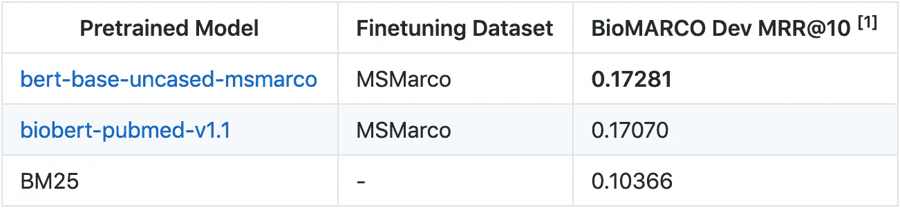

# 构建自定义搜索相关性训练集

> 原文：<https://towardsdatascience.com/building-a-custom-search-relevance-training-set-38a4fb90044f?source=collection_archive---------40----------------------->

## 使用 bing 数据和文本分类器生成搜索引擎训练/评估集

由[科尔·塞恩斯](https://medium.com/@colethienes)合著，看看我们的 [Github](https://github.com/koursaros-ai/nboost)

Photo by [Markus Winkler](https://unsplash.com/@markuswinkler?utm_source=medium&utm_medium=referral) on [Unsplash](https://unsplash.com?utm_source=medium&utm_medium=referral)

在构建可训练的语义搜索平台 [NBoost](https:/github.com/koursaros-ai/nboost) 的过程中，我意识到缺乏大规模、易于使用、带标签的数据集来评估特定领域的搜索引擎，例如生物医学信息的定制搜索。

**本文包括生成搜索查询和段落的代码，这些查询和段落被标记为与特定领域或知识领域相关。**我们通过选择微软流行的 MS Marco 数据集的子集来实现这一点。微软发布的完整标签集太大了，无法完整使用。

为健康/生物学生成的子集中的查询和相关段落的示例:

> ***查询:*** 按年龄划分正常血压是多少？
> 
> ***相关段落:****……对于 25-29 岁的成年人来说，正常的血压读数是 120/80 毫米汞柱……*

# 用谷歌自然语言 API 标注 10k 段落

使用[谷歌的语言 API](https://cloud.google.com/natural-language/) ，高达 30k/月的文档分类是**免费的**。它可以用来将段落分为 700+个类别，还可以报告置信度得分。

**您需要先** [**注册 Google Cloud 并认证您的客户端**](https://cloud.google.com/natural-language/docs/reference/libraries) **，参见。**然后运行:

# 为集合的其余部分创建文本分类器

我们使用 [vowpal-wabbit](https://github.com/VowpalWabbit/vowpal_wabbit) (VW)来构建一个二进制文本分类器，它可以非常快速且免费地对集合的其余部分进行分类。请确保它已安装。(在 bash 上键入`vw --help`)。

定义一个从 Google NLP 类别中提取二进制标签的函数。在我们的案例中，我们使用健康/科学:

然后用它来建立一个大众培训集:

然后使用此数据训练分类器，并将其保存为 bio_model:

`vw input.vw -f bio_model`

# 分类 MSMarco

*   下载 MsMarco 收藏+查询:`wget [https://msmarco.blob.core.windows.net/msmarcoranking/collectionandqueries.tar.gz](https://msmarco.blob.core.windows.net/msmarcoranking/collectionandqueries.tar.gz)`
*   摘录:`tar -xvzf collectionandqueries.tar.gz`
*   从这个 repo 构建 porter stmr cli，并确保它在您的路径中。
*   将你提取 collectionsandqueries.tar.gz 的目录设置为:马可女士的
    `export DATA_DIR=./collectionandqueries`
*   运行以下代码，生成{passage_id} {score}格式的文件`preds`。分数越高，越有可能与特定领域相关:

> ⚠️如果你把这个复制粘贴到终端中，第一个 **sed** 命令中的**标签** 可能会变成一个空格。手动删除并按下 *ctrl-v* 然后 tab。

# 为子集构建段落和查询

从 MSMarco 加载集合和查询然后对它们进行分类的代码稍微复杂一些，所以我在这里就不赘述了。

如果您想要生产该集合，克隆[这个](https://github.com/koursaros-ai/MSMarco-bio)回购并运行 python 脚本:

`python3 build_dataset.py --data_dir <path to collectionsandqueries dir> --out_dir <bio-collectionsandqueries>`

输出文件夹应包含:

*   `collection.tsv`
*   `qrels.dev.small.tsv`
*   `qrels.train.tsv`
*   `queries.dev.small.tsv`
*   `queries.train.tsv`

有关这些文件格式的更多细节，请参见此处的。

# 生物子集的评估结果

我使用了在 [NBoost](https:/github.com/koursaros-ai/nboost) repo 上提供的预先训练的搜索相关性模型来对我为健康/生物学生成的数据集进行基准测试。

在此下载数据集[或按照下面的指南构建数据集。查看](https://storage.googleapis.com/koursaros/bio-collectionandqueries.tar.gz)[此处](https://github.com/microsoft/MSMARCO-Passage-Ranking)了解更多关于文件格式的细节。

查看我们的主要项目 [NBoost](https://github.com/koursaros-ai/nboost) 下载并使用 ElasticSearch 部署模型。

**[1]** 对 BM25 的前 50 名结果进行重新排序

*原载于 2019 年 12 月 3 日*[*https://koursaros-ai . github . io*](https://koursaros-ai.github.io/Custom-Search/)*。*