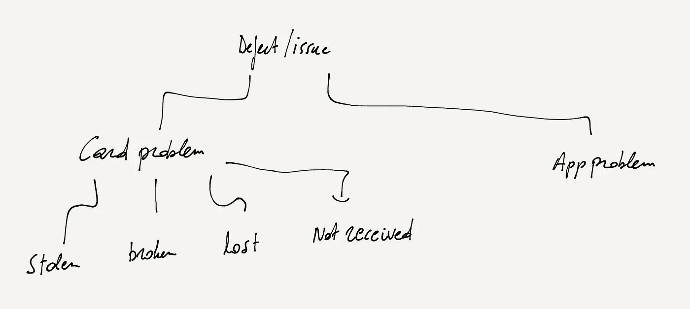
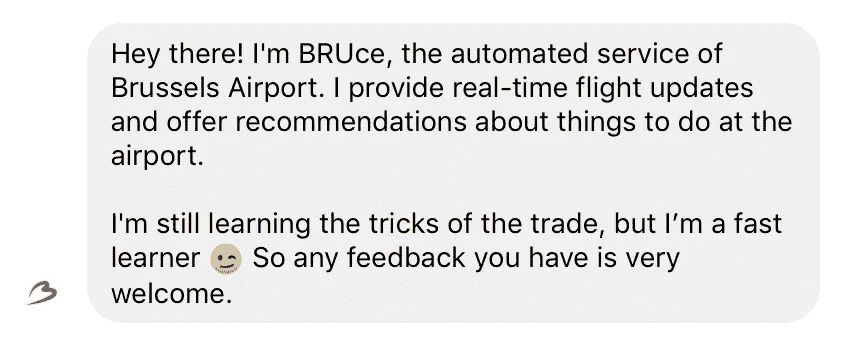
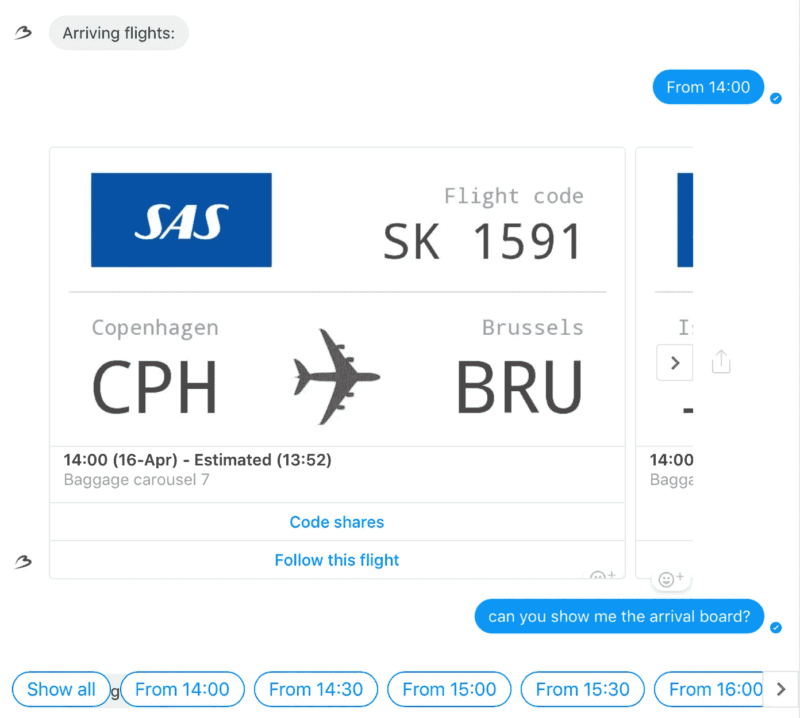

# 从产品所有者的角度构建客户服务聊天机器人

> 原文：<https://towardsdatascience.com/building-a-customer-service-chatbot-from-a-product-owners-perspective-aa59dfbb2f65?source=collection_archive---------15----------------------->

在一家大型金融机构从事聊天机器人项目 1 年半之后，我已经了解了一两件关于构建虚拟助理的事情。如果您正在考虑启动一个类似的项目或正在进行的实现，我希望这篇文章可以在某种程度上帮助您。如果你想深入了解这件事，不要犹豫，留下评论或直接联系。

首先是一些不可避免的术语，以确保我们都在同一页上:

*   **意图**:用户想要做的任务(获取信息，做一个(交易)动作，报告一个问题等等)。
*   **表情**:用户如何表达他的意图(句子、问题、命令等等)。也称为话语。
*   **对话状态**:对话树结构中的节点，对应于聊天机器人可以提供的答案。意图基本上是在特定对话状态下启动聊天机器人会话的“快捷方式”。
*   机器人回复:用户将从聊天机器人那里收到的实际答案。
*   **NLP** :自然语言处理，人工智能内部的一个学科，专注于通过使用机器学习技术来处理人类语言。

# **构建业务案例**

在任何项目开始之前，清楚地陈述目标是很重要的。该聊天机器人定位于客户服务环境，该项目有两个目标:

1.  了解新技术:自然语言处理、人工智能和对话式用户界面
2.  探索聊天机器人是否有潜力取代网站常见问题，成为头号数字自助服务支持渠道

# **你有足够的正确数据吗？**

在当今的结构化和非结构化大数据世界中，在线分析、指标、仪表盘等。重要的是专注于手头任务有用的东西。在构建客服聊天机器人时，你基本上需要一样东西:对话。

当我们开始我们的项目时，几乎没有可用的文本对话数据。绝大多数的客户互动都是电话。wav 录音存储在银行的服务器上。因此，我们必须根据 FAQ 文章浏览量和关键字搜索分析来选择我们的初始范围。回想起来，这并不是建立聊天机器人的理想起点。为什么？因为 FAQ 是包含大量信息的比较大的文章。有具体问题的人都可以在同一篇 FAQ 文章中找到答案。所以你可以认为这是一个“危险”的游戏，我们知道答案，我们需要猜测随之而来的问题。

在理想情况下，您可以访问联系中心代理和客户之间的大量聊天会话。这个对话数据集让您能够确定客户用自己的话表达的真正需求。然后你就可以开始聚集这些表达并识别意图。一旦你有了一套意图，你就可以继续构建一个对话树来构建对话状态并相应地链接意图。

如果你没有必要的会话数据，我会建议使用“机械土耳其人”原则。这基本上是在聊天机器人背后安排人力，在 POC/启动阶段提供答案。您需要一个模拟聊天机器人用户体验的对话式 UI，以及几个实时处理聊天机器人对话的客户服务代理。用户将获得顶级的用户体验，您将能够收集必要的对话数据。

# **意向库**

因此，您现在可以访问必要的对话数据，并成功地将许多表达聚合成意图。现在最难做的事情之一是提出一个明确的、逻辑的和层次化的意图命名约定。我怎么强调这一点都不为过，因为你的整个聊天机器人团队都需要使用它，它是你的自然语言处理的核心。这是我的团队到目前为止学到的最重要的一课。

**不含糊**

对于任何给定的用户表达，你的 NLP 培训师应该 100%清楚它必须被归类到哪个意图下。如果有任何疑问，你就冒着多个人工智能训练者将相似的表达归类到不同意图下的风险= >这将导致意图混淆，从而降低你的整体 NLP 性能。

**逻辑**

随着你的聊天机器人的成长，被支持的意图的数量会大量增加。我们的聊天机器人目前有+/- 150 个意向，但我们正准备扩大到 1000–1500 个意向。为了做到这一点，你需要一个意图的逻辑结构。当人工智能训练器分析一个表达式进行意图匹配时，他(她)需要解构句子，并识别主语、动词、细节……这种逻辑应该反映在意图命名中，以便匹配可以有效地发生。

**分等级**

基于意图命名结构的逻辑方面，包含分层方法是一种合理的做法。这里的想法是建立在所谓的“基本意图”上，它包含非常基本的表达(非常短的句子)。用户在表达中提供的细节越多，NLP 训练器就能给出越详细的适当意图。一旦有信息丢失或解释的空间，NLP 训练者应该能够默认一个更高的意图，并让 DialogState 从那里开始对话。

# 理想的团队构成

构建聊天机器人需要合适的团队来让它工作。以下角色已被证明是不可或缺的:

*   **NLP 训练器**:维护对话树，对话状态，bot 回复；为现有意图提供表达式；建议创造新的意图。
*   **NLP 看门人**:维护意图结构(CRUD)并测试意图混淆
*   **开发者**:将聊天机器人整合到你的数字渠道(网站、应用、…)
*   产品负责人:制定聊天机器人的总体战略，负责利益相关者的管理，并在团队中设定任务优先级。

# UI/UX 提示和技巧

## 限制表达式长度

这对客服聊天机器人特别有用。人们倾向于在最初的表达中包含大量的信息。这使得聊天机器人很难理解，得到的机器人回复通常是可怕的“对不起，我不明白你的问题，请重新措辞”。为了预测这种情况，您可以限制用户可以键入的字符数。理想情况下，用户表达式应该局限于一个简洁的问题。瞄准麦克斯。100 个字符(但一定要检查您的对话数据集，并根据您的用户群调整该数字)。

## 和人类聊天:好的，但是不要这么快

你的聊天机器人经常会失败，让客户感到沮丧(尤其是在机器人开发的早期阶段)。当聊天机器人在翻译中迷路时，给人们提供与人类聊天的选项是一个最佳实践。但是，要确保这种“退出策略”不会太方便。如果有人可以通过一个简单的命令来寻求人类的帮助，他们会很快学会，这将成为回头客的标准。确保用户至少尝试两次来表达他们的需求，否则机器人就会过时。

## 给你的聊天机器人赋予个性，但不要试图成为一个人

一开始就明确表示人们正在和聊天机器人聊天。否则，当事情出错时，他们会感到困惑和恼怒。但是不要让它阻碍你创造机器人人格。这允许你(除了名字、头像之外……)选择一种“语调”，这是解释范围和联系目标受众的有效工具。

Example from Brussels Airport chatbot, BRUce

## 使用 NLP，但是尽可能使用按钮和媒体

尝试用 NLP 引擎捕捉用户的表情，但是在你的机器人回复中使用按钮和媒体(图片，视频)。它给用户信心和感觉，他们越来越接近他们的问题的答案。

Quick replies and visual carousels can enhance the UX when used properly

# 结束语💭

聊天机器人的使用目前仍处于试验阶段(2018 年至 2019 年)。有很多 NLP 提供商，所以确保你不要把自己过多地束缚在一个系统中。保持你的意图+表情目录和机器人回复的所有权。测试竞争的 NLP 提供商并比较结果。

