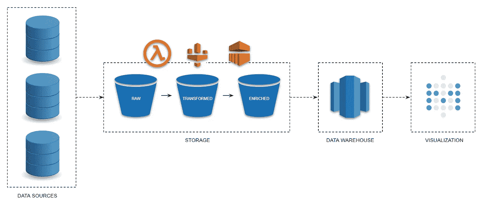

# 在 AWS 上从头开始构建数据管道

> 原文：<https://towardsdatascience.com/building-a-data-pipeline-from-scratch-on-aws-35f139420ebc?source=collection_archive---------10----------------------->

当你开始深入数据世界时，你会发现有很多方法可以选择，有很多工具可以使用。一开始可能会让你有点不知所措。

在这篇文章中，我将尝试帮助您了解如何选择合适的工具，以及如何基于我最近构建的管道，使用 AWS 堆栈在云上构建一个完全可用的数据管道。

这里讨论的管道将为所有数据阶段提供支持，从数据收集到数据分析。这里的目的是为您提供足够的信息，通过回顾我构建第一个数据管道的整个过程，以便在这篇文章结束时，您能够构建自己的架构并讨论您的选择。

# 我应该使用哪些工具？

让我们来解决你可能想到的第一个问题:**构建管道的合适工具是什么？**我在建矿时找到的答案是:

> 没有正确的工具或架构，它将永远取决于您的需求！

如果你需要处理流数据，也许 Kinesis 对你来说是一件好事，但如果你有一些预算限制，并且你不介意照顾基础设施，你可以选择 Kafka。如果你必须处理历史数据，你不会需要这些东西，但是另一方面，胶水是一个很好的朋友。换句话说，你的需求将决定什么最适合你。这里重要的是**了解你的挑战，知道你的局限**，以便做出正确的选择。

# 挑战

等我进了公司，就出现了一个大问题:数据太孤立了。分析数据既慢又难，人们找不到做这件事的动机。挑战是:集中这些数据并在公司推动**数据民主化**，以便**授权**员工！很大的挑战，对吧？

# 风景怎么样？

我们当时的数据来源是多种多样的。我们必须从脸书广告 API、广告词 API、谷歌分析、谷歌表单和公司内部系统中收集一些数据。为了从这些来源收集数据，我构建了一个 Node JS 应用程序，因为 Node JS 具有异步运行的能力，并且在这种情况下收集数据时可以加快速度。

# 管道

为满足这些需求而提出的管道架构如下图所示，我们将讨论其中的一点改进。

## 数据摄取

流水线的第一步是**数据摄取**。这个阶段将负责运行提取器，这些提取器将从不同的源收集数据，并将它们加载到数据湖中。

为了运行那些节点 JS 脚本，我们在 AWS 上使用了 EC2 实例，但是我推荐你做的一个很大的改进是使用 Lambda 来运行那些脚本。Lambda 是 AWS 提供的一个很棒的无服务器解决方案。通过使用 Lambda，您将不必担心维护服务器，也不必为只使用几个小时的 24 小时服务器付费。

## 数据存储

但是我应该在哪里加载这些数据呢？S3 是 AWS 提供的一项出色的存储服务。它具有高可用性和成本效益，是构建数据湖的完美解决方案。一旦脚本从不同的数据源提取数据，数据就被加载到 S3。

考虑如何组织数据湖是很重要的。对于这条管道，一旦我们没有科学家和分析师团队来处理这些数据，一旦我们的数据来自非常有组织的来源，我只在 S3 上创建了一个原始分区，在那里我以真实的形式(它们来自源的方式)存储数据，只在 Node JS 脚本中做了一些调整。

但是，如果您希望让数据科学家和分析师处理这些数据，我建议您创建其他分区，以便以适合每个用户的形式存储数据。您可以在这里创建三个目录，如下所示:

*   Raw:在这里，您将按照数据的真实形式存储数据，即它来自源的未经修改的形式。
*   Transformed:在转换数据后，处理可能的问题，如标准化、丢失值和诸如此类的问题，数据将被加载到这里。这些数据将对数据科学家有用。
*   丰富:为了分析，你必须丰富数据。您可能希望创建一个适合您的业务规则的大表(OBT ),这样您就可以在一个地方获得分析师需要的所有信息。这是将存储在该层的数据。

现在你可能会问:我如何将数据从一个阶段转移到另一个阶段？而答案是:看情况！如果您的数据量很小，不超过 3008M 内存和 15 分钟的执行时间(这些是我写这篇文章时的限制，现在检查它是否仍然适用)，一个好的解决方案可能是 Lambda。您可以创建转换和丰富函数，以便处理一个阶段的数据并将其加载到另一个阶段。然而，如果你的数据超过这个限制，你可能会去胶水。胶水是一个非常有用的工具。在这条管道上，我使用 Glue 对数据执行转换，但是因为我没有实现转换和丰富阶段，所以我使用它将数据直接加载到数据仓库。但是如果你需要这三个(或者更多)阶段，胶水也是一个不错的解决方案。但是，如果您需要处理大量数据，使用 EMR 集群可能是更好的解决方案。这将取决于你正在处理的数据量、你处理数据的速度以及你的花费。

## 数据仓库

现在，您的数据已经在您的数据湖上，经过转换和丰富，是时候将它发送到数据仓库了！我使用红移已经有一段时间了，我对它有很好的体验。这是一款性能卓越、价格合理的可靠解决方案。红移还提供了一个非常棒的资源，叫做红移光谱，它使得直接从 S3 的数据湖中查询数据成为可能。

对于我的解决方案，由于数据量不是问题，所以我将所有数据存储在红移上，从而提高了性能。但是，如果您有大量的数据，那么在红移中维护所有的历史数据会变得很昂贵，因此只存储最新的红移数据并保留 S3 的历史数据是很好的。除此之外，要记住的一件好事是将 S3 的历史数据以列格式存储，如 Parquet，因为这将大大降低使用红移光谱查询的成本。

## 数据可视化

如果人们无法访问数据，那么数据还有什么价值？最后一步，您需要将可视化工具集成到您的管道中。我选择使用的工具是 Metabase。

Metabase 是一个很棒的开源可视化工具。它提供了一个直观和用户友好的界面，因此没有查询、SQL 和那些东西的知识的用户将能够探索数据并创建图形和仪表板来可视化他们的结果。Metabase 还允许用户通过电子邮件和 slack 定义通知，接收通知已定义指标或分析的预定电子邮件，创建可以按公司部门分组数据的集合，创建显示分析的面板以限制对用户组的访问，等等。

# 包扎

在这篇文章中，我们讨论了如何使用 AWS 解决方案实现数据管道。我与你分享了我用来建立我的第一个数据管道的一些东西，以及我从中学到的一些东西。当然还有很多东西可以用来改进它，比如日志等等，但是这已经是开始的一大步了。我希望到现在为止，您已经非常清楚如何开始构建自己的管道了！

感谢您的阅读，如果您有任何问题或建议，请告诉我，我很乐意与您讨论:)