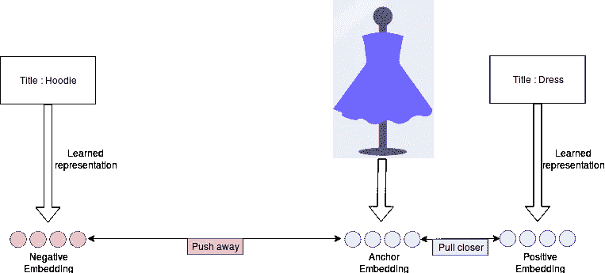
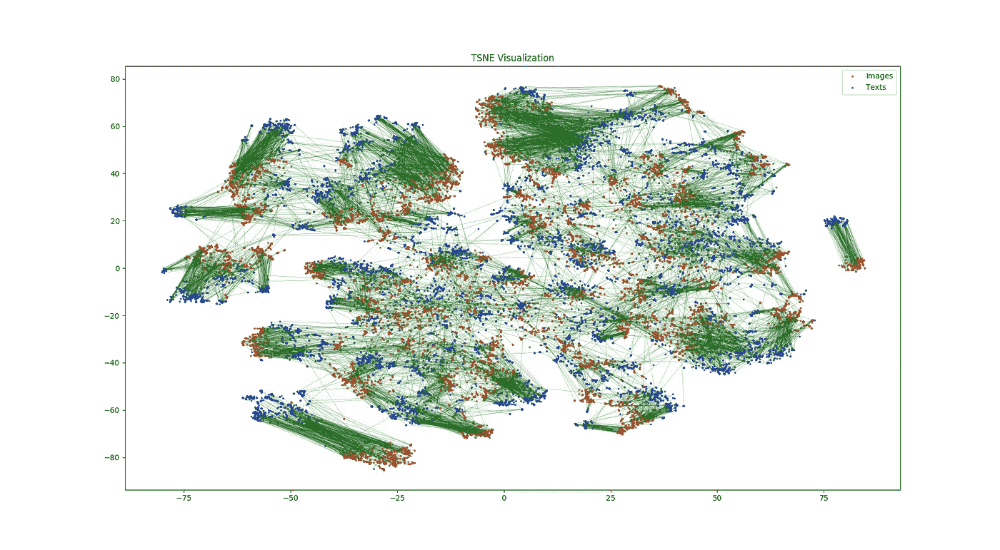
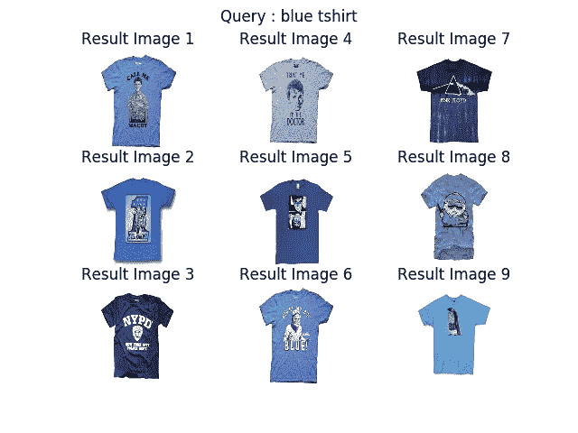
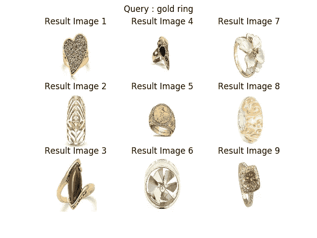
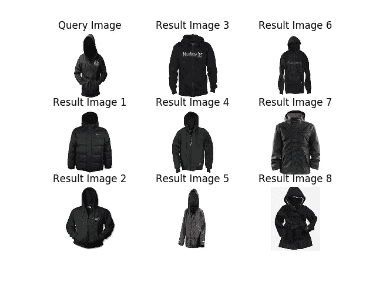
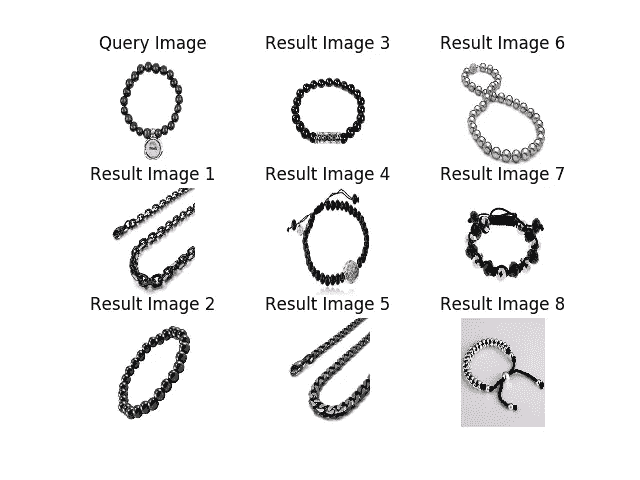

# 使用 tf 构建深度图像搜索引擎。克拉斯

> 原文：<https://towardsdatascience.com/building-a-deep-image-search-engine-using-tf-keras-6760beedbad?source=collection_archive---------17----------------------->

Photo by [Kayla Farmer](https://unsplash.com/@imagesbykayla?utm_source=unsplash&utm_medium=referral&utm_content=creditCopyText) on [Unsplash](https://unsplash.com/s/photos/search?utm_source=unsplash&utm_medium=referral&utm_content=creditCopyText)

# 动机:

想象一下，有几十万到几百万张图像的数据集合，却没有描述每张图像内容的任何元数据。我们如何建立一个系统，能够找到这些图像的子集，最好地回答用户的搜索查询？我们基本上需要的是一个搜索引擎，它能够根据图像结果与搜索查询的对应程度对图像结果进行排序，搜索查询可以用自然语言或另一种查询图像来表达。
我们将在本文中解决这个问题的方法是通过训练一个深度神经模型，该模型学习任何输入图像和文本的固定长度表示(或嵌入),并使这些表示在欧几里得空间中接近，如果文本-图像或图像-图像对“相似”的话。

# 数据集:

我找不到一个足够大的搜索结果排名数据集，但我能够得到这个数据集:【http://jmcauley.ucsd.edu/data/amazon/】T2，它将电子商务项目图片链接到它们的标题和描述。我们将使用这些元数据作为监督源来学习有意义的联合文本-图像表示。为了管理计算和存储成本，实验仅限于时装(服装、鞋子和珠宝)和 500，000 张图像。

# 问题设置:

我们拥有的数据集将每张图片与用自然语言书写的描述联系起来。因此，我们定义了一个任务，在这个任务中，我们希望学习一个连接的、固定长度的图像和文本表示，以便每个图像表示都接近其描述的表示。

# 型号:

该模型采用 3 个输入:图像(即锚点)、图像标题+描述(正面示例)，第三个输入是一些随机采样的文本(负面示例)。
然后我们定义两个子模型:

*   图像编码器:Resnet50 在 ImageNet+GlobalMaxpooling2D 上预先训练
*   文本编码器:GRU+GlobalMaxpooling1D

图像子模型产生锚点的嵌入 **E_a** ，文本子模型输出正面标题+描述的嵌入 **E_p** 和负面文本的嵌入 **E_n** 。

然后，我们通过优化以下三重损失进行训练:

**L = max( d(E_a，E_p)-d(E_a，E_n)+alpha，0)**

其中 d 是欧几里德距离，α是在该实验中等于 0.4 的超参数。

基本上这个损失允许做的就是把 **d(E_a，E_p)** 做小，把 **d(E_a，E_n)** 做大，这样每一个图像嵌入都是靠近其描述的嵌入而远离随机文本的嵌入。

# 可视化结果:

一旦我们学习了图像嵌入模型和文本嵌入模型，我们就可以通过使用 tsne([https://sci kit-learn . org/stable/modules/generated/sk learn . manifold . tsne . html](https://scikit-learn.org/stable/modules/generated/sklearn.manifold.TSNE.html))将它们投影到二维空间来可视化它们。

Test Images and their corresponding text description are linked by green lines

从图中我们可以看出，一般来说，在嵌入空间中，图像与其对应的描述是接近的。这正是我们所期望的训练损失。

# 文本图像搜索:

在这里，我们使用几个文本查询的例子在一组 70，000 张图像中搜索最佳匹配。我们为查询计算文本嵌入，然后为集合中的每个图像计算嵌入。我们最终选择嵌入空间中最接近查询的前 9 个图像。

这些例子表明，嵌入模型能够学习图像的有用表示和简单单词组合的嵌入。

# 图像-图像搜索:

这里我们将使用一个图像作为查询，然后在 70，000 个图像的数据库中搜索与其最相似的例子。使用欧几里德距离，通过每对图像在嵌入空间中的接近程度来确定排名。

结果表明，所生成的嵌入是图像的高级表示，其捕捉了所表示的对象的最重要的特征，而不受方向、照明或微小的局部细节的过多影响，并且没有被明确地训练来这样做。

# 结论:

在这个项目中，我们致力于机器学习模块，使我们能够建立一个基于关键字和图像的搜索引擎，应用于图像集合。基本思想是为文本和图像学习一个有意义的联合嵌入函数，然后使用嵌入空间中项目之间的距离对搜索结果进行排序。

**参考文献:**

*   [通过排名大规模在线学习图像相似度](http://www.jmlr.org/papers/volume11/chechik10a/chechik10a.pdf)
*   [起伏:用一类协同过滤对流行趋势的视觉演变建模](https://cseweb.ucsd.edu/~jmcauley/pdfs/www16a.pdf)
*   [https://github . com/KinWaiCheuk/Triplet-net-keras/blob/master/Triplet % 20NN % 20 test % 20 on % 20 minist . ipynb](https://github.com/KinWaiCheuk/Triplet-net-keras/blob/master/Triplet%20NN%20Test%20on%20MNIST.ipynb)

**代码:** 重现结果🔍=>[https://github.com/CVxTz/image_search_engine](https://github.com/CVxTz/image_search_engine)