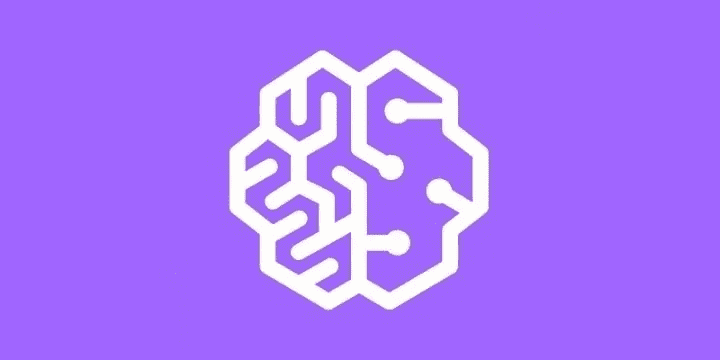

# 为机器学习和人工智能构建 DevOps 管道:评估 Sagemaker

> 原文：<https://towardsdatascience.com/building-a-devops-pipeline-for-machine-learning-and-ai-evaluating-sagemaker-cf7fdd3632e7?source=collection_archive---------12----------------------->

## 构建和部署机器学习模型的热潮暴露了传统 DevOps 过程中的裂缝。

为部署传统应用程序而构建的基础架构没有针对大规模部署 AI/ML 的挑战进行优化。这一挑战来自数据科学家和工程师工作方式的固有差异。数据科学家工作流的迭代和实验性质，加上他们计算需求的高度可变性，使得构建 DevOps 机器学习(ML)管道(越来越多地被称为“MLOps”)变得非常困难。

MLOps 管道背后的目标是以一种仍然允许灵活实验的方式稳定和简化 ML 模型发布过程。然而，很难找到一个一致的框架来构建这个管道，因为 ML 团队实践和工具都不够成熟。这篇文章提供了一个有用的框架来评估 MLOps 管道组件，并深入探讨了这些管道组件的一些潜在解决方案，包括 AWS Sagemaker 和 Comet.ml。

## 目标和注意事项

将模型部署到生产环境只是 MLOps 管道的一部分。有效的 MLOps 管道还包括为持续培训、适当的版本控制、可扩展的服务基础设施以及持续的监控和警报建立数据管道。显然，这与传统的软件开发有相似之处，但是仍然有一些重要的开放性问题需要回答:

**针对 DevOps 工程师**

*   我如何将它连接到现有系统？
*   我如何使这些组件可伸缩？
*   它会使模型部署更容易吗？
*   它会让与数据科学家的合作变得更容易吗？

**为数据科学家**

*   它是否像使用我自己的环境工具/设置一样灵活？
*   它会使构建和训练模型变得更容易吗？
*   它会让与其他数据科学家的合作变得更容易吗？
*   这会让与 DevOps 的合作变得更容易吗？

**这些问题可以归结为有效的 MLOps 渠道应该实现的三个主要目标:**

*   扩展基础设施
*   灵活的团队协作
*   再现性

不管你的团队的规模和组成如何，这些目标都很重要，但是它们的执行可能会因这些因素而有所不同。许多团队面临的问题是，是建立自己的定制环境，还是从 Amazon、Google 或 Microsoft 等云提供商那里购买托管服务。

## 购买与构建

对于 DevOps ML 管道，您可以考虑的一个选项是 AWS Sagemaker。AWS 宣布 Sagemaker 是“完全托管的端到端机器学习服务，使数据科学家、开发人员和机器学习专家能够快速构建、训练和托管大规模的机器学习模型。”

那么 Sagemaker 在整个管道中处于什么位置，它与定制环境有什么不同呢？

**模型开发**

Sagemaker 的价值归结为抽象和统一。Sagemaker 本质上是 AWS 中的一个托管 Jupyter notebook 实例，它提供了一个用于深度学习模型的简单分布式训练的 API。在引擎盖下，SageMaker 的主要组件是特定的[亚马逊机器映像](https://docs.aws.amazon.com/AWSEC2/latest/UserGuide/AMIs.html) (AMIs)和普通的 EC2 实例，其数据来自 S3 对象存储[ [源](https://hackernoon.com/should-i-use-amazon-sagemaker-for-deep-learning-dc4ae6b98fab)。

如果您自己设置了这些等价部分，那么您可以自己托管一个 EC2 实例。当您请求 EC2 实例时，您可以指定哪个 AMI 应该被用作它的模板(查看 AWS Marketplace 以获得预配置 AMI 的完整列表)。ami 从操作系统、库、应用程序等细节中捕捉环境的确切状态。对于深度学习项目，亚马逊提供了一个名为深度学习 ami 的 ami 子集，预装了开源的深度学习框架。

在开发阶段，使用 Sagemaker 与在深度学习 AMI 上运行 Jupyter 笔记本没有太大的不同，实际上可能更不灵活，因为您必须调整您的代码来显式地为训练、评估和预测模式提供 EstimatorSpec 对象，并使用支持的数据类型[ [来源](http://sujitpal.blogspot.com/2018/04/aws-ml-week-and-adventures-with.html) ]。

**模特培训**

对于分布式模型训练，Sagemaker 运行在一个完全托管的弹性计算服务器上，该服务器可以根据作业规模自动扩展。如果你使用 Sagemaker 的“优化”算法，你可以看到性能的提升，因为这些算法是专门设计来跨多个 EC2 和 GPU 实例扩展的[ [Source](https://aws.amazon.com/sagemaker/) ]。

**模型部署**

如果您想从 Sagemaker 外部部署一个定制模型，Sagemaker 的抽象实际上可能会成为部署过程中的一个缺点。对于定制模型，亚马逊允许你将 Docker 容器加载到弹性容器库(ECR)中进行生产，但你必须使用一个[非常具体的 Docker 目录结构](http://docs.aws.amazon.com/sagemaker/latest/dg/sagemaker-algo-docker-registry-paths.html)。对于他们的内置算法，Sagemaker 为每个算法提供了一致的训练和推理接口。【[来源】](https://medium.freecodecamp.org/what-we-learned-by-serving-machine-learning-models-at-scale-using-amazon-sagemaker-ad1d974d8dca)

如果你要用 AWS 组件构建自己的管道来部署模型，你需要将 AWS API Gateway、AWS Lambda 和 Cloudwatch [ [来源](https://medium.freecodecamp.org/what-we-learned-by-serving-machine-learning-models-using-aws-lambda-c70b303404a1) ]组合在一起。

对于没有专用开发运维或数据工程资源的团队来说，像 Sagemaker 这样的托管服务的额外成本可能值得在维护 EC2 实例(特别是如果您使用 Spot 实例[)、更新软件包和在虚拟私有云(VPC)上进行复杂的网络配置方面节省的时间。](https://blog.slavv.com/learning-machine-learning-on-the-cheap-persistent-aws-spot-instances-668e7294b6d8?gi=6b6a8c70026)

最终，采用像 Sagemaker 这样的托管服务可能会使基础设施的扩展更容易处理，但仍然没有解决 MLOps 管道的两个重要目标:灵活的团队协作和可复制性。

## 少了什么？

我们已经看到了 AWS SageMaker 如何提供方便可靠的基础设施来训练和部署机器学习模型，但我们如何才能在 DevOps ML 管道中建立可重复性？

就像适当的源代码控制使软件工程变得高效一样，机器学习中的可再现性可以防止瓶颈，即使有可靠的 DevOps 管道，这些瓶颈也会显著增加成本。当数据科学家和工程师试图:

*   从离开公司的数据科学家那里恢复工作
*   比较不同模型迭代的结果
*   从合作者、研究论文甚至生产模型中复制模型结果
*   追踪原始训练数据、相关性、超参数或实际模型，同时尝试有效地重新训练模型
*   避免跨团队重复工作

使机器学习工作可重复并不容易，因为训练过程可能会充满大量的数据转换和分割、模型架构变化和超参数配置。在协作环境中尤其如此，在协作环境中，处理不同版本模型的数据科学家可能会对项目中的文件进行数百次更改。

[Comet.ml](http://bit.ly/2PpiSaY) 对机器学习的作用就像 Github 对代码的作用一样。我们允许机器学习开发者自动跟踪他们的数据集、代码更改、实验历史和模型。在成千上万的用户和多家财富 100 强公司的支持下，Comet 提供见解和数据来构建更好、更准确的模型，同时提高生产力、协作和可解释性。

通过在 Sagemaker、vanilla Jupyter 笔记本电脑或任何其他开发环境的基础上运行，Comet 可以作为生产中或仍在进行中的机器学习工作的单一真实来源。一旦数据科学家和工程师了解了要部署的有效模型的特征，更重要的是，了解了创建该模型所涉及的技术工作，围绕模型架构、超参数和优化的关键后期分析就成为可能。

## 连接 Comet.ml 和 Sagemaker

因为 Comet.ml 与您选择的基础设施和机器框架无关，所以您可以继续使用您当前的培训过程——无论是在 AWS Sagemaker 还是您自己的定制环境中。

如果你对测试 Comet.ml 如何与 Sagemaker 集成感兴趣，请参见这篇关于将 [Comet.ml](http://www.comet.ml) 与 AWS Sagemaker 的 Tensorflow [Estimator API](https://sagemaker.readthedocs.io/en/latest/estimators.html) 集成的教程。我们将使用 Tensorflow 在 CIFAR10 数据集上调整[运行 Resnet 模型。](https://github.com/awslabs/amazon-sagemaker-examples/tree/master/sagemaker-python-sdk/tensorflow_resnet_cifar10_with_tensorboard)