# 利用自然语言处理构建假新闻分类器

> 原文：<https://towardsdatascience.com/building-a-fake-news-classifier-using-natural-language-processing-83d911b237e1?source=collection_archive---------15----------------------->


Photo by [Tim Mossholder](https://unsplash.com/@timmossholder?utm_source=medium&utm_medium=referral) on [Unsplash](https://unsplash.com?utm_source=medium&utm_medium=referral)

听着，我不是来选边站的。唐纳德·特朗普(Donald Trump)只是我使用“假新闻”一词的替罪羊，但无论你是共和党人还是民主党人，是社交媒体爱好者还是森林隐士，你都必须承认，我们这个快速数字化、两极分化的世界正在遇到一个特定的问题:**假新闻**。无论是脸书还是所有的铁板一块的科技公司，只给我们提供我们*想让*听到的信息，以增加广告收入，我们正在失去对多样化信息的接触，作为消费者，我们正面临着这样的可能性:无论我们被提供什么，都可能不准确。这意义重大——根据 *eMarketer* 的数据，一般成年人每天**花 3 小时 54 分钟在手机上。我们甚至不知道这些信息是否准确，这就需要很长时间。作为一名数据科学家，我的目标是利用信息时代的优势来催化社会变革，希望随着时间的推移，该领域的进步和志同道合的研究人员将减少负面影响。**

这个项目，我自我戏称为“假新闻分类器”，将致力于使用自然语言处理来分类一个新闻是假还是不假。首先，我们来定义假新闻:

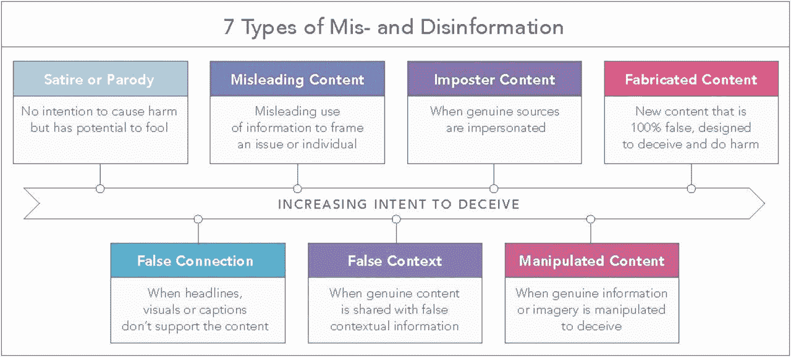

[https://www.pnas.org/content/114/48/12631](https://www.pnas.org/content/114/48/12631). Inspired by Dawn Graham’s own iteration of this project.

正如我们在上表中看到的，假新闻在各种媒体上普遍存在。为了方便使用，我们将把重点放在对讽刺内容的分类上(令人尴尬的是，我不止一次地相信了《洋葱新闻》的文章)。

我们将从两个 Reddit subs，r/TheOnion 和 r/NotTheOnion 中抽取数据来构建我们的数据。**洋葱**满足了我们对讽刺新闻的要求，而**不是洋葱**是一个子编辑，它提供了一系列疯狂但真实的新闻。甚至经常光顾 Reddit 的人也经常把这两者搞混。

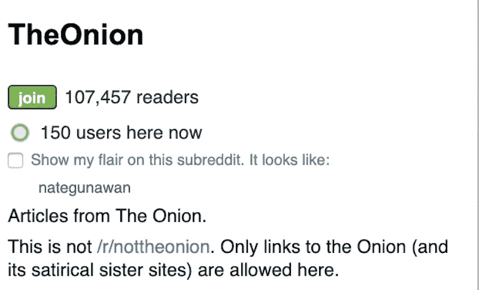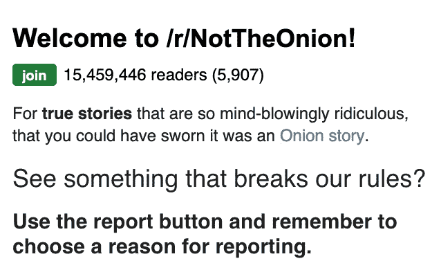

The Onion even has to issue a warning!

从上面我们可以看到，r/TheOnion 有大约 100，000 名读者，而 r/NotTheOnion 有超过 1，500 万名读者(对于那些非数学迷来说，这大约是他们的 150 倍或者更多)。鉴于这一事实，我们可以期待更多来自《非洋葱报》的帖子，并可能在新闻来源方面更加多样化——鉴于《洋葱报》实际上是它自己的出版物。这可能会扭曲一点细节，我们稍后会看到，因为洋葱帖子可能是以某种同质的方式编写的，可能会影响我们的分析，但现在我们将继续前进！

# 数据收集和探索性数据分析

对于我们的数据收集，我们使用 Pushshift API (pushshift.io)从 r/TheOnion 收集了大约 15，500 个帖子(达到了上限),从 r/NotTheOnion 收集了 17，500 个帖子。

你可以看到我是如何使用 PSAW 包装器(基于 Pushshift API)来提取下面的帖子的:

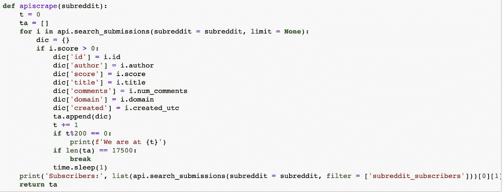

You could definitely set time.sleep to be less than 1 second. I was playing it way too safe.

两个子记录的时间跨度如下所示:

1.  **洋葱** subreddit 从 2013 年 10 月 3 日到 2019 年 7 月 5 日一路拉帖子。
2.  **不是洋葱**subreddit(17500)帖子仅在 2019 年 3 月 29 日至 2019 年 7 月 6 日期间撤回帖子。

客观地说，两个子网站之间的时间跨度差异不仅是因为《洋葱》的读者数量比《洋葱》多 150 倍，还因为《洋葱》是它自己的独立新闻网站，而《洋葱》引用了各种各样的“可信新闻来源”。

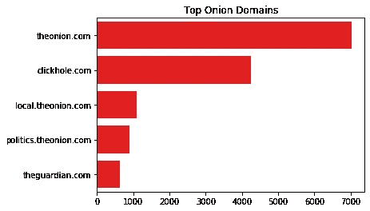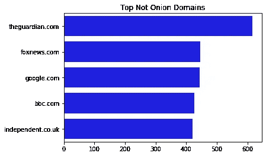

Interestingly, theguardian.com is listed more than 500 times. Researching this, it’s due to the fact that they reference The Onion a lot.

正如我们在上面看到的，洋葱主要链接洋葱相关的网站，而不是洋葱链接相对平衡的新闻来源(令人惊讶的是卫报在两个子网站上都有链接)。看看作者的多样性，我们发现了一些相似之处。

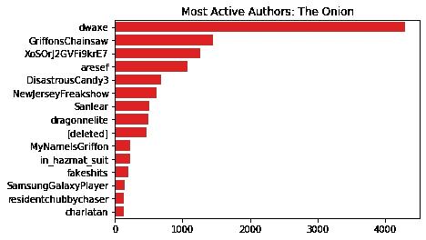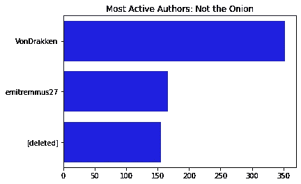

作者“dwaxe”发布了 4000 多次——从一开始就是一个相当荒谬的数字。看看洋葱和非洋葱的帖子频率之间的对比，非洋葱中的顶部海报只有 350 个帖子。考虑到更多的读者，这似乎令人惊讶，但当你考虑到洋葱子编辑的作者可能是出版物本身的编辑/海报时，这是有意义的。

所有这些都是说:由于时间差异很大(很多事情发生在 6 年的间隔中)，并且洋葱帖子链接的域大多是同质的，所以我们的模型可能不会考虑当天的准确表示。这是我们在这个项目的未来构建中肯定会考虑的事情。

此外，由于这些帖子都链接到它们自己的独立新闻文章，因此没有帖子有正文，因此我们将把整个自然语言分析的重点放在文章的标题上。对于项目的其余部分，我们将输入 1 来引用洋葱**和 0 来引用**而不是洋葱。****

# 自然语言处理

## 情感分析

为了增加我们的功能列表，我使用了 VADER 和 TextBlob 软件包(是的，是的，我知道……)对这些标题进行情感分析。我将向您展示我是如何实现这两个包的——从 VADER 开始:

```
from nltk.sentiment.vader import SentimentIntensityAnalyzersia = SentimentIntensityAnalyzer()corpus = list(df['title'])
sentimentscores = []for i in corpus:
    score = sia.polarity_scores(i)
    score['title'] = i
    sentimentscores.append(score)

sentimentdf = pd.DataFrame(sentimentscores)
sentimentdf.drop(columns=['title'], inplace = True)
```

VADER 给你四个分数，正如它的文档所解释的:

*   正、负和中性分数代表属于这些类别的文本的比例。这些分数加起来是 1。
*   复合得分是一个指标，它计算在-1(最负面)和+1(最正面)之间标准化的所有评分的总和。

我们在下面看到了我们的 VADER 分数:

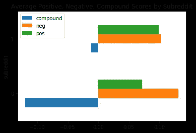

VADER Sentiment Scores

正如我们所看到的，没有一个分数是显著不同的。但是我们可以看到**而不是洋葱**帖子的综合得分大约比洋葱的低 0.1 个单位——这表明标题更负面一点。

我们对 TextBlob 情感分析的实现也差不多，所以我将跳过它(如果你想看更多的文档，请参见[https://textblob.readthedocs.io/en/dev/](https://textblob.readthedocs.io/en/dev/))，直接进入正题！TextBlob 给你两个从 0 到 1 的分数:

1.  极性在文中描述了积极和消极的情绪，其中 0 表示最消极，1 表示最积极。
2.  主观句通常指个人观点、情感或判断，而客观句则指事实信息。范围从最客观 0 到最主观的 1。

我们在下面看到了我们的 TextBlob 情感得分:

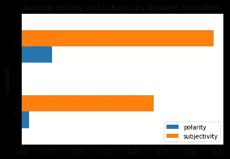

TextBlob Sentiment scores

我们从 VADER 的分析中得到了一些证实，洋葱网的帖子并没有更加负面，但也获得了一些新的信息:洋葱网帖子的主观性明显更高。稍后，我们将看到情感分析如何影响我们的模型。

## 相互关系

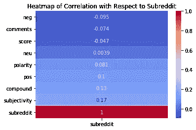

好吧。没有一个分数是相互关联的*——考虑到这是一个分类问题，这是有意义的。但是知道情感分析(尤其是 Textblob 的情感分析)有一些效果是很有帮助的。接下来，我们将使用 TextBlob 的情感分析作为我们的附加功能。*

## 字频率

在矢量化之前，我们使用 WordNetLemmatizer 和 RegexpTokenizer 来处理标题。我们可以在下面看到这一点:

```
for i in range(len(listoftitles)):
    tokenized = tokenizer.tokenize(listoftitles[i].lower())
    lemmatizelist = []
    for word in tokenizedi:
        lemmatizedword = lemmatizer.lemmatize(word)
        lemmatizelist.append(lemmatizedword)
    listoftitles[i] = " ".join(lemmatizelist)soupedtitles = [BeautifulSoup(title).get_text() for title in listoftitles]cleanedsoup = [re.sub("[^a-zA-Z]", " ", i) for i in soupedtitles]arraysoup = np.ravel(cleanedsoup)df['title'] = arraysoup
```

记号赋予器将把我们的单个标题分成一个单词列表，而词汇赋予器将把单词连到它的“根”上。然后，我们使用正则表达式删除任何非字母字符，并将标题数组替换为我们现在处理的标题数组！

使用 CountVectorizer，我们分析了洋葱式和非洋葱式子编辑中的单词频率:

**Unigrams**

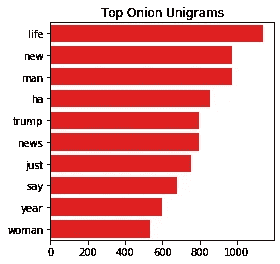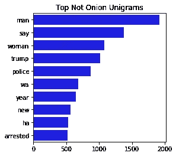

Top Unigrams in The Onion and Not The Onion

出现在洋葱中的前 5 个单字是“生活”、“新”、“人”、“哈”和“特朗普”。

出现在《不是洋葱》中的前 5 个单字是“男人”、“说”、“女人”、“特朗普”和“警察”。

**二元模型**

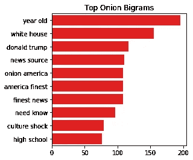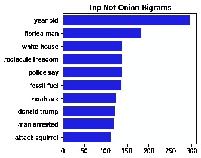

Top Bigrams in The Onion and Not The Onion

出现在《洋葱》中的前 5 个双字母是“岁”、“白宫”、“唐纳德·特朗普”、“新闻来源”和“洋葱美国”。

出现在《不是洋葱》中的前五个大人物是“岁”、“佛罗里达人”、“白宫”、“分子自由”和“警察说”。

**停止字**

我取两个子词中出现的顶级单词和顶级双词的交集，即单词“onion ”,并创建一个定制的停用词列表，其中包括来自 Scikit-Learn 的原始英语停用词列表。这不仅在我们的建模过程中有用，而且在我们的系数分析后建模中也有用。

# 建模

我为训练集拟合了 7 个模型，模型的测试精度为:

1.  使用计数向量机进行逻辑回归(86.9%)
2.  使用计数矢量器+情感分析进行逻辑回归(80.6%)
3.  用 tfidf 向量机进行逻辑回归(88.6%)
4.  带有 tfidf 矢量器的 SVC 模型(88.4%)
5.  带有 tfidf 矢量器的多项式朴素贝叶斯(87.8%)

通过反复试验，我发现最好的模型包含 TfidfVectorizer，而不包含情感分析。原始模型是相当过度拟合的(在训练集上具有> 98%的准确度)。对于我的最后两个模型，我想删除被 L1 惩罚的逻辑回归剔除的特征，并把它们放入更多的模型中，以潜在地修复过度拟合。

6.梯度增强分类器(76%)

7.使用 TfidfVectorizer 的逻辑回归(测试集上的 85.8%，训练集上的 91.9%，这是**最佳模型**，也是我选择的一个模型，考虑了偏差-方差权衡，也是具有最佳可解释性的模型)

# 型号选择

考虑到偏差-方差权衡，我们选择了我们的最佳模型作为我们的逻辑回归，使用 TfidfVectorizer，而不进行情感分析。利用具有 10%测试规模的训练测试分割，这在训练集上实现了 91.9%的准确度，在测试数据上实现了 85.8%的准确度。显然，这不是最好的测试精度，但是它确实减少了方差——这也是良好建模的一个方面。

我绘制了我们的模型与测试分数的混淆矩阵:

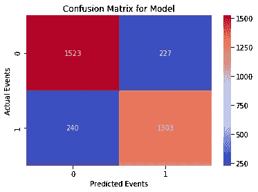

Confusion Matrix of Model

使用以下指标:

```
Sensitivity: 84.45%
Specificity: 87.03%
Precision: 85.16%
Accuracy: 85.82%
Misclassification Rate: 14.18%
```

很明显，在我们的测试集预测中有相当数量的假阴性(在这种情况下，这些帖子被预测为引用真实新闻，但实际上是假新闻)。这无疑是我们今后必须解决的问题，即使这可能会牺牲准确性。

# 系数分析

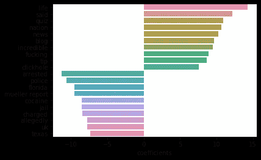

Our most impactful features

绘制在任一方向上影响我们模型的 10 大特征，我们看到:

“生活”、“说”、“测验”、“国家”、“新闻”、“博客”和“不可思议”这些词增加了帖子出现在洋葱子编辑中的几率。

“被捕”、“警察”、“佛罗里达”、“穆勒报告”、“可卡因”和“监狱”这些词增加了《邮报》出现在“非洋葱”子编辑中的几率。

上面列出的特征极大地影响了模型的分类能力。例如，如果“生活”一词出现在帖子的标题中，相对于其他词，帖子出现在洋葱上的几率是 1531737 倍。正如我们在之前关于数据集的讨论中提到的，假设洋葱来自同质的海报和域(只有洋葱新闻文章)，那么在任一子编辑中经常使用的某些词会极大地影响模型的分类能力，这是有道理的。

# 后续步骤和结论

这个模型并不完美。考虑到不能有效地检测假新闻的情况和影响，最佳模型仍然存在相当大的差异，具有足够高的偏差。然而，它肯定比基线要好，并且考虑到该模型可以以高达 88.5%的准确度检测 Not Onion 帖子，这使得我第一次进入自然语言处理和 API web 抓取时它是可以的。

如果我再做一次这个项目，我肯定会从比《洋葱》更广泛的来源收集更多的讽刺新闻。由于我们真正可以分析的唯一文本是帖子的标题(遗憾的是，这是公平的，因为我们大多数人在“互联网时代”实际上只浏览新闻文章的标题并从中做出判断)，我希望能够创建一个新闻故事数据库，提取实际的新闻内容并基于此进行分析。

考虑到所有的事情，我确实从这个项目中学到了很多，我迫不及待地想继续提高我的技能！现在，我把这些留给你们:

[](https://thehill.com/homenews/state-watch/374816-florida-house-votes-to-declare-porn-a-public-health-risk-within-an-hour) [## 佛罗里达州众议院在否认突击步枪禁令后不久宣布色情是一种公共健康风险

### 佛罗里达州的立法者在周二通过了一项决议，宣布色情是公共健康风险，不到一个小时后…

thehill.com](https://thehill.com/homenews/state-watch/374816-florida-house-votes-to-declare-porn-a-public-health-risk-within-an-hour) [](https://apnews.com/5adaacef468642c4930d1ad76ff09b69) [## 佛罗里达候选人说外星人绑架不能定义她

### 迈阿密(美联社)——美国众议院候选人贝蒂娜·罗德里格斯·阿奎莱拉有一长串成就来支持她的竞选…

apnews.com](https://apnews.com/5adaacef468642c4930d1ad76ff09b69) [](https://www.npr.org/2019/07/02/738131948/after-6-year-battle-florida-couple-wins-the-right-to-plant-veggies-in-front-yard) [## 经过 6 年的斗争，佛罗里达夫妇赢得了在前院种植蔬菜的权利

### 秋葵。甜椒。樱桃番茄。墨西哥胡椒和南瓜。这些是她最喜欢的蔬菜…

www.npr.org](https://www.npr.org/2019/07/02/738131948/after-6-year-battle-florida-couple-wins-the-right-to-plant-veggies-in-front-yard)