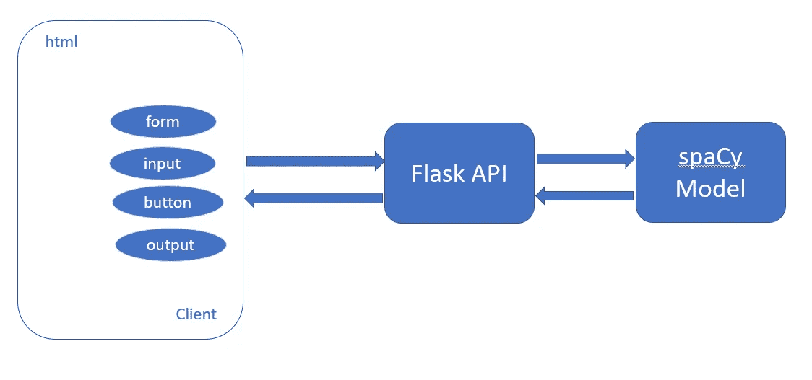
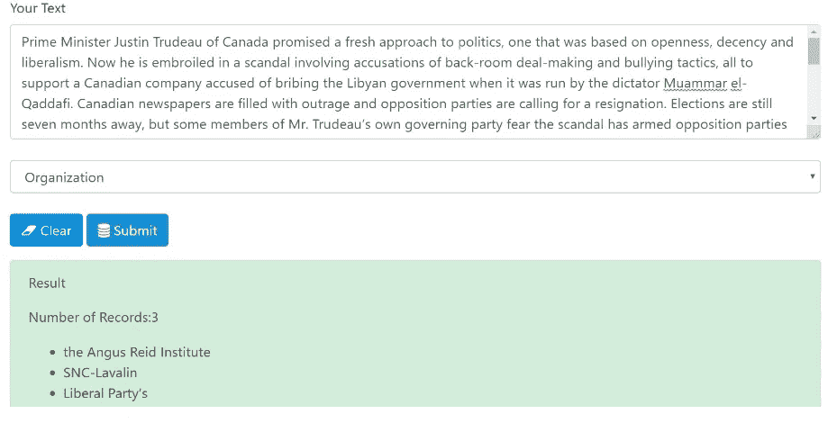
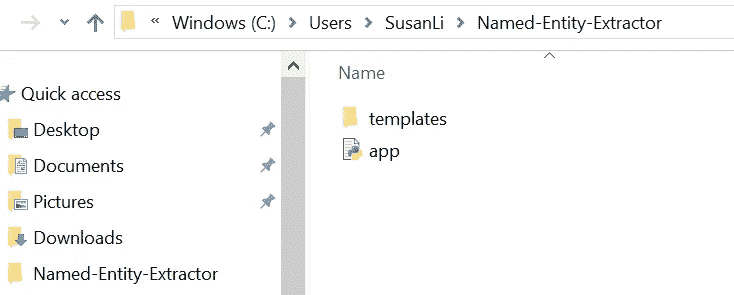
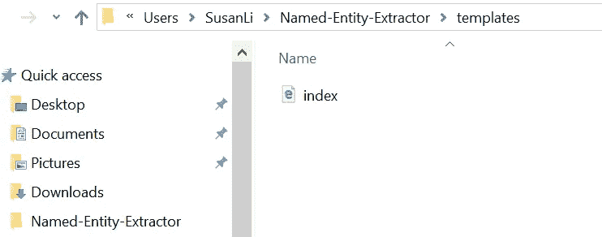
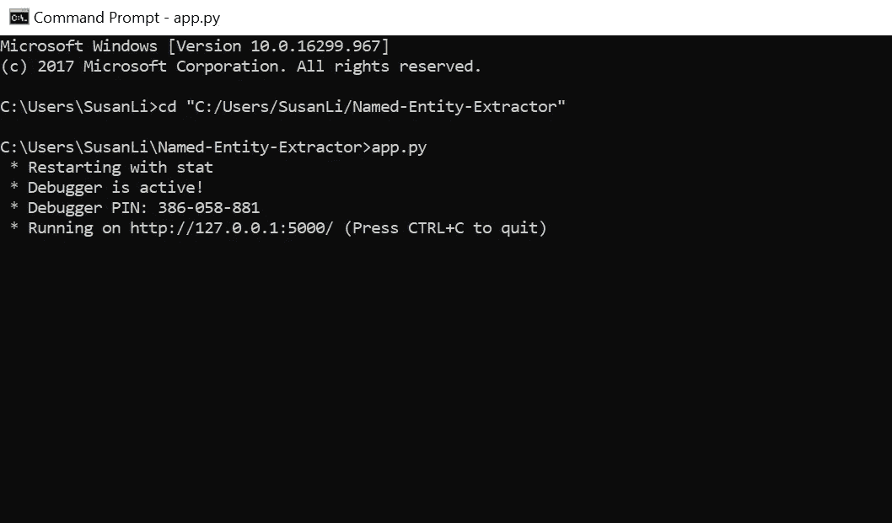
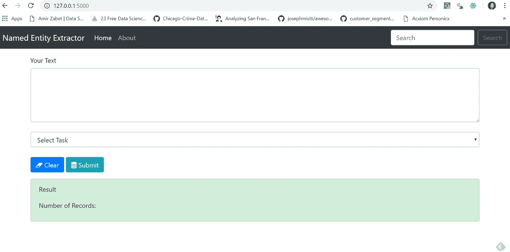
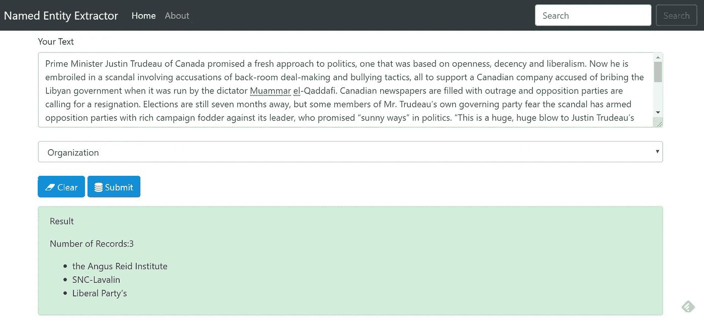
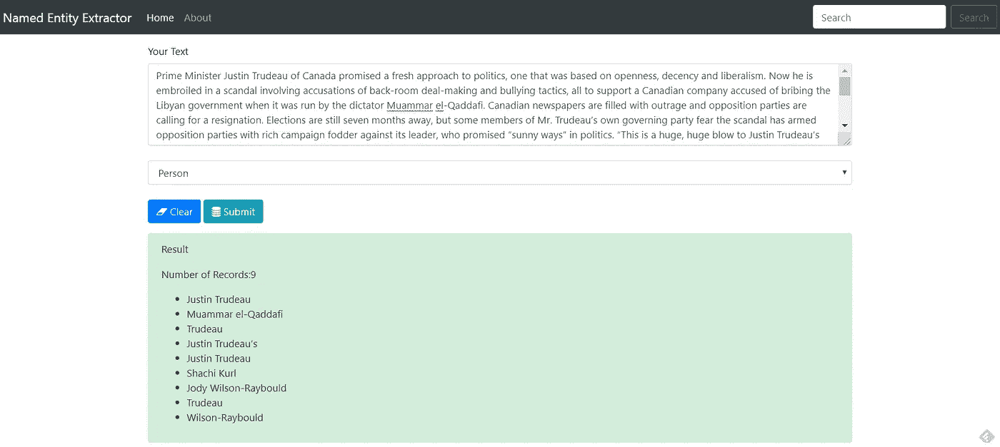
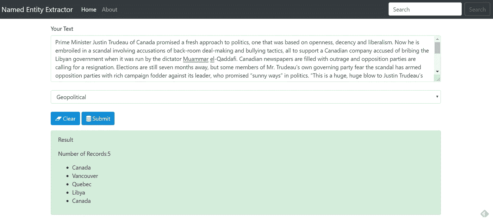
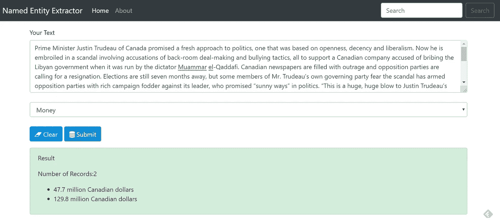

# 使用 SpaCy 构建 Flask API 来自动提取命名实体

> 原文：<https://towardsdatascience.com/building-a-flask-api-to-automatically-extract-named-entities-using-spacy-2fd3f54ebbc6?source=collection_archive---------12----------------------->

Photo credit: Pixabay

## 如何使用 spaCy 中的命名实体识别模块来识别文本中的人、组织或位置，然后使用 Flask 部署 Python API

如果数据是结构化的，那么今天大量的非结构化文本数据提供了丰富的信息来源。命名实体识别(NER )(也称为命名实体提取)是从半结构化和非结构化文本来源构建知识的第一步。

只有在 NER 之后，我们才能至少揭示出这些信息包含了什么人和什么内容。因此，数据科学团队将能够在语料库中看到人员、公司、地点等所有名称的结构化表示，这可以作为进一步分析和调查的出发点。

在[之前的文章](/named-entity-recognition-with-nltk-and-spacy-8c4a7d88e7da)中，我们已经学习并练习了[如何使用 NLTK 和 spaCy](/named-entity-recognition-with-nltk-and-spacy-8c4a7d88e7da) 构建命名实体识别器。为了更进一步，创建一些有用的东西，本文将介绍如何使用 spaCy 开发和部署一个简单的命名实体提取器，并使用 python 中的 Flask API 为其提供服务*。*

# 烧瓶 API

我们的目标是构建一个 API，我们提供文本，例如，一篇纽约时报的文章(或任何文章)作为输入，然后我们的命名实体提取器将识别和提取四种类型的实体:组织、个人、位置和金钱。基本架构如下所示:

Figure 1

为了构建 API，我们需要创建两个文件:

1.  `index.html`处理 API 的模板。
2.  `app.py`处理请求并返回输出文件。

最终的产品会是这样的:

Figure 2

让我们开始构建 API，并逐步创建两个文件。我们的项目文件夹结构如下所示:

*   我们的项目位于 ***命名-实体-提取器*** 文件夹中。

Figure 3

*   `templates`目录与创建它的 app.py 在同一个文件夹中。

Figure 4

*   index.html 位于 templates 文件夹中。

## index.html

*   我们将我们的应用程序命名为“命名实体提取器”
*   使用 [BootstrapCDN](https://www.bootstrapcdn.com/) ，在所有其他样式表加载我们的 CSS 之前，将[样式表](https://getbootstrap.com/docs/4.1/getting-started/introduction/) `<link>`复制粘贴到我们的`<head>`中。
*   从[获得 Bootstrap 的导航标题，一个简单信息网站](https://getbootstrap.com/docs/4.3/examples/jumbotron/#)的模板。它包括一个称为[大屏幕](https://getbootstrap.com/docs/4.0/components/jumbotron/)的大标注和三个支持内容。
*   从模板的[源代码](http://view-source:https://getbootstrap.com/docs/4.3/examples/jumbotron/)中复制粘贴[导航栏](https://getbootstrap.com/docs/4.0/components/navbar/)代码。
*   Bootstrap 需要一个容器元素来包装站点内容并存放我们的网格系统。
*   在我们的例子中，对于第一个容器，我们将创建一个带有两个输入字段的垂直表单，一个“Clear”按钮和一个“Submit”按钮。
*   文本表单控件是用`form-control`类设计的。
*   我们给我们的用户四个任务选项(又名命名实体提取任务)供选择，它们是: ***组织*** ， ***人*** ， ***地缘*** & ***金钱*** 。
*   第二个容器为我们的用户操作提供上下文反馈消息，这是命名实体提取的结果。
*   我们不仅希望向用户打印出命名实体提取结果，还希望打印出每次命名实体提取的结果数量。
*   复制粘贴 html 页面末尾附近的`<script>`中的 [JavaScript](https://getbootstrap.com/docs/4.1/getting-started/introduction/) ，就在结束的`</body>`标签之前，

index.html

## app.py

我们的`app.py`文件相当简单易懂。它包含将由 Python 解释器执行以运行 Flask web 应用程序的主要代码，还包含用于识别命名实体的空间代码。

*   我们将应用程序作为一个单独的模块运行；因此，我们用参数`__name__`初始化了一个新的 Flask 实例，让 Flask 知道它可以在它所在的同一个目录中找到 HTML 模板文件夹(`templates`)。
*   我们使用 route decorator ( `@app.route('/')`)来指定应该触发`index`函数执行的 URL。
*   我们的`index`函数只是呈现了位于`templates`文件夹中的`index.html` HTML 文件。
*   在`process`函数中，我们将 nlp 应用于用户将要输入的原始文本，并从原始文本中提取预先确定的命名实体( ***组织*** ， ***人*** ， ***地缘*** & ***金钱*** )。
*   我们使用`POST`方法在消息体中将表单数据传输到服务器。最后，通过在`app.run`方法中设置`debug=True`参数，我们进一步激活了 Flask 的调试器。
*   我们使用`run`函数仅在 Python 解释器直接执行该脚本时在服务器上运行应用程序，这是通过使用带有 `__name__ == '__main__'`的`if`语句来确保的。

app.py

我们快到了！

# 尝试我们的 API

*   启动**命令提示*命令*。**
*   导航到我们的 ***命名实体-提取器*** 文件夹。

Figure 5

*   打开您的 Web 浏览器，将“ [http://127.0.0.1:5000/](http://127.0.0.1:5000/) ”复制粘贴到地址栏中，我们将看到以下表单:

Figure 6

*   我复制粘贴了纽约时报的一篇文章的几段，这是一个加拿大的故事:

Figure 7

*   在“选择任务”下选择“ ***组织*** ，然后点击“提交”，这是我们得到的结果:

Figure 8

*   很好。让我们试试 ***人*** 实体:

Figure 9

*   *“实体:*

**

*Figure 10*

*   ****金钱*** 实体:*

**

*Figure 11*

*我们完了！*

*如果你按照上面的步骤做到了，那么恭喜你！您已经零成本地创建了一个简单而有效的命名实体提取器！回头看，我们只需要创建两个文件。我们所需要的是开源库和学习如何使用它们来创建这两个文件。*

*通过构建这样一个应用程序，你学到了新的技能，并利用这些技能创造出有用的东西。*

*完整的源代码可以从这个[库](https://github.com/susanli2016/Named-Entity-Extractor)获得。周一快乐！*

*参考:*