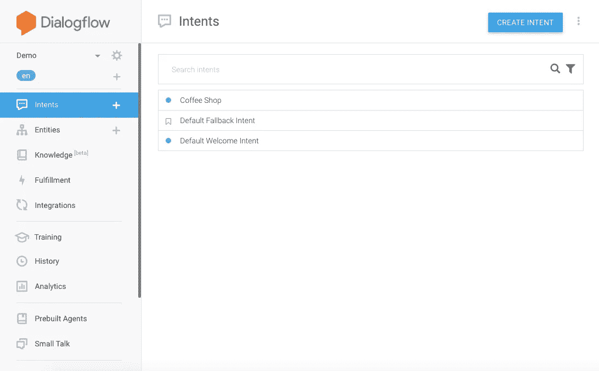
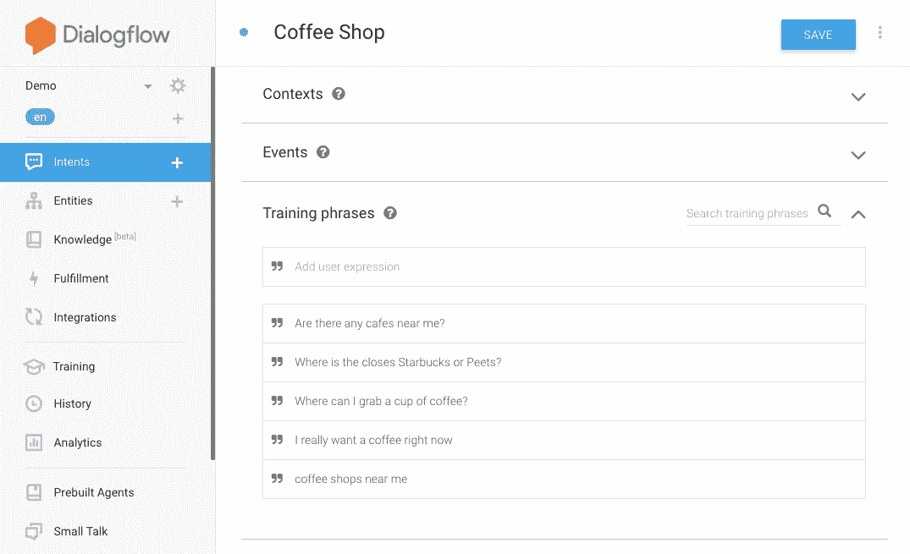
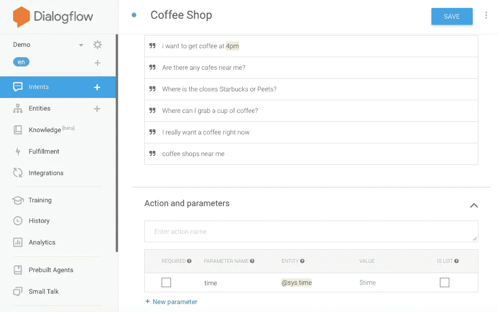
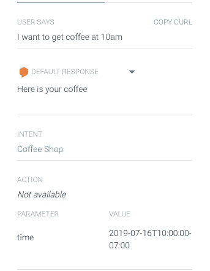
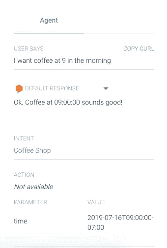
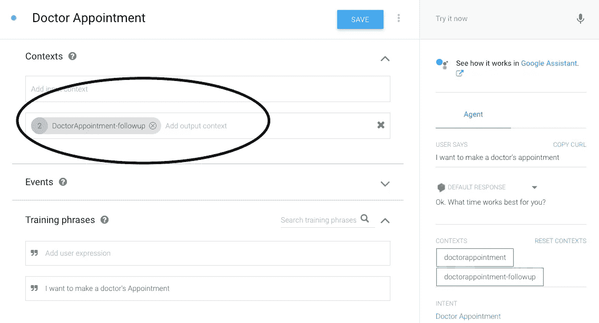
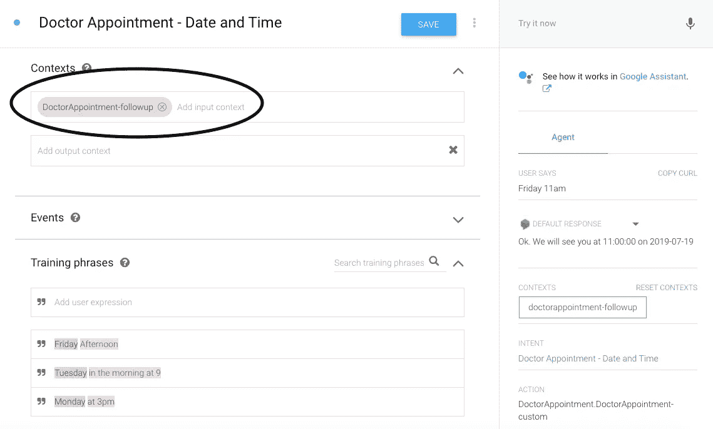

# 在 Dialogflow 上构建功能聊天机器人

> 原文：<https://towardsdatascience.com/building-a-functional-chatbot-in-dialogflow-aeeba1260353?source=collection_archive---------14----------------------->

虽然 Dialogflow 被广泛认为是一个直观和简单的平台，但它的一些功能可能有点晦涩，我认为任何初学者都可以从迷你指南中受益。这篇博文旨在涵盖与 Dialogflow 相关的许多基本概念和词汇，但是因为这些 NLP 平台之间有许多重叠，所以这里讨论的许多概念也可以应用于其他地方。

就像任何其他项目一样，在开始构建聊天机器人之前有一个思维图总是好的。这将有助于确定你需要多少意图、跟进意图和背景。但是等等…什么是意图？

# 意图

意图基本上是对话流的核心和灵魂。它们旨在捕捉用户的意图，并触发聊天机器人内部的响应。换句话说，意图捕获用户的意图，对其进行处理，并将其映射到特定的响应。例如，如果用户说“我附近的咖啡店”，一个名为“咖啡店”的假设意图将被触发并响应用户的请求。

你的聊天机器人最终会有几个意图来处理用户和聊天机器人之间对话的所有场景。

## 训练短语

训练短语是用户说出来触发特定意图的短语。使用上面的同一个咖啡店示例，用户可以通过多种方式要咖啡。

1.  我附近的咖啡店
2.  我现在真的很想喝杯咖啡
3.  最近的星巴克或李丁丁在哪里？
4.  我附近有咖啡馆吗？

显然，要想出一份详尽的清单列出所有说“我想要咖啡”的可能方式是不可能的。然而，训练短语的妙处在于你不需要提供一个详尽的列表。相当数量的表达相同意图的相似短语足以让自然语言理解引擎将任何输入映射到特定意图

# 实体

意图允许聊天机器人理解用户的意图，而实体则用于从自然语言输入中提取信息。从日期和时间到对象的价格，您想要从用户输入中提取的任何数据都有相应的实体。

Dialogflow 有一个预定义的实体列表，称为系统实体；它们包括基本值，如日期、时间、位置、单位等..回到咖啡店的例子，假设我们想在下午 4 点去喝咖啡

我使用了 sys.time 实体，并提取了训练短语中的时间。现在，聊天机器人将寻找这个实体，并试图在用户的输入中提取它。

当我测试聊天机器人时，它能够识别并提取上午 10 点的时间值。查看图像底部的时间参数。

# 反应

这是 Dialgflow 更容易和更直观的特性之一。每当用户说些什么，一个意图就会被触发，聊天机器人必须用适当的信息来回应——就像它在正常对话中的工作方式一样。

顾名思义，响应部分就是为了这个目的。response 部分很酷的一点是，您可以重复从用户输入中提取的实体值

如您所见，我从用户输入中提取了时间，并将其作为确认包含在响应中。

# 上下文

上下文表示用户请求的当前状态；可以把它们看作是用户在对话结构中所处位置的虚拟检查点。此外，上下文还确保会话以串行方式流动(可以说，不能从检查点 A 跳到检查点 D)。

有两种上下文:

## 输出上下文

每当用户有特定意图时，就会创建输出上下文。从更专业的角度来说，可以将输出上下文视为任何特定意图的布尔属性。每当用户有任何特定意图时，输出上下文返回 true 并保持活动状态，直到用户触发另一个意图；然后，另一个意图的输出上下文变为活动的。

## **输入上下文**

输入上下文是防止其他不需要的意图被触发的东西。我喜欢把输入上下文想象成“如果”条件。只有当 xyz 上下文处于活动状态时，才会触发 xyz 意图。当用户询问后续问题时，这尤其有用。例如，如果我想预约医生，我会先说“我想预约”，然后再提任何关于我喜欢的时间或日期的事情。时间和日期只有在我表示希望预约时才是相关的。在这种情况下，医生预约意图的输出上下文成为后续意图的输入上下文:日期和时间。

# 后续意图

跟进意图是对话流程的关键部分——你会比你想象的更需要它们！几乎每个意向都有后续意向；无论是简单的“是”或“否”响应，还是更具体的请求，如日期或时间偏好。

如果你对输入和输出环境的工作原理有一个坚实的理解，那么后续的意图应该是轻而易举的。

# 更多资源

我希望这有所帮助；上面讨论的概念应该给你足够的背景知识来在 Dialogflow 上构建一个简单的聊天机器人。

如果你想更了解它，查看文档【https://cloud.google.com/dialogflow/docs/concepts 

**请继续关注集成、履行和分析等后端技术！**