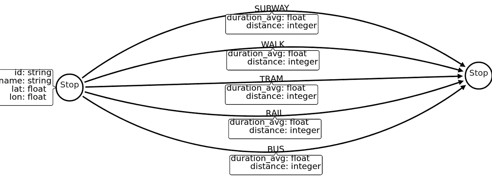

# 在 Neo4j 构建图形分析管道，探索罗马的交通系统

> 原文：<https://towardsdatascience.com/building-a-graph-analytics-pipeline-in-neo4j-to-explore-the-transport-system-in-rome-281d05dfbf88?source=collection_archive---------21----------------------->

我正试着回到写作模式，每个月发布几篇新的博客文章。 [Neo4j graph algorithms](https://neo4j.com/docs/graph-algorithms/current/) 中有很多很酷的新特性我还没有写出来，所以我会尽可能多的介绍一下。

其中一个新特性是升级了[节点和关系类型](https://neo4j.com/docs/graph-algorithms/current/projected-graph-model/label-relationship-type-projection/)投影，以支持加载多种关系类型。让我们来看看算法引擎是如何工作的，以及这个特性是如何派上用场的。


Image from [https://neo4j.com/docs/graph-algorithms/current/projected-graph-model/](https://neo4j.com/docs/graph-algorithms/current/projected-graph-model/)

每当我们运行任何算法时，图形加载器都会从 Neo4j 中读取图形，并将其作为投影图形加载到内存中。一旦投影图存储在内存中，我们就可以对它运行任何算法。假设我们希望在由关系类型 REL _ 类型 1 描述的网络上运行 PageRank 算法，并在由 REL _ 类型 2 描述的网络上运行连通分量算法。如果你读过我以前的博客，你可能会看到这样的内容

```
CALL algo.pageRank('Node','REL_TYPE1');
CALL algo.unionFind('Node','REL_TYPE2');
```

我按顺序运行两个算法。这种方法效率不高，因为我们首先将图形投影到 PageRank 算法的内存中，存储结果，然后从内存中卸载图形。然后，我们对连通分量算法重复相同的过程。为了避免同一个图形多次加载到内存中，我们可以使用名为 graphs loading 的[。它允许我们将考虑的图形存储到内存中，并能够在其上运行许多算法，而不必在每次运行时将图形加载到内存中。](https://neo4j.com/docs/graph-algorithms/current/projected-graph-model/named-graph/)

命名图形加载示例:

```
CALL algo.graph.load('my-graph','Node',
'REL_TYPE1 | REL_TYPE2',
{ 
   duplicateRelationships:'min',
   relationshipProperties:{ 
      distance:{ 
         property:'distance'
      },
      duration:{ 
         property:'duration_avg',
         default_value:5
      }
   },
   nodeProperties:{ 
      seed_value:{ 
         property:'seed_value'
      }
   }
})
```

如您所见，我们已经将两种不同类型的关系加载到投影图中。我们还加载了关系的距离和持续时间属性以及节点的 seed_value 属性。运行图算法时，这些属性可用作权重或种子属性。

现在我们可以在同一个投影图上运行这两种算法。

```
CALL algo.pageRank('Node','REL_TYPE1',{graph:'my-graph'});
CALL algo.unionFind('Node','REL_TYPE2',{graph:'my-graph'});
```

当我们完成分析后，请记住使用以下命令从内存中删除图形:

```
CALL algo.graph.remove('my-graph')
```

# 关系重复数据删除策略

为了更好地理解重复数据消除战略，让我们看一下下面的示例。

```
CREATE (a:Loc)-[:ROAD{cost:4}]->(b:Loc),
           (a)-[:ROAD{cost:7}]->(b),
           (a)-[:RAIL{cost:5}]->(b),
           (a)-[:RAIL{cost:8}]->(b)
```


在这个例子中，我们有两个由四个关系连接的节点，它们都指向同一个方向。假设我们想要搜索最短的加权路径。为了理解当我们将 Neo4j 存储的图形投影到图形算法内存图形时会发生什么，最好看一下[文档](https://neo4j.com/docs/graph-algorithms/current/projected-graph-model/)中的这段引文。

> 投影图模型不支持一对节点之间的多种关系。

关系重复数据消除策略弥补了 Neo4j 中多个存储关系与算法引擎中单一预测关系之间的差距。如果关系中不存在权重，则没有关系，因为所有存储的关系将被简化为单个投影关系。但是，如果关系中存在权重，那么我们可以从以下四种策略中选择一种来处理权重重复数据消除:

*   `skip` -保持第一次遇到的关系(以及相关的权重)。
*   `sum` -对所有遇到的关系的相关权重求和。
*   `min` -保持所有遇到的关系的最小权重。
*   `max` -保持所有遇到的关系的最大权重。

在图中搜索最短路径时，我们希望使用`min` 重复数据删除策略。我们分别加载铁路和公路关系类型。

```
CALL algo.graph.load('my-graph', 'Loc', 'RAIL | ROAD', {relationshipWeight: 'cost', duplicateRelationships: 'min' })
```

有了内存中的图形，我们可以开始搜索最短路径。

```
MATCH (start:Loc)-->(end:Loc)
WITH distinct start,end
CALL algo.shortestPath.stream(start,end,'cost',
  {graph:'my-graph',relationshipQuery:'RAIL'})
YIELD nodeId,cost
RETURN nodeId,cost
```

结果


正如我们所料，算法会从两个可能的铁路关系中选择成本最低的一个。

在关系型道路上尝试同样的事情。

```
MATCH (start:Loc)-->(end:Loc)
WITH distinct start,end
CALL algo.shortestPath.stream(start,end,'cost',
  {graph:'my-graph',relationshipQuery:'ROAD'})
YIELD nodeId,cost
RETURN nodeId,cost
```

结果


现在运行算法，不要指定任何关系类型。如果我们不指定关系类型，算法将遍历所有可用的关系类型。

```
MATCH (start:Loc)-->(end:Loc)
WITH distinct start,end
CALL algo.shortestPath.stream(start,end,'cost',
  {graph:'my-graph'})
YIELD nodeId,cost
RETURN nodeId,cost
```

结果


同样，我们得到了所有关系类型(公路和铁路)的网络中最短的可用路径。

您必须记住，决定如何删除重复关系权重的不是最短路径算法，而是图形加载器。例如，如果我们使用`sum`重复数据删除策略，公路和铁路示例中的最短路径将花费 24，因为这是所有关系权重的总和。

# 罗马交通系统分析

有了对投影图的新理解，让我们来看一个更实际的例子。我发现了这个极好的罗马[交通网络](http://transportnetworks.cs.aalto.fi/browse)数据集。它的信息非常丰富，包含五种不同的交通方式，如地铁、公交或步行。

**图形模型**



类似地，和以前一样，我们的节点只有一个标签。唯一的区别是，在这里，我们有五种不同的交通方式可用，并存储为一个关系类型。

**创建约束**

```
CREATE CONSTRAINT ON (s:Stop) ASSERT s.id IS UNIQUE;
```

## 导入

我们将首先导入网络的节点，然后导入关系。您需要在导入之前将数据复制到 *$Neo4j/import* 文件夹中。

**导入节点**

```
LOAD CSV WITH HEADERS FROM “file:///network_nodes.csv” as row FIELDTERMINATOR “;”
MERGE (s:Stop{id:row.stop_I})
SET s+=apoc.map.clean(row,[‘stop_I’],[])
```

**导入关系**

```
UNWIND ['walk','bus','tram','rail','subway'] as mode
LOAD CSV WITH HEADERS FROM "file:///network_" + mode + ".csv" as row FIELDTERMINATOR ";"
MATCH (from:Stop{id:row.from_stop_I}),(to:Stop{id:row.to_stop_I})
CALL apoc.create.relationship(
 from, toUpper(mode),
{distance:toInteger(row.d),
 duration_avg:toFloat(row.duration_avg)}, to) YIELD rel
RETURN distinct 'done'
```

步行是唯一缺乏平均持续时间属性的交通方式。幸运的是，如果我们假设一个人平均每小时走 5 公里，或者大约每秒 1.4 米，我们可以很容易地计算出来。

```
WITH 5 / 3.6 as walking_speed
MATCH (:Stop)-[w:WALK]->()
SET w.duration_avg = toFloat(w.distance) / walking_speed
```

# 图表分析管道

现在图形已经准备好了，我们可以通过将 Neo4j 存储的图形加载到投影的内存图形中来启动图形算法管道。我们用五种关系类型和两种关系属性加载图表。这两个属性可以被算法用作关系权重。

```
CALL algo.graph.load('rome','Stop',
    'BUS | RAIL | SUBWAY | TRAM | WALK',
    { 
       duplicateRelationships:'min',
       relationshipProperties:{ 
          distance:{ 
             property:'distance'
          },
          duration:{ 
             property:'duration_avg'
          }
       }
    })
```

## PageRank 算法

为了开始分析，让我们使用 PageRank 算法在有轨电车交通网络中找到最著名的 graphfamous 车站。

```
CALL algo.pageRank.stream('Stop','TRAM',{graph:'rome'})
YIELD nodeId, score
WITH nodeId, score
ORDER BY score DESC LIMIT 5
RETURN algo.asNode(nodeId).name as name, score
```

结果


图形加载器支持加载许多关系类型，算法也是如此。在本例中，我们在公共汽车、电车和铁路的组合网络中搜索最著名的 graphfamous 站点。

```
CALL algo.pageRank.stream('Stop','TRAM | RAIL | BUS',{graph:'rome'})
YIELD nodeId, score
WITH nodeId, score
ORDER BY score DESC LIMIT 5
RETURN algo.asNode(nodeId).name as name, score
```

结果


## 连通分量算法

Graph algorithms pipeline 也可以是批处理作业的一部分，在批处理作业中，您可以将图形加载到内存中，运行一些算法，将结果写回 Neo4j，然后卸载内存中的图形。让我们分别对所有交通模式网络运行连通分量算法，并写回结果。

```
UNWIND ["BUS","RAIL","SUBWAY","TRAM","WALK"] as mode
CALL algo.unionFind('Stop',mode,{writeProperty:toLower(mode) + "_component"})
YIELD computeMillis
RETURN distinct 'done'
```

探索电车网络中的连接组件。

```
MATCH (s:Stop)
RETURN s.subway_component as component,
       collect(s.name)[..3] as example_members,
       count(*) as size
ORDER BY size DESC
LIMIT 10
```

结果


这些结果很奇怪。我没去过罗马，但我高度怀疑有六个不相连的电车部件。即使查看结果，您也可能想知道为什么组件 7848 和 7827 具有相同的成员。

您的组件 id 可能会不同，所以请确保使用正确的 id。

```
MATCH p = (s:Stop)-[:SUBWAY]-()
WHERE s.subway_component in [7848,7827]
RETURN p
```

结果


我知道这很难看到，但网络上有同名的站点。虽然站点的名称可能相同，但站点 id 不同，因此被视为独立的节点。我们可以猜测，这是一条单向行驶的有轨电车线路，路的两边各有一条。由于每个方向的车站相距步行距离，因此该数据集对它们进行区分。

## 最短路径算法

我发现了一个用例，在这个用例中，您希望将投影图一直保存在内存中。假设我们正在构建一个应用程序，它将帮助我们找到罗马两点之间最短或最快的路径。我们不希望为每个查询将图形投影到内存中，而是希望一直将投影的图形保存在内存中。

我们可以搜索仅穿过特定关系类型的最短路径，或者在我们的情况下，搜索运输模式。

```
MATCH (start:Stop{name:’Parco Leonardo’}),(end:Stop{name:’Roma Trastevere’})
CALL algo.shortestPath.stream(start,end,’distance’,{graph:’rome’,relationshipQuery:’RAIL’})
YIELD nodeId,cost
RETURN algo.asNode(nodeId).name as name, cost as meters
```

结果


仅使用铁路网络的问题在于，大多数停靠点不在铁路网络中。为了能够找到网络中任何一对站点之间的最短路径，我们还必须允许算法遍历行走关系。

```
MATCH (start:Stop{name:'LABICANO/PORTA MAGGIORE'}),(end:Stop{name:'TARDINI'})
CALL algo.shortestPath.stream(start,end,'distance',{graph:'rome',relationshipQuery:'WALK | RAIL'})
YIELD nodeId, cost
RETURN algo.asNode(nodeId).name as name, cost as meters
```

结果


如果你还记得，我们在图形存储器中存储了两个关系属性。现在让我们使用持续时间属性作为权重。

```
MATCH (start:Stop{name:'LABICANO/PORTA MAGGIORE'}),(end:Stop{name:'TARDINI'})
CALL algo.shortestPath.stream(start,end,'duration',{graph:'rome',relationshipQuery:'WALK | RAIL'})
YIELD nodeId, cost
RETURN algo.asNode(nodeId).name as name, cost / 60 as minutes
```

结果


# 结论

我希望我已经给了你一些关于如何设计你的图形算法管道并从中获益的想法。

和往常一样，代码可以在 [Github](https://github.com/tomasonjo/blogs/tree/master/graph_analytics_rome) 上获得。