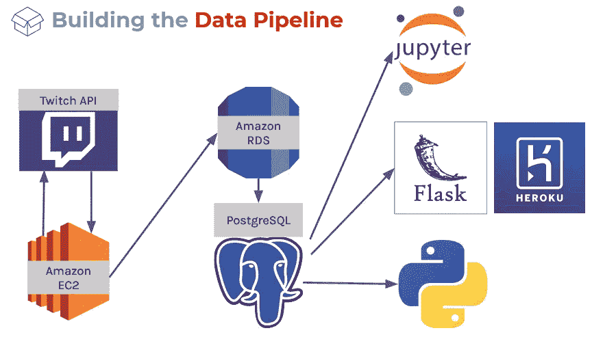
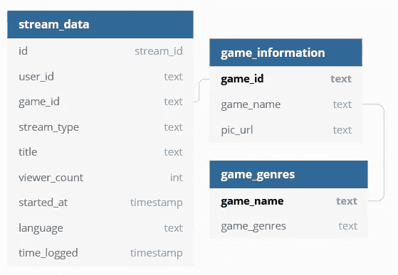
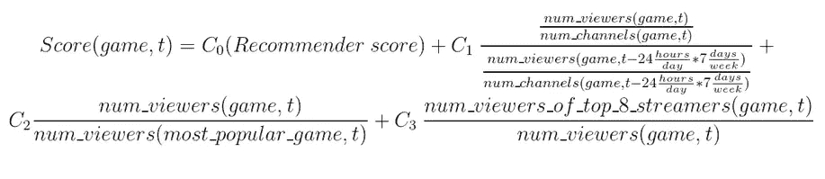
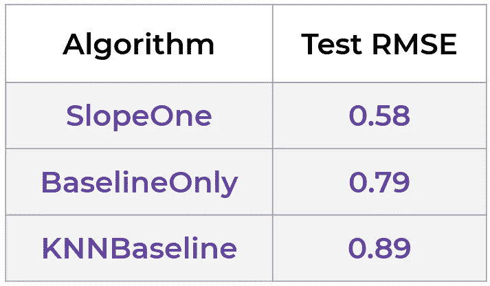
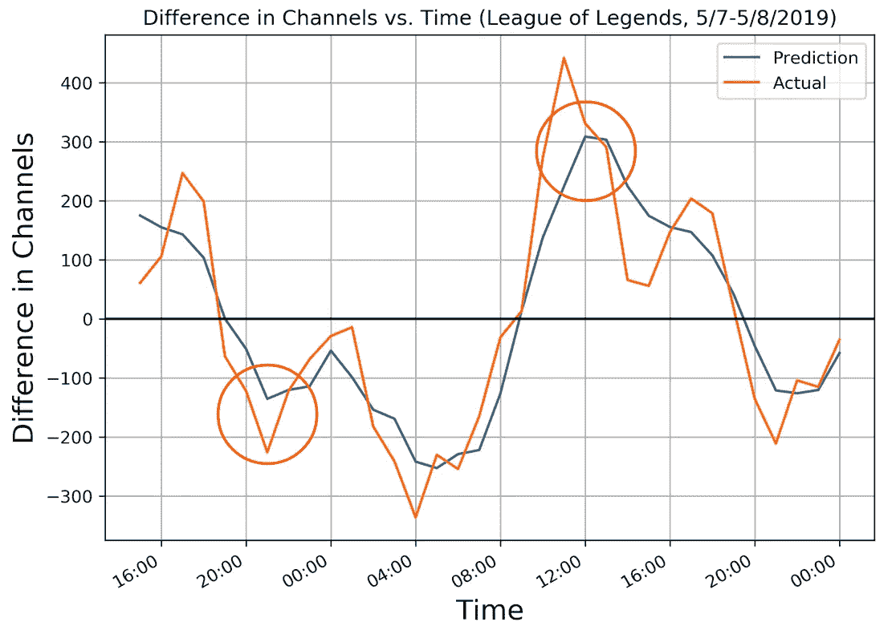

# 为 Twitch Streamers 构建一个关注增长的游戏推荐器

> 原文：<https://towardsdatascience.com/building-a-growth-focused-game-recommender-for-twitch-streamers-7389e3868f2e?source=collection_archive---------21----------------------->

Photo by [Caspar Camille Rubin](https://unsplash.com/@casparrubin?utm_source=unsplash&utm_medium=referral&utm_content=creditCopyText) on [Unsplash](https://unsplash.com/s/photos/ps4-streaming?utm_source=unsplash&utm_medium=referral&utm_content=creditCopyText)

## 将流媒体推荐的传统重点从观众转移到流媒体，优先考虑其频道的增长。

witch 是一个视频流平台，用户可以在这里观看其他用户可以观看的内容，它在过去十年中取得了巨大的成功。2018 年，它共记录了 5600 亿分钟的观看时间，每月有 440 万条独特的流媒体。它可以被简洁地描述为众包直播电视。为了增加用户的保留，它有一个推荐系统，为用户提供与他们过去观看过的类似的频道。然而，Twitch 没有为那些希望继续流媒体播放，但可能对他们目前玩的游戏感到厌倦，但仍然希望扩大观众群的流媒体用户提供任何东西。这篇文章讲述了[兰迪·马卡雷格](https://www.linkedin.com/in/randysm/)、[娜塔莎与](https://www.linkedin.com/in/natashaborders/)之间的边界，我试图为这一鸿沟建立一个解决方案。

# 目标

这个项目的目标是根据流媒体用户以前的流媒体播放历史和观众的接受程度，为流媒体用户推荐游戏。该推荐系统将理想地为提供他们的名字作为输入的流播者输出游戏和理想时间。所有这一切，包括项目构思和数据收集，将在三周的时间内完成。

# 1.数据

在我们能说出想法之前，我们需要看看我们在做什么。通过 [Twitch API](https://dev.twitch.tv/docs/api/) ，我们可以抓取一些东西:

1.  顶级游戏
2.  每场比赛中彩带的身份
3.  给定流媒体的观众计数
4.  每场比赛的艺术框
5.  每个游戏的类型

所有这些都是以小时为基础的，并且有每 30 秒 100 个电话的限制。对于我们的分析来说，这是一个限制因素，但是为了证明这个概念，我们向前推进了。

# 2.管道

为了在 API 限制和粒度之间取得平衡，我们选择对排名前 100 的游戏进行每小时一次的清理。我们的管道由以下步骤组成:

1.  从 Amazon EC2 实例上托管的 Python 脚本调用 Twitch API。使用每小时一次的内置 Linux Cron 作业自动调用脚本和 API。
2.  将 JSON 对象转换成 SQL 格式，并将数据推送到托管 PostgreSQL 数据库的 Amazon RDS 实例。
3.  从 RDS 数据库中训练模型，并拥有一个在运行模型时引用此数据库的应用程序。

以下是 RDS 数据库模式:

Database schema, generated on [https://dbdiagram.io/home](https://dbdiagram.io/home)

你也可以在 Tableau 上玩我们搜集的数据:

 [## 随着时间的推移，Twitch 的游戏、类型、频道和收视率的趋势。GitHub…

### 随着时间的推移，Twitch 的游戏、类型、频道和收视率的趋势。GitHub…

随着时间的推移，Twitch 的游戏、类型、频道和收视率的趋势。GitHub…public.tableau.com](https://public.tableau.com/views/TwitchVisualizations/PickYourGame?:embed=y&:display_count=yes&:origin=viz_share_link&source=post_page-----e40d4a45e4ee----------------------&:showVizHome=no) 

# 3.成长分数

一旦我们有了数据，我们想找到一种方法来对推荐的游戏进行排名。要做到这一点，我们需要考虑哪些可量化的属性可能使游戏有利于流媒体频道的增长。我们得出了以下每场比赛的时间函数指标:

1.  **流民亲和力**—我们想根据流民以前的游戏推荐一款他们会喜欢的游戏。这通过使用推荐系统(惊喜包，使用相似用户矩阵)来量化
2.  **游戏增长**——由于我们不想推荐一款垂死的游戏，我们想量化那些观众增长且得分较高的游戏。一个简单的表示可以通过查看一周前每个频道的观众数量来实现。
3.  **游戏受欢迎程度**——因为 Twitch 默认按照观众数量降序排列游戏，所以一个更受欢迎的游戏可能有更好的机会获得新观众，因为它会更容易被寻找新内容的观众看到。我们可以用一场比赛的总观看人数占当时观看人数最多的比赛的观看人数的比例来量化这个。
4.  **市场渗透力** —有时观众会通过*各种彩带被带到一个不知名或不太受欢迎的游戏，而*彩带会随着忠实观众群从一个游戏跳到另一个游戏。除此之外，有时有些游戏没有人想看，但某个流是他们观看游戏的唯一原因，他们没有兴趣探索其他人。为了量化这一点，我们可以看看前 8 个 streamers 中的观众人数及其占该游戏观众总数的比例。

Readable form of our metrics equation

Hypothetical equation for Growth Score

# 4.推荐系统

我们使用的框架是 Python 的惊喜包。该软件包需要用户矩阵形式的输入，其中每个用户是一行，他们玩过的每个游戏是该行中的一列，值在 1-5 之间。根据这些分数，它可以使用各种算法(如 KNN、余弦相似度)向用户推荐相似的游戏。

因为我们没有每个流媒体播放者对他们玩的每个游戏的偏好，所以我们根据他们在每个游戏中的观众人数相对于他们播放的观众人数最高的游戏的比例来输入一个指标，然后在 1 到 5 之间进行缩放。这个指标将捕捉流媒体的观众更喜欢看什么，或者什么游戏对流媒体来说最成功。请注意，这个数字对异常值很敏感，可以通过在一段时间内取平均值来改善。

在将我们的矩阵通过惊喜包中可用的不同算法后，我们得到了以下测试 RMSE 结果。这些都是相对于惊喜预期的 1-5 级，因此在 10-20%的准确度范围内。利用这些数据，我们能够补充增长得分中的**流光亲和力**部分。

# 5.时机

基于观众和流媒体兴趣的推荐完成后，我们需要看看我们是否可以预测未来的游戏指标，以便提出流媒体播放时间的建议。为此，我们使用了长短期记忆(LSTM)神经网络。

LSTM 网络是一种递归神经网络(RNN ),具有使用 sigmoid 层“忘记”先前输入的额外能力。这与 RNNs 相比具有优势，因为它不需要在所有先前的(并且可能不重要的)数据点上浪费处理时间和空间，而是只关注具有有价值信号的数据点。你可以在这里了解更多关于 LSTM 的。

对于 LSTM 的输入，我们选择输入前 168 小时和过去 24 小时的模型状态，以便预测下周的性能。这些参数是在我们有限的 2 周数据集内制定的，因此它们肯定会根据建议的预期范围和可用数据进行更改。当预测游戏《英雄联盟》的观众人数时，LSTM 得出的样本内和样本外 RMSE 约为 10%，这意味着它可以很好地推广到未来的新数据。

通过 LSTMs 运行每场比赛的观众数量数据变化和每场比赛的频道数量变化，我们可以计算下周任何时间点的比赛分数，并相应地对比赛和时间进行排名。不幸的是，我们最终没有时间来实现这一点，因为它需要为 100 多个游戏中的每一个训练两个 LSTM 模型，因此超出了我们的时间范围。然而，基本的想法仍然是合理的，并且可以在未来实际实施。

# 6.事后思考

总之，像我们正在构建的系统将有助于提高流注保留率，同时，理想情况下，也有助于为那些忠实于流注的用户保留用户。

为了量化这种功能的影响，我们可以进行 A/B 测试，将该功能随机分配给一组流媒体工具(可能包括一项调查，看看他们是否会根据我们的推荐播放推荐的游戏)。我们可以添加一个简单的推荐系统，而不需要将增长指标作为另一个测试用例来计算。一段时间后，我们可以比较这些组之间的频道增长，以量化推荐者的效果。

# 7.附加链接

这是我们在 Heroku 上建立并托管的网站的一个快速演示:

 [## 网站演示视频

drive.google.com](https://drive.google.com/file/d/1rEY_Flt0ieiVEc1oqZm-59ydiPmJGkh2/view?usp=sharing) 

代码可以在[这里](https://github.com/jeremyrchow/Twitch_Streamers_Recommender)找到。

感谢阅读！如果你喜欢这篇文章，看看我的其他项目文章，如[量化聊天室毒性](/quantifying-chatroom-toxicity-e755dd2f9ccf)！