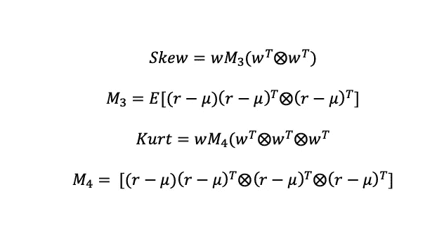
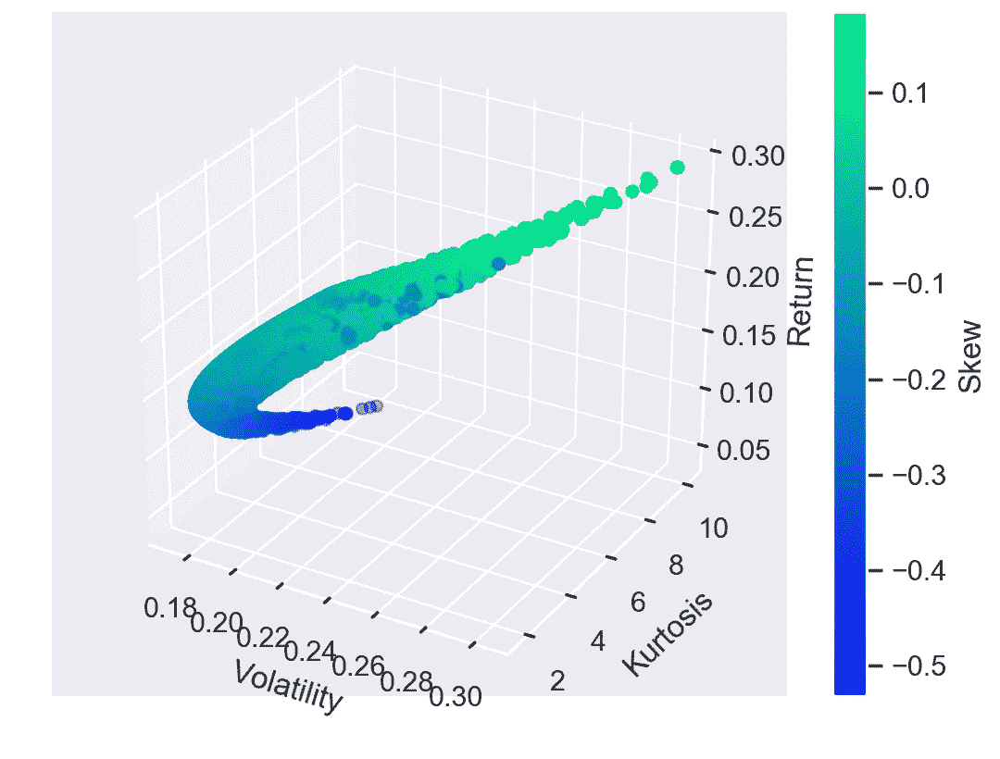
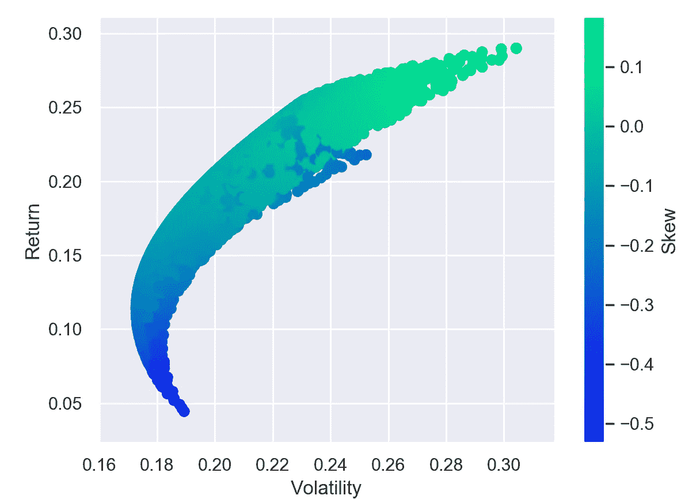
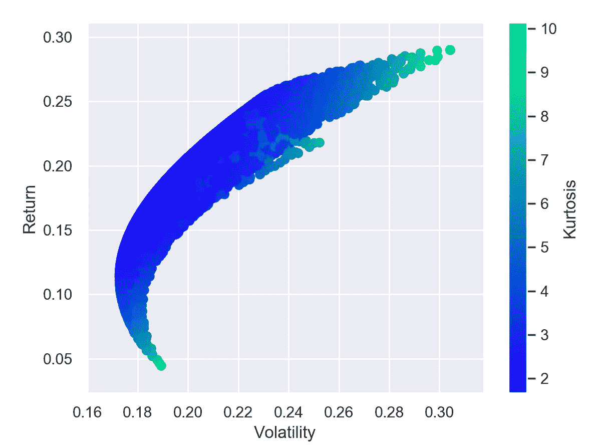

# 在 Python 中构建更高维度的有效边界

> 原文：<https://towardsdatascience.com/building-a-higher-dimensional-efficient-frontier-in-python-ce66ca2eff7?source=collection_archive---------20----------------------->

现代投资组合理论认为，投资者要承担更多的风险，就必须有更高的预期回报。这一假设导致了有效边界的产生，它代表了对于给定的风险值具有最大预期回报的所有投资组合。许多投资组合经理使用这个工具来查看与其他可能的投资组合相比，他们承担了多少风险。然而，比较回报率和方差只是故事的一部分。由于股票市场具有大幅下跌的性质，了解你的投资组合的尾部风险，以及其他可能的投资组合的尾部风险是很重要的。出于这个原因，有效边界的当前构造可以通过包括更高的统计矩如偏度和峰度来修改。

# 获取数据

我将使用来自 quandl 的真实股票数据来构建这个投资组合。我将在我假设的投资组合中使用苹果、IBM 和亚马逊。

# 构建矩阵

包含每日日志回报的 log_ret 数据框架将用于构建有效边界。更高维的形式将包含预期收益、波动性、偏度和峰度。目前，python 不具备计算共生矩阵或峭度矩阵的能力，因此我们必须自己构建它们。提醒你一下，偏度和峰度的定义如下。

其中，w 是权重向量，r 是每日回报，M3 是共生矩阵，M4 是峰度矩阵。偏斜度代表分布的不对称程度。正偏斜意味着分布更倾向于正值。由于下跌幅度大于上涨幅度，每日股票回报数据往往呈现负偏态。峰度衡量分布的峰值程度。一个大的峰度意味着一个分布比正态分布有更尖锐的峰值，但是有更厚的尾部。股票回报数据有很大的峰度，因为尾部受大事件支配。为了计算共生矩阵，我们可以运行下面的代码。

我们可以对峰度做同样的事情。

# 绘制有效边界

现在我们有了需要的矩阵，我们可以建立有效边界。以下将运行 10，000 次随机选择权重的试验，并计算预期收益、方差、偏斜度和峰度。输出是所有试验的结果，在 3 个空间维度上有回报、波动性和峰度，偏度显示为彩色地图。

如果在 jupyter 笔记本中运行，该图可以旋转，从而可以更清楚地了解分布情况。我们可以复制有效边界的原始形式，但是现在用彩色的偏度和峰度图。

我们可以看到，投资组合可以有相同的预期收益和波动性，但有不同的偏度或峰度。

# 结论

投资组合经理需要对其投资组合中的风险有充分的了解。使用有效边界的标准方法不能为投资专业人士传递足够的信息。当与其他可能的权重分配相比时，将偏度和峰度添加到最优投资组合集合中可以更清楚地了解投资组合的情况。